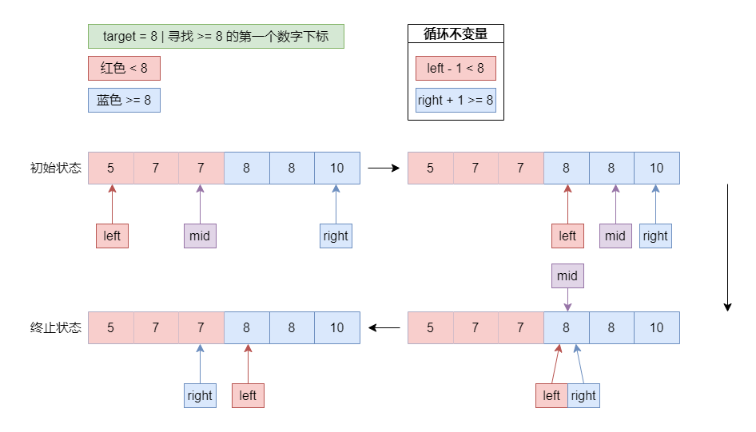
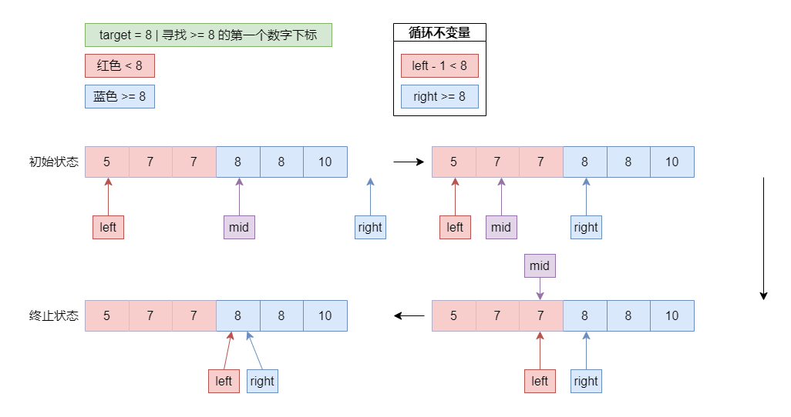
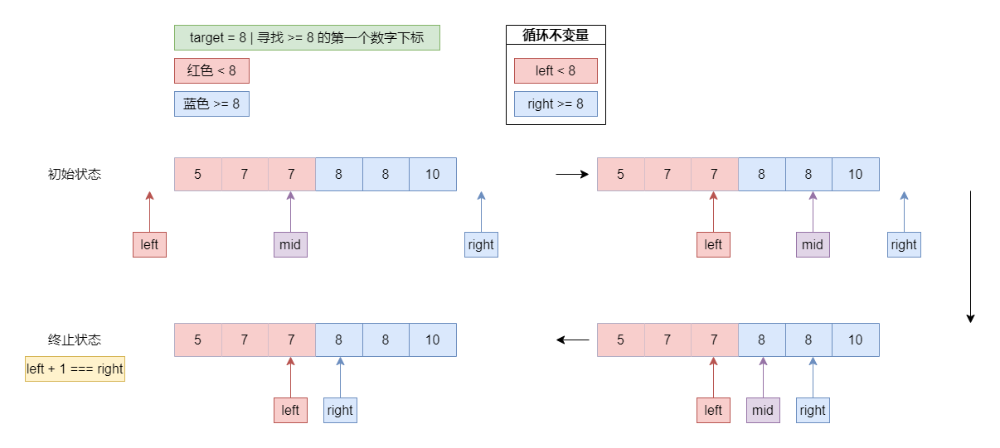
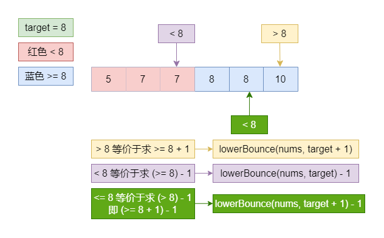
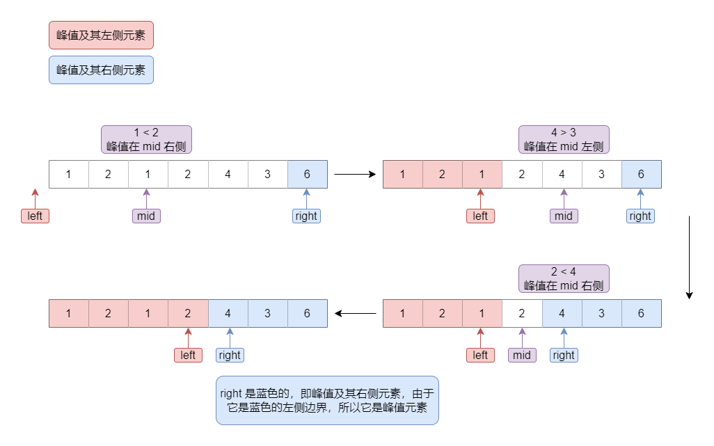

# 二分查找

## 基本框架

二分查找可以根据查找区间的开闭关系分为以下三种情况：

- `[left, right]` 闭区间
- `[left, right)` 左闭右开区间
- `(left, right)` 开区间

以一个典型的问题为例，演示这三种写法的区别

> 问题：返回按非递减顺序排序的数组中，第一个 `>= x` 的位置，如果所有数都 `< x`，则返回数组长度

先用三种区间关系解决该问题，之后还会对问题中 `>= x` 这一条件的变种：

- `> x`
- `< x`
- `<= x`

先写一个简单的单元测试便于稍后验证

```TypeScript
describe('binary-search', () => {
  const nums = [5, 7, 7, 8, 8, 10]
  const target = 8

  test.only('[left, right] | >= x', () => {
    const res = lowerBounce1(nums, target)
    expect(res).toBe(3)
  })

  test('[left, right) | >= x', () => {
    const res = lowerBounce2(nums, target)
    expect(res).toBe(3)
  })

  test('(left, right) | >= x', () => {
    const res = lowerBounce3(nums, target)
    expect(res).toBe(3)
  })
})
```

`lowerBounce` 的意思就是寻找最小的边界，正是非递减数组中第一个 `>= x` 的数的下标

### 闭区间



```TypeScript
/** @description [left, right] | >= x */
function lowerBounce1(nums: number[], target: number) {
  const n = nums.length

  let left = 0
  let right = n - 1

  // [left, right] 闭区间
  const { floor } = Math
  while (left <= right) { // 区间不为空 - left === right 时区间内有一个元素，因此可以有等号
    const mid = floor(left + floor((right - left) / 2))

    if (nums[mid] < target) {
      left = mid + 1 // [mid + 1, right]
    } else {
      // 包含了等于的情况，等于时收缩右侧边界，以此寻找到 `>= x` 这一左侧边界
      right = mid - 1 // [left, mid - 1]
    }
  }

  /**
   * 循环过程中，存在循环不变量：
   * - [0, left - 1] 范围内的全都是 `< x` 的
   * - [right + 1, n - 1] 范围内的全都是 `>= x` 的
   *
   * 最终 right 在 left 左侧相邻，因此 right + 1 即为 `>= x` 的左侧边界
   * 而 right + 1 === left，因此返回 left
   */

  return left
}
```

### 左闭右开区间



```TypeScript
/** @description [left, right) | >= x */
function lowerBounce2(nums: number[], target: number) {
  const n = nums.length

  let left = 0
  let right = n

  const { floor } = Math

  // 区间不为空 - left === right 时区间内为空，所以不能有等号
  while (left < right) {
    const mid = floor(left + floor((right - left) / 2))

    if (nums[mid] < target) {
      left = mid + 1 // [mid + 1, right)
    } else {
      right = mid // [left, mid)
    }
  }

  // 最终 left === right，返回哪个都行
  return left
}
```

### 开区间



```TypeScript
/** @description (left, right) | >= x */
function lowerBounce3(nums: number[], target: number) {
  const n = nums.length

  let left = -1
  let right = n

  const { floor } = Math

  // 区间不为空 - 不能是 `left < right`，因为两个指针相邻时，区间内为空
  while (left + 1 < right) {
    const mid = floor(left + floor((right - left) / 2))

    if (nums[mid] < target) {
      left = mid
    } else {
      right = mid
    }
  }

  // 最终 left right 相邻，right 为答案
  return right
}
```

### 拓展

前面问题中要求的是数组中第一个 `>= x` 的数的下标，如果现在我改一下，要求 `> x` 呢？甚至是要求 `< x` 和 `<= x` 呢？

事实上很简单，理解下面这个转换关系即可



接下来就做一道题 - [34. 在排序数组中查找元素的第一个和最后一个位置](#_34-在排序数组中查找元素的第一个和最后一个位置)，练练这个拓展！

## 34. 在排序数组中查找元素的第一个和最后一个位置

[题目链接](https://leetcode.cn/problems/find-first-and-last-position-of-element-in-sorted-array/)

本质上就是寻找 `>= target` 和 `<= target` 的两个数的下标

`>= target` 直接调用 `lowerBounce(nums, target)`

`<= target` 直接调用 `lowerBounce(nums, target + 1) - 1`

```TypeScript
function searchRange(nums: number[], target: number): number[] {
  // 寻找最小边界
  const lowerBounce = (nums: number[], target: number): number => {
    const n = nums.length
    let left = -1
    let right = n

    while (left + 1 < right) {
      const mid = Math.floor(left + Math.floor((right - left) / 2))
      if (nums[mid] < target) {
        left = mid
      } else {
        right = mid
      }
    }

    return right
  }

  const n = nums.length

  // >= target
  const start = lowerBounce(nums, target)

  if (start === n || nums[start] !== target) {
    return [-1, -1]
  }

  // <= target
  const end = lowerBounce(nums, target + 1) - 1

  return [start, end]
}
```

时间复杂度：`O(log n)`

空间复杂度：`O(1)`

## 162. 寻找峰值

[题目链接](https://leetcode.cn/problems/find-peak-element/description/)

这里以开区间的写法为例，首先我们要明确何时让 mid 往右走，何时往左走

不难发现，数组最后一个元素肯定是在峰顶右侧的，因为最后一个元素没有右侧元素，不可能成为峰顶，因此二分初始情况不用将其考虑进来，但是它能够作为之后进行二分的一个重要依据

每次二分时，我们将 mid 元素与其下一个元素 next 进行比较：

- `mid < next` - 峰顶在 mid 的右侧
- `mid > next` - 峰顶在 mid 左侧

题目说了 `nums[i] !== nums[i+1]`，所以不用考虑相等的情况，直接看图更加直观



```TypeScript
function findPeakElement(nums: number[]): number {
  const n = nums.length

  let left = -1
  let right = n - 1

  while (left + 1 < right) {
    const mid = Math.floor(left + Math.floor((right - left) / 2))

    if (shouldTurnRight(nums[mid], nums[mid + 1])) {
      left = mid
    } else {
      right = mid
    }
  }

  return right
}

/** @description 跟下一个元素比较，判断峰值在 mid 的哪一侧 */
function shouldTurnRight(num: number, next: number) {
  // num > next --> 峰值在 mid 左侧
  // num <= next --> 峰值在 mid 右侧
  return num <= next
}
```

时间复杂度：`O(log n)`

空间复杂度：`O(1)`

## 153. 寻找旋转排序数组中的最小值

[题目链接](https://leetcode.cn/problems/find-minimum-in-rotated-sorted-array/)


```TypeScript
/**
 * @description 二分查找 - 闭区间写法
 */
function findMin(nums: number[]): number {
  const n = nums.length
  let left = 0
  let right = n - 2

  while (left <= right) {
    const mid = Math.floor(left + Math.floor((right - left) / 2))

    if (shouldTurnRight(nums[mid], nums[n - 1])) {
      left = mid + 1
    } else {
      right = mid - 1
    }
  }

  return nums[left]
}

function shouldTurnRight(midNum: number, lastNum: number) {
  return midNum > lastNum
}
```

时间复杂度：`O(log n)`

空间复杂度：`O(1)`
