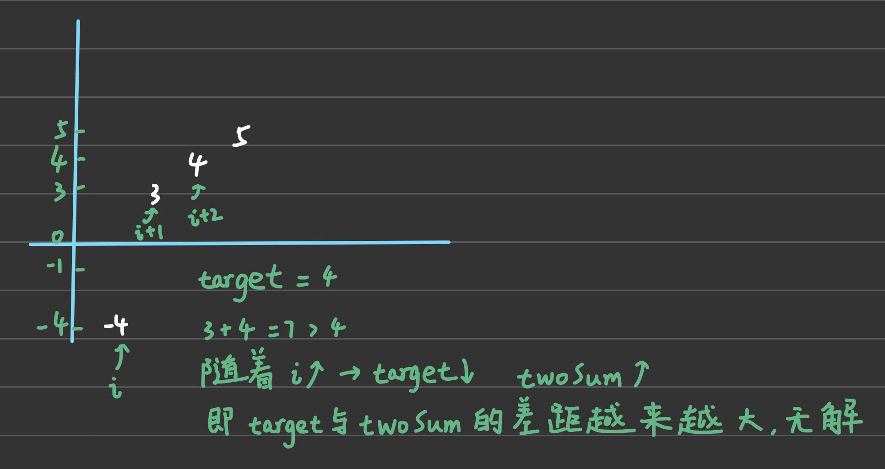
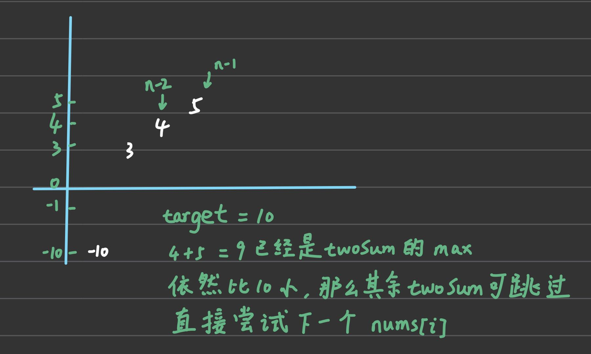

# 相向双指针

## 167. 两数之和 II - 输入有序数组

[题目链接](https://leetcode.cn/problems/two-sum-ii-input-array-is-sorted/)

利用数组已非递减排序的特性，初始化两个指针 left 和 right 分别指向数组两端，相向运动

- `nums[left] + nums[right] === target`: return `[left + 1, right + 1]`
- `nums[left] + nums[right] > target`: right 左移
- `nums[left] + nums[right] < target`: left 右移

```TypeScript
/**
 * @description 相向双指针
 */
function twoSum(numbers: number[], target: number): number[] {
  let left = 0
  let right = numbers.length - 1

  while (left < right) {
    const sum = numbers[left] + numbers[right]

    if (sum === target) break
    else if (sum < target) left++
    else if (sum > target) right--
  }

  return [left + 1, right + 1]
}
```

时间复杂度：`O(n)`

:::details 原因分析
假设最坏情况下，left 一直不移动，一直都是 right 往左移动，那么 right 需要移动 `n-2` 次，也就是 `O(n)`
:::

---

空间复杂度：`O(1)`

## 15. 三数之和

[题目链接](https://leetcode.cn/problems/3sum/)

```TypeScript
/**
 * @description 相向双指针
 */
function threeSum(nums: number[]): number[][] {
  const n = nums.length
  const res: number[][] = []

  // 先将 nums 升序排序 -- 让 twoSum 的时间复杂度降到 `O(n)`
  nums.sort((a, b) => a - b)

  // 遍历 [0, n - 3] 是因为要留出 nums[n-2] 和 nums[n-1] 给 twoSum
  for (let i = 0; i < n - 2; i++) {
    // 相同的 x 答案是一样的，避免重复答案
    // `i - 1` 作为数组下标，需要保证 `i - 1 >= 0`，即 `i >= 1`
    if (i >= 1 && nums[i] === nums[i - 1]) continue

    // `-x` 作为 twoSum 的 target
    const x = nums[i]
    const target = -x

    // twoSum
    let left = i + 1
    let right = n - 1

    while (left < right) {
      const y = nums[left]
      const z = nums[right]
      const sum = y + z

      if (sum === target) {
        // 更新 res
        res.push([x, y, z])

        // left 右移 -- 如果移动前后的数字相同则跳过
        left++
        // `left - 1` 作为数组下标需要 `>= 0`，即 `left >= 1`
        // `left < right` 可以保证这一子条件成立
        while (left < right && nums[left] === nums[left - 1]) left++

        // right 左移 -- 如果移动前后的数字相同则跳过
        right--
        // `right + 1` 作为数组下标需要 `>= 0`，即 `right >= -1`
        // `right > left` 可以保证这一子条件成立
        while (right > left && nums[right] === nums[right + 1]) right--
      } else if (sum < target) {
        left++
        // 相同元素跳过，避免重复计算
        while (left < right && nums[left] === nums[left - 1]) left++
      } else if (sum > target) {
        right--
        // 相同元素跳过，避免重复计算
        while (right > left && nums[right] === nums[right + 1]) right--
      }

      if (i === 1) console.log(left, right)
    }
  }

  return res
}
```

时间复杂度：`O(n^2)`

:::details 原因分析

- 数组排序 -- `O(nlogn)`

- `i` 遍历整个数组 -- `O(n)` => 整体 `O(n^2)`
  - `twoSum` -- `O(n)`

`O(n^2) > O(nlogn)` => 最终 `O(n^2)`
:::

---

空间复杂度：`O(1)`

### 优化路径一：无解的情况



```TypeScript
function threeSum(nums: number[]): number[][] {
  const n = nums.length
  const res: number[][] = []

  // 先将 nums 升序排序 -- 让 twoSum 的时间复杂度降到 `O(n)`
  nums.sort((a, b) => a - b)

  // 遍历 [0, n - 3] 是因为要留出 nums[n-2] 和 nums[n-1] 给 twoSum
  for (let i = 0; i < n - 2; i++) {
    // 相同的 x 答案是一样的，避免重复答案
    // `i - 1` 作为数组下标，需要保证 `i - 1 >= 0`，即 `i >= 1`
    if (i >= 1 && nums[i] === nums[i - 1]) continue

    // `-x` 作为 twoSum 的 target
    const x = nums[i]
    const target = -x

    // 优化路径一：`nums[i+1] + nums[i+2] > target`，那么后续元素之和只会更加比 target 大 // [!code focus]
    if (nums[i + 1] + nums[i + 2] > target) break // [!code focus]

    // twoSum
    let left = i + 1
    let right = n - 1

    while (left < right) {
      const y = nums[left]
      const z = nums[right]
      const sum = y + z

      if (sum === target) {
        // 更新 res
        res.push([x, y, z])

        // left 右移 -- 如果移动前后的数字相同则跳过
        left++
        // `left - 1` 作为数组下标需要 `>= 0`，即 `left >= 1`
        // `left < right` 可以保证这一子条件成立
        while (left < right && nums[left] === nums[left - 1]) left++

        // right 左移 -- 如果移动前后的数字相同则跳过
        right--
        // `right + 1` 作为数组下标需要 `>= 0`，即 `right >= -1`
        // `right > left` 可以保证这一子条件成立
        while (right > left && nums[right] === nums[right + 1]) right--
      } else if (sum < target) {
        left++
        // 相同元素跳过，避免重复计算
        while (left < right && nums[left] === nums[left - 1]) left++
      } else if (sum > target) {
        right--
        // 相同元素跳过，避免重复计算
        while (right > left && nums[right] === nums[right + 1]) right--
      }
    }
  }

  return res
}
```

### 优化路径二：`nums[i]` 无需继续的情况



```TypeScript
function threeSum(nums: number[]): number[][] {
  const n = nums.length
  const res: number[][] = []

  // 先将 nums 升序排序 -- 让 twoSum 的时间复杂度降到 `O(n)`
  nums.sort((a, b) => a - b)

  // 遍历 [0, n - 3] 是因为要留出 nums[n-2] 和 nums[n-1] 给 twoSum
  for (let i = 0; i < n - 2; i++) {
    // 相同的 x 答案是一样的，避免重复答案
    // `i - 1` 作为数组下标，需要保证 `i - 1 >= 0`，即 `i >= 1`
    if (i >= 1 && nums[i] === nums[i - 1]) continue

    // `-x` 作为 twoSum 的 target
    const x = nums[i]
    const target = -x

    // 优化路径一：`nums[i+1] + nums[i+2] > target`
    // 那么随着 i 增加，target 会减小，target 与 twoSum 的差距会越来越大，无解
    if (nums[i + 1] + nums[i + 2] > target) break

    // 优化路径二：`nums[n-1] + nums[n-2] < target` // [!code focus]
    // 那么 nums[i+1, ..., n-2] 的 twoSum 只会更小，不可能达到 target，忽略当前 nums[i] // [!code focus]
    if (nums[n - 1] + nums[n - 2] < target) continue // [!code focus]

    // twoSum
    let left = i + 1
    let right = n - 1

    while (left < right) {
      const y = nums[left]
      const z = nums[right]
      const sum = y + z

      if (sum === target) {
        // 更新 res
        res.push([x, y, z])

        // left 右移 -- 如果移动前后的数字相同则跳过
        left++
        // `left - 1` 作为数组下标需要 `>= 0`，即 `left >= 1`
        // `left < right` 可以保证这一子条件成立
        while (left < right && nums[left] === nums[left - 1]) left++

        // right 左移 -- 如果移动前后的数字相同则跳过
        right--
        // `right + 1` 作为数组下标需要 `>= 0`，即 `right >= -1`
        // `right > left` 可以保证这一子条件成立
        while (right > left && nums[right] === nums[right + 1]) right--
      } else if (sum < target) {
        left++
        // 相同元素跳过，避免重复计算
        while (left < right && nums[left] === nums[left - 1]) left++
      } else if (sum > target) {
        right--
        // 相同元素跳过，避免重复计算
        while (right > left && nums[right] === nums[right + 1]) right--
      }
    }
  }

  return res
}
```

## 18. 四数之和

[题目链接](https://leetcode.cn/problems/4sum/description/)

和 [15. 三数之和](#_15-三数之和) 类似，遍历数组每个元素，然后调用 `threeSum` 得到结果后，将当前元素推入即可

```TypeScript{53,72}
function fourSum(nums: number[], target: number): number[][] {
  nums.sort((a, b) => a - b)

  const moveLeft = (_nums: number[], left: number, right: number) => {
    left++
    while (left < right && _nums[left] === _nums[left - 1]) left++
    return left
  }

  const moveRight = (_nums: number[], left: number, right: number) => {
    right--
    while (right > left && _nums[right] === _nums[right + 1]) right--
    return right
  }

  /** @description 两数之和 */
  const twoSum = (_nums: number[], _target: number): number[][] => {
    const n = _nums.length
    const res: number[][] = []
    let left = 0
    let right = n - 1

    while (left < right) {
      const x = _nums[left]
      const y = _nums[right]
      const sum = _nums[left] + _nums[right]

      if (sum === _target) {
        res.push([x, y])

        left = moveLeft(_nums, left, right)
        right = moveRight(_nums, left, right)
      } else if (sum < _target) {
        left = moveLeft(_nums, left, right)
      } else if (sum > _target) {
        right = moveRight(_nums, left, right)
      }
    }

    return res
  }

  const threeSum = (_nums: number[], _target: number): number[][] => {
    const n = _nums.length
    const res: number[][] = []

    for (let i = 0; i < n; i++) {
      if (i >= 1 && _nums[i] === _nums[i - 1]) continue

      const x = _nums[i]
      const twoSumTarget = _target - x

      const twoSumRes = twoSum(_nums.slice(i + 1), twoSumTarget)
      if (twoSumRes.length > 0) {
        const threeSumRes = twoSumRes.map(item => [...item, x])
        res.push(...threeSumRes)
      }
    }

    return res
  }

  const n = nums.length
  const res: number[][] = []

  for (let i = 0; i < n; i++) {
    if (i >= 1 && nums[i] === nums[i - 1]) continue

    const x = nums[i]
    const threeSumTarget = target - x

    const threeSumRes = threeSum(nums.slice(i + 1), threeSumTarget)
    if (threeSumRes.length > 0) {
      const fourSumRes = threeSumRes.map(item => [...item, x])
      res.push(...fourSumRes)
    }
  }

  return res
}
```

:::danger 注意
`fourSum` 调用 `threeSum` 以及 `threeSum` 调用 `twoSum` 时，传入的数组需要截取当前遍历的元素的下一个元素到末尾才行，这样做是为了防止结果重复
:::

时间复杂度：`O(n^3)`

:::details 原因分析

- 遍历所有元素 -- `O(n)` => 整体 `O(n^3)`

  - 每轮遍历中调用 `threeSum` -- `O(n^2)`

:::

---

空间复杂度：`O(1)`

### 扩展到 nSum

从 `fourSum` 和 `threeSum` 的代码中可以看出高度的相似性，因此可以考虑抽象成 `nSum` 解法

```TypeScript
function nSum(nums: number[], n: number, target: number) {
  nums.sort((a, b) => a - b)
  return _nSum(nums, n, target)
}

function _nSum(nums: number[], n: number, target: number): number[][] {
  const length = nums.length
  const res: number[][] = []

  /**
   * base case 1
   *   n 至少得是 2，也就是至少得是个两数之和问题
   *   且 nums.length 至少得 >= n
   */
  if (n < 2 || length < n) return res

  if (n === 2) {
    // n === 2 -- 两数之和
    return twoSum(nums, target)
  } else {
    // n > 2 -- 遍历数组 并递归调用 (n-1)Sum 的算法
    for (let i = 0; i < length; i++) {
      // 避免重复
      if (i >= 1 && nums[i] === nums[i - 1]) continue

      const x = nums[i]
      const nMinusOneTarget = target - x

      const nMinusOneRes = _nSum(nums.slice(i + 1), n - 1, nMinusOneTarget)
      if (nMinusOneRes.length > 0) {
        const nSumRes = nMinusOneRes.map(item => [...item, x])
        res.push(...nSumRes)
      }
    }
  }

  return res
}

function twoSum(nums: number[], target: number): number[][] {
  const n = nums.length
  const res: number[][] = []
  let left = 0
  let right = n - 1

  while (left < right) {
    const x = nums[left]
    const y = nums[right]
    const sum = x + y

    if (sum === target) {
      res.push([x, y])

      left++
      while (left < right && nums[left] === nums[left - 1]) left++

      right--
      while (right > left && nums[right] === nums[right + 1]) right--
    } else if (sum < target) {
      left++
      while (left < right && nums[left] === nums[left - 1]) left++
    } else if (sum > target) {
      right--
      while (right > left && nums[right] === nums[right + 1]) right--
    }
  }

  return res
}
```

核心在于：调用 `_nums` 之前要先对数组升序排序

现在我们可以解决任意 sum 问题了，比如 `4Sum`

```TypeScript
function fourSum(nums: number[], target: number): number[][] {
  return nSum(nums, 4, target)
}
```

## 11. 盛最多水的容器

[题目链接](https://leetcode.cn/problems/container-with-most-water/)

1. 左右指针相向移动
2. 高度较矮的那个作为容器的高度瓶颈，计算容积，更新 res
3. 高度较矮的那个指针移动，试图寻找瓶颈高度更高的柱子

```TypeScript
function maxArea(height: number[]): number {
  const n = height.length

  let left = 0
  let right = n - 1
  let res = 0

  while (left < right) {
    // 选取较矮的柱子作为容器的容纳高度
    const containerHeight = Math.min(height[left], height[right])

    // 计算容积
    const area = (right - left) * containerHeight

    res = Math.max(area, res)

    height[left] < height[right] ? left++ : right--
  }

  return res
}
```

时间复杂度：`O(n)`

:::details 原因分析
指针每移动一次，花费 `O(1)` 的时间进行计算，指针会访问每个柱子，所以一共是 `O(n)`
:::

---

空间复杂度：`O(1)`

## 42. 接雨水

[题目链接](https://leetcode.cn/problems/trapping-rain-water/)

### 前后缀分解

- 每个柱子中能接雨水的最大高度取决于 `它前面的最高的柱子` 和 `它后面的最高柱子` 中较矮的那个，记为 `containerMaxHeight`
- 得到 `containerMaxHeight` 后，还要考虑柱子自身的高度，减去自身高度后才是真正的存水量，也就是 `containerMaxHeight - height[i]`

因此关键在于遍历每个柱子的时候能够知道 `它前面的最高的柱子` 和 `它后面的最高柱子`

为此我们需要分别用两个额外的长度为 n 的数组去记录每个柱子的 `前面最高柱子` 和 `后面最高柱子`，分别记为 `前缀和数组` 与 `后缀和数组`

如何生成这两个数组呢？

- 前缀和数组 - 从前往后遍历 `height` 数组，维护一个 `prefixMaxHeight` 变量，记录遍历过程中的柱子最大高度，每次遍历时用 `Math.max(prefixMaxHeight, height[i])` 作为当前柱子的 `前面最高柱子`，同时更新 `prefixMaxHeight`

- 后缀和数组 - 从后往前遍历 `height` 数组，维护一个 `suffixMaxHeight` 变量，记录遍历过程中的柱子最大高度，每次遍历时用 `Math.max(suffixMaxHeight, height[i])` 作为当前柱子的 `后面最高柱子`，同时更新 `suffixMaxHeight`

```TypeScript
function trap(height: number[]): number {
  const n = height.length

  // ======= 生成前缀和数组 =======
  const prefixHeight: number[] = new Array(n).fill(0)

  // 记录前缀和数组遍历过程中的柱子最大高度值
  let prefixMaxHeight = 0

  for (let i = 0; i < n; i++) {
    // 计算当前柱子前面的最高柱子 同时 更新 prefixMaxHeight
    prefixMaxHeight = prefixHeight[i] = Math.max(prefixMaxHeight, height[i])
  }

  // ======= 生成后缀和数组 =======
  const suffixHeight: number[] = new Array(n).fill(0)

  // 记录后缀和数组遍历过程中的柱子最大高度值
  let suffixMaxHeight = 0

  for (let i = n - 1; i >= 0; i--) {
    // 计算当前柱子后面的最高柱子 同时 更新 suffixMaxHeight
    suffixMaxHeight = suffixHeight[i] = Math.max(suffixMaxHeight, height[i])
  }

  // 遍历所有柱子计算总共能接多少雨水
  let res = 0
  for (let i = 0; i < n; i++) {
    // 从前后缀和数组中找出较矮的那个
    const containerMaxHeight = Math.min(prefixHeight[i], suffixHeight[i])

    // 接水量 - containerMaxHeight - height[i]
    res += containerMaxHeight - height[i]
  }

  return res
}
```

时间复杂度：`O(n)`

:::details 原因分析
计算前后缀和数组分别需要遍历 2 次 height 数组，每次遍历花费 `O(1)` 的时间，所以是 `O(2n)`

计算接水量需要遍历 height 数组，每次遍历花费 `O(1)` 的时间，所以是 `O(n)`

因此总的时间复杂度为 `O(2n) + O(n) === O(n)`
:::

---

空间复杂度：`O(n)`

:::details 原因分析
用到了 2n 的额外空间的前缀和数组
:::
