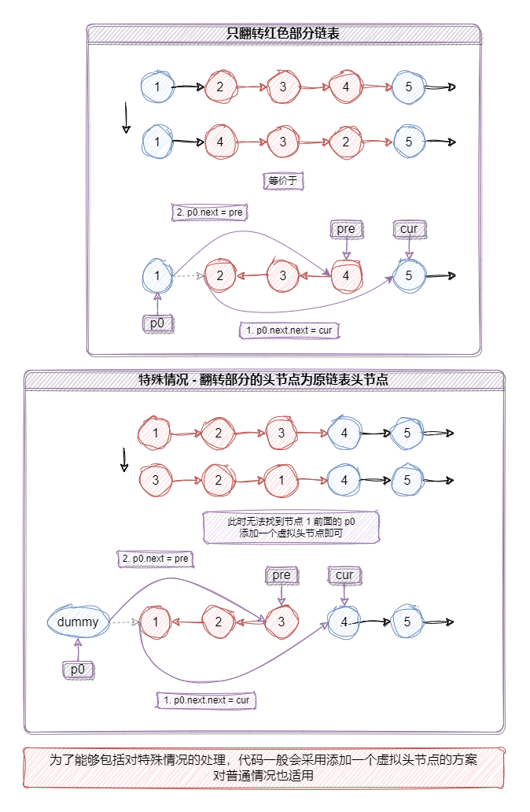

# 翻转链表

## 206. 反转链表

[题目链接](https://leetcode.cn/problems/reverse-linked-list/description/)

用三个指针 - `pre`, `cur`, `next` 不断交替更改指针指向关系即可

```TypeScript
function reverseList(head: ListNode | null): ListNode | null {
  let pre = null
  let cur = head
  let next = null

  while (cur !== null) {
    next = cur.next
    cur.next = pre
    pre = cur
    cur = next
  }

  return pre
}
```

时间复杂度：`O(n)`

空间复杂度：`O(1)`

## 92. 反转链表 II

[题目链接](https://leetcode.cn/problems/reverse-linked-list-ii/)



```TypeScript
function reverseBetween(head: ListNode | null, left: number, right: number): ListNode | null {
  // 虚拟头节点
  const dummy = new ListNode(NaN, head)

  let pre = dummy
  let cur = dummy.next
  let next = null

  // 让 cur 前进到 left 对应的节点
  for (let i = 0; i < left - 1; i++) {
    pre = cur
    cur = cur.next
  }

  // p0 记录翻转部分的头节点的前一个节点
  const p0 = pre

  // 翻转部分链表 - 翻转 (right - left + 1) 次
  for (let i = 0; i < right - left + 1; i++) {
    next = cur.next
    cur.next = pre
    pre = cur
    cur = next
  }

  // 翻转完毕 - 修复 p0 指向关系
  p0.next.next = cur
  p0.next = pre

  return dummy.next
}
```

时间复杂度：`O(n)`

空间复杂度：`O(1)`
