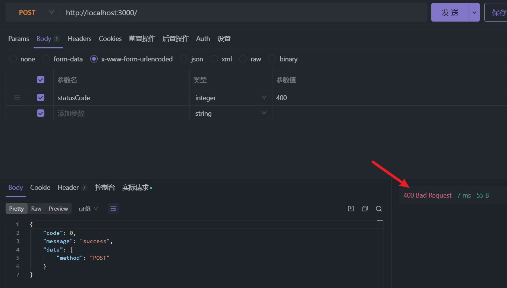
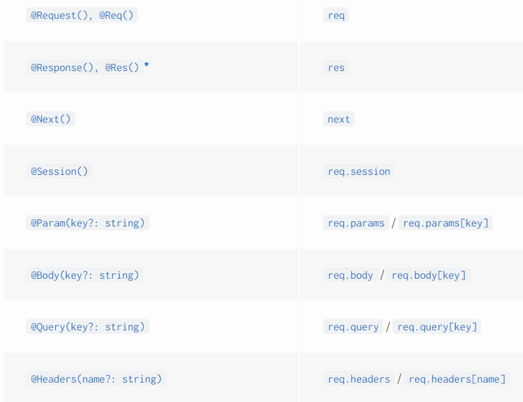
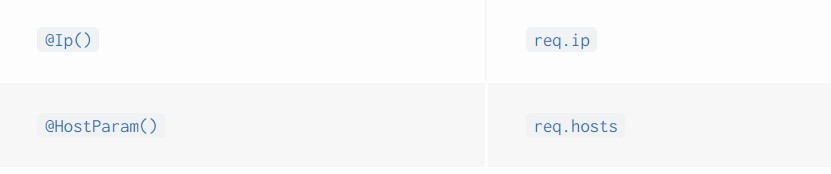
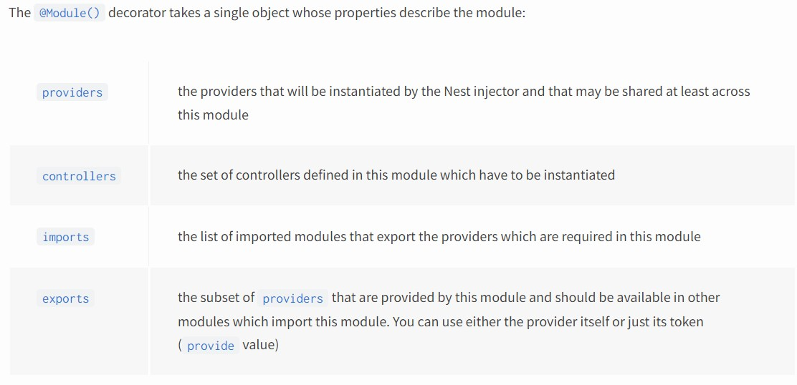
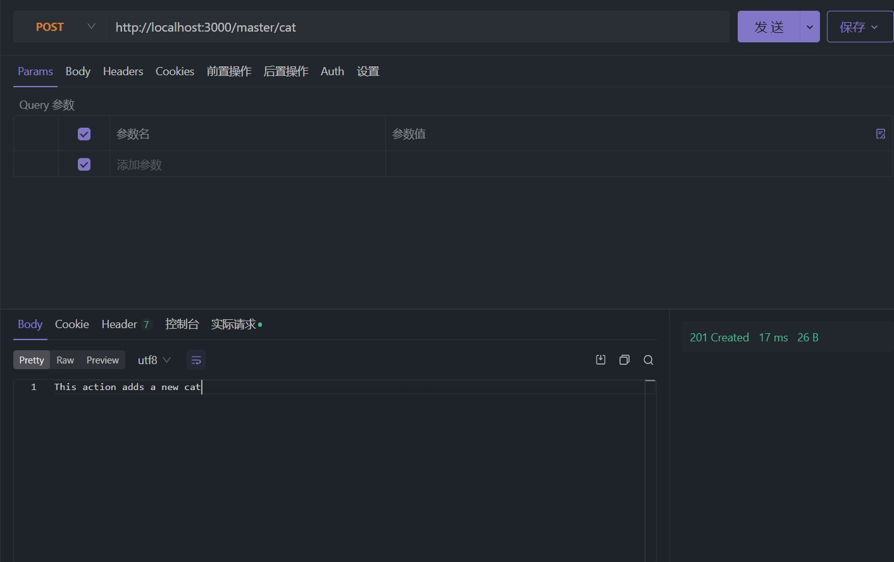
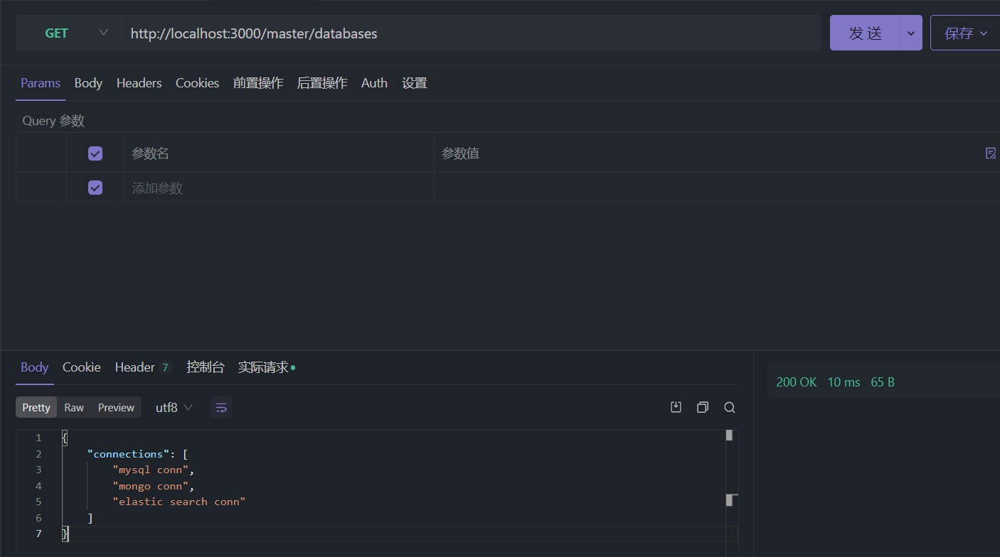

# 基础使用

## Controller

:::info
Controller 负责处理到来的请求并返回响应
:::

### HTTP 状态码

默认 `@Get()` 装饰器装饰的 handler 成功时会返回 `200`，而 `@Post()` 装饰的则返回 `201`

:::tip
`@Put()`, `@Patch()`, `@Delete()` 装饰的 handler 成功时也是返回 `200`
:::

通过 `@Get()`, `@Post()` 等装饰器的方式处理响应被称为 `Standard`，也是 Nest 官方推荐的

如果状态码需要根据具体代码逻辑动态变化的话，就需要用 `Library-specific` 方式，顾名思义，也就是允许我们在 handler 中使用底层框架去处理响应，默认情况下 Nest 的底层框架是 `express`，你也可以选择使用 `fastify`

比如现在我需要根据请求参数中的 `statusCode` 去动态决定响应状态码，那么就要用这种方式，使用起来也很简单，在 handler 的参数中使用 `@Res()` 装饰器即可获取到底层框架的 response 对象

```TypeScript
@Controller()
export class AppController {
  @Post()
  // @ts-ignore
  post(@Res() response, @Body() body: any) {
    // 从请求体中获取 statusCode 作为响应状态码
    const statusCode = Number(body.statusCode) ?? 200

    response.status(statusCode).send({
      code: 0,
      message: 'success',
      data: {
        method: 'POST',
      },
    })
  }
}
```

值得注意的是，`post(@Res() response, @Body() body: any)` 中的参数位置没有明确规定，因为通过装饰器修饰后无论参数放在第几个都能够准确获取到，也就是说 `post(@Body() body: any, @Res() response)` 这样也是可以的

效果如下：



`Standard` 和 `Library-specific` 方式不能同时使用，同时使用时会将 `Standard` 方式禁用，也就是说 `@Get()` 这样的装饰器不会起作用

如果一定要两个同时用的话，可以给 `@Res()` 添加 `passthrough: true` 配置项，即 `@Res({ passthrough: true })`

这意味着我们想要返回数据的时候只能是通过 `response.send()` 这样的方式，通过 `return` 返回的数据会被忽略，十分别扭，假设现在我只是想动态决定响应状态码，但是仍然使用 `return` 的返回值作为接口响应的数据，那么就可以用 `passthrough` 这个配置项了

```TypeScript
@Post()
post(@Res({ passthrough: true }) response: Response) {
  // @Post 默认会返回 201 响应码，我想手动改成 200
  response.status(200)

  // 并且不希望使用 response.send() 这样别扭的方式返回数据
  return {
    code: 0,
    message: 'success',
    data: {
      method: 'POST',
    },
  }
}
```

### 请求相关装饰器

可以通过在 handler 的参数中使用 `@Request()` 或 `@Req()` 装饰器获取到底层框架的 request 对象，然后从其中获取常用的请求相关的信息，比如 `path params`, `body`, `query params` 等

```TypeScript
import type { Request } from 'express'

@Post(':id')
post(@Req() request: Request) {
  console.log(request.params, request.query, request.body)
  return {
    code: 0,
    message: 'success',
    data: {
      method: 'POST',
    },
  }
}
```

但实际上更方便的方式是使用装饰器，Nest 提供了很多请求相关的装饰器让我们可以便捷地获取请求相关信息





```TypeScript
@Post(':id')
post(@Param('id') id: string, @Query() query: any) {
  console.log({ id, query })
  return {
    code: 0,
    message: 'success',
    data: {
      method: 'POST',
    },
  }
}
```

### 路由通配符

可以这样用：`@Get('ab*cd')`，就和正则表达式中的符号规则一样，`abcd`, `abwcd`, `ab1cd` 等都可以匹配到该路由

### @Header

`@Header()` 装饰器可以给接口添加响应头

```TypeScript
@Get()
@Header('Foo', 'Bar')
getHello(): string {
  return this.appService.getHello()
}
```

### DTO

DTO 全名 `Data Transfer Object`，一般将接口的参数中要用到的数据类型用 DTO 声明，这样能有良好的类型提示能力

在 TypeScript 中可以使用 `class` 或者 `interface` 去定义 DTO，但是 Nest 官方更建议使用 `class`，理由如下：

- Classes are part of the JavaScript ES6 standard, and therefore they are preserved as real entities in the compiled JavaScript.
- TypeScript interfaces are removed during the transpilation, Nest can't refer to them at runtime.
- Pipes enable additional possibilities when they have access to the metatype of the variable at runtime.

## Providers

可以被其他类注入作为依赖的就能够被称为是 `Provider`，比如 `services`, `repositories`, `factories`, `helpers` 等

这实际上就涉及到一个 Java 的 Spring 中常谈的概念 -- `Dependency Injection` 依赖注入

将能够被注入到其他类中使用的类通过 `@Injectable()` 装饰器修饰，然后将其添加到 `@Module({ providers: [] })` 中即可将该类对应的实例交给 Nest 的 IoC 容器管理

然后要用到 Provider 的地方直接在构造函数中声明即可，比如下面这样：

```TypeScript{2,13,20}
// Provider -- service
@Injectable()
export class AppService {
  getHello(): string {
    return 'Hello World!'
  }
}

// module 中声明需要 IoC 容器托管的 Providers
@Module({
  imports: [],
  controllers: [AppController],
  providers: [AppService],
})
export class AppModule {}

// 消费 Provider 的地方通过构造函数将其注入
@Controller()
export class AppController {
  constructor(private readonly appService: AppService) {}
}
```

### 自定义 Provider

当使用类作为 Provider 时，注入它们不需要使用 `@Inject()` 装饰器

而对于自定义 Provider 使用字符串或 symbol 作为 key 的时候，就需要使用 `@Inject()` 装饰器去显式声明要使用的依赖

```TypeScript{5,14,23}
// app.module.ts
@Module({
  imports: [],
  controllers: [AppController],
  providers: [AppService, { provide: 'FOO', useValue: 'foo' }],
})
export class AppModule {}

// app.controller.ts
@Controller()
export class AppController {
  constructor(
    private readonly appService: AppService,
    @Inject('FOO') private foo: string,
  ) {}

  @Get()
  getHello() {
    return {
      code: 0,
      message: 'success',
      data: {
        hello: this.appService.getHello(),
        foo: this.foo,
      },
    }
  }
}
```

该 demo 中使用 `useValue` 作为 Provider 的数据源，官方文档中还介绍了 `useClass`, `useFactory`, `useExisting` 的方式，具体查看 [Custom providers](https://docs.nestjs.com/fundamentals/custom-providers#custom-providers)

### Optional providers

当注入的实例不影响程序的运行时说明其是一个可选的依赖项，这时候可以用 `@Optional()` 装饰器修饰

```TypeScript
import { Injectable, Optional, Inject } from '@nestjs/common';

@Injectable()
export class HttpService<T> {
  constructor(@Optional() @Inject('HTTP_OPTIONS') private httpClient: T) {}
}
```

### Property-based injection

使用 `@Inject()` 注入非 class 的 Provider 时，除了在构造函数的参数中使用，还能在类的属性声明中使用，这种方式常用于需要手动 new 实例的时候，如果该类的构造函数过多的使用 `@Inject()` 声明依赖项，那么手动 new 的时候传参很痛苦，所以此时可以考虑将依赖项的声明放到类属性声明中

```TypeScript
@Controller()
export class AppController {
  // Property-based injection
  @Inject(AppService) private readonly appService: AppService
  @Inject('FOO') private foo: string

  @Get()
  getHello() {
    return {
      code: 0,
      message: 'success',
      data: {
        hello: this.appService.getHello(),
        foo: this.foo,
      },
    }
  }
}
```

## Modules

Module 是对业务模块的封装，其本质是一个由 `@Module()` 装饰器装饰的类，该装饰器的参数如下：



### Register a module

假设现在有一个 cats 接口，正常来说我们需要有 `cats.controller.ts`, `cats.service.ts` 等文件，它们之间是密切关联的，适合作为一个 Module 进行管理，所以可以统一在 `cats.module.ts` 中进行管理

在 `cats.module.ts` 中将相关的 controller 和 service 注册进来

```TypeScript
import { Module } from '@nestjs/common'
import { CatsService } from './cats.service'
import { CatsController } from './cats.controller'

@Module({
  controllers: [CatsController],
  providers: [CatsService],
})
export class CatsModule {}
```

再将 `CatsModule` 注册到 `AppModule` 中，注册的方式是通过 `imports` 元数据属性将其导入进来

```TypeScript
import { Module } from '@nestjs/common'
import { AppController } from './app.controller'
import { AppService } from './app.service'
import { CatsModule } from './cats/cats.module'

@Module({
  imports: [CatsModule],
  controllers: [AppController],
  providers: [AppService],
})
export class AppModule {}
```

其实上面这个过程在每次创建 Module 的时候都会重复进行，为了提高效率，可以使用 nest cli 的代码生成器来生成这些重复性代码

执行 `npx nest g res cats` 命令去生成对 `cats` 资源的 CRUD 代码

:::tip
初次运行 `npx nest g res cats` 的时候，会安装一个 `@nestjs/mapped-types` 依赖，容易出现安装失败的问题，建议先手动安装一次该依赖后再运行命令
:::

### Shared Modules

假设现在有一个新的资源 -- Master，代表主人，主人能够购买猫，所以要有一个 `purchaseCat` controller 去处理这个逻辑，为了方便起见，购买的逻辑就是调用 `CatsService` 的 create 方法，因此我们需要在 `MasterService` 中能够访问到 `CatsService`

那么这就涉及到一个 Module 之间共享 service 的需求了，实现很简单，只需要在 `CatsModule` 的装饰器元数据属性的 `exports` 中导出 `CatsService`，再在 `MasterModule` 中通过 `imports` 将 `CatsModule` 加载进来，这样就能够访问到其导出的模块了

1. `CatsModule` 中导出 `CatsService` 用于共享：

```TypeScript
@Module({
  controllers: [CatsController],
  providers: [CatsService],
  exports: [CatsService],
})
export class CatsModule {}
```

2. `MasterModule` 中导入 `CatsModule`，以获取对其导出的 `CatsService` 的访问能力：

```TypeScript
@Module({
  imports: [CatsModule],
  controllers: [MasterController],
  providers: [MasterService],
})
export class MasterModule {}
```

3. `MasterService` 中注入 `CatsService` 作为依赖项：

```TypeScript
@Injectable()
export class MasterService {
  constructor(private catsService: CatsService) {}

  /**
   * @description 购买一只猫 -- 调用 CatsService 的 create 方法
   */
  purchaseCat() {
    return this.catsService.create({})
  }
}
```

4. `MasterController` 中实现接口

```TypeScript
@Controller('master')
export class MasterController {
  constructor(private readonly masterService: MasterService) {}

  @Post('cat')
  purchaseCat() {
    return this.masterService.purchaseCat()
  }
}
```

效果如下：



### Global Modules

有的 Module，比如数据库连接相关的 Module 是需要在其他所有 Module 中都用得上的，如果一个个去手动 imports 进来的话十分麻烦，对于这种情况，就适合将其声明为全局 Module，使用 `@Global()` 装饰器修饰就可以实现

假设现在有一个 `DatabasesModule` 要在 `CatsModule` 和 `MasterModule` 中使用

```TypeScript{2}
// databases.module.ts
@Global()
@Module({
  providers: [DatabasesProvider],
  exports: [DatabasesProvider],
})
export class DatabasesModule {}

// databases.provider.ts
@Injectable()
export class DatabasesProvider {
  getMySQLConn() {
    return 'mysql conn'
  }

  getMongoConn() {
    return 'mongo conn'
  }

  getElasticSearchConn() {
    return 'elastic search conn'
  }
}
```

在 `MasterService` 中使用它，无需在 `MasterModule` 中显式将其声明到 imports 中

```TypeScript
// master.service.ts
@Injectable()
export class MasterService {
  constructor(
    private databasesProvider: DatabasesProvider,
  ) {}

  getDatabasesConnections() {
    return {
      connections: [
        this.databasesProvider.getMySQLConn(),
        this.databasesProvider.getMongoConn(),
        this.databasesProvider.getElasticSearchConn(),
      ],
    }
  }
}

// master.controller.ts
@Controller('master')
export class MasterController {
  constructor(private readonly masterService: MasterService) {}

  @Get('databases')
  showDatabasesConnections() {
    return this.masterService.getDatabasesConnections()
  }
}
```

效果如下：



### Dynamic Modules

首先我们来了解一下 Dynamic Modules 是什么，来看看官方文档对它的介绍

> Dynamic modules provide an API for importing one module into another, and customizing the properties and behavior of that module when it is imported.

主要用于需要对 Module 进行定制控制的时候使用，比如需要给 Module 传递参数，对其行为进行控制，就像使用 vite 插件那样，每个插件能够传入配置项进行单独配置

> A dynamic module is nothing more than a module created at runtime, with the same exact properties as a static module, plus one additional property called `module`.

首先理解一下 `static module`，也就是平时我们用的 `@Module()` 装饰器，而 `dynamic module` 相比于 `static module`，也是包括 `imports`, `controllers`, `providers` 和 `exports`，但是多了一个 `module` 属性

如何实现一个 `dynamic module` 呢？很简单，给一个 Module 实现一个返回 `DynamicModule` 接口的静态方法即可，这个接口就是上面说的包括了 `static module` 的那些属性外加一个 module 属性

这个静态方法实际上就是第一段官方文档描述中的 `API`

:::tip
这个静态方法在 Nest 社区中约定俗成的名字是 `register`, `forRoot` 和 `forFeature`，三种名字的区别如下：

- `register`: 单纯起到一个配置作用

  > you are expecting to configure a dynamic module with a specific configuration for use only by the calling module.

  e.g. `HttpModule.register({ baseUrl: 'someUrl' })`

- `forRoot`: 配置一次，在多处复用配置

  > you are expecting to configure a dynamic module once and reuse that configuration in multiple places (though possibly unknowingly as it's abstracted away).

- `forFeature`: 使用 forRoot 的配置，但是需要根据业务需求进行修改，比如要用哪个 repository；logger 中要使用哪个上下文等

  > you are expecting to use the configuration of a dynamic module's forRoot but need to modify some configuration specific to the calling module's needs (i.e. which repository this module should have access to, or the context that a logger should use.)

此外，还会有异步版本的命名，加上 async 后缀，比如 `registerAsync`, `forRootAsync`, `forFeatureAsync`

:::
