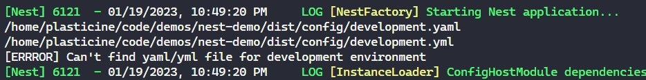
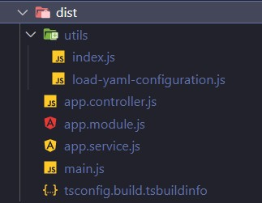

# 分环境配置

## 前言

平时我们区分环境都是通过环境变量，比如 `process.env.NODE_ENV` 去区分运行的环境，然后加载对应环境的配置文件，然后连接对应环境的数据库或进行别的操作

在 NestJS 中，提供了更方便的方式，可以实现一个 `ConfigModule`，通过该 module 去获取配置文件中的配置，手动实现还是比较麻烦的，NestJS 提供了开箱即用的 `ConfigModule`

## ConfigModule 基本使用

NestJS 提供的 `ConfigModule` 在 `@nestjs/config` 这个包中，我们先安装它

```shell
pnpm i @nestjs/config
```

使用也很简单，通过调用其静态方法 `forRoot`，以 [dynamic module](./basic.md#dynamic-modules) 的方式注册到 AppModule 中即可

```TypeScript
// app.module.ts
import { Module } from '@nestjs/common'
import { ConfigModule } from '@nestjs/config'

@Module({
  imports: [ConfigModule.forRoot()],
})
export class AppModule {}

// app.service.ts
@Injectable()
export class AppService {
  getEnv(key: string) {
    return {
      data: process.env[key] ?? 'not found',
    }
  }
}

// app.controller.ts
@Controller()
export class AppController {
  constructor(private readonly appService: AppService) {}

  @Get('env')
  getEnv(@Query('key') key: string) {
    return this.appService.getEnv(key)
  }
}
```

然后在项目根目录创建 `.env` 文件，并将环境变量写入即可在业务代码中通过 `process.env` 加载了

`forRoot` 静态方法还能接收很多参数，下面我们来体验一下这些参数的作用

## 自定义配置文件

对于 `.env` 中配置的环境变量，通过 `process.env` 读取时全是 string 类型，但业务上可能需要确切的类型，比如定义了一个 `IS_XXX=true` 的环境变量，我们希望读取到的是 `boolean` 的 `true` 而不是 `string` 的 `'true'`

这种时候就需要用到自定义配置文件的方式了，通过 `ConfigModule.forRoot({ load: [] })` 去配置，数组中接收的是一个函数，函数返回的对象作为解析好的配置对象使用

但是这个时候就不再是通过 `process.env` 去获取了，而是通过 `ConfigService` 去获取，就像下面这样：

```TypeScript{5-13,24,27-33}
// app.module.ts
@Module({
  imports: [
    ConfigModule.forRoot({
      load: [
        () => ({
          port: 3000,
          database: {
            host: 'localhost',
            port: 5432,
          },
        }),
      ],
    }),
  ],
  controllers: [AppController],
  providers: [AppService],
})
export class AppModule {}

// app.service.ts
@Injectable()
export class AppService {
  @Inject(ConfigService) private configService: ConfigService

  getEnv() {
    return {
      port: this.configService.get('port'),
      database: {
        host: this.configService.get('database.host'),
        port: this.configService.get('database.port'),
      },
    }
  }
}
```

## 使用 yaml 作为配置文件的格式

`dot-env` 的方式编写配置文件不太方便，既然 NestJS 有自定义配置文件的能力，那我们可以使用 yaml 的方式编写配置文件，然后写一个加载 yaml 配置文件的函数，返回解析的结果，这样就能通过 `ConfigService` 去获取 yaml 文件的配置项了

要解析 yaml，首先要能够解析 yaml 文件，`yaml` 这个库可以做到

```shell
pnpm i yaml
```

然后实现一个加载 yaml 配置的函数

```TypeScript
import { existsSync, readFileSync } from 'fs'
import { resolve } from 'path'

import { parse } from 'yaml'

const CONFIG_DIR = resolve(__dirname, '../config')

/**
 * @description 根据 process.env.NODE_ENV 加载对应配置文件
 */
export function loadYAMLConfiguration() {
  const env = process.env.NODE_ENV ?? 'development'

  const pathToYAML = resolve(CONFIG_DIR, `${env}.yaml`)
  const pathToYML = resolve(CONFIG_DIR, `${env}.yml`)
  let pathToTarget = ''

  if (existsSync(pathToYAML)) {
    pathToTarget = pathToYAML
  } else if (existsSync(pathToYML)) {
    pathToTarget = pathToYML
  } else {
    console.error(`[ERRROR] Can't find yaml/yml file for ${env} environment`)
    return null
  }

  const fileContent = readFileSync(pathToTarget, { encoding: 'utf-8' })
  const resolvedConfig = parse(fileContent)

  return resolvedConfig
}
```

然后将它添加到 `ConfigModule` 中

```TypeScript{4}
@Module({
  imports: [
    ConfigModule.forRoot({
      load: [loadYAMLConfiguration],
    }),
  ],
  controllers: [AppController],
  providers: [AppService],
})
export class AppModule {}
```

再创建 `config/development.yaml` 文件，随便写一点配置

```yaml
mysql:
  host: localhost
  port: 3306
  username: foo
  password: bar
```

此时启动 nest 会发现输出了我们编写的报错信息，但明明已经把配置文件写好了，为什么还是找不到文件？

打印看看两个文件路径看看：





可以看到原来是因为 yaml 配置文件并没有被打包金产物中，官方文档有说到这一点，解决方案很简单，在 `nest-cli.json` 中配置 `compilerOptions#assets` 选项即可，因为配置文件被视为静态资源默认不会打包进产物中

```json
{
  "$schema": "https://json.schemastore.org/nest-cli",
  "collection": "@nestjs/schematics",
  "sourceRoot": "src",
  "compilerOptions": {
    "deleteOutDir": true,
    "assets": [
      {
        "include": "../config/*.yaml",
        "outDir": "./dist/config",
        "watchAssets": true
      },
      {
        "include": "../config/*.yml",
        "outDir": "./dist/config",
        "watchAssets": true
      }
    ]
  }
}
```

:::tip
这里 `config` 目录是和 `src` 目录同级的，include 配置项是相对于 src 目录而言的，所以应为 `..` 而不是 `.`
:::

## ConfigService

ConfigService 提供了好用的泛型，让我们能够很好地声明需要的配置的类型，就以上面的示例 yaml 文件为例，首先定义一个与之对应的 interface

```TypeScript
interface MySQLConfig {
  host: string
  port: number
  username: string
  password: string
}
```

然后将其传给 `this.configService.get` 方法

```TypeScript
const mysqlConfig = this.configService.get<MySQLConfig>('mysql', {
  host: 'default-host',
  port: 3306,
  username: 'default-user',
  password: 'default-password',
})
```

第二个参数是默认值，此时 `mysqlConfig` 的类型是 `MySQLConfig`，如果没有传默认值，则类型为 `MySQLConfig | undefined`

还可以在注入 `ConfigService` 时给 `ConfigService` 传入泛型

```TypeScript
interface MySQLConfig {
  host: string
  port: number
  username: string
  password: string
}

interface EnvironmentVariables {
  mysql: MySQLConfig
}

@Injectable()
export class AppService {
  @Inject(ConfigService)
  private configService: ConfigService<EnvironmentVariables>

  getEnv() {
    const mysqlConfig = this.configService.get<MySQLConfig>('mysql', {
      host: 'default-host',
      port: 3306,
      username: 'default-user',
      password: 'default-password',
    })

    const username = this.configService.get('mysql.username', { infer: true })

    return mysqlConfig
  }
}
```

调用 `get` 方法时，第二个参数传入 `{ infer: true }` 即可开启类型推导，这里将 username 推导成我们定义的 string 类型

## 环境变量校验

假设我们需要在项目启动的时候对环境变量进行校验，比如 `NODE_ENV` 只允许是 `development` 或 `production`，如果是其它的 `NODE_ENV` 则直接抛出异常终止项目启动，没有配置 `NODE_ENV` 时则配置默认值

`ConfigModule.forRoot` 的 `validationSchema` 可以做到这一点，还需要结合 `joi` 这个库

```TypeScript{5-9}
@Module({
  imports: [
    ConfigModule.forRoot({
      load: [loadYAMLConfiguration],
      validationSchema: Joi.object({
        NODE_ENV: Joi.string()
          .valid('development', 'production')
          .default('development'),
      }),
    }),
  ],
  controllers: [AppController],
  providers: [AppService],
})
export class AppModule {}
```
