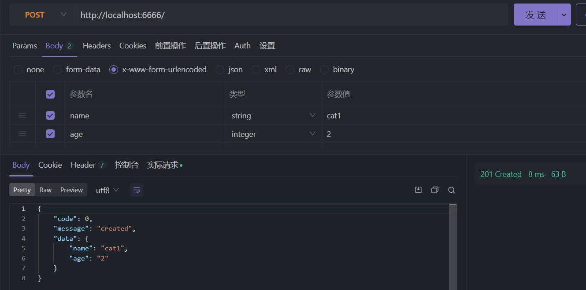
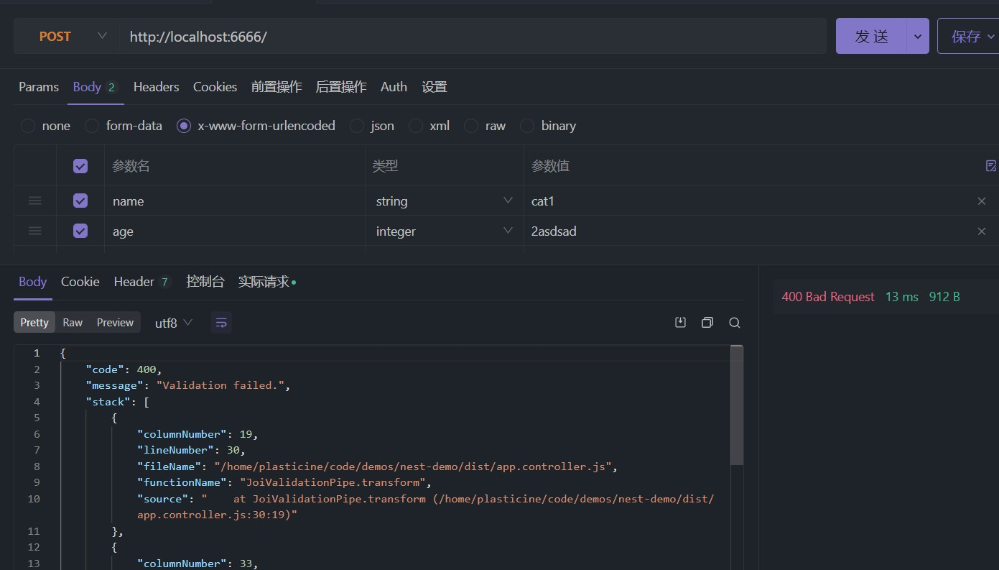

# 管道 - 数据转换和验证

对于需要使用参数的 controller，我们往往需要对数据进行一些处理，比如转换和验证操作，通过 nest 的 pipe 管道可以很方便的实现

比如下面这种情况：

```TypeScript
@Controller()
export class AppController {
  @Get('pipe')
  pipeDemo(@Param('id') id: number) {
    return {
      id,
      typeofId: typeof id,
    }
  }
}
```

这里我们期望 id 的类型是 number，但实际得到的是怎样的呢？

```json
{
  "id": "1",
  "typeofId": "string"
}
```

可以看到，并不符合我们的类型注解的预期，这时候就可以用 pipe 来处理了，其使用方式很简单

```TypeScript
import { Controller, Get, Param, ParseIntPipe } from '@nestjs/common'

@Controller()
export class AppController {
  @Get('pipe/:id')
  pipeDemo(@Param('id', ParseIntPipe) id: number) {
    return {
      id,
      typeofId: typeof id,
    }
  }
}
```

从这个 demo 就能直到 pipe 的作用就是在参数传递到 controller handler 之前进行预处理，因此我们可以进行数据类型的转换以及校验操作，避免在 handler 中写 `Number(id)` 这样看起来很冗余的代码

## Nest 内置管道

上面的 `ParseIntPipe` 是 nest 的内置 pipe，还有很多内置 pipe

- ValidationPipe
- ParseIntPipe
- ParseFloatPipe
- ParseBoolPipe
- ParseArrayPipe
- ParseUUIDPipe
- ParseEnumPipe
- DefaultValuePipe
- ParseFilePipe

都是看名字就知道用处的 pipe，就不一一介绍了，感兴趣的自己开个 demo 一一体验就行

## 自定义管道

首先我们来看看一个自定义的 pipe 长什么样：

1. 使用 `@Injectable()` 装饰器
2. 实现了 `PipeTransform` 接口的类

```TypeScript
import { PipeTransform, Injectable, ArgumentMetadata } from '@nestjs/common'

@Injectable()
export class ValidationPipe implements PipeTransform {
  transform(value: any, metadata: ArgumentMetadata) {
    return value
  }
}
```

:::tip

PipeTransform 接口有两个泛型参数 -- `T` 和 `R`，即 `PipeTransform<T, R>`

- T 代表 transform 方法的 value 类型，也就是 pipe 操作的目标的类型

- R 代表 transform 方法的返回值类型

:::

`ArgumentMetadata` 的类型定义如下：

```TypeScript
interface ArgumentMetadata {
  // 可以直到 pipe 当前作用于哪种类型的参数 -- @Body(), @Query(), @Param() 等
  type: 'body' | 'query' | 'param' | 'custom'

  // 参数的元类型 -- 比如 String, Number 等
  metatype?: Type<unknown>

  // 传递给 @Body('xxx') 等参数装饰器的参数，也就是这里的 'xxx'
  data?: string
}
```

下面以实现一个自定义的 DTO 校验管道为例来体验下如何自定义一个管道去完成我们的需求

## 场景 1：校验 DTO 属性

虽然 TypeScript 能通过类型注解为 DTO 的属性声明类型，但是最终运行时是以 JavaScript 代码运行的，类型注解会被擦除，因此为了保证运行时能够校验 DTO 属性，我们需要额外的代码来完成校验功能

你当然可以选择在自定义 pipe 中一个个验证传入的对象的属性是否是符合预期的类型，比如：

```TypeScript
@Injectable()
class JoiValidationPipe implements PipeTransform {
  transform(value: any, metadata: ArgumentMetadata) {
    if (!value.name instanceof String) {
      throw new BadRequestException('Validation failed.')
    }

    if (!value.age instanceof Number) {
      throw new BadRequestException('Validation failed.')
    }

    return value
  }
}
```

这样虽然能达到目的，但是显得很麻烦，遵循 [DRY](https://en.wikipedia.org/wiki/Don%27t_repeat_yourself) 原则，目前有两种成熟的方案能够帮助我们完成 dto 的校验逻辑：

- schema based validation
- class validator

下面我们来分别体验一下两种方式

### schema based validation

这是一种基于 schema 描述数据校验逻辑的方案，典型代表则是 [Joi](https://joi.dev/)

其使用方式很简单，比如我们需要校验 `CreateCatDto` 这样一个类型的数据

```TypeScript
interface CreateCatDto {
  name: string
  age: number
}
```

那么我们就能够用 Joi 为其声明一个 schema

```TypeScript
const createCatSchema = Joi.object<CreateCatDto>({
  name: Joi.string().required(),
  age: Joi.number().integer().required(),
})
```

可以看到，其 api 设计得十分符合常理，因此即便我不说你也能知道它的作用是什么了，就是根据接口的定义去声明一个 schema 对象，该对象会描述一个对象的校验规则，这样就省去让我们手动编写校验代码了，直接以声明式（不严格来说，相对于编写校验代码来说算是声明式）的方式去描述校验逻辑

Joi 中校验一个对象类型的 schema，也就是 `ObjectSchema`，通过 `createCatSchema.validate({ name: 'cat1', age: 2 })` 这样的方式即可完成校验，校验失败时会在返回的对象中的 `error` 属性中体现，利用这一特性，我们能够很轻松的实现一个用于校验 DTO 的自定义 pipe

```TypeScript
@Injectable()
class JoiValidationPipe implements PipeTransform {
  constructor(private schema: ObjectSchema) {}

  transform(value: any, metadata: ArgumentMetadata) {
    // { metatype: [Function: Object], type: 'body', data: undefined }
    console.log(metadata)

    const { error } = this.schema.validate(value)

    if (error) {
      throw new BadRequestException('Validation failed.')
    }

    return value
  }
}
```

实际使用这个管道也是和之前 `ParseIntPipe` 的方式类似

```TypeScript
@Controller()
export class AppController {
  @Post()
  createCat(
    @Body(new JoiValidationPipe(createCatSchema)) createCatDto: CreateCatDto,
  ) {
    const { name, age } = createCatDto

    return {
      code: 0,
      message: 'created',
      data: {
        name,
        age,
      },
    }
  }
}
```

现在我们看看接口的校验效果

当传入的 post 请求体符合要求时：



不符合要求时，比如这里 age 我传入英文字符



这种方式需要我们在定义好 DTO 类型后再额外定义其 schema，如果你不喜欢这种编写额外代码的感觉，那么下面要介绍的 [class-validator](#class-validator) 可能更加适合你，它能够将描述校验逻辑的代码直接以装饰器的方式写在 DTO 的类型定义中

### class validator

这种方式能够让我们在声明数据类型的时候就把校验逻辑通过装饰器的方式声明到属性上，这么说可能会比较懵，直接看代码就懂了

首先要安装一个依赖 -- `class-validator`，其提供各种校验相关的装饰器

```TypeScript
import { IsNotEmpty, IsNumber, IsString, validate } from 'class-validator'

class CreateCatDto {
  @IsString()
  @IsNotEmpty()
  name: string

  @IsNumber()
  @IsNotEmpty()
  age: number
}
```

这等价于用 joi 编写的校验逻辑：

```TypeScript
interface CreateCatDto {
  name: string
  age: number
}

const createCatSchema = Joi.object<CreateCatDto>({
  name: Joi.string().required(),
  age: Joi.number().integer().required(),
})
```

可以看到，不需要再编写额外的像 `createCatSchema` 这样的分离的代码，而是直接把校验逻辑放在类型声明的时候就做好了

其次，从原来的 interface 变成了 class

接下来再为其编写自定义 pipe 进行校验

```TypeScript
import { validate } from 'class-validator'
import { plainToInstance } from 'class-transformer'

@Injectable()
export class ValidationPipe implements PipeTransform<any> {
  async transform(value: any, { metatype }: ArgumentMetadata) {
    if (!metatype || !this.toValidate(metatype)) {
      return value
    }
    const object = plainToInstance(metatype, value)
    const errors = await validate(object)
    if (errors.length > 0) {
      throw new BadRequestException('Validation failed')
    }
    return value
  }

  private toValidate(metatype: Function): boolean {
    const types: Function[] = [String, Boolean, Number, Array, Object]
    return !types.includes(metatype)
  }
}
```

最后应用到 controller 的 handler 参数中即可

```TypeScript
@Controller()
export class AppController {
  @Post()
  createCat(@Body(ClassValidatorPipe) createCatDto: CreateCatDto) {
    const { name, age } = createCatDto

    return {
      code: 0,
      message: 'created',
      data: {
        name,
        age,
      },
    }
  }
}
```

还可以应用到全局，和 [应用异常过滤器](exception.md#应用异常过滤器) 中的方式是类似的，可以调用 `app.useGlobalPipes()` 方法应用，也可以通过 provider 的方式应用，只是 provide 属性要换成 `@nestjs/core` 中的 `APP_PIPE` 而已

### 内置的校验管道

基于 [DRY](https://en.wikipedia.org/wiki/Don%27t_repeat_yourself) 原则，校验管道的实现是比较通用的，因此 nest 官方已经提供了一个开箱即用的 `ValidationPipe`，其校验逻辑是基于 `class-validator` 的，因此如果要使用该校验管道，需要安装 `class-validator` 和 `class-transformer`

内置的这个校验管道提供了很多功能，具体可自行查看 [官方文档](https://docs.nestjs.com/techniques/validation#using-the-built-in-validationpipe)

## 场景 2：转换数据

这个使用场景前面我们就已经体验过了，比如 nest 内置的 `ParseIntPipe`，除此之外我们还可以自行根据业务需要去实现自定义管道对数据格式进行转换，比较简单，就不赘述了
