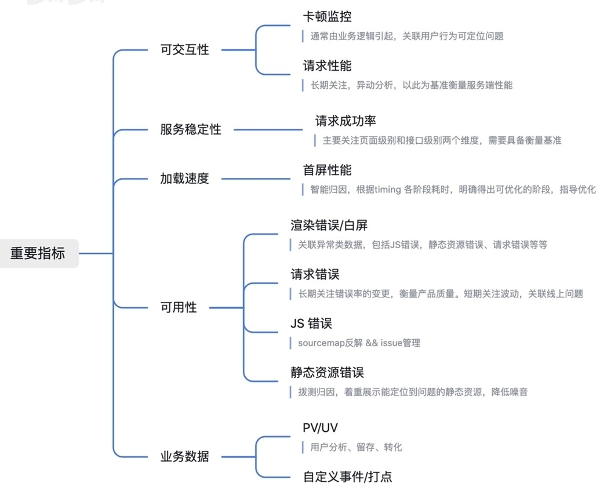

# 基础知识

## 1. 为什么要有前端监控？

- 用户体验直接决定用户留存，然而众多 **体验问题** 单靠用户反馈并不现实
  - 页面加载慢
  - 页面白屏
  - 操作卡顿或无响应
  - 请求响应慢
  - 一直在请求中
  - 请求频繁报错
  - 排版样式错乱
  - ...
- 移动互联网时代，用户要求越来越高，耐心越来越少，对页面响应慢、页面不可用的容忍度低
- 使用场景复杂，H5、App、Web、浏览器版本兼容、手机型号、用户网速等等，都可能给业务带来影响

## 2. 前端监控能带来什么好处？

- 提升稳定性，更快地发现异常、定位异常、解决异常
  - JavaScript 运行时错误
  - 网络接口请求异常
  - 资源加载异常
  - 白屏
  - ...
- 提升用户体验，建立性能规范，长期关注优化
  - 页面性能
  - 接口性能
  - 资源加载性能
  - 卡顿监控
- 了解业务数据，指导产品升级
  - PV && UV
  - 业务数据
  - 行为监控

## 3. 前端监控的流程

主要分为四步：

1. 数据采集
2. 组装上报
3. 清洗存储
4. 数据消费

### 3.1. 数据采集

- PV 监控：记录页面切换后新的 url、页面切换原因
- JavaScript 错误：错误对应的类型、描述、行列号、堆栈，错误发生前的用户交互、错误的上下文等等
- 性能监控：首屏加载各阶段耗时、各性能指标、SPA 切换耗时、LongTask 等等
- 请求监控：请求的路径、状态码、请求头和响应头、请求各阶段耗时等等
- 白屏监控：白屏发生的页面、关联的异常、相关的上下文等等
- 静态资源监控 && 用户行为监控 && 自定义监控

### 3.2. 组装上报

- 基础信息包装：页面路径、页面标识、全局 context、部署版本、部署环境、网络等等
- 采样逻辑
- 用户自定义包装逻辑执行：通过提供生命周期钩子的方法让用户扩展自定义包装逻辑，比如补充更多上下文、对数据进行脱敏等
- 队列暂存 && 聚合发送
- 发送时机：使用 `sendBeacon` 进行发送，它会在页面关闭时发送请求，并且不会阻塞页面卸载

### 3.3. 清洗存储

- User-Agent 解析：浏览器版本、系统版本、设备型号、品牌等
- IP 解析：地区、省份、城市、运营商、地理位置等
- 分类型落表落库
- 处理 JavaScript 错误：堆栈数据格式化、`SourceMap` 还原

### 3.4. 数据消费

- 总览分析：查看站点的整体运行情况，有效呈现需要关注的问题和出现的异常情况
- 各功能模块消费视角：如异常模块、性能模块等
- 单点查询，能够针对用户全生命周期上报数据的重建展示，比如展示某个异常发生时用户的行为
- 提供数据订阅能力，当业务关注某块数据的时候，会在对应数据变化时主动通知业务方
- 提供实时报警能力：当检测到严重异常时会主动发起报警

## 4. 前端监控的关注点

