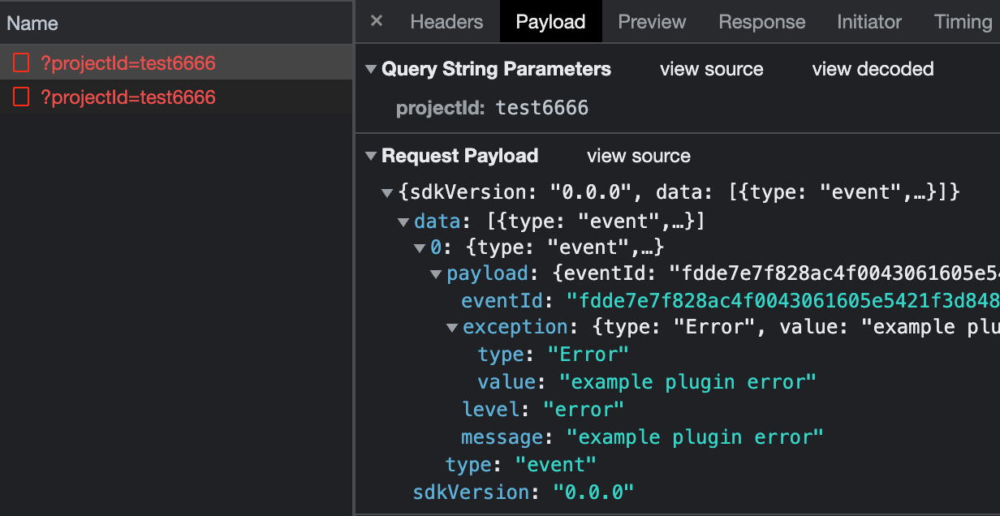

# 数据上报流程

:::tip 对应的理论篇传送门
[传送门](/fe-monitor-system/theoretical-chapter/sentry-sdk-architecture/data-report/)
:::

## 需求分析

`core`

- 生成 Event 相关的抽象方法:

  - eventFromException
  - eventFromMessage

- 捕获 exception -- captureException
- 捕获 message -- captureMessage
- 生成 Envelope
- 实现 Transport
- 发送 Event -- sendEvent

`browser`

- 实现 eventFromException 和 eventFromMessage

## 实现生成 Event 相关的方法

首先需要声明一下 Event 的类型，我们不需要像 Sentry 那样在 Event 中上报那么多数据，按需选择，只上报一些基本数据即可

```ts
export interface Event {
  eventId?: string
  message?: string
  exception?: EventException
  level?: EventLevel
}

export type EventLevel = 'info' | 'warning' | 'error' | 'debug'

export interface EventException {
  type?: string
  value?: string
}

export type RuntimeException = Error | ErrorEvent | DOMException
```

- eventId 用于标识 Event
- message 用于记录上报事件的消息
- exception 用于记录上报事件的异常
- level 用于标记事件等级

RuntimeException 是代码运行时会遇到的异常类型，需要在捕获到它们的时候将其转为统一的 EventException 后再上报，确保数据格式的一致性

接下来在 `packages/types/src/client.ts` 中为 Client 接口添加两个新的方法 -- `eventFromException` 和 `eventFromMessage`，其签名如下：

```ts
export interface Client<O extends ClientOptions = ClientOptions> {
  /** @description 根据异常生成 Event */
  eventFromException(exception: RuntimeException): Event

  /** @description 根据消息生成 Event */
  eventFromMessage(message: string, level?: EventLevel): Event
}
```

然后在 BaseClient 中实现这两个方法，但是需要注意，这两个方法不应该由 BaseClient 实现，而应当由其子类实现

```ts
export abstract class BaseClient<O extends ClientOptions> implements Client<O> {
  public abstract eventFromException(exception: RuntimeException): Event

  public abstract eventFromMessage(message: string, level?: EventLevel | undefined): Event
}
```

具体实现会在 BrowserClient 中完成

---

### 确定 eventId 的生成策略

将异常转换成 event 时，需要考虑一下 `eventId` 怎么生成，这个关系到服务端对大量重复异常的去重逻辑，十分重要

如果不能正确地为重复的异常生成唯一标识的 id，会导致数据清洗时出现大量重复数据，因此需要明确一个合理的 eventId 生成策略

我采用的生成策略为：从异常的 `name` + `message` + `stack` 堆栈解析结果三者结合的方式去生成 id

为此，我们需要先实现堆栈解析的能力，将原始的异常的 stacktrace 字符串转成结构化的对象，方便我们获取信息，可以直接使用 [stacktrace-parser](https://www.npmjs.com/package/stacktrace-parser) 这个库

### eventFromException

```ts
export function eventFromException(exception: RuntimeException): Event {
  const eventId = generateEventId({ exception })
  const eventException = generateEventExceptionFromRuntimeException(exception)

  return {
    eventId,
    level: EventLevelEnum.Error,
    exception: eventException,
    message: exception.message,
  }
}
```

eventId 需要根据不同的运行时异常去生成，`generateEventId` 实现如下：

```ts
function generateEventId(options: GenerateEventIdOptions): string {
  const { exception, message, level } = options

  if (exception !== undefined) return generateEventIdFromException(exception)

  if (message !== undefined && level !== undefined) return generateEventIdFromMessage(message, level)

  return generateRandomEventId()
}

function generateEventIdFromException(exception: RuntimeException): string {
  if ((isError(exception) || isDOMException(exception)) && exception.stack !== undefined) {
    return generateEventIdFromErrorLike(exception)
  }

  if (isErrorEvent(exception) && isError(exception.error)) {
    return generateEventIdFromErrorLike(exception.error)
  }

  return generateRandomEventId()
}

interface ErrorLike {
  name: string
  message: string
  stack?: string
}

function generateEventIdFromErrorLike(errorLike: ErrorLike): string {
  const stackframes = parse(errorLike.stack!)

  // 使用 name + message + stackframes 作为 hash 的输入
  const hashInput: string[] = [errorLike.name, errorLike.message]

  stackframes.forEach((frame) => {
    const { file, methodName, lineNumber, column } = frame

    file !== null && hashInput.push(file)
    methodName !== null && hashInput.push(methodName)
    lineNumber !== null && hashInput.push(String(lineNumber))
    column !== null && hashInput.push(String(column))
  })

  return hash(stackframes.join('-'))
}

function generateEventIdFromMessage(message: string, level: EventLevel): string {
  const hashInput = `${message}-${level}`

  return hash(hashInput)
}

function generateRandomEventId() {
  const hashInput = `${Date.now()}-${Math.random()}`

  return hash(hashInput)
}
```

类似地，EventException 的生成也需要根据不同的 RuntimeException 去生成，其实现如下：

```ts
export function generateEventExceptionFromRuntimeException(runtimeException: RuntimeException): EventException {
  if (isError(runtimeException)) return eventExceptionFromError(runtimeException)

  if (isErrorEvent(runtimeException)) return eventExceptionFromErrorEvent(runtimeException)

  if (isDOMException(runtimeException)) return eventExceptionFromDOMException(runtimeException)

  return {
    type: 'unknown',
    value: 'unknown',
  }
}

function eventExceptionFromError(error: Error): EventException {
  return {
    type: error.name,
    value: error.message,
  }
}

function eventExceptionFromErrorEvent(errorEvent: ErrorEvent): EventException {
  return eventExceptionFromError(errorEvent.error)
}

function eventExceptionFromDOMException(domException: DOMException): EventException {
  return eventExceptionFromError(domException)
}
```

### eventFromMessage

相较于 exception，message 的处理显然简单很多，因为不涉及对异常的处理，其实现如下：

```ts
export function eventFromMessage(message: string, level?: EventLevel): Event {
  const eventId = generateEventId({ message, level })

  return {
    eventId,
    level: level ?? DEFAULT_MESSAGE_LEVEL,
    message,
  }
}
```

### 单元测试看效果

接下来可以编写一个单元测试看看效果如何：

```ts
describe('BrowserClient', () => {
  let browserClient: BrowserClient

  beforeEach(() => {
    browserClient = new BrowserClient({
      plugins: [],
    })
  })

  test('eventFromException', () => {
    const error = new Error('foo')
    const event = browserClient.eventFromException(error)
    expect(event).toMatchInlineSnapshot(`
      {
        "eventId": "W29iamVjdCBPYmplY3RdLVtvYmplY3QgT2JqZWN0XS1bb2JqZWN0IE9iamVjdF0tW29iamVjdCBPYmplY3RdLVtvYmplY3QgT2JqZWN0XS1bb2JqZWN0IE9iamVjdF0tW29iamVjdCBPYmplY3RdLVtvYmplY3QgT2JqZWN0XS1bb2JqZWN0IE9iamVjdF0tW29iamVjdCBPYmplY3Rd",
        "exception": {
          "type": "Error",
          "value": "foo",
        },
        "level": "error",
        "message": "foo",
      }
    `)
  })
})
```

## 捕获 exception 和 message

捕获异常的流程如下：

1. 为异常生成 Event -- 可以调用 `eventFromException` 或 `eventFromMessage`
2. 调用 `sendEvent` 将事件发送出去，这个会在下面讲解发送 Event 的时候实现

首先声明这两个方法

```ts{14-26}
export interface Client<O extends ClientOptions = ClientOptions> {
  /** @description 获取 client options */
  getOptions(): O

  /** @description 注册插件 - 插件从 options 中获取 */
  setupPlugins(): void

  /** @description 根据异常生成 Event */
  eventFromException(exception: RuntimeException): Event

  /** @description 根据消息生成 Event */
  eventFromMessage(message: string, level?: EventLevel): Event

  /**
   * @description 捕获异常并进行上报
   * @returns 异常对应的 Event 的 id
   */
  captureException(exception: RuntimeException): string

  /**
   * @description 捕获消息并进行上报
   * @param message 消息
   * @param level 消息等级
   * @returns 消息对应的 Event 的 id
   */
  captureMessage(message: string, level?: EventLevel): string
}
```

再到 BaseClient 中进行实现，目前只需要调用 `eventFromException` 和 `eventFromMessage` 生成对应 Event 并返回 eventId 即可

```ts{18-26}
export abstract class BaseClient<O extends ClientOptions> implements Client<O> {
  protected readonly _options: O

  // 只允许子类实例化 不允许直接实例化 BaseClient
  protected constructor(options: O) {
    this._options = options
  }

  getOptions(): O {
    return this._options
  }

  setupPlugins(): void {
    const { plugins } = this._options
    setupPlugins(plugins)
  }

  public captureException(exception: RuntimeException): string {
    const event = this.eventFromException(exception)
    return event.eventId
  }

  public captureMessage(message: string, level?: EventLevel | undefined): string {
    const event = this.eventFromMessage(message, level)
    return event.eventId
  }

  public abstract eventFromException(exception: RuntimeException): Event

  public abstract eventFromMessage(message: string, level?: EventLevel | undefined): Event
}
```

## 发送 Event

参考 Sentry 的设计，我们会将要发送的 Event 放到 Envelope 这个载体中发送出去

Envelope 可以类比成 HTTP Request，包括了请求头和请求体部分，请求头中主要存放 dsn，而请求体则是 Event，值得注意的是，Envelope 中可以有多个 Event，因此可以批量将多个 Event 封装到一个 Envelope 中发送出去

而 Envelope 又会由 Transport 去发送，Transport 是对发送数据这一行为的抽象，主要是考虑到有 Fetch 和 XMLHttpRequest 两种场景下对数据进行发送，优先使用 Fetch，当执行环境不支持 Fetch 时则会降级使用 XMLHttpRequest 进行发送

其次，在 Sentry 中，Transport 还支持缓冲区的特性，能够在缓冲区满时才将 Envelope 发送出去，也可以手动清空缓冲区发送 Envelope，这里我们就不设计缓冲区的功能了，只对运行时环境的 Fetch 和 XMLHttpRequest 进行区分

明白了 Envelope 和 Transport 的作用后，我们就可以开始写代码了，首先来实现一下 Envelope

---

### 实现 Envelope

之所以要有 Envelope 而不是直接将 Event 发送到服务端，是考虑到之后要发送的数据载体不仅仅是 Event，还要包含用户手动调用 API 上传的数据，为了统一一个数据格式而抽象出了 Envelope 这一概念

需要先编写其类型，面向类型编程，然后编写创建 Envelope 的函数

Envelope 类型如下：

::: code-group

```ts [packages/types/src/envelope.ts]
import type { DSN } from './dsn'
import type { Event } from './event'

export type EnvelopeItemType = 'event' | 'user_report'

export interface EnvelopeHeaders {
  dsn: DSN
}

export interface EnvelopeBodyItem {
  type: EnvelopeItemType
  payload: Event
}

export interface Envelope {
  headers: EnvelopeHeaders
  body: EnvelopeBodyItem[]
}
```

```ts [packages/types/src/dsn.ts]
export type DSNProtocol = 'http' | 'https'

export interface DSN {
  protocol: DSNProtocol
  host: string
  projectId: string
  port?: number
  path?: string
}
```

:::

接下来实现一个简单的创建 Envelope 的函数

```ts
import type { DSN, Envelope, Event } from '@plasticine-monitor/types'

export function createEventEnvelope(dsn: DSN, event: Event): Envelope {
  return {
    headers: {
      dsn,
    },
    body: [
      {
        type: 'event',
        payload: event,
      },
    ],
  }
}
```

### 实现 Transport

Transport 的操作对象是 Envelope，它只管读取 Envelope 里的 headers 获取接收方的信息，并将 Envelope 里的信息发送出去，因此很容易得出它的类型定义：

```ts
import type { Envelope } from './envelope'

export interface Transport {
  send(envelope: Envelope): Promise<void>
}
```

接下来实现一个通用的 `createTransport`，具体的数据请求逻辑作为函数参数传入，这样就可以让 Fetch 和 XHR 的公共部分逻辑放到 `createTransport` 中实现，而它们各自具体的 API 则分别交给各自实现

```ts
import type { Transport, TransportRequestExecutor } from '@plasticine-monitor/types'

import { getCurrentHub } from './hub'

export function createTransport(requestExecutor: TransportRequestExecutor): Transport {
  const options = getCurrentHub().getClient()?.getOptions()

  return {
    async send(envelope) {
      const { headers, body } = envelope
      const { sdkVersion } = headers

      try {
        await requestExecutor({
          body: {
            sdkVersion,
            data: body,
          },
        })
      } catch (error) {
        if (options?.enableLogger) {
          console.error('plasticine-monitor 数据上报出错：', error)
        }
      }
    },
  }
}
```

然后分别为 Fetch 和 XMLHttpRequest 环境实现两个对应的创建 Transport 的函数

::: code-group

```ts [packages/browser/src/transports/fetch.ts]
import { createTransport } from '@plasticine-monitor/core'
import type { CreateTransportOptions, Transport } from '@plasticine-monitor/types'

export function createTransportWithFetch(options: CreateTransportOptions): Transport {
  const { url, headers } = options

  return createTransport(async (request) => {
    const { body } = request

    const { status } = await fetch(url, {
      body: JSON.stringify(body),
      headers,
      method: 'POST',
    })

    return {
      statusCode: status,
    }
  })
}
```

```ts [packages/browser/src/transports/xhr.ts]
import { createTransport } from '@plasticine-monitor/core'
import type { CreateTransportOptions, Transport } from '@plasticine-monitor/types'

const XHR_READYSTATE_DONE = 4

export function createTransportWithXHR(options: CreateTransportOptions): Transport {
  const { url, headers } = options

  return createTransport(async (request) => {
    const { body } = request

    return new Promise((resolve, reject) => {
      const xhr = new XMLHttpRequest()
      xhr.addEventListener('error', reject)
      xhr.addEventListener('readystatechange', () => {
        if (xhr.readyState === XHR_READYSTATE_DONE) {
          resolve({
            statusCode: xhr.status,
          })
        }
      })

      // set headers
      Object.entries(headers).forEach(([key, value]) => {
        xhr.setRequestHeader(key, value)
      })

      xhr.open('POST', url)
      xhr.send(JSON.stringify(body))
    })
  })
}
```

:::

这两个函数的 options 是从哪里来的呢？由 BaseClient 构造函数传入

```ts
export abstract class BaseClient<O extends ClientOptions> implements Client<O> {
  protected readonly _options: O

  protected readonly _dsn?: DSN

  protected readonly _transport?: Transport

  protected constructor(options: O) {
    const { dsn, createTransport } = options

    this._options = options

    if (dsn) {
      this._dsn = dsn

      const url = transformDSNToURL(dsn)
      this._transport = createTransport?.({
        url,
        headers: {
          'Content-Type': 'application/json',
        },
      })
    }
  }
}
```

并且在 browser 的 init 函数中初始化 BrowserClientOptions 时决定如何调用这个两个创建 Transport 的函数：

```ts
export function init(options: BrowserOptions = {}) {
  const { dsn, plugins, enableLogger, createTransport } = options

  const clientOptions: BrowserClientOptions = {
    dsn,
    enableLogger: enableLogger ?? false,
    plugins: plugins ?? defaultPlugins,
    createTransport: createTransport ?? supportsFetch() ? createTransportWithFetch : createTransportWithXHR,
  }

  initAndBind(BrowserClient, clientOptions)

  console.log('plasticine-monitor SDK 初始化完成')
}
```

### sendEvent

最后再通过 sendEvent 整合一下即可：

```ts
export abstract class BaseClient<O extends ClientOptions> implements Client<O> {
  public sendEvent(event: Event): void {
    if (this._dsn) {
      const envelope = createEventEnvelope(this._dsn, event)

      this._transport?.send(envelope)
    }
  }
}
```

为了测试效果，修改一下之前在 browser 包中实现的一个示例插件

```ts
import type { Plugin } from '@plasticine-monitor/types'

export function examplePlugin(): Plugin {
  return {
    name: 'examplePlugin',
    setupOnce(getCurrentHub) {
      const client = getCurrentHub().getClient()
      client?.captureException(new Error('example plugin error'))
      client?.captureMessage('example plugin message', 'debug')
    },
  }
}
```

该插件这会在初始化的时候分别执行 `captureException` 和 `captureMessage`，最终会发送数据出去

接下来打包一下，然后在 playground 包中测试看看效果



至此，我们的 SDK 具备了数据上报的能力，接下来就可以实现错误监控相关的插件，在合适的时机调用数据上报能力相关 API 完成错误监控了！
