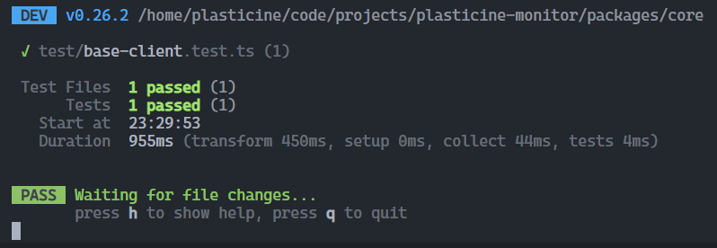

# 初始化流程

:::tip 对应的理论篇传送门
[传送门](../../../theoretical-chapter/sentry-sdk-architecture/init/)
:::

## 需求分析

现在是刚开始，我们只需要实现简单的逻辑先，之后再逐步完善新的功能特性

初始化阶段我们主要需要实现以下几个功能：

1. 定义 SDK 的 options
2. 实现插件机制

   2.1. 定义插件的类型

   2.2. 实现 Client 用于注册插件

   2.3. 实现 Hub 供插件获取 Client 实例

   2.4. 实现 getCurrentHub 用于全局获取 Hub 实例

:::warning
这里不应该奔着实现完整的 Hub 和 Client 去实现，而是仅针对于当前要实现的插件机制去实现
:::

## 定义 SDK 的 options

SDK 的 options 需要分为 core 的 options 和 browser 的 options

options 的定义显然是以类型的方式声明的，因此我们可以将其放到 `types` 包中实现，主要定义的是 core 包中 sdk 的 options

因为具体环境的 sdk 是依赖于 core 中的 sdk 的，所以 core 的 options 会被多个包使用到，而具体环境的 sdk 只会在自己的包中使用到自己特定的 options

所以这里会将 core 的 options 定义放到 `types` 包中，browser 的 options 则交给 browser 自己维护

`packages/types/src/options.ts`

```TypeScript
/**
 * @description 实例化 SDK client 的 options
 */
export interface ClientOptions {
  /** @description 插件 */
  plugins: Plugin[]
}

/**
 * @description 初始化 SDK 的 options
 */
export type Options = Partial<ClientOptions>
```

由于目前我们只针对插件系统实现，所以只考虑 plugins 配置项即可，这里为什么要拆分成 ClientOptions 和 Options 呢？

ClientOptions 作为实例化 client 对象的时候使用，是由我们控制的

Options 作为用户初始化 SDK 时使用，是由用户控制的，单独声明 ClientOptions 是为了保证 client 能够被顺利实例化，以免用户少传某个或多个配置项导致实例化参数缺失的问题

在用户角度来看，传入的参数最好都是可选的，这样可以保证用户即便没传入任何 options 也不会让 SDK 代码出错导致业务代码无法运行

我们可以在初始化流程中用默认值填补 ClientOptions 以保证 client 实例化不出错

## 实现插件机制

### 定义插件类型

首先我们来定义一下插件的类型

`packages/types/src/plugin.ts`

```TypeScript
export interface Plugin {
  /** @description 插件名称 */
  name: string

  /**
   * @description 注册插件
   * @param getCurrentHub 获取 Hub 实例
   */
  setupOnce(getCurrentHub: () => Hub): void
}
```

:::tip
关于 Hub 是什么如果不清楚的建议先阅读 [Hub 是什么？](/fe-monitor-system/theoretical-chapter/sentry-sdk-architecture/init/#hub-是什么) 和 [Sentry SDK Hub 源码分析](/fe-monitor-system/theoretical-chapter/sentry-sdk-source/hub/)
:::

### 实现 Client 用于注册插件

注册插件这个功能是所有平台的 client 都具有的，所以应当放在 core 包中实现，基于面向接口编程的理念，我们先构思一下 Client 具备什么能力？

目前其只需要具备注册插件的能力即可，因此其接口定义如下：

`packages/types/src/client.ts`

```TypeScript
export interface Client<O extends ClientOptions = ClientOptions> {
  /** @description 获取 client options */
  getOptions(): O

  /** @description 注册插件 - 插件从 options 中获取 */
  setupPlugins(): void
}
```

接下来就可以去实现这个接口了

`packages/core/src/base-client.ts`

```TypeScript
/**
 * @description 只提供通用逻辑的抽象类，具体的平台相关的逻辑需要子类继承去实现
 */
export abstract class BaseClient<O extends ClientOptions> implements Client<O> {
  protected readonly _options: O

  // 只允许子类实例化 不允许直接实例化 BaseClient
  protected constructor(options: O) {
    this._options = options
  }

  getOptions(): O {
    return this._options
  }

  setupPlugins(): void {
    const { plugins } = this._options
    setupPlugins(plugins)
  }
}
```

`packages/core/src/plugins.ts`

```TypeScript
import type { Plugin } from '@plasticine-monitor/types'

export function setupPlugins(plugins: Plugin[]) {
  plugins.forEach((plugin) => {
    plugin.setupOnce()
  })
}
```

setupOnce 需要有 `getCurrentHub` 去获取 hub 实例，因此接下来我们去实现 getCurrentHub

### 实现 Hub 供插件获取 Client 实例

同样的，在实现 Hub 之前我们先定义一下它的接口，面向接口编程

理论篇已经分析过了，Hub 内部有维护一个模拟函数调用栈，所以接口中肯定要有栈相关的方法 - `getStackTop`, `getStack`

还需要在 hub 中能够获取到 client 实例供插件使用，因此还要有一个 `getClient` 方法，光是能获取还不行，还需要将 client 和 hub 关联起来，不然 getClient 获取不到东西

所以还需要定义一个 `bindClient` 方法用于关联二者

`packages/types/src/hub.ts`

```ts
/** @description 内部模拟函数调用栈的栈帧元素类型 */
export interface Layer {
  client?: Client
}

export interface Hub {
  /** @description 将 client 绑定到 hub 中 */
  bindClient(client?: Client): void

  /** @description 获取 Client 实例 */
  getClient(): Client | undefined

  /** @description 获取内部模拟的函数调用栈 */
  getStack(): Layer[]

  /** @description 获取内部模拟的函数调用栈的栈顶元素 */
  getStackTop(): Layer
}
```

实现代码如下：

`packages/core/src/hub.ts`

```TypeScript
import type { Client, ClientOptions, Hub as HubInterface, Layer } from '@plasticine-monitor/types'

export class Hub implements HubInterface {
  private readonly _stack: Layer[] = [{}]

  constructor(client?: Client) {
    if (client !== undefined) {
      this.bindClient(client)
    }
  }

  /** @inheritdoc */
  public bindClient(client?: Client<ClientOptions> | undefined): void {
    const top = this.getStackTop()
    top.client = client

    client?.setupPlugins()
  }

  /** @inheritdoc */
  public getClient<C extends Client>(): C | undefined {
    return this.getStackTop().client as C
  }

  /** @inheritdoc */
  public getStack(): Layer[] {
    return this._stack
  }

  /** @inheritdoc */
  public getStackTop(): Layer {
    return this._stack.at(-1) ?? {}
  }
}
```

### 实现 getCurrentHub 用于全局获取 Hub 实例

我们需要将 Hub 实例挂载到全局对象上，方便插件获取到 Hub 进行操作，思路是在全局对象上挂载一个 symbol 属性，其值为 SDK 会用到的一些全局信息

这个全局对象应当放到 shared 包中定义，因为 browser 包中也有需要访问全局对象的需求

`packages/shared/src/global-object.ts`

```TypeScript
interface InternalGlobalObject {
  __PLASTICINE_MONITOR__: {
    hub?: any
  }
}

export const GLOBAL_OBJECT: InternalGlobalObject =
  (typeof globalThis === 'object' && globalThis) ||
  (typeof window === 'object' && window) ||
  (typeof self === 'object' && self) ||
  (typeof global === 'object' && global) ||
  (function (this: any) {
    return this
  })() ||
  {}

/**
 * @description
 * 从全局对象的 `__PLASTICINE_MONITOR__` 中获取全局单例值，尽量避免直接通过 GLOBAL_OBJECT 获取值
 * 因为 GLOBAL_OBJECT.__PLASTICINE_MONITOR__ 可能为 undefined
 * 通过该函数去获取能够保证其不为 undefined
 *
 * @param factory 待获取的属性不存在时会调用该工厂函数进行创建
 */
export function getOrCreateSingletonOnGlobalObject<T>(
  key: keyof InternalGlobalObject['__PLASTICINE_MONITOR__'],
  factory: () => T,
): T {
  // 确保全局对象上存在 `__PLASTICINE_MONITOR__`
  const __PLASTICINE_MONITOR__ = (GLOBAL_OBJECT.__PLASTICINE_MONITOR__ = GLOBAL_OBJECT.__PLASTICINE_MONITOR__ || {})

  // 待获取的单例 不存在时则调用工厂函数进行创建
  const singleton = __PLASTICINE_MONITOR__[key] || (__PLASTICINE_MONITOR__[key] = factory())

  return singleton
}
```

这样一来就能调用 `getOrCreateSingletonOnGlobalObject` 来获取全局对象上的 hub 了

```TypeScript
/**
 * @description 从全局对象的 `__PLASTICINE_MONITOR__` 中获取 hub 单例
 */
export function getCurrentHub(): Hub {
  return getOrCreateSingletonOnGlobalObject('hub', () => new Hub())
}
```

### 单元测试看效果

由于我们的 `BaseClient` 的构造函数用了 `protected` 修饰符，所以我们需要实现一个专门用于测试的 TestClient 类，只需要继承 BaseClient 即可

`packages/core/test/mock/test-client.ts`

```TypeScript
import type { ClientOptions } from '@plasticine-monitor/types'

import { BaseClient } from '../../src/base-client'

export type TestClientOptions = ClientOptions

export class TestClient extends BaseClient<TestClientOptions> {
  constructor(options: TestClientOptions) {
    super(options)
  }
}
```

#### getOptions

编写一个单元测试看看能不能实例化以及查看 getOptions 的效果

`packages/core/test/base.test.ts`

```TypeScript
import { TestClient, TestClientOptions } from './mock/test-client'

describe('BaseClient', () => {
  test('constructor / getOptions()', () => {
    const options: TestClientOptions = {
      plugins: [],
    }
    const client = new TestClient(options)
    expect(client.getOptions()).toEqual(options)
  })
})
```



一切正常，接下来看看能否注册插件

#### setupPlugins

单元测试如下：

```TypeScript
describe('BaseClient', () => {
  test('setupPlugins', () => {
    const pluginSetup = {
      isSetup: false,
      clientOptions: {},
    }

    const options: TestClientOptions = {
      plugins: [
        {
          name: 'testPlugin',
          setupOnce(getCurrentHub) {
            const hub = getCurrentHub()
            const client = hub.getClient()

            pluginSetup.isSetup = true
            pluginSetup.clientOptions = client!.getOptions()
          },
        },
      ],
    }

    const client = new TestClient(options)
    const hub = getCurrentHub()
    hub.bindClient(client)

    expect(pluginSetup).toMatchInlineSnapshot(`
      {
        "clientOptions": {
          "plugins": [
            {
              "name": "testPlugin",
              "setupOnce": [Function],
            },
          ],
        },
        "isSetup": true,
      }
    `)
  })
})
```

插件机制也正常运作
