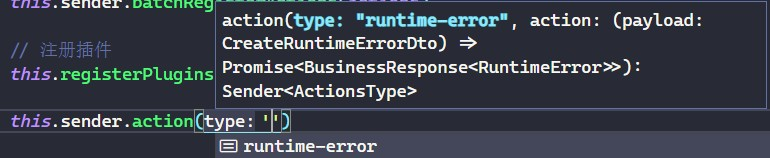
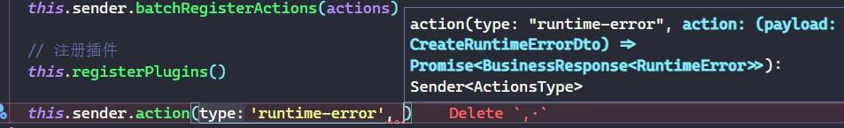
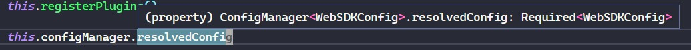

# 架构设计

## 整体设计

为支持多平台、可拓展、可插拔的特点，整体 SDK 的架构设计是 `内核+插件` 的插件式设计

Core 提供平台无关的底层核心实现，然后具体平台的 SDK 只需要继承 Core 类，然后实现具体平台需要的插件安装到 Core 实例上即可

比如 Web 端的 JavaScript 代码错误监控、网络错误监控等都是通过插件的方式去实现，然后注册到 Core 实例中，这种插件式的设计提供了极大的灵活性，并且其拓展性和可插拔性都十分可观

并且我为各个模块都添加了单元测试，以 TDD 的方式进行开发，一方面能够给自己设计 API 带来灵感，另一方面也能够让我在发现架构设计不合理时大胆地对代码进行重构

## 项目结构

```text
packages
├── browser 浏览器平台下的监控 SDK 实现
├── core    底层通用逻辑 -- 具体平台实现会继承自该包导出的 Core 类
└── shared  各包共享的常量、工具函数
```

## Core

`Core` 类是底层核心，其提供了与平台无关的能力

### 数据上报能力

通过 `Core` 实例的 `sender` 属性获取 `Sender` 实例

Sender 实例允许链式调用 `action` 方法注册平台特有的数据上报逻辑，并在需要上报数据时调用 `Sender` 实例的 `send` 方法，指定已注册的 action 类型，传入 payload 后即可触发注册的上报逻辑，本质上就是一个发布订阅设计模式的应用

并且通过 TypeScript 类型体操为 Sender 提供了良好的类型提示能力，可以显式声明用到的 Action 类型，并将其传递给 Core 的泛型参数即可，以 WebSDK 举例：

```TypeScript
type ActionsType = {
  /** @description 运行时错误 */
  'runtime-error': (
    payload: RuntimeErrorActionPayload,
  ) => Promise<BusinessResponse<RuntimeErrorActionResponse>>
}
class WebSDK extends Core<WebSDKConfig, ActionsType> {}
```

效果如下：





并且提供了批量注册 actions 的能力，这使得我们可以将 action 的实现抽离到单独的文件中，然后统一进行注册，而不用在子类中去一个个注册 action，使得代码可读性更高

比如在 `action.ts` 中去实现各个 action

```TypeScript
const actions: ActionsType = {
  async 'runtime-error'(payload) {
    const res = await api.runtimeError.reportRuntimeErrorInfo(payload)

    return res!
  },
}
```

然后在继承了 Core 的子类中调用 sender 实例的 `batchRegisterActions` 方法即可

```TypeScript
class WebSDK extends Core<WebSDKConfig, ActionsType> {
  constructor(config: WebSDKConfig) {
    super(config, defaultWebSDKConfig)

    // 批量注册 sender actions // [!code focus]
    this.sender.batchRegisterActions(actions) // [!code focus]
  }
}
```

### 配置管理器

子类可自定义所需配置，并提供默认配置，传递给 Core 的构造函数即可通过 `this.configManager.resolvedConfig` 获取到配置管理器解析出来的配置

同样的，也可以定义好配置的类型，然后传递给 Core 的泛型参数即可获取完整的类型提示能力

```ts
interface WebSDKConfig {
  /** @description 数据上报 url */
  senderURL: string
}

class WebSDK extends Core<WebSDKConfig, ActionsType> {
  constructor(config: WebSDKConfig) {
    super(config, defaultWebSDKConfig)

    // 能够有类型提示
    this.configManager.resolvedConfig.senderURL
  }
}
```




### 插件系统

继承了 Core 的子类中可以直接通过 `this.use` 进行插件注册，一个插件是一个实现了 `install` 方法的对象，可以直接通过导入 `@plasticine-monitor/core` 包中的 `Plugin` 类型获取其类型定义

这里以监听 JavaScript 代码运行时错误的插件实现为例：

```TypeScript
import type { Plugin } from '@plasticine-monitor/core'

import { WebSDK } from '../sdk'

/**
 * @description 监听运行时错误插件
 */
const runtimeErrorPlugin: Plugin<WebSDK> = {
  install(webSDK) {
    // ...
  },
}
```

在 WebSDK 实现中通过调用 `this.use` 注册插件

```TypeScript
this.use(runtimeErrorPlugin)
```

### 生命周期钩子

Core 还提供了完整的生命周期钩子（仍在开发中），目前已有的生命周期钩子包括：

- onNetworkRequesterInit: 用于初始化网络请求器，比如 axios

#### onNetworkRequesterInit

为什么要有该生命周期钩子呢？axios 这样的网络请求库直接使用不就可以了吗？干嘛要在这个钩子中进行初始化呢？

因为我们开发的是 SDK 而不是常规的业务项目开发，对于常规的业务项目，其网络请求的 baseURL 是可以预先知道的，最终打包到构建产物中即可使用

而 SDK 中，baseURL 是无法预先知道的，因此我们需要将其作为 SDK 的配置项传入，并且在 SDK 初始化的时候传入 baseURL 去初始化 axios 实例

为了方便管理 axios 实例，我实现了一个 `AxiosInstanceManager`，在这里面负责对 axios 实例进行管理，其实例暴露一个 `initAxiosInstance` 方法，这样我们就能将 axios 实例的初始化延迟到 SDK 初始化流程中执行，在 axios 实例的角度而言，其相当于被懒加载了

由于 axios 实例懒加载，导致了封装 api 请求的时候，不能直接使用 axios，而要间接地通过 `AxiosInstanceManger` 实例去获取 axios 实例，以我封装的 `Request` 类为例，部分代码如下：

```ts
class Request {
  constructor(private axiosInstanceManager: AxiosInstanceManager) {}

  request<RequestBody = unknown, ResponseData = unknown>(
    url: string,
    method: Method,
    body: RequestBody | null,
    params: Record<string, string | number> | null,
    responsePreprocessor?: ResponsePreprocessor<ResponseData>,
  ): Promise<UnifiedResult<ResponseData>> {
    return new Promise((resolve) => {
      this.axiosInstanceManager // [!code focus]
        .getInstance() // [!code focus]
        .request({ url, method, data: body, params }) // [!code focus]
        .then((axiosResponse) => {
          let businessResponse: BusinessResponse<ResponseData> =
            axiosResponse.data

          responsePreprocessor &&
            (businessResponse = responsePreprocessor(businessResponse))

          resolve([null, businessResponse])
        })
        .catch((reason) => {
          resolve([reason, undefined])
        })
    })
  }
}
```

站在 Request 的角度，因为不能预先将 axios 实例初始化好，因此要从具有获取 axios 实例能力的 `axiosInstanceManager` 对象中获取 axios 实例，因为 SDK 的初始化一定是在 Request 实例的方法被调用之前进行的，所以等到 Request 实例的方法触发时，`axiosInstanceManager` 中的 axios 实例已初始化完毕，可以正常使用

出于这个原因，设计了 `onNetworkRequesterInit` 这个生命周期钩子，其使用方式很简单，执行 SDK 中网络请求所需的初始化操作即可，以上面的例子来说就是执行 `axiosInstanceManager.initAxiosInstance` 方法

```TypeScript
class WebSDK extends Core<WebSDKConfig, ActionsType> {
  constructor(config: WebSDKConfig) {
    super(config, defaultWebSDKConfig)
  }

  /**
   * @description 在网络请求工具初始化钩子中初始化 axios instance
   */
  protected onNetworkRequesterInit(): void { // [!code focus]
    const { senderURL } = this.configManager.resolvedConfig // [!code focus]
    axiosInstanceManager.initAxiosInstance(senderURL) // [!code focus]
  } // [!code focus]
}
```

## WebSDK

WebSDK 是浏览器平台下的监控 SDK 实现，其继承自 Core 类，通过插件的方式实现各种监控能力

目前以实现的监控能力有：

- JavaScript 代码运行时错误监控

### JavaScript 代码运行时错误监控

对应的插件名为 `runtimeErrorPlugin`，其实现很简单，主要就是通过 `window.addEventListener` 去监听 `error` 事件，并在监听到错误时调用 Core 实例提供的 sender 的 send 方法完成数据的上报

```TypeScript
/**
 * @description 监听运行时错误插件
 */
const runtimeErrorPlugin: Plugin<WebSDK> = {
  install(webSDK) {
    monitorRuntimeError(webSDK)
  },
}

/**
 * @description 监听运行时错误
 */
function monitorRuntimeError(webSDK: WebSDK) {
  // 注册运行时错误上报的 sender action
  window.addEventListener('error', ev => {
    webSDK.sender.send('runtime-error', {
      errorMessage: ev.message,
      rowNo: ev.lineno,
      colNo: ev.colno,
    })
  })
}
```
