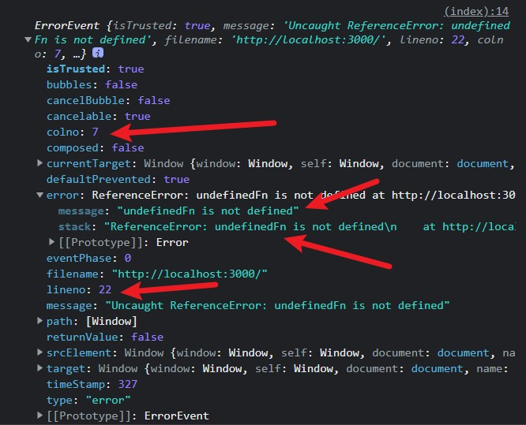
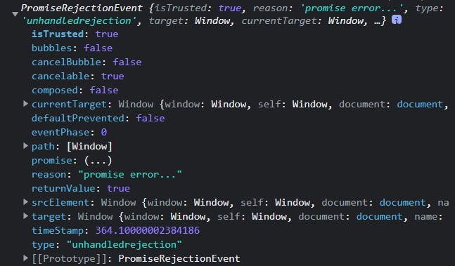
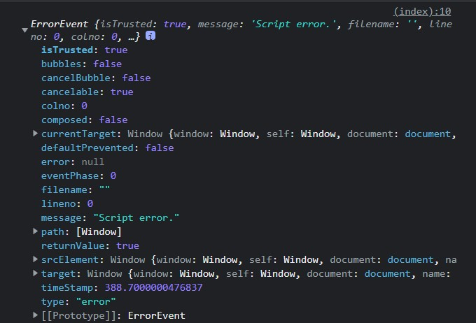

# 错误监控

## 可监控的错误类型

- JavaScript 代码运行错误
- 资源加载错误
- Promise 错误
- Http 请求错误
- CORS 跨域错误

可以定义一个枚举去记录这些错误类型，可用于统一上报到后端方便其进行分类处理

```ts
enum ErrorType {
  JSError = 'js-error',
  ResourceError = 'resource-error',
  PromiseError = 'promise-error',
  HttpError = 'http-error',
  CORSError = 'cors-error',
}
```

## 运行时判断错误类型

TODO

## 为每个错误生成 uid

为什么要为每个错误生成 `uid` 呢？

- `防止同一用户重复上报相同错误`
- 多个用户产生的同一个错误可以在服务端归类，用于 `分析影响用户数、错误数等指标`

对于同一个原因产生的同一个错误，生成的 uid 是相同的，从而起到标识错误的功能

```ts
const genErrorUid = (input: string) => {
  return window.btoa(decodeURIComponent(input))
}
```

> 具体实现参考 [三、异常聚合](https://aozev637mr.feishu.cn/file/boxcnBSIs0Tkcga1lEQDFwsX5eb)

### btoa

用于将二进制字符串使用 `Base64` 编码转成 `ASCII` 字符串

- `b` 代表 `binary`
- `a` 代表 `ascii`

类似地，可以使用 `atob` 将 `ASCII` 字符串转成 二进制字符串

### decodeURIComponent

> `decodeURIComponent()` 方法用于解码由 [encodeURIComponent](https://developer.mozilla.org/zh-CN/docs/Web/JavaScript/Reference/Global_Objects/encodeURIComponent) 方法或者其它类似方法编码的部分统一资源标识符（URI）。

简单来说就是解码 URL 编码的字符串

## JavaScript 代码运行错误

使用 `window.addEventListener('error', (ev) => {})` 去捕获 JavaScript 运行时错误

通过这种方式捕获错误相较于 `window.onerror` 而言有以下优点：

- 可以同时处理静态资源错误
- 不会像 `window.onerror` 那样被覆盖

`ev` 的类型是 `ErrorEvent`，从该对象中可以获取到如下信息：



我们可以从中获取出错的文件名、行号、列号以及具体的堆栈错误信息，对于堆栈错误信息，我们还需要对其进行解析，设置一个最大解析深度，把每个堆栈的函数名、文件名、行列号等信息都记录下来

对于错误堆栈解析，可以使用 [error-stack-parser](https://www.npmjs.com/package/error-stack-parser) 实现

## 资源加载错误

比如加载一个不存在的图片：

```html

```

会出现如下报错：


可以通过 `window.addEventListener('error', () => {}, true)` 去捕获

**一定要记得在捕获阶段添加事件监听器，因为静态资源错误是在捕获阶段发生的**

## Promise 错误

对于 Promise 错误，是无法被 `window.addEventListener('error')` 捕获到的，需要通过监听 `unhandledrejection` 事件

相比于同步代码的错误，异步代码的错误无法获取到行列号等信息，这是浏览器本身的事件循环机制导致的，异步任务需要等到同步任务执行完成后，再从异步队列里取出异步任务并执行，这个时候是无法沿着调用栈回溯这个异步任务的创建时的堆栈信息的。



## Http 请求错误

前端网络请求的底层目前主要是两个：`XMLHttpRequest` 和 `Fetch API`，我们只需要对这两种 API 进行拦截，每当发送网络请求时生成我们需要的信息，整合到 `WebSDK` 中，在遇到错误的时候通过 `Core` 的 `sender` 实例将错误上报

## CORS 跨域错误

假设现在有两个服务器在运行，分别为服务器 A 和 B，A 运行在 `localhost:3000`，B 运行在 `localhost:3001`

```text
src
├── server-a
│   ├── foo.js
│   └── index.html
└── server-b
    └── index.html
```

其中 A 提供了一个 `foo.js` 文件，其代码如下：

```JavaScript
const arr = new Array(-1)
```

然后在 B 的 `index.html` 中通过 `http://localhost:3000/foo.js` 去加载 A 的 `foo.js`，并且加上 `error` 事件监听器

```html
<!DOCTYPE html>
<html lang="en">
  <head>
    <meta charset="UTF-8" />
    <meta http-equiv="X-UA-Compatible" content="IE=edge" />
    <meta name="viewport" content="width=device-width, initial-scale=1.0" />
    <title>Server B</title>
    <script>
      window.addEventListener('error', (ev) => {
        console.log(ev)
      })
    </script>
  </head>
  <body>
    <script src="http://localhost:3000/foo.js"></script>
  </body>
</html>
```

此时得到的 `ev` 对象属性如下：



可以看到，此时的 `msg` 是 `Script error.`，并且行列号、文件名等信息都无法获取了

其实这是浏览器的一个安全机制：当跨域加载的脚本中发生语法错误时，浏览器出于安全考虑，不会报告错误的细节，而只报告简单的 Script error。

浏览器只允许同域下的脚本捕获具体错误信息，而其他脚本只知道发生了一个错误，但无法获知错误的具体内容（控制台仍然可以看到，JS 脚本无法捕获），由于现在的环境是两个不同源的服务器之间加载 JavaScript 脚本，从而产生了跨域。

### 解决方案：

1. 服务端响应头中添加 `Access-Control-Allow-Origin` 配置允许跨域的域名
2. 前端的 `<script src="">` 中加上 `crossorigin` 属性，即 `<script src="" crossorigin>`
