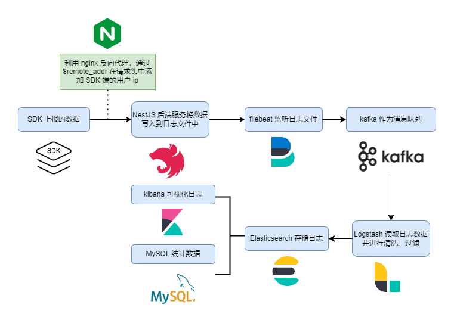

# 日志平台

## 架构设计

日志平台在前端监控系统中的作用是对 SDK 上报的数据以日志文件的方式存放在服务器中，并通过 [ELK 集群](https://www.elastic.co/guide/index.html) 对日志进行处理，再批量入库

处理主要是对 SDK 上报的数据进行扩展，比如对 `User-Agent` 进行解析，对 `ip` 进行解析，获取到国家、省份、城市等信息，解析完后整合到 SDK 上报的数据中

那么直接将 SDK 上报的数据处理后存入 MySQL 不行吗？为什么要这样“多此一举”呢？

这是因为考虑到要缓解高峰期服务端的压力，对于大量到来的 SDK 上报请求，如果都直接去进行处理入库的话，会导致服务器压力很大，因此需要用到类似消息队列的机制，对于到来的上报请求，统一加入到队列中，然后再通过定时任务去统一消费它们，降低服务端的负担

关于这里的“类似消息队列”的机制，本系统采用的是 `filebeat + Kafka + Logstash + Elasticsearch` 的架构

- Filebeat

上报接口会将上报的数据写入到日志文件中，filebeat 负责监听日志文件，当日志文件内容变化时，将数据传递给 Kafka

- Kafka + Logstash

为什么要有 `Kafka + Logstash` 这个流程呢？试想一下没有这些中间件，我们直接把数据写入到 `Elasticsearch` 的话，在面对大量的 SDK 上报数据时，会造成 **日志的堆积和丢失** 问题

因此我们需要引入消息队列的机制，让不能及时处理的消息全都排队等待，一个一个消费这些消息，Kafka 能够很好地完成这个任务，而 Logstash 的 filter 则允许我们在数据存入 elasticsearch 之前进行处理
