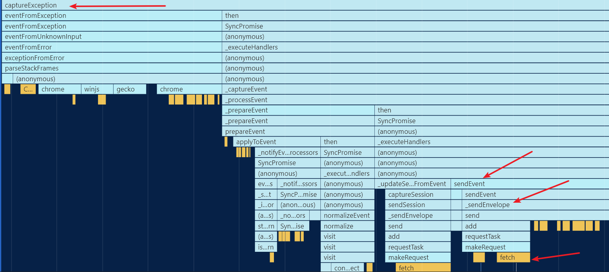
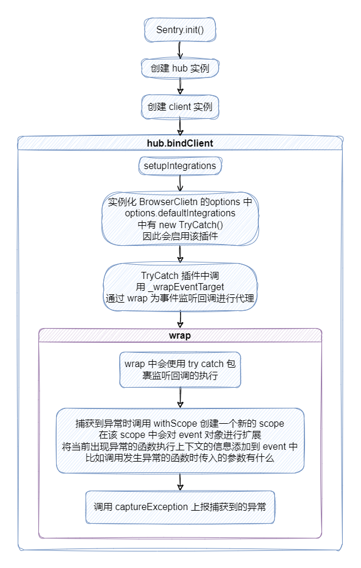

# Sentry SDK 异常监控流程分析

## 前言

对应用中错误监控的流程主要包括：

- JavaScript 代码运行错误
- 资源加载错误

对于如何捕获这两种异常，在 [异常捕获原理](/fe-monitor-system/theoretical-chapter/sentry-sdk-architecture/error-monitor/) 中已经提到过，就不再赘述了

这里主要是解释下 Sentry 中对 JS 异常的捕获思路，一般我们捕获异常是通过添加全局的 `error` 和 `unhandledrejection`，而在 Sentry 中，为了更精确地捕获到用户行为，还会为 `setInterval`, `setTimeout`, `requestAnimationFrame` 中的回调以及事件处理函数的事件对象进行监听，使得 `Breadcrumb` 能够更加精确地记录用户行为

本篇文章会讲解和异常监控有关的三个 integrations:

- `GlobalHandlers` 以全局监听 error 和 unhandledrejection 的方式去实现常见的异常监听
- `TryCatch` 监听上述的几种特殊场景下的 js 运行时代码以更精确地记录用户行为
- `HttpContext` 记录网络请求时的信息，用于在 Breadcrumb 中记录用户发起的网络请求

## GlobalHandlers

这个 integration 的作用是在全局监听 `error` 和 `unhandledrejection` 事件，对应的监听函数如下

```ts
function _installGlobalOnErrorHandler(): void {
  addInstrumentationHandler(
    'error',
    // eslint-disable-next-line @typescript-eslint/no-explicit-any
    (data: { msg: any; url: any; line: any; column: any; error: any }) => {
      const [hub, stackParser, attachStacktrace] = getHubAndOptions()
      if (!hub.getIntegration(GlobalHandlers)) {
        return
      }
      const { msg, url, line, column, error } = data
      if (shouldIgnoreOnError() || (error && error.__sentry_own_request__)) {
        return
      }

      const event =
        error === undefined && isString(msg)
          ? _eventFromIncompleteOnError(msg, url, line, column)
          : _enhanceEventWithInitialFrame(
              eventFromUnknownInput(stackParser, error || msg, undefined, attachStacktrace, false),
              url,
              line,
              column,
            )

      event.level = 'error'

      addMechanismAndCapture(hub, error, event, 'onerror')
    },
  )
}
```

:::tip instrumentation 的意思

addInstrumentationHandler 中的 instrumentation 是什么意思呢？常规意思是乐器，器械，但这里显然不是这个意思

从其动词的角度去查这个单词的意思，其动词不太常见，这里我到 [merriam webster](https://www.merriam-webster.com/dictionary/instrument) 词典中对 `instrument` 这个单词的动词解释：

> to equip with instruments especially for measuring and recording data

也就是说 addInstrumentationHandler 主要就是添加一个异常监听器函数的

:::

通过 `addInstrumentationHandler` 去添加一个异常监听器函数，至于最后的 `addMechanismAndCapture`，其涉及到 `mechanism` 这个概念，可以到理论篇的源码分析 -- [Mechanism](/fe-monitor-system/theoretical-chapter/sentry-sdk-source/mechanism/) 中了解

### addInstrumentationHandler

其源码如下：

```ts
/**
 * Add handler that will be called when given type of instrumentation triggers.
 * Use at your own risk, this might break without changelog notice, only used internally.
 * @hidden
 */
export function addInstrumentationHandler(type: InstrumentHandlerType, callback: InstrumentHandlerCallback): void {
  handlers[type] = handlers[type] || []
  ;(handlers[type] as InstrumentHandlerCallback[]).push(callback)
  instrument(type)
}
```

这里主要关注 `instrument` 函数，它用来监听各种原生 API：

```ts
/**
 * Instrument native APIs to call handlers that can be used to create breadcrumbs, APM spans etc.
 *  - Console API
 *  - Fetch API
 *  - XHR API
 *  - History API
 *  - DOM API (click/typing)
 *  - Error API
 *  - UnhandledRejection API
 */

const handlers: { [key in InstrumentHandlerType]?: InstrumentHandlerCallback[] } = {}
const instrumented: { [key in InstrumentHandlerType]?: boolean } = {}

/** Instruments given API */
function instrument(type: InstrumentHandlerType): void {
  if (instrumented[type]) {
    return
  }

  instrumented[type] = true

  switch (type) {
    case 'console':
      instrumentConsole()
      break
    case 'dom':
      instrumentDOM()
      break
    case 'xhr':
      instrumentXHR()
      break
    case 'fetch':
      instrumentFetch()
      break
    case 'history':
      instrumentHistory()
      break
    case 'error':
      instrumentError()
      break
    case 'unhandledrejection':
      instrumentUnhandledRejection()
      break
    default:
      __DEBUG_BUILD__ && logger.warn('unknown instrumentation type:', type)
      return
  }
}
```

可以看到它支持监听多种场景，这里我们主要关注 `error` 和 `unhandledrejection` 对应的监听函数 `instrumentError` 和 `instrumentUnhandledRejection`

#### instrumentError

```ts
let _oldOnErrorHandler: OnErrorEventHandler = null
/** JSDoc */
function instrumentError(): void {
  _oldOnErrorHandler = WINDOW.onerror

  WINDOW.onerror = function (msg: any, url: any, line: any, column: any, error: any): boolean {
    triggerHandlers('error', {
      column,
      error,
      line,
      msg,
      url,
    })

    if (_oldOnErrorHandler) {
      // eslint-disable-next-line prefer-rest-params
      return _oldOnErrorHandler.apply(this, arguments)
    }

    return false
  }
}
```

最终还是通过 `onerror` 完成对异常的监听

#### instrumentUnhandledRejection

```ts
let _oldOnUnhandledRejectionHandler: ((e: any) => void) | null = null
/** JSDoc */
function instrumentUnhandledRejection(): void {
  _oldOnUnhandledRejectionHandler = WINDOW.onunhandledrejection

  WINDOW.onunhandledrejection = function (e: any): boolean {
    triggerHandlers('unhandledrejection', e)

    if (_oldOnUnhandledRejectionHandler) {
      // eslint-disable-next-line prefer-rest-params
      return _oldOnUnhandledRejectionHandler.apply(this, arguments)
    }

    return true
  }
}
```

和 error 的监听类似，通过 `onunhandledrejection` 进行 Promise 异常的监听

---

addInstrumentationHandler 可以为 error 和 unhandledrejection 添加多个处理函数，类似于 DOM 中添加多个 event listener 一样

## TryCatch

首先源码中对 TryCatch 的注释是这样写的：

> Wrap timer functions and event targets to catch errors and provide better meta data

也就是说它的作用主要是提供额外的元数据信息

以对 `setTimeout` 的回调函数捕获为例，TryCatch 中的额外处理如下：

```ts
function _wrapTimeFunction(original: () => void): () => number {
  // eslint-disable-next-line @typescript-eslint/no-explicit-any
  return function (this: any, ...args: any[]): number {
    const originalCallback = args[0]
    args[0] = wrap(originalCallback, {
      mechanism: {
        data: { function: getFunctionName(original) },
        handled: true,
        type: 'instrument',
      },
    })
    return original.apply(this, args)
  }
}
```

核心在于这里的 `wrap` 函数做了什么，这就是我们接下来要分析的目标

### 环境准备

接下来我们编写一段简单的触发错误的代码，看看 TryCatch 的流程是怎样的，由于 TryCatch 作用于 `setTimeout` 等 timer function 以及事件处理函数对象上，这里以 `setTimeout` 为例：

```TypeScript
export const emitJSError = () => {
  markFuncStack()

  setTimeout(async () => {
    // @ts-ignore
    undefinedFn()
  }, 300)
}

export function markFuncStack() {
  console.log('markFuncStack')
}
```

:::tip
这里的 `markFuncStack` 是为了方便在 performance 面板中快速定位函数调用站
:::

`setTimeout` 的回调中进行了一次网络请求，为了能够记录这个用户行为，

### 分析函数调用栈

开启 Performance 工具进行记录，并触发 error，得到的结果如下图所示：




:::tip Performance 报告
你可以下载对应的 Performance 报告加载到你的 chrome dev tools 中对照着查看

[触发 js error 的 Performance 报告](https://raw.githubusercontent.com/Plasticine-Yang/Plasticine-Yang.github.io/main/docs/fe-monitor-system/theoretical-chapter/sentry-sdk-architecture/error-capture/files/sentry_tirgger_js_error_performance_log.json)
:::

从第二张图中的左上方依次到右下方的箭头是整个异常捕获并上报数据的核心流程：

1. 首先通过 `captureException` 捕获异常

   1.1. `eventFromException` 为异常生成 Event 对象

2. 在微任务中通过 `_prepareEvent` 预处理生成的 Event 对象

3. Event 对象预处理完毕后调用 `sendEvent` 将数据发送到服务端

   3.1. 底层调用了 `_sendEnvelope`，上面也提到了，Sentry 底层发送数据都是以 envelope 作为发送单位

   3.2. 由于当前 chrome 环境支持 fetch，因此通过 fetch 将请求发送出去，这是在 `init` 中初始化 transport 对象的时候就决定好的

接下来我们对照着源码探究一下这个流程

### wrap 源码分析 - 代理函数的运行流程

首先我们从函数调用栈的最开始 - `sentryWrapped` 开始看，在 [sentry-javascript](https://github.com/getsentry/sentry-javascript) 仓库中搜索这个函数，在 `packages/browser/helpers.ts` 中有一个 `wrap` 函数

其作用是将我们的业务函数使用 `try catch` 包裹起来，当业务函数发生异常时，被 catch 捕获到，并创建一个新的 scope 记录当前业务函数被调用时传入的参数有什么，然后再上报到服务端，可以理解为是对业务函数进行了代理

上述的是大概流程，具体流程如下：

```TypeScript
/**
 * Instruments the given function and sends an event to Sentry every time the
 * function throws an exception.
 *
 * @param fn A function to wrap. It is generally safe to pass an unbound function, because the returned wrapper always
 * has a correct `this` context.
 * @returns The wrapped function.
 * @hidden
 */
export function wrap(
  fn: WrappedFunction,
  options: {
    mechanism?: Mechanism
  } = {},
  before?: WrappedFunction,
  // eslint-disable-next-line @typescript-eslint/no-explicit-any
): any {
  // 1. 官方源码中的注释说的很清楚，会为业务函数 fn 包裹，也可以理解为为其进行代理，并且为了避免重复 wrap 代理，会通过
  // 在原始函数 fn 上添加 non-enumerable 的 `__sentry_wrapped__` 属性指向已代理的函数，对原始函数进行缓存
  // 并且也会为代理过的函数添加一个 non-enumberable 的 `__sentry_original__` 属性指向原始函数，方便从代理函数中获取到原始函数

  // for future readers what this does is wrap a function and then create
  // a bi-directional wrapping between them.
  //
  // example: wrapped = wrap(original);
  //  original.__sentry_wrapped__ -> wrapped
  //  wrapped.__sentry_original__ -> original

  // 2.1. base case 1 - 确保 fn 是函数
  if (typeof fn !== 'function') {
    return fn
  }

  // 2.2. base case 2 - 避免重复 wrap
  try {
    // if we're dealing with a function that was previously wrapped, return
    // the original wrapper.
    const wrapper = fn.__sentry_wrapped__
    if (wrapper) {
      return wrapper
    }

    // We don't wanna wrap it twice
    if (getOriginalFunction(fn)) {
      return fn
    }
  } catch (e) {
    // Just accessing custom props in some Selenium environments
    // can cause a "Permission denied" exception (see raven-js#495).
    // Bail on wrapping and return the function as-is (defers to window.onerror).
    return fn
  }

  /* eslint-disable prefer-rest-params */
  // It is important that `sentryWrapped` is not an arrow function to preserve the context of `this`
  // 3. 为原始函数进行代理
  const sentryWrapped: WrappedFunction = function (this: unknown): void {
    const args = Array.prototype.slice.call(arguments)

    try {
      if (before && typeof before === 'function') {
        before.apply(this, arguments)
      }

      // eslint-disable-next-line @typescript-eslint/no-explicit-any, @typescript-eslint/no-unsafe-member-access
      // 3.1. 递归地将参数中的函数也进行代理，确保所有函数的执行都在 sentry 的监控中
      const wrappedArguments = args.map((arg: any) => wrap(arg, options))

      // Attempt to invoke user-land function
      // 3.2. 执行被 wrap 的函数，发生异常时会被 catch 捕获并上报数据
      // NOTE: If you are a Sentry user, and you are seeing this stack frame, it
      //       means the sentry.javascript SDK caught an error invoking your application code. This
      //       is expected behavior and NOT indicative of a bug with sentry.javascript.
      return fn.apply(this, wrappedArguments)
    } catch (ex) {
      ignoreNextOnError()

      // 3.3. 创建一个新的 scope，在该 scope 的 event 队列被消费时能够获取到当前函数执行上下文的参数
      withScope((scope: Scope) => {
        scope.addEventProcessor((event: SentryEvent) => {
          if (options.mechanism) {
            // 给异常 event 添加 type 和 value，这里 type 和 value 都传入 undefined 会为初始化 type 为 'Error'
            addExceptionTypeValue(event, undefined, undefined)

            // mechanism 是已捕获的异常的元数据，用于记录错误类型、是否处理过等信息
            addExceptionMechanism(event, options.mechanism)
          }

          event.extra = {
            ...event.extra,

            // 记录发生异常时，为原始函数传入的参数有哪些
            arguments: args,
          }

          return event
        })

        // 3.4. 捕获并上报 exception event
        captureException(ex)
      })

      throw ex
    }
  }
  /* eslint-enable prefer-rest-params */

  // Accessing some objects may throw
  // ref: https://github.com/getsentry/sentry-javascript/issues/1168
  // 4. 由于最终执行的是 sentryWrapped，因此要尽量使其和 fn 保持一致，所以需要将 fn 函数对象上的属性也拷贝到 sentryWrapped 中
  try {
    for (const property in fn) {
      if (Object.prototype.hasOwnProperty.call(fn, property)) {
        sentryWrapped[property] = fn[property]
      }
    }
  } catch (_oO) {} // eslint-disable-line no-empty

  // Signal that this function has been wrapped/filled already
  // for both debugging and to prevent it to being wrapped/filled twice
  // 5. 给 sentryWrapped 标记上 `__sentry_original__` 指向原始 fn
  markFunctionWrapped(sentryWrapped, fn)

  // 6. 给原始 fn 标记上 `__sentry_wrapped__` 指向 sentryWrapped，起到一个缓存作用，防止重复对原始函数进行代理
  addNonEnumerableProperty(fn, '__sentry_wrapped__', sentryWrapped)

  // Restore original function name (not all browsers allow that)
  // 7. 让代理函数尽量和原始 fn 保持一致 - 将原始函数名通过 `Object.defineProperty` 设置到代理函数名上 - 存在兼容性问题
  try {
    const descriptor = Object.getOwnPropertyDescriptor(sentryWrapped, 'name') as PropertyDescriptor
    if (descriptor.configurable) {
      Object.defineProperty(sentryWrapped, 'name', {
        get(): string {
          return fn.name
        },
      })
    }
    // eslint-disable-next-line no-empty
  } catch (_oO) {}

  return sentryWrapped
}
```

我们现在只是搞懂了 `sentryWrapped` 代理函数内部的运行流程，但是还是不清楚它到底是怎么被调用的，为什么 Demo 中执行的 `markFuncStack` 和 `undefinedFn` 能够被 `sentryWrapped` 代理？因此我们要找到 `wrap` 函数的调用时机

### wrap 函数的调用时机

首先查找一下源码中哪里调用了 `packages/browser/helper.ts` 中的 `wrap` 函数，能够发现，在 `packages/browser/integrations/trycatch.ts` 中使用了该函数

也就是说 Sentry 中是以插件的方式将这部分逻辑集成进来的，这个插件名为 `TryCatch` 其内部通过 `_wrapEventTarget` 函数对 `addEventListener` 进行了修改，会将我们绑定到 DOM 元素的事件监听器回调进行 wrap 处理，从而能够实现代理我们的函数，捕获异常并进行数据上报，其核心代码如下：

```TypeScript
// target 是 window 下的待处理对象，比如 window.EventTarget，这里就以 EventTarget 为例进行说明
function _wrapEventTarget(target: string): void {
  const globalObject = WINDOW as { [key: string]: any }

  // 操作的是 window.EventTarget 的原型，原型上含有 `addEventListener`, `dispatchEvent` 和 `removeEventListener`
  const proto = globalObject[target] && globalObject[target].prototype

  if (!proto || !proto.hasOwnProperty || !proto.hasOwnProperty('addEventListener')) {
    return
  }

  // fill 会为 EventTarget 的 addEventListener 进行代理，代理函数为这里传入的第三个函数参数
  fill(proto, 'addEventListener', function (original: () => void): (
    eventName: string,
    fn: EventListenerObject,
    options?: boolean | AddEventListenerOptions,
  ) => void {
    return function (
      this: any,
      eventName: string,
      fn: EventListenerObject,
      options?: boolean | AddEventListenerOptions,
    ): (eventName: string, fn: EventListenerObject, capture?: boolean, secure?: boolean) => void {
      // 调用原始的 addEventListener
      return original.apply(this, [
        eventName,
        // 对我们给 DOM 绑定的事件监听器进行代理
        wrap(fn as any as WrappedFunction, {
          mechanism: {
            data: {
              function: 'addEventListener',
              handler: getFunctionName(fn),
              target,
            },
            handled: true,
            type: 'instrument',
          },
        }),
        options,
      ])
    }
  })
}
```

这样一来就不难理解为什么我们绑定的事件监听器回调会被 Sentry 捕获到了，我们再通过画图的方式来梳理一下整个错误监控流程

### 流程图总结



相信通过这幅图，你能够大致理解 TryCatch 这个 integration 的错误捕获流程了

## HttpContext

该 integration 会注册一个全局的 Sentry 事件处理器，在里面对请求信息进行记录，可以在 Breadcrumb 中看到这些信息

```TypeScript
/** HttpContext integration collects information about HTTP request headers */
export class HttpContext implements Integration {
  /**
   * @inheritDoc
   */
  public static id: string = 'HttpContext'

  /**
   * @inheritDoc
   */
  public name: string = HttpContext.id

  /**
   * @inheritDoc
   */
  public setupOnce(): void {
    addGlobalEventProcessor((event: Event) => {
      if (getCurrentHub().getIntegration(HttpContext)) {
        // if none of the information we want exists, don't bother
        if (!WINDOW.navigator && !WINDOW.location && !WINDOW.document) {
          return event
        }

        // grab as much info as exists and add it to the event
        const url = (event.request && event.request.url) || (WINDOW.location && WINDOW.location.href)
        const { referrer } = WINDOW.document || {}
        const { userAgent } = WINDOW.navigator || {}

        const headers = {
          ...(event.request && event.request.headers),
          ...(referrer && { Referer: referrer }),
          ...(userAgent && { 'User-Agent': userAgent }),
        }
        const request = { ...event.request, ...(url && { url }), headers }

        return { ...event, request }
      }
      return event
    })
  }
}
```
