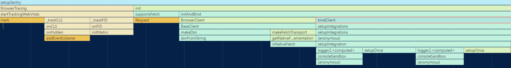
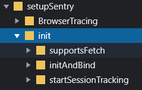
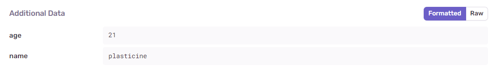
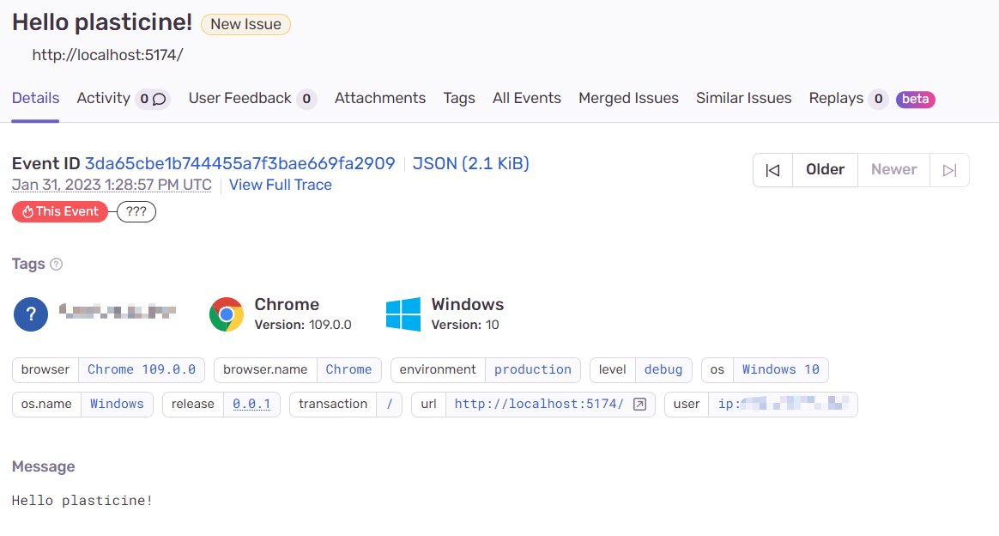
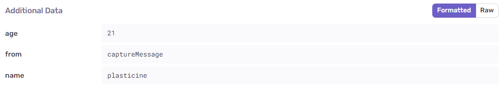
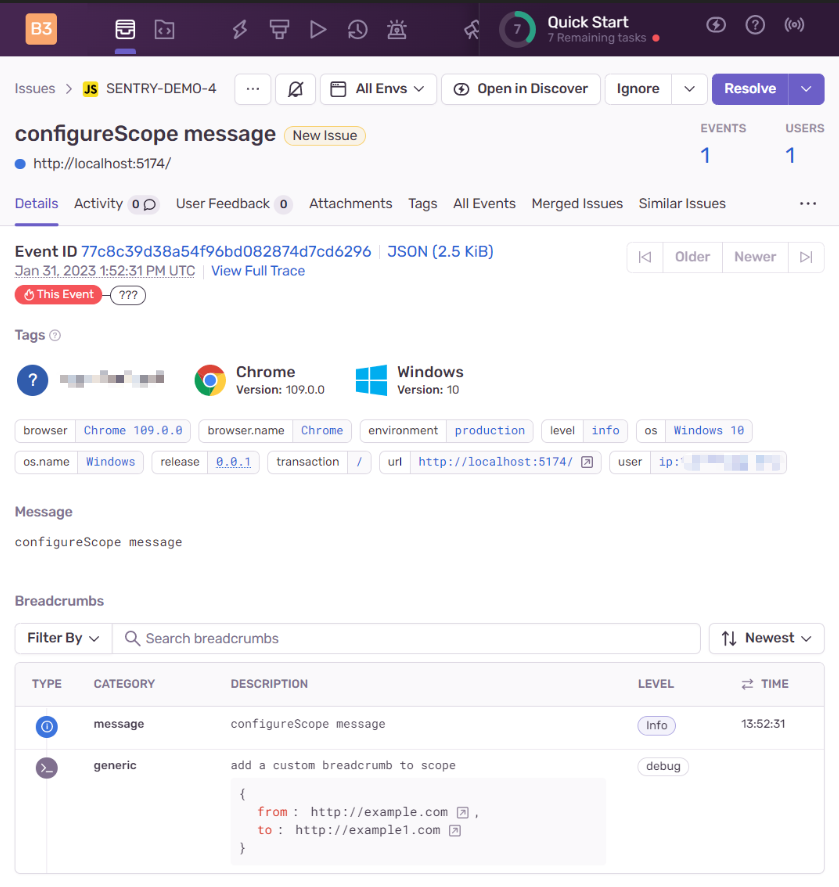
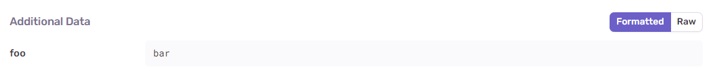
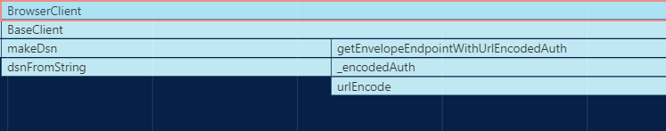

# Sentry SDK 初始化流程分析

:::tip 对应的实战篇传送门
[传送门](../../../coding-chapter/sdk/init/)
:::

## 环境准备

首先通过 vite 创建一个 `Vanilla JS` 项目用于观察 sentry 的初始化流程，主要是通过 chrome 开发者工具的 `Performance` 分析工具完成

测试的代码如下：

```TypeScript
import * as Sentry from '@sentry/browser'
import { BrowserTracing } from '@sentry/tracing'

export const setupSentry = () => {
  Sentry.init({
    dsn: 'your sentry project dsn',
    integrations: [new BrowserTracing()],
    tracesSampleRate: 1.0,
    debug: true,
    release: '0.0.1',
  })
}
```

## 整体函数调用栈

Performance 分析完毕后，直接 `Ctrl + F` 搜索 `setupSentry` 函数调用即可快速定位对应函数调用栈，如下图所示：



:::tip Performance 报告
你可以下载对应的 Performance 报告加载到你的 chrome dev tools 中对照着查看

[Sentry 初始化流程的 Performance 报告](https://raw.githubusercontent.com/Plasticine-Yang/Plasticine-Yang.github.io/main/docs/fe-monitor-system/theoretical-chapter/sentry-sdk-architecture/init/files/sentry_init_performance_log.json)
:::

可以看到，首先会先后执行来自 `@sentry/tracing` 包中的 `BrowserTracing` 构造函数，然后再执行 `@sentry/browser` 包中的 init 函数开始初始化流程

## init 调用栈

从 `BrowserTracing` 的调用栈中不难发现它用于追踪 `WebVitals`，也就是页面的性能指标，我们主要关注 `init` 调用栈来分析一下初始化流程，其调用栈如下：



这里我们只关注前两个函数即可，从名字上很容易理解它们的作用

---

### supportsFetch

用于检测当前 Javascript runtime 是否支持 `Fetch API`

sentry 提供了 sourcemap，因此我们可以很方便地查看到其源码：

```ts
/**
 * Tells whether current environment supports Fetch API
 * {@link supportsFetch}.
 *
 * @returns Answer to the given question.
 */
export function supportsFetch(): boolean {
  if (!('fetch' in WINDOW)) {
    return false
  }

  try {
    new Headers()
    new Request('http://www.example.com')
    new Response()
    return true
  } catch (e) {
    return false
  }
}
```

---

### initAndBind

这是来自 `@sentry/core` 的函数，其调用栈如下：


对应代码如下（只放核心部分）：

```TypeScript
/**
 * Internal function to create a new SDK client instance. The client is
 * installed and then bound to the current scope.
 *
 * @param clientClass The client class to instantiate.
 * @param options Options to pass to the client.
 */
export function initAndBind<F extends Client, O extends ClientOptions>(
  clientClass: ClientClass<F, O>,
  options: O,
): void {
  const hub = getCurrentHub()
  const scope = hub.getScope()
  if (scope) {
    scope.update(options.initialScope)
  }

  const client = new clientClass(options)
  hub.bindClient(client)
}
```

这里涉及到两个 Sentry 的重要概念 - `Scope` 和 `Hub`，这里我会简单介绍一下这两个概念，但还是建议阅读一下 Sentry 官网中关于这两个概念的介绍 - [Scopes and Hubs](https://docs.sentry.io/platforms/javascript/enriching-events/scopes/)

---

#### Scope 是什么？

Sentry 中上报的数据类型有多种，其中一种是 `event`，比如我们业务代码中遇到的 Javascript runtime error，Promise error 等都会被包装成 event 上报到 Sentry 服务端

而 Scope 则会在发送 event 之前，将当前函数执行上下文的一些信息整合到 event 中，以便于让我们更快地发现和定位问题，这里的函数执行上下文在 Sentry 中被抽象成了 Scope

这意味着在 Scope 中能够对代码运行过程进行追踪，从而可以实现用于追踪用户行为的 [Breadcrumbs](https://docs.sentry.io/platforms/javascript/enriching-events/breadcrumbs/) 以及 [在当前 Scope 中加入自定义上下文](https://docs.sentry.io/platforms/javascript/enriching-events/context/) 的功能

:::tip Scope 源码解析
关于 Scope 的源码解析可以在 [Sentry SDK 源码分析 - Scope](../../sentry-sdk-source/scope/) 中查看
:::

---

#### Hub 是什么？

Hub 译为 “枢纽”，可见其地位有多么重要，SDK 的核心功能就是数据上报，而 Hub 则是负责调控这一流程的

比如现在如果我想在业务代码中在特定业务逻辑中上报一些自定义的数据，那么可以调用 Sentry 提供的 `captureEvent`，就像下面这样：

```TypeScript
Sentry.captureEvent({
  level: 'debug',
  extra: {
    name: 'plasticine',
    age: 21,
  },
})
```

然后就能在 Sentry 的管理端查看到捕获的事件的自定义数据：



又比如调用 `captureMessage` 发送自定义数据：

```TypeScript
Sentry.captureMessage('Hello plasticine!', {
  level: 'debug',
  extra: {
    name: 'plasticine',
    age: 21,
    from: 'captureMessage'
  },
})
```





这些都是依靠 Hub 去管理的，当我们调用 `captureEvent` 或 `captureMessage` 时，会获取到当前的 hub 并让其捕获我们抛出的 event 或 message

总之，目前只要理解 Hub 作为一个中部枢纽的角色，负责调控 SDK 运行过程中要发送到服务端的数据就行

:::tip Hub 源码解析
关于 Hub 的源码解析可以在 [Sentry SDK 源码分析 - Hub](../../sentry-sdk-source/hub/) 中查看
:::

---

综上所述，Scope 负责记录执行环境的信息，而 Hub 则负责调控整合数据到最终要发送到服务端的数据中，明白这一点就够了

最后再看一个自定义 Scope 的例子加深对 Hub 和 Scope 作用的理解

```TypeScript
// 往 scope 中添加信息记录当前执行环境
Sentry.configureScope((scope) => {
  // 添加自定义数据到当前 Scope 中
  scope.setExtra('foo', 'bar')

  // 添加 breadcrumb 自定义记录用户行为
  scope.addBreadcrumb({
    type: 'custom-breadcrumb',
    data: {
      from: 'http://example.com',
      to: 'http://example1.com',
    },
    level: 'debug',
    message: 'add a custom breadcrumb to scope',
    timestamp: Date.now(),
  })
})

// 发送一个消息查看往 scope 中自定义的配置是否生效
Sentry.captureMessage('configureScope message')
```





现在再回过头看 `initAndBind` 的流程，首先会获取到 hub 实例，然后会创建一个 scope 对象，如果 options 中有传入 `initialScope` 的话则会以它作为初始 scope，否则就只是一个空 scope

然后会创建一个 `BrowserClient` 实例，并将其绑定到 hub 对象上，这样无论在哪里我们都可以通过调用 `Sentry.getCurrent().getClient()` 获取到 SDK 客户端实例

---

### bindClient

在 bindClient 中会调用 `setupIntegrations` 函数去注册所有 integrations，integrations 可以理解为是插件，Sentry 中各种监控功能是通过插件，也就是 integration 的方式集成到 BrowserClient 中的，在没有配置的情况下，默认会启用的 integrations 有以下这些：

```TypeScript
export const defaultIntegrations = [
  new CoreIntegrations.InboundFilters(),
  new CoreIntegrations.FunctionToString(),
  new TryCatch(),

  // 记录用户行为
  new Breadcrumbs(),

  // 捕获 Javascript runtime error
  new GlobalHandlers(),
  new LinkedErrors(),
  new Dedupe(),
  new HttpContext(),
]
```

接下来我们再去看看 BrowserClient 的实例化流程

## BrowserClient

先来看看 `BrowserClient` 的调用栈



整个 SDK 的主要功能是由 `BaseClient` 实现的，提供了一些抽象方法交给平台特定的子类去实现，而 BrowserClient 则是浏览器端的 SDK 实现

BaseClient 提供的抽象方法有两个：

- eventFromException: 根据传入的 exception 生成一个 `Event` 对象
- eventFromMessage: 根据传入的 string message 生成一个 `Event` 对象

在捕获到 exception 和 message 时如何生成 event，这个逻辑是取决于具体平台的，目前我们不需要关心这个，因此我们将目光转移到 `BaseClient` 中

## BaseClient

---

### 构造函数流程

首先从其构造函数看起

```TypeScript
/**
 * Initializes this client instance.
 *
 * @param options Options for the client.
 */
protected constructor(options: O) {
  this._options = options;
  if (options.dsn) {
    this._dsn = makeDsn(options.dsn);
    const url = getEnvelopeEndpointWithUrlEncodedAuth(this._dsn, options);
    this._transport = options.transport({
      recordDroppedEvent: this.recordDroppedEvent.bind(this),
      ...options.transportOptions,
      url,
    });
  } else {
    __DEBUG_BUILD__ && logger.warn('No DSN provided, client will not do anything.');
  }
}
```

---

#### DSN 转换成实际上报 url

首先会将传入的 dsn 字符串通过 `makeDsn` 生成一个 `DsnComponents` 对象，其 interface 长这样子：

```TypeScript
/** Primitive components of a Dsn. */
export interface DsnComponents {
  /** Protocol used to connect to Sentry. */
  protocol: DsnProtocol
  /** Public authorization key. */
  publicKey?: string
  /** Private authorization key (deprecated, optional). */
  pass?: string
  /** Hostname of the Sentry instance. */
  host: string
  /** Port of the Sentry instance. */
  port?: string
  /** Sub path/ */
  path?: string
  /** Project ID */
  projectId: string
}
```

从这个 interface 中我们就能猜出来，Sentry 希望以一种结构化的方式管理 dsn，将字符串中的关键信息全都保存到对象的指定字段上，方便管理

将 DsnComponents 对象传给 `getEnvelopeEndpointWithUrlEncodedAuth` 函数后就能得到带有认证信息的实际上报 url

比如这里我们传给 Sentry 的 dsn 配置项为

```text
https://7739b75518814822b9ca01f681a63d9c@o4504406454829056.ingest.sentry.io/4504597574123520
```

然后经 `getEnvelopeEndpointWithUrlEncodedAuth` 处理后得到的实际上报 url 为

```text
https://o4504406454829056.ingest.sentry.io/api/4504597574123520/envelope/?sentry_key=7739b75518814822b9ca01f681a63d9c&sentry_version=7&sentry_client=sentry.javascript.browser%2F7.34.0
```

可以看到，生成的 url 是一个符合 Restful 规范的 url，其操作的资源是 `envelope`，Sentry 中发送数据到服务端时都是以 `envelope` 对象发送的，这个之后再细说

至于 DSN 是啥？这里简单解释一下，它用于告诉 Sentry SDK 该往哪里上报数据，dsn 是可以公开的，按照官方文档的解释，其只允许上报数据而不允许读取任何数据，想要读取上报的数据只能通过登录到管理端进行查看

> DSNs are safe to keep public because they only allow submission of new events and related event data; they do not allow read access to any information.

关于 DSN 更具体的介绍可以自行 [阅读官方文档](https://docs.sentry.io/product/sentry-basics/dsn-explainer/)

---

#### 生成 Transport 对象

这里又涉及到一个新概念了，什么是 Transport 呢？遇到不懂的地方最好的解决办法就是看官方文档，官方文档中对于 Transport 的定义是这样的：

> Transports are used to send events to Sentry. Transports can be customized to some degree to better support highly specific deployments.

Transport 的 interface 定义如下：

```TypeScript
interface Transport {
  send(request: Envelope): PromiseLike<void | TransportMakeRequestResponse>
  flush(timeout?: number): PromiseLike<boolean>
}
```

在 event 发送到 Sentry 服务端的这个过程中抽象出一层 Transport，我们可以实现自己的 Transport 去定义发送行为，比如 Sentry 默认会使用 fetch 或者 xhr 实现一个 Transport

```TypeScript
const clientOptions: BrowserClientOptions = {
  ...options,
  stackParser: stackParserFromStackParserOptions(options.stackParser || defaultStackParser),
  integrations: getIntegrationsToSetup(options),
  transport: options.transport || (supportsFetch() ? makeFetchTransport : makeXHRTransport), // [!code focus]
}
```

如果你希望使用 axios 等网络请求库去发送请求时，就需要自行实现 Transport，大致就像下面这样：

```TypeScript
Sentry.init({
  dsn: 'https://7739b75518814822b9ca01f681a63d9c@o4504406454829056.ingest.sentry.io/4504597574123520',
  transport(transportOptions) {
    return {
      async send(request) {
        const res = await axios.post({...})
        return {
          statusCode: xxx,
          headers: {
            'x-sentry-rate-limits': 'xxx',
            'retry-after': 'xxx'
          }
        }
      },
      async flush(timeout) {
        // ...
        return true
      },
    }
  },
})
```

至此，初始化流程的分析就结束了，对实现感兴趣的可以移步到对应的实战篇 - [SDK 初始化流程实现](../../../coding-chapter/sdk/init/)

Sentry 的监控功能是通过各种 integrations 实现的，初始化的时候将这些 integrations 都注册进来了，之后等到特定事件发生时触发 integration 中的行为，完成错误监控、行为监控等功能

接下来我会以错误监控为目标去分析 Sentry 的流程和源码
