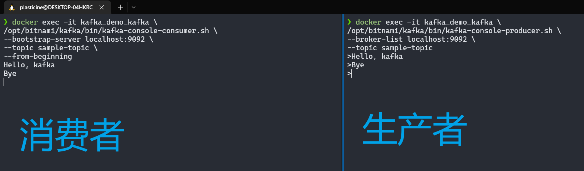
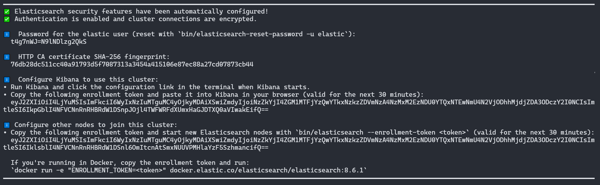
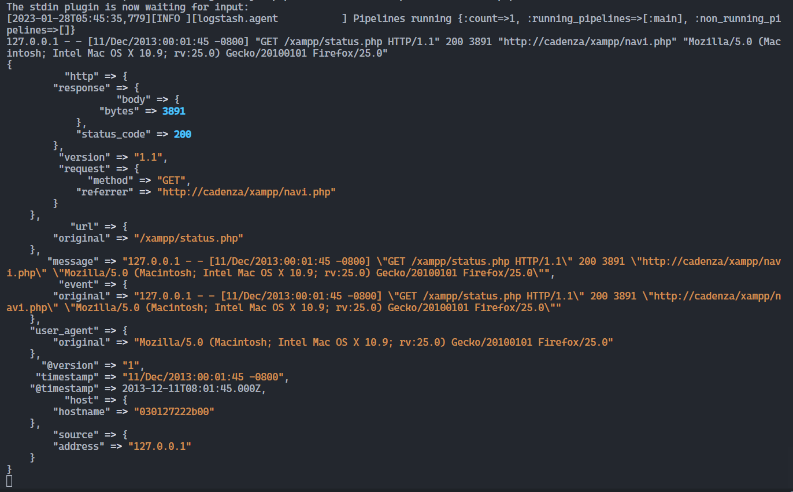
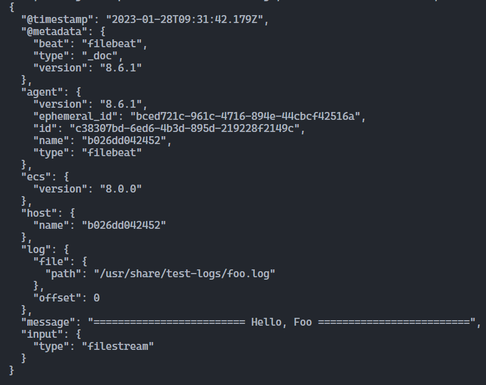

# 服务端相关技术栈学习

## 前言

后端服务用到的技术栈主要有：

- [NestJS](https://nestjs.com/)
- [Kafka](https://kafka.apache.org/)
- [Elasticsearch](https://www.elastic.co/guide/en/elasticsearch/reference/8.6/elasticsearch-intro.html)
- [Kibana](https://www.elastic.co/guide/en/kibana/8.6/introduction.html)
- [Logstash](https://www.elastic.co/guide/en/logstash/8.6/introduction.html)
- [Filebeat](https://www.elastic.co/guide/en/beats/filebeat/8.6/filebeat-installation-configuration.html)

本篇文章主要是从一个前端的角度去学习如何简单的使用这些后端技术栈，所以并不会深入讲解

## NestJS

关于 NestJS 的部分可以到本网站对应的模块阅读：[NestJS](/backend/nest/basic/)

NestJS 是一个非常棒的后端框架，个人想法是比 express, koa 等框架更加规范，通过各种装饰器严格规范 MVC 的流程，而不像 koa 等框架实际上并不存在严格的 MVC 流程，当然，可以自行实现一些结构化代码去将项目变得符合 MVC 开发规范

并没有说 express, koa 等框架不好的意思，实际上 NestJS 底层也是基于 express 进行了封装，由于使用了适配器模式，其还可以将底层框架替换为 fastify，实际上 express 等框架很优秀，在 Node.js 后端框架中存在多年，许多项目也有在使用，而 NestJS 提供的抽象能力让我们能够对很多功能开箱即用，并且有极好的 TypeScript 支持，所以我个人更倾向于使用 NestJS

**如果感兴趣深入学习 NestJS 建议直接阅读官方文档**

## Kafka

关于 Kafka 并不需要深入学习，只要会用即可，整个日志平台中 Kafka 的职责仅仅是开启一个 topic，然后启动一个消费者监听该 topic，当 Filebeat 往该 topic 中加入消息时就将其传递给 Logstash，仅此而已，没有很复杂的操作，所以我们会 Kafka 的基本操作即可

下面就简单体验一下 kafka 的使用叭~

使用 `docker-compose` 搭建一个 kafka 环境

```shell
mkdir kafka-demo && cd kafka-demo
```

创建一个 `docker-compose.yml` 文件，写入如下内容：

```yaml
version: '2'

services:
  zookeeper:
    container_name: kafka_demo_zookeeper
    image: docker.io/bitnami/zookeeper:3.8
    ports:
      - '2181:2181'
    volumes:
      - 'zookeeper_data:/bitnami'
    environment:
      - ALLOW_ANONYMOUS_LOGIN=yes

  kafka:
    container_name: kafka_demo_kafka
    image: docker.io/bitnami/kafka:3.3
    ports:
      - '9092:9092'
    volumes:
      - 'kafka_data:/bitnami'
    environment:
      - KAFKA_CFG_ZOOKEEPER_CONNECT=zookeeper:2181
      - ALLOW_PLAINTEXT_LISTENER=yes
    depends_on:
      - zookeeper

volumes:
  zookeeper_data:
    driver: local
  kafka_data:
    driver: local
```

启动 `docker-compose`

```shell
docker compose up -d
```

创建一个 topic

```shell
docker exec -it kafka_demo_kafka \
/opt/bitnami/kafka/bin/kafka-topics.sh \
--create \
--topic sample-topic \
--bootstrap-server localhost:9092
```

创建一个消费者

```shell
docker exec -it kafka_demo_kafka \
/opt/bitnami/kafka/bin/kafka-console-consumer.sh \
--bootstrap-server localhost:9092 \
--topic sample-topic \
--from-beginning
```

创建一个生产者

```shell
docker exec -it kafka_demo_kafka \
/opt/bitnami/kafka/bin/kafka-console-producer.sh \
--broker-list localhost:9092 \
--topic sample-topic
```

生产者启动后会有一个输入的命令行，输入消息后回车，消息就会被监听了对应 topic 的消费者接收到



:::tip
想学习 kafka 的话可以看看这篇文章 - [真的，Kafka 入门一篇文章就够了](https://juejin.cn/post/6844903495670169607)，也可以去看官方文档
:::

## Elasticsearch

接下来体验一下 Elasticsearch，使用 docker 启动一个单一节点的 es 服务

```shell
docker network create elastic
docker run --name es01 -e ES_JAVA_OPTS="-Xms256m -Xmx256m" --net elastic -p 9200:9200 -it docker.elastic.co/elasticsearch/elasticsearch:8.6.1
```

:::tip Java JVM 内存设置
`ES_JAVA_OPTS="-Xms256m -Xmx256m"` 这个环境变量用于控制 es 运行时的 JVM 虚拟机内存大小，如果使用默认配置太卡的话可以考虑减小为 `256m`
:::

:::tip max_map_count 太小问题
建议先将 docker 宿主机的进程最大虚拟内存容量扩大，默认是 `65530`，不足以启动 es，至少需要 `262144`

只生效一次，重启后失效：

```shell
wsl -d docker-desktop
sysctl -w vm.max_map_count=262144
```

修改配置文件，永久生效：

```shell
wsl -d docker-desktop
vi /etc/sysctl.conf
```

在末尾添加如下行：

```text
vm.max_map_count=262144
```

应用新的配置：

```shell
wsl -d docker-desktop
sysctl -p
```

:::

启动成功后会显示默认生成的密码和 `kibana enrollment token`



默认的用户名是 `elastic`，如果忘记保存生成的密码和 token 也不用担心，elasticsearch 内部提供了相关的脚本重设密码和生成新 token

重设密码

```shell
docker exec -it es01 /usr/share/elasticsearch/bin/elasticsearch-reset-password -u elastic
```

生成 `kibana enrollment token`

```shell
docker exec -it es01 /usr/share/elasticsearch/bin/elasticsearch-create-enrollment-token -s kibana
```

## Kibana

Kibana 用于对 elasticsearch 的数据进行可视化管理，先来体验下简单搭建个 kibana docker container

```shell
docker pull docker.elastic.co/kibana/kibana:8.6.1
docker run --name kib-01 --net elastic -p 5601:5601 docker.elastic.co/kibana/kibana:8.6.1
```

启动后访问 `http://localhost:5601`，然后输入上面启动 `elasticsearch` 时生成的 `kibana enrollment token`

再输入用户名 `elastic` 以及生成的密码登录即可

## Logstash

Logstash 用于消费 kafka 消息队列中的日志消息，首先我们来模拟体验一下其运行流程，同样是使用 docker 的方式创建一个 container

首先需要介绍一下 logstash 的运行流程


> The input plugins consume data from a source, the filter plugins modify the data as you specify, and the output plugins write the data to a destination.

输入输出就不用多解释了，我们可以指定 stdin, kafka 等作为输入端，指定 stdout, elasticsearch 等作为输出端，很好理解

而 filter 则是 Logstash 的关键，其用于修改数据，这意味着我们可以往 input 加载的数据中注入额外信息

接下来再说说官方的 docker 镜像会如何运作，它会先加载容器中 `/usr/share/logstash/pipeline` 目录下的 `.conf` 配置文件，这些配置文件正是用于描述 input, output 和 filter 的

所以我们需要先在宿主机创建一个 pipeline 目录用于给 Logstash 使用

`./pipeline/logstash.conf`

```text
input { stdin { } }

filter {
  grok {
    match => { "message" => "%{COMBINEDAPACHELOG}" }
  }
  date {
    match => [ "timestamp" , "dd/MMM/yyyy:HH:mm:ss Z" ]
  }
}

output {
  stdout { codec => rubydebug }
}
```

`grok`, `date` 都是 [filter plugins](https://www.elastic.co/guide/en/logstash/8.6/filter-plugins.html)，Logstash 提供了很多 plugin 用于对数据进行处理，比如 [关于 grok 这一 plugin](https://www.elastic.co/guide/en/logstash/8.6/plugins-filters-grok.html) 的描述中我们就能看到该插件的作用如下：

> Parse arbitrary text and structure it.
>
> Grok is a great way to parse unstructured log data into something structured and queryable.
>
> This tool is perfect for syslog logs, apache and other webserver logs, mysql logs, and in general, any log format that is generally written for humans and not computer consumption.

那么接下来只需要将 `./pipeline` 挂载到容器内的 `/usr/share/logstash/pipeline/` 目录下即可让 Logstash 加载我们定义的 pipeline

```shell
docker run --rm -it \
-v $(pwd)/pipeline/:/usr/share/logstash/pipeline/ \
--name logstash-demo \
docker.elastic.co/logstash/logstash:8.6.1
```

:::warning
docker volume 挂载目录时要用绝对路径，所以这里要加上 `$(pwd)` 引用当前命令在宿主机执行时的绝对路径
:::

上面我们定义的 pipeline input 为 stdin，output 为 stdout，所以运行后会出现让我们输入内容的提示，输入后就会经过 filter 处理，并将结果输出到 stdout

输入如下内容：

```text
127.0.0.1 - - [11/Dec/2013:00:01:45 -0800] "GET /xampp/status.php HTTP/1.1" 200 3891 "http://cadenza/xampp/navi.php" "Mozilla/5.0 (Macintosh; Intel Mac OS X 10.9; rv:25.0) Gecko/20100101 Firefox/25.0"
```

效果如下：



搞懂了如何使用后，我们之后实战只需要将 `Kafka` 的消息作为 input，将 elasticsearch 作为 output 即可将日志数据同步到 elasticsearch 中，并且可以通过 filter 对数据定制处理

## Filebeat

上报接口会将上报的数据写入到日志文件中，Filebeat 负责监听日志文件，当日志文件内容变化时，将数据传递给 Kafka

elastic 提供了很多种 beat，在监控系统中我们只需要用到 Filebeat 即可


现在我们以读取容器的 `/usr/share/test-logs/*` 目录中的 `.log` 文件为例，将读取的结果输出到控制台

首先在宿主机中创建一个 `logs` 目录，写入一个 `foo.log` 文件，文件内容如下：

```text
========================= Hello, Foo =========================
```

然后编写一个 filebeat 的配置文件，让其监听 `/usr/share/test-logs/` 中的日志文件，并且配置输出为控制台，在宿主机当前目录中新建一个 `filebeat.docker.yml` 文件：

```yaml
filebeat.inputs:
  - type: filestream
    paths:
      - /usr/share/test-logs/*.log
output.console:
  pretty: true
```

然后启动一个 Filebeat docker container，将配置文件和 `./logs` 目录挂载到容器的 `/usr/share/test-logs/`

```shell
docker run --rm -it \
  --volume="$(pwd)/filebeat.docker.yml:/usr/share/filebeat/filebeat.yml:ro" \
  --volume="$(pwd)/logs/:/usr/share/test-logs/" \
  docker.elastic.co/beats/filebeat:8.6.1 filebeat -e --strict.perms=false \
```

效果如下：



在项目实战中，我们只需要把输入端改成 NestJS 输出的日志文件，输出端改成 Kafka 即可
