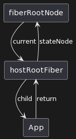
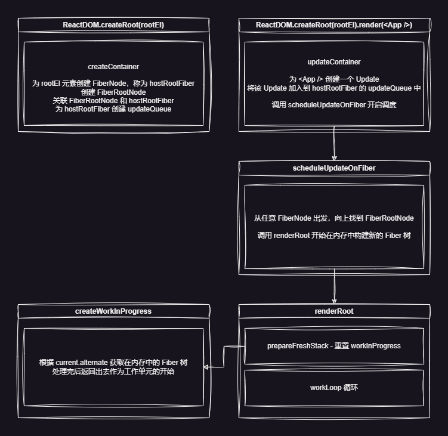

# 状态更新机制

## 抽象状态更新行为

- `Update`: 对每个更新的抽象，它有一个 `action` 属性，与 `setState({ ... })` 和 `setState((prevState) => nextState)` 对应，可以是新状态的值或一个返回新状态的回调
- `UpdateQueue`: 其 `shared.pending` 属性是一个数组，里面存放了多个 Update，通过消费这些 Update 来实现状态的更新

## 类型

### Update 相关类型

```ts
/**
 * setState(nextState)
 */
export type UpdateActionPayload<State> = State

/**
 * setState((prevState) => nextState)
 */
export type UpdateActionCallback<State> = (prevState: State) => State

/**
 * 1. setState(nextState)
 * 2. setState((prevState) => nextState)
 */
export type UpdateAction<State> = UpdateActionPayload<State> | UpdateActionCallback<State>

/** 对状态更新行为的抽象 */
export interface Update<State> {
  action: UpdateAction<State>
}
```

### UpdateQueue 相关类型

```ts
export interface UpdateQueue<State> {
  shared: {
    pending: Update<State> | null
  }
}

/** UpdateQueue 消费完后返回的结果 */
export interface ProcessedUpdateQueueResult<State> {
  memoizedState: State
}
```

## 相关的工厂函数

```ts
export function createUpdate<State>(action: UpdateAction<State>): Update<State> {
  return {
    action,
  }
}

export function createUpdateQueue<State>(): UpdateQueue<State> {
  return {
    shared: {
      pending: null,
    },
  }
}
```

## 相关操作函数

```ts
export function enqueueUpdate<State>(updateQueue: UpdateQueue<State>, update: Update<State>) {
  updateQueue.shared.pending = update
}

/** 消费 UpdateQueue */
export function processUpdateQueue<State>(
  baseState: State,
  pendingUpdate: Update<State>,
): ProcessedUpdateQueueResult<State> {
  const result: ProcessedUpdateQueueResult<State> = {
    memoizedState: baseState,
  }

  const action = pendingUpdate.action

  if (action instanceof Function) {
    result.memoizedState = action(baseState)
  } else {
    result.memoizedState = action
  }

  return result
}
```

## 接入状态更新机制

### 支持任意节点触发更新

以下三种方式都会导致任意节点触发更新：

- `ReactDOM.createRoot(rootEl).render(<App />)` - 根节点触发更新
- Class Component `this.setState()` - 任意节点触发
- Function Component `useState dispatch` - 任意节点触发

整个 workLoop 都是从根节点开始进行 DFS 的，因此更新流程也得是从根节点开始，这就需要具备当子节点中的任意一个节点触发了更新时能够找到根节点的能力

为了实现这种能力，先描述一下整个 Fiber 树的结构：



- fiberRootNode 是 `ReactDOM.createRoot()` 创建出来的，作为 Fiber 树的根节点

- hostRootFiber 是 `rootEl` 对应的 FiberNode 节点

- App 是 `<App />` 这个 ReactElement

---

### FiberRootNode

先来定义一下 FiberRootNode，其需要具备以下几个能力：

1. 获取当前渲染在视图中的 Fiber 树
2. 获取当前在内存中渲染好的下一个状态的 Fiber 树
3. 实例化时与 hostRootFiber 建立联系

```ts
/** Fiber 树的根节点 */
export class FiberRootNode {
  public container: HostContainer

  /** 指向当前在视图上的 hostRootFiber */
  public current: FiberNode

  /** 指向 render 阶段完成时的 hostRootFiber */
  public finishedWork: FiberNode | null

  constructor(container: HostContainer, hostRootFiber: FiberNode) {
    this.container = container
    this.current = hostRootFiber
    this.finishedWork = null

    hostRootFiber.stateNode = this
  }
}
```

:::tip

这里 HostContainer 是宿主环境的容器元素，考虑到多端渲染的兼容性，container 的具体类型由具体平台的渲染器实现时决定，reconciler 不关心

:::

### 让 FiberRootNode 与 Update 更新机制关联

目前我们已经有了 Update 机制，以及根据上面的图定义的 FiberRootNode，但是还没有将它们关联起来，要如何进行关联呢？

在 `ReactDOM.createRoot(rootEl).render(<App />)` 中：

- createRoot 时创建一个 FiberRootNode 和 rootEl 对应的 FiberNode，也就是 hostRootFiber，并将它们关联起来，并为 hostRootFiber 创建一个 updateQueue
- render 时会传入一个 ReactElement，为该 ReactElement 创建一个 Update，并将其与 hostRootFiber 的 updateQueue 关联起来，这样在消费 updateQueue 时就能够触发更新，将 `<App />` 渲染到 `rootEl` 中了

```ts
/** 关联 hostRootFiber 和 root & 为 hostRootFiber 创建 updateQueue */
export function createContainer(container: HostContainer) {
  const hostRootFiber = new FiberNode(WorkTagEnum.HostRoot, {}, null)
  const root = new FiberRootNode(container, hostRootFiber)

  hostRootFiber.updateQueue = createUpdateQueue()

  return root
}

/** 为 element 创建 Update，并关联到 hostRootFiber 的 updateQueue 中 */
export function updateContainer(element: ReactElement | null, root: FiberRootNode) {
  const hostRootFiber = root.current
  const updateQueue = hostRootFiber.updateQueue
  const update = createUpdate(element)

  if (updateQueue) {
    enqueueUpdate(updateQueue, update)
  }

  return element
}
```

createRoot 时会调用 createContainer，render 时会调用 updateContainer

### 让 FiberRootNode 与 workLoop 关联

回顾一下之前的 workLoop:

```ts
function renderRoot(root: FiberNode) {
  prepareFreshStack(root)

  do {
    try {
      workLoop()
      break
    } catch (error) {
      console.error('workLoop 出错', error)
      workInProgress = null
    }
    // eslint-disable-next-line no-constant-condition
  } while (true)
}
```

这里是启动 workLoop 的地方，但是目前 renderRoot 这个函数还没被调用，如果我们能将其和 FiberRootNode 关联，就可以在 workLoop 的流程中消费 updateQueue，从而触发更新了！

### 调度器中处理 renderRoot 的调用时机

关键就在于如何关联，需要清楚一点，更新机制并不仅仅对 FiberRootNode 生效，还需要对任意一个 FiberNode 生效，因此需要有一个统一的调度器来负责处理这一层逻辑

- 对于 FiberRootNode，调用 renderRoot，开启 workLoop 进行 DFS 遍历
- 对于任意的 FiberNode，需要先往上找到 FiberRootNode，再开始进行 DFS 遍历

无论是哪种情况，都需要先找到 FiberRootNode，再调用 renderRoot 开始工作

```ts
/**
 * 为 Fiber 调度更新
 *
 * 从传入的 FiberNode 出发，往上寻找到 FiberRootNode 后调用 renderRoot 开启调度
 */
function scheduleUpdateOnFiber(fiberNode: FiberNode) {
  const root = markUpdateFromFiberToRoot(fiberNode)

  if (root) {
    renderRoot(root)
  }
}
```

`markUpdateFromFiberToRoot` 就是从传入的 fiberNode 出发，往上寻找 FiberRootNode 的，其实现待会再看，先想想 `scheduleUpdateOnFiber` 何时被调用

这就是前面说的几个更新场景了，目前我们主要针对 `ReactDOM.createRoot(rootEl).render(<App />)` 这一场景，这一场景中只有 render 方法的调用会涉及到更新，因此可以在 `updateContainer` 中调用 `scheduleUpdateOnFiber`

```ts {11}
/** 为 element 创建 Update，并关联到 hostRootFiber 的 updateQueue 中 */
export function updateContainer(element: ReactElement | null, root: FiberRootNode) {
  const hostRootFiber = root.current
  const updateQueue = hostRootFiber.updateQueue
  const update = createUpdate(element)

  if (updateQueue) {
    enqueueUpdate(updateQueue, update)
  }

  scheduleUpdateOnFiber(hostRootFiber)

  return element
}
```

到这里就已经将 FiberRootNode 和 更新机制关联起来了，接下来要去实现 `markUpdateFromFiberToRoot`，保证任意 FiberNode 触发的更新都能找到 FiberRootNode

#### markUpdateFromFiberToRoot

还是看刚刚那幅图


当遍历到 hostRootFiber 时，其 return 指向 null，此时返回其 stateNode 即可

```ts
/**
 * 从 fiberNode 出发，往上寻找 FiberRootNode
 */
function markUpdateFromFiberToRoot(fiberNode: FiberNode): FiberRootNode | null {
  let node = fiberNode
  let parent = node.return

  while (parent !== null) {
    node = parent
    parent = node.return
  }

  // hostRootFiber -> 返回其 stateNode 即为 FiberRootNode
  if (node.workTag === WorkTagEnum.HostRoot) {
    return node.stateNode as FiberRootNode
  }

  return null
}
```

### renderRoot 适配 FiberRootNode

之前实现 renderRoot 的时候还没有 FiberRootNode 的概念，因此传给它的 root 参数的类型还是 FiberNode，现在需要变成 FiberRootNode

```ts
function renderRoot(root: FiberNode) { // [!code --]
function renderRoot(root: FiberRootNode) { // [!code ++]
  prepareFreshStack(root)

  do {
    try {
      workLoop()
      break
    } catch (error) {
      console.error('workLoop 出错', error)
      workInProgress = null
    }
    // eslint-disable-next-line no-constant-condition
  } while (true)
}
```

同理，这里依赖的 `prepareFreshStack` 函数也需要进行调整

```ts
function prepareFreshStack(fiberNode: FiberNode) { // [!code --]
function prepareFreshStack(root: FiberRootNode) { // [!code ++]
  workInProgress = fiberNode // [!code --]
  workInProgress = root // [!code ++]
}
```

但是 workInProgress 的类型仍然是 FiberNode，不能直接将 FiberRootNode 赋值给它，因此我们还需要一个从 root 到 workInProgress 的转换

root 的 current 是视图中已经渲染的 Fiber 树，而调用 renderRoot 是为了在内存中计算下一个状态的 Fiber 树，因此从 root 到 workInProgress 的转换需要将 root.current 传入，并返回一个 Fiber 树的根节点作为 workInProgress，这样才能保证 renderRoot 是作用在新的 Fiber 树上

这一过程封装到一个名为 `createWorkInProgress` 的函数中

```ts
/**
 * 创建待更新的工作树
 * @param current 已渲染到视图中的 Fiber 树
 * @param pendingProps 待更新的 props
 */
function createWorkInProgress(current: FiberNode, pendingProps: ReactElementProps): FiberNode {
  let wip: FiberNode | null = current.alternate

  if (wip === null) {
    // mount - 首次渲染时不存在 alternate
    wip = new FiberNode(current.workTag, pendingProps, current.key)
    wip.stateNode = current.stateNode
    wip.alternate = current
    current.alternate = wip
  } else {
    // update
    wip.pendingProps = pendingProps

    // 清除副作用
    wip.flags = FiberFlagEnum.NoFlags
  }

  wip.type = current.type
  wip.updateQueue = current.updateQueue
  wip.child = current.child
  wip.memoizedProps = current.memoizedProps
  wip.memoizedState = current.memoizedState

  return wip as FiberNode
}
```

再应用到 prepareFreshStack 中

```ts
function prepareFreshStack(root: FiberRootNode) {
  workInProgress = createWorkInProgress(root.current, {})
}
```

## 总结

到这里就将整个状态更新机制串联起来了，整个流程如下图所示：


