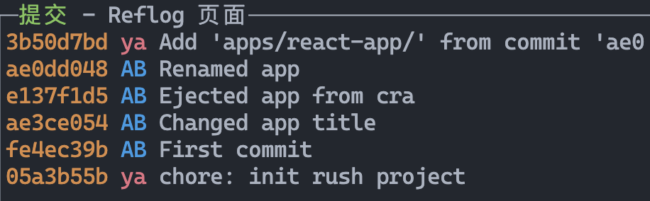

# Git

## 拷贝远端仓库的部分文件并保留 commit 记录

场景：仓库是一个 monorepo，并且想拷贝其他 monorepo 的子项目到当前仓库中，并且保留其 commit 记录

```shell
git subtree add --prefix apps/react-app \
 https://github.com/abereghici/react-app master
```


