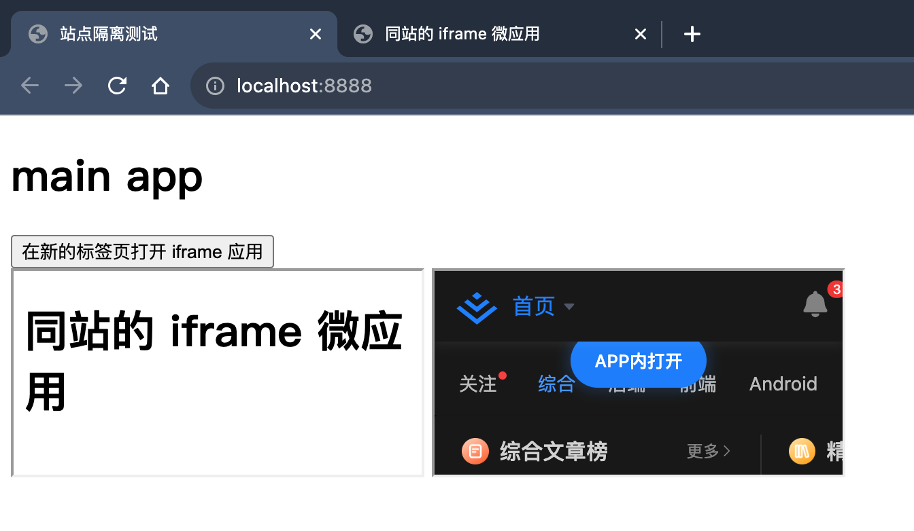
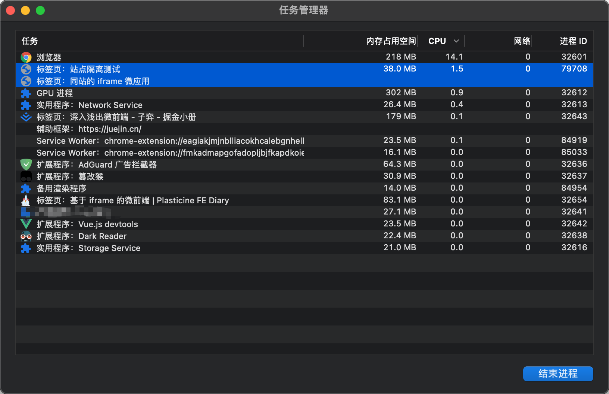

# 基于 iframe 的微前端

## 前言

浏览器的 iframe 具备天然的沙箱隔离机制，可以很轻松地实现微前端所需的能力，但这就得提出几个问题了：

- iframe 隔离的标准是什么？是不同源的站点之间进行隔离还是不同站的站点之间进行隔离？
- 同源和同站的区别是什么？
- 如果没有进行隔离又会有什么后果？

本篇文章会围绕这几个问题展开，并且最后会给出一个 demo 来体验一下 iframe 隔离的效果。

## 同源和同站的区别是什么？

看下面这幅图就懂了：


- 同源：protocol, host, port 都相同
- 同站：eTLD + 1 (有效顶级域名 + 二级域名) 相同

:::tip
eTLD (Effective Top-Level-Domain) 和顶级域名不同，比如 `github.io` 是一个有效顶级域名，而不是把 `.io` 视为有效顶级域名

有效顶级域名可到 [public_suffix_list](https://publicsuffix.org/list/public_suffix_list.dat) 查询。
:::

## iframe 隔离的标准是什么？

iframe 隔离的标准是同站的 iframe 复用同一个 Renderer 进程，不同站的 iframe 则使用不同的 Renderer 进程，从进程层面进行隔离。

Renderer 进程主要负责 UI 渲染以及 JavaScript 脚本的执行。

对于这个问题的答案下面的 Demo 中还会进行验证。

## 如果没有进行隔离会有什么后果？

如果不对 iframe 与主页面进行进程隔离的话，那么 iframe 中的站点就可以：

- 获取跨站点应用的 DOM 元素
- 获取跨站点应用的 Cookie
- 获取浏览器保存的密码
- 共享跨站点应用的授权权限，比如地理位置信息

而有了进程级别的隔离之后，iframe 中的站点无法进行上述的操作，避免对其他站点应用造成影响。

## Demo

在 Demo 中存在一个主应用和一个子应用，子应用独立部署，并通过 iframe 的方式嵌入到主应用中，代码如下：

::: code-group

```ts [main-app/index.ts]
import express from 'express'

import siteConfig from '../config'
import { useEJS } from '../shared'
import { resolve } from 'path'

const { host, port } = siteConfig.mainApp

export function bootstrapMainApp() {
  const mainApp = express()

  useEJS(mainApp, resolve(__dirname, 'views'))

  // 浏览器访问 http://${host}:${port}/ 时会渲染 views/index.html
  mainApp.get('/', function (_, res) {
    // 使用 ejs 模版引擎填充主应用 views/index.html 中的 iframeUrl 变量，并将其渲染到浏览器
    res.render('index', {
      // 填充 iframe 应用的地址，只有端口不同，iframe 应用和 main 应用跨域但是同站
      microAppUrl: `http://${host}:${siteConfig.microApp.port}`,
    })
  })

  mainApp.listen(port, host)

  console.log(`mainApp serve at http://${host}:${port}`)
}
```

```html [main-app/views/index.html]
<!DOCTYPE html>
<html lang="en">
  <head>
    <meta charset="UTF-8" />
    <meta http-equiv="X-UA-Compatible" content="IE=edge" />
    <meta name="viewport" content="width=device-width, initial-scale=1.0" />
    <title>站点隔离测试</title>
  </head>
  <body>
    <h1>main app</h1>
    <button onclick="javascript:window.open('<%= microAppUrl %>')">在新的标签页打开 iframe 应用</button>
    <br />
    <!-- 同站应用：micro-app -->
    <iframe src="<%= microAppUrl %>"></iframe>

    <!-- 跨站应用: https://juejin.cn/ -->
    <iframe src="https://juejin.cn"></iframe>
  </body>
</html>
```

```ts [micro-app/index.ts]
import express from 'express'

import siteConfig from '../config'
import { useEJS } from '../shared'
import { resolve } from 'path'

const { host, port } = siteConfig.microApp

export function bootstrapMicroApp() {
  const mainApp = express()

  useEJS(mainApp, resolve(__dirname, 'views'))

  mainApp.get('/', function (_, res) {
    res.render('index')
  })

  mainApp.listen(port, host)

  console.log(`mainApp serve at http://${host}:${port}`)
}
```

```html [micro-app/views/index.html]
<!DOCTYPE html>
<html lang="en">
  <head>
    <meta charset="UTF-8" />
    <meta http-equiv="X-UA-Compatible" content="IE=edge" />
    <meta name="viewport" content="width=device-width, initial-scale=1.0" />
    <title>同站的 iframe 微应用</title>
  </head>
  <body>
    <h1>同站的 iframe 微应用</h1>
  </body>
</html>
```

```ts [shared.ts]
import { renderFile } from 'ejs'
import { Express } from 'express'

/** 使用 ejs 作为模板引擎解析 html */
export function useEJS(app: Express, viewsPath: string) {
  // 使用 ejs 作为模板引擎解析 html
  app.engine('html', renderFile)

  // ejs 默认使用 CWD/views 里的文件作为模板，需要将其指定到应用的模板目录中
  app.set('views', viewsPath)

  // Without this you would need to
  // supply the extension to res.render()
  // ex: res.render('users.html').
  app.set('view engine', 'html')
}
```

```ts [config.ts]
const HOST = 'localhost'

const siteConfig: SiteConfig = {
  mainApp: {
    host: HOST,
    port: 8888,
  },
  microApp: {
    host: HOST,
    port: 8889,
  },
}

export default siteConfig
```

```ts [types.d.ts]
interface AppConfig {
  host: string
  port: number
}

interface SiteConfig {
  mainApp: AppConfig
  microApp: AppConfig
}
```

:::

最终效果如下：



通过点击按钮打开一个新的标签页访问微应用，再打开 Chrome 自带的任务管理器查看一下标签页对应的进程 id 是否为同一个：



可以看到，对于同站的标签页，会使用相同的 Renderer 进程去处理。

### iframe 的浏览上下文

每一个 iframe 都有自己的浏览上下文，可以简单理解为有自己的 window 全局对象，当应用 micro-app 通过 iframe 被嵌入到应用 main-app 中时，main-app 中的 window 称为顶级浏览上下文，而 micro-app 中的 window 则不是。

可以通过 `window.top` 获取当前的顶级浏览上下文，这也就意味着在 micro-app 中可以通过 `window.top === window` 来识别自己目前是否被 iframe 嵌套使用。

在本 Demo 的 micro-app 对应的模板中加入该判断并查看结果：

::: code-group

```html [micro-app/views/index.html]
<!DOCTYPE html>
<html lang="en">
  <head>
    <meta charset="UTF-8" />
    <meta http-equiv="X-UA-Compatible" content="IE=edge" />
    <meta name="viewport" content="width=device-width, initial-scale=1.0" />
    <title>同站的 iframe 微应用</title>
  </head>
  <body>
    <h1>同站的 iframe 微应用</h1>
  </body>
  <script>
    console.log(window.top === window) // false
  </script>
</html>
```

:::

## iframe 微前端方案设计

根据之前的文章提到过的微前端的特点可以知道，我们需要先有一个主应用，在主应用中维护一些菜单导航，可以使内容区切换至相应的子应用。

菜单导航既可以是通过前端路由的方式控制几个 iframe 的显隐，也可以是像该 Demo 中一样用服务端路由，切换菜单时只需要切换内容区 iframe 指向的地址即可。

## iframe 方案优缺点

优点：

- 站点隔离 & 浏览上下文隔离，使微应用之间天然隔离，无需进行额外操作，实现简单，适合在集成第三方应用时使用
- 可移植性和复用性好，只需通过原生的 iframe 就可以完成移植和复用

缺点：

- 主应用刷新时，子应用的 url 状态会丢失
- 主子应用不在同一浏览上下文时，子应用的 modal 模态框无法相对主应用居中
- 主子应用的数据持久化 & 通信问题
