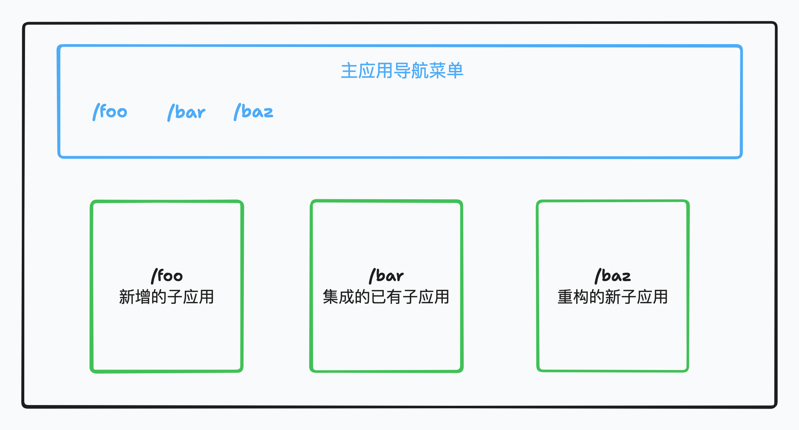

# 微前端解决了什么问题？

## 前言

虽然在公司工作一直使用的是微前端，但说实话，一直都没花时间去了解为什么要用微前端？微前端到底解决了什么业务痛点问题？借此机会好好梳理一下微前端的使用场景，本篇文章以管理后台应用举例，在不使用微前端架构下会有什么痛点问题。

## 集成已有应用困难

在管理后台应用中，往往有很多页面重复率较高，为了提高开发效率，逐渐产生了使用低代码平台进行应用搭建的场景，但这带来的问题就是很难在低代码平台中集成已有的一些管理应用，因为已有的管理应用可能并不符合低代码平台约定的规范，无法直接集成进来。

这时候要么就只能用低代码平台的能力重新实现一遍要集成的应用，要么就是推翻低代码平台，直接将现有功能重做迁移到已有应用中，无论哪种方式，它们的开发成本都是极高的。

另一种方案则是通过 iframe 的方式将部署好的管理应用集成进来，虽然能够集成，但其体验上对 UX 来说是难以接受的，存在明显的割裂感。

## 集成新应用时受到限制

假设已有的业务应用是通过低代码平台搭建的，此时如果希望集成新的应用时，考虑到业务体验的一致性，在技术选型上就被约束了只能使用低代码平台的能力。

## 遇到性能瓶颈时难以进行重构

在低代码应用发生性能瓶颈问题时，业务方可能希望渐渐去除相关的低代码页面，改成其他方式来重构，但这就和上面说的一样，使用其他方式实现的话业务体验的一致性比较差。

## 痛点问题

综上所述，我们可以总结出如下三个痛点问题：

- 新增应用在建设时需要使用和已有应用相同的技术栈保证业务体验的一致性
- 已有应用集成到现有应用时由于技术栈不同导致难以实现集成
- 遇到性能瓶颈希望使用别的技术栈重构现有应用的部分页面时困难

## 解决方案需要具备的特点

为了解决上面的痛点问题，我们需要提出一个新的解决方案，该解决方案需要具备以下特点：

- 新增应用时无需考虑已有应用的技术栈，可以随意使用其他技术栈，并且能够独立部署
- 集成已有应用时只需要做少量改动即可集成到现有应用中，无需推翻重做
- 对于存在性能问题的页面进行重构时可以使用新的技术栈来逐步重构

微前端架构就具备这些特点，在该架构下，有一个主应用来组织各个子应用，无论是新增应用、集成已有应用还是重构现有应用都需要经过主应用的管理，通过主应用的菜单导航来跳转到各个子应用。

从这些特点可以看出来：微前端可以降低大型复杂应用的开发、升级、维护以及团队协作的成本。当然，解决历史遗留的难以开发、升级和维护的大型应用，也是使用微前端的一个重要原因。

## 微前端的业务场景

微前端最常见的场景就是大型 ToB 系统，比如飞书、钉钉的各种管理系统等。

需要注意的是微前端并不是万能的，不要为了使用微前端而使用，一定是现有的技术体系无法满足开发诉求或者无法解决业务场景中的痛点时才需要考虑使用微前端。
