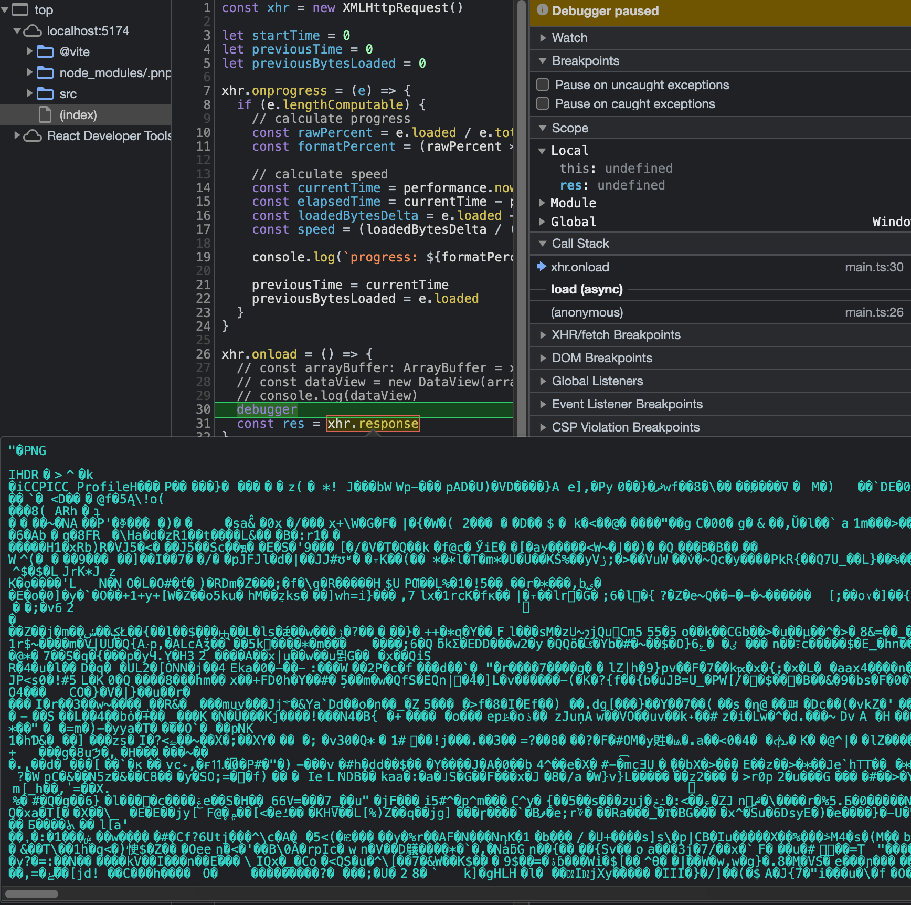
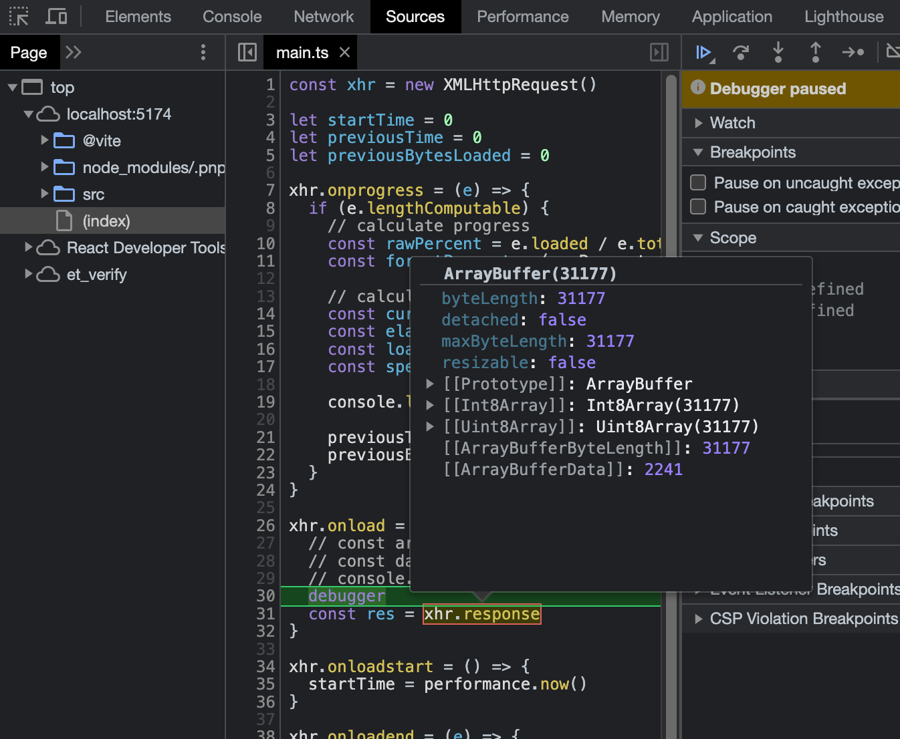

# cropperjs 源码学习

## 加载图片的细节

### xhr 请求图片想要二进制数据的话需要设置 responseType

```js
xhr.open('GET', 'http://localhost:8086/images/temp-image.png', true)
xhr.responseType = 'arraybuffer'
```

如果不设置 responseType 为 `arraybuffer` 的话即便请求的是二进制文件，得到的也只会是 string，因为 responseType 的默认值为 `text`

responseType 为 `text`:



responseType 为 `arraybuffer`:



### Data URL 中的图片 EXIF 信息

EXIF 是什么？

> EXIF（Exchangeable Image File Format）方向信息是一种用于记录数字图像中旋转和镜像变换的元数据。EXIF 是一种包含图像相关信息的标准格式，通常嵌入在数字照片中。
>
> EXIF 方向信息记录了拍摄设备的方向，并提供了指示如何正确显示图像的指示。由于某些设备在拍摄时可能会自动旋转图像，而不是根据设备的方向进行调整，因此 EXIF 方向信息非常有用。
>
> EXIF 方向信息可以通过 Orientation 标签来表示，它是一个整数值，通常存储在图像的 EXIF 元数据中。该值可以为 1 到 8 的范围，每个值都表示不同的旋转或镜像变换。
>
> 以下是常见的 EXIF 方向信息值及其含义：
>
> 1：没有旋转或镜像变换。
> 2：图像水平翻转。
> 3：顺时针旋转 180 度。
> 4：垂直翻转。
> 5：逆时针旋转 90 度，并进行水平翻转。
> 6：顺时针旋转 90 度。
> 7：逆时针旋转 90 度，并进行垂直翻转。
> 8：逆时针旋转 90 度。
> 对于包含 EXIF 方向信息的图像，应用程序或浏览器可以读取该信息，并相应地进行图像的旋转或镜像处理，以确保图像正确显示。这对于在不同设备上展示照片时非常有用，因为它可以根据设备的方向自动调整图像的显示方式，以获得正确的方向。

Data URL 场景下只有 JPEG 图片会记录 EXIF 信息

### 跨域图像请求的缓存错误问题

"crossOrigin" 属性用于在 HTML 和 JavaScript 中控制从外部来源加载图像的行为，例如当您尝试从不同域加载图像时。它允许您指定浏览器是否应该使用 CORS（跨域资源共享）请求图像。

当涉及到缓存时，"crossOrigin" 属性可以用于解决浏览器缓存错误的问题。浏览器通常会缓存加载的图像，以提高性能和减少网络请求。然而，当您在处理跨域图像时，由于安全策略的限制，浏览器可能会缓存不符合预期的结果，导致错误的图像显示。

在这种情况下，您可以使用 "crossOrigin" 属性来请求图像并避免缓存错误。通过将 "crossOrigin" 设置为 "anonymous" 或 "use-credentials"，浏览器会强制重新下载图像并避免使用缓存版本。这样可以确保您获得最新的图像，并避免由于缓存引起的错误。

请注意，为了使 "crossOrigin" 属性生效，图像的响应头中必须允许跨域访问。如果图像所在的服务器不支持 CORS，那么设置 "crossOrigin" 属性可能不起作用。

这个时候可以手动给图片 url 加上一个时间戳参数以强制不使用浏览器缓存的图片，避免发生预期之外的情况

```js
// Bust cache when there is a "crossOrigin" property to avoid browser cache error
if (options.checkCrossOrigin && isCrossOriginURL(url) && element.crossOrigin) {
  url = addTimestamp(url)
}
```

:::tip
bust: 破坏
:::

### 性能优化：加载图片过程中如果发现不是图片类型可以直接终止请求

```js
xhr.onprogress = () => {
  // Abort the request directly if it not a JPEG image for better performance
  if (xhr.getResponseHeader('content-type') !== 'image/jpeg') {
    xhr.abort()
  }
}
```

## 读取图片的细节

### 判断文件头是否为 JPEG

JPEG 的文件头为 `0xFFD8`，读取二进制文件需要将请求到的 ArrayBuffer 转成 DataView，然后通过 `getUint8` 等方法去判断文件头符合

```js
// PS: xhr.response = 'arraybuffer'
const dataView = new DataView(xhr.response)

// Only handle JPEG image (start by 0xFFD8)
if (dataView.getUint8(0) === 0xff && dataView.getUint8(1) === 0xd8) {
  // ...
}
```

也可以改成用 `getUint16`：

```js
if (dataView.getUint16(0) === 0xffd8) {
  // ...
}
```

### JPEG 0xF1 的用处

> 在 JPEG 图片的二进制数据中，0xFFE1 是一个特殊的标记，表示应用程序段（Application Segment）。JPEG 图像文件中的应用程序段通常包含与特定应用程序相关的信息。
>
> 更具体地说，0xFFE1 是 JPEG 文件中的一个标记字节，它由两个字节组成：0xFF 和 0xE1。在 JPEG 文件的二进制数据中，这个标记通常出现在图像的开始部分，紧随着 JPEG 文件的 SOI（Start of Image）标记（0xFFD8）之后。
>
> 0xFFE1 标记后面的数据段通常用于存储包含元数据、缩略图或其他应用程序特定信息的数据。这些数据段是基于应用程序定义的，不属于 JPEG 标准规范的一部分。不同的应用程序可以使用不同的应用程序段，并存储各种类型的信息。
>
> 通常情况下，0xFFE1 标记后面的数据段以长度字段开始，指示数据段的长度（包括长度字段自身）。然后是应用程序标识符字段，用于指定使用该数据段的应用程序。
>
> 值得注意的是，JPEG 图像中可能会有多个应用程序段，每个应用程序段都有其特定的用途和格式。要正确解析 JPEG 文件中的应用程序段数据，需要参考相应的应用程序文档或 JPEG 文件格式规范。
>
> 总结起来，0xFFE1 标记表示 JPEG 图片中的应用程序段，用于存储与特定应用程序相关的数据和信息。具体的数据格式和含义取决于应用程序的定义和使用。
