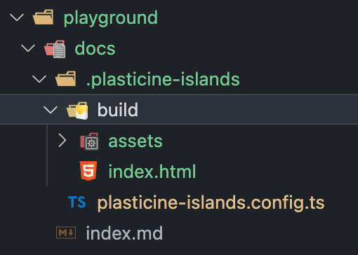

# 实现配置文件解析功能

## 前言

在使用很多库的时候，大家应该都注意到它们都支持以配置文件的方式进行自定义配置，比如 vite 支持 `vite.config.ts`，`vite.config.js` 等文件进行配置

那么你是否好奇如何实现一个配置文件解析功能呢？可以了解一下 [unconfig](https://github.com/antfu/unconfig)，它提供了通用的配置文件解析功能，能够解析常见的配置文件格式，比如 `.json`，`.js`，`.ts`，`.xxxrc`等

本篇文章我们就会用它来为项目添加配置文件解析能力

## 模拟 vitepress 的配置文件解析方式

首先思考一下配置文件解析能力应该放到哪个包中实现？

很显然，需要放到 cli 包中实现，只需将解析出的配置对象传递给其依赖的 core 包使用即可，不需要 core 包自己再去单独解析

在 vitepress 中，配置文件是放在命令执行的 root 目录下的 `.vitepress` 目录中的，事实上很多工具都会有这种以 `.` 开头的目录作为该工具的配置目录以及一些由该工具使用的文件，比如 vitepress 的 build 命令构建的产物也同样会放到 `.vitepress` 目录中

为此，我们需要先定义一个 `BASE_DIRECTORY` 常量指定一个类似 `.vitepress` 这样的目录，但是又得思考一下，这个常量放到 cli 包中定义适合吗？

之前的 mvp 版本中，core 包中的 bundle 产物是输出到 root 目录下的，现在有了 `BASE_DIRECTORY` 后，应当输出到 `root/BASE_DIRECTORY/dist` 这样的目录下，也就是说 core 包也会使用到这个常量，但是不可能让 core 包将 cli 包作为依赖安装进来吧？这样就循环依赖了，不太合理

为此需要有一个 shared 包去管理这些多个包都会用到的共同代码，shared 这样的包在很多开源库中都会用到，比如 vue3 的源码就是这样管理的

创建一个新的包之前已经说过很多次了，就不再赘述了，直接上代码

::: code-group

```ts [packages/shared/src/constants.ts]
/**
 * @description plasticine-islands 在用户侧的基本目录
 *
 * 比如运行 build 构建的产物，用户定义的配置文件等都会保存到该目录中
 */
export const BASE_DIRECTORY = '.plasticine-islands'
```

:::

然后 core 包和 cli 包都需要安装 shared 包，装好之后就可以集成 unconfig 解析配置文件了

## cli 包集成 unconfig 解析配置文件

unconfig 提供了一个 `loadConfig` 函数，我们只需要告诉它希望解析什么名字的文件，并提供一个工作目录即可，代码如下

::: code-group

```ts [packages/cli/src/config-resolver.ts]
import { loadConfig as unconfigLoadConfig } from 'unconfig'

import { BASE_DIRECTORY } from '@plasticine-islands/shared'
import type { PlasticineIslandsConfig } from '@plasticine-islands/types'

import { resolve } from 'path'

export async function loadConfig(root: string) {
  const res = await unconfigLoadConfig<PlasticineIslandsConfig>({
    sources: [
      {
        files: 'plasticine-islands.config',
        extensions: ['ts', 'js'],
      },
    ],
    merge: false,
    cwd: resolve(root, BASE_DIRECTORY),
  })

  res.config = res.config ?? {}

  return res
}

export function defineConfig(config: PlasticineIslandsConfig) {
  return config
}
```

```ts [packages/types/src/config.ts]
export interface BuildConfig {
  /**
   * @description 产物的目录名
   * @default dist
   */
  outDirectoryName?: string
}

export interface PlasticineIslandsConfig {
  build?: BuildConfig
}

export interface LoadedConfig {
  config: PlasticineIslandsConfig
  sources: string[]
}
```

:::

这里我们还导出了一个 `defineConfig` 函数，它啥也没做，仅仅是提供一个类型提示

### 修改 build action 的实现

有了配置文件的话，我们就不用之前的 cli option 了，不然还得考虑两者的优先级问题，比较复杂

在 build action 中移除 options 参数，并调用上面实现的 `loadConfig` 函数获取解析出来的配置，并把原先依赖 options 的 core 包中的函数修改一下

还需要将 `BASE_DIRECTORY` 的改动也加上

::: code-group

```ts{6,12,14} [packages/cli/src/actions/build.ts]
import { resolve } from 'path'

import { build } from '@plasticine-islands/core'
import type { ActionBuildFunc } from '@plasticine-islands/types'

import { loadConfig } from '../config-resolver'

export const actionBuild: ActionBuildFunc = async (root) => {
  /** @description 需要将相对路径 root 解析成绝对路径，默认使用命令执行时的路径作为 root */
  const parsedRoot = root !== undefined ? resolve(root) : process.cwd()

  const loadConfigResult = await loadConfig(parsedRoot)

  build(parsedRoot, loadConfigResult)
}
```

```ts{4,11-12,17,23} [packages/core/src/build/index.ts]
import { resolve } from 'path'
import type { OutputChunk } from 'rollup'

import { BASE_DIRECTORY } from '@plasticine-islands/shared'
import type { LoadedConfig, ServerBundleModule } from '@plasticine-islands/types'

import { SERVER_BUNDLE_DIRECTORY_NAME, SERVER_BUNDLE_NAME } from '../constants'
import { bundle } from './bundle'
import { renderPage } from './render-page'

export async function build(root: string, loadedConfig: LoadedConfig) {
  const { build: buildConfig = {} } = loadedConfig.config

  const [clientBundle] = await bundle(root, buildConfig)

  // 加载服务端构建产物中的 render 函数
  const serverBundleModulePath = resolve(root, BASE_DIRECTORY, SERVER_BUNDLE_DIRECTORY_NAME, SERVER_BUNDLE_NAME)
  const { render }: ServerBundleModule = await import(serverBundleModulePath)

  // 获取客户端产物的入口地址
  const clientEntryChunk = clientBundle.output.find((item) => item.type === 'chunk' && item.isEntry) as OutputChunk

  renderPage(root, render, clientEntryChunk, buildConfig)
}
```

```ts{6,38-39,46} [packages/core/src/build/bundle.ts]
import ora from 'ora'
import { join } from 'path'
import type { RollupOutput } from 'rollup'
import { build as viteBuild, type InlineConfig } from 'vite'

import { BASE_DIRECTORY } from '@plasticine-islands/shared'
import type { BuildConfig } from '@plasticine-islands/types'

import {
  CLIENT_BUNDLE_DIRECTORY_NAME,
  CLIENT_ENTRY_PATH,
  SERVER_BUNDLE_DIRECTORY_NAME,
  SERVER_ENTRY_PATH,
} from '../constants'

/**
 * @description 构建客户端和服务端产物
 * @param root 命令执行的目标路径
 * @returns [clientBundle, serverBundle]
 */
export async function bundle(root: string, buildConfig: BuildConfig) {
  const spinner = ora('building client + server bundles...\n').start()

  try {
    const clientViteConfig = resolveViteConfig(root, 'client', buildConfig)
    const serverViteConfig = resolveViteConfig(root, 'server', buildConfig)

    const [clientBundle, serverBundle] = await Promise.all([viteBuild(clientViteConfig), viteBuild(serverViteConfig)])
    spinner.succeed('build client + server bundles successfully!')

    return [clientBundle, serverBundle] as [RollupOutput, RollupOutput]
  } catch (error) {
    spinner.fail('构建客户端和服务端产物过程出错')
    console.error(error)
  }
}

function resolveViteConfig(root: string, target: 'client' | 'server', buildConfig: BuildConfig): InlineConfig {
  const { outDirectoryName = CLIENT_BUNDLE_DIRECTORY_NAME } = buildConfig
  const isServer = target === 'server'

  return {
    mode: 'production',
    root,
    build: {
      outDir: isServer ? join(BASE_DIRECTORY, SERVER_BUNDLE_DIRECTORY_NAME) : join(BASE_DIRECTORY, outDirectoryName),
      ssr: isServer ? true : false,
      rollupOptions: {
        input: isServer ? SERVER_ENTRY_PATH : CLIENT_ENTRY_PATH,
        output: {
          format: 'esm',
        },
      },
    },
  }
}
```

```ts{7,25,38-39,42} [packages/core/src/build/render-page.ts]
import ejs from 'ejs'
import fsExtra from 'fs-extra'
import ora from 'ora'
import { resolve } from 'path'
import type { OutputChunk } from 'rollup'

import { BASE_DIRECTORY } from '@plasticine-islands/shared'
import type { BuildConfig, BuildHtmlEjsData, ServerRenderFunc } from '@plasticine-islands/types'

import {
  BUILD_HTML_PATH,
  CLIENT_BUNDLE_DIRECTORY_NAME,
  DEFAULT_BUILD_HTML_TITLE,
  SERVER_BUNDLE_DIRECTORY_NAME,
} from '../constants'

const { ensureDir, readFile, remove, writeFile } = fsExtra

export async function renderPage(
  root: string,
  serverRender: ServerRenderFunc,
  clientEntryChunk: OutputChunk,
  buildConfig: BuildConfig,
) {
  const { outDirectoryName = CLIENT_BUNDLE_DIRECTORY_NAME } = buildConfig
  const spinner = ora('rendering page...\n').start()

  try {
    // 读取模板并注入数据
    const template = await readFile(BUILD_HTML_PATH, 'utf-8')
    const html = ejs.render(template, {
      title: DEFAULT_BUILD_HTML_TITLE,
      serverRenderedString: serverRender(),
      clientEntryChunkPath: clientEntryChunk.fileName,
    } as BuildHtmlEjsData)

    // 将结果写入构建目录中
    await ensureDir(resolve(root, BASE_DIRECTORY, outDirectoryName))
    await writeFile(resolve(root, BASE_DIRECTORY, outDirectoryName, 'index.html'), html)

    // 移除服务端构建产物
    await remove(resolve(root, BASE_DIRECTORY, SERVER_BUNDLE_DIRECTORY_NAME))

    spinner.succeed('render page successfully!')
  } catch (error) {
    spinner.fail('渲染页面过程出错\n')
    console.error(error)
  }
}
```

:::

## playground 体验

接下来到 playground 中体验一下，首先编写一个 `plasticine-islands.config.ts` 配置文件

::: code-group

```ts [playground/docs/.plasticine-islands/plasticine-islands.config.ts]
import { defineConfig } from '@plasticine-islands/cli'

export default defineConfig({
  build: {
    outDirectoryName: 'build',
  },
})
```

:::

接下来运行 `pnpm play:build`，效果如下：



至此，配置文件解析的功能就实现啦，之后会随着项目开发继续添加额外的配置项，只需要先修改 `PlasticineIslandsConfig` 类型即可，然后在用到相应配置的地方解构出对应配置项，并且要记得赋默认值即可
