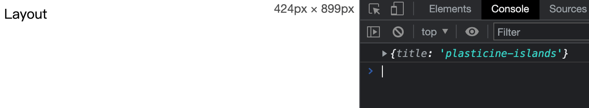
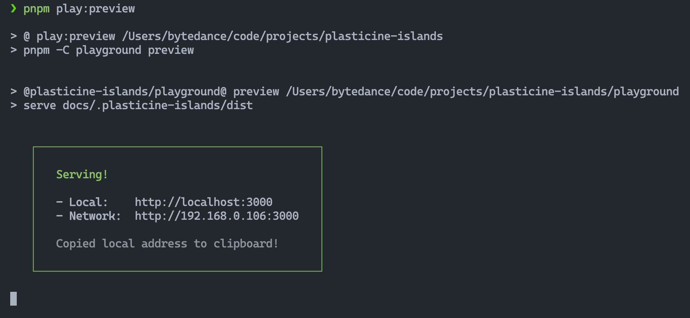
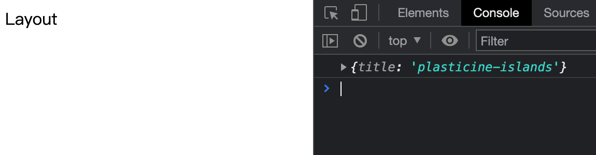
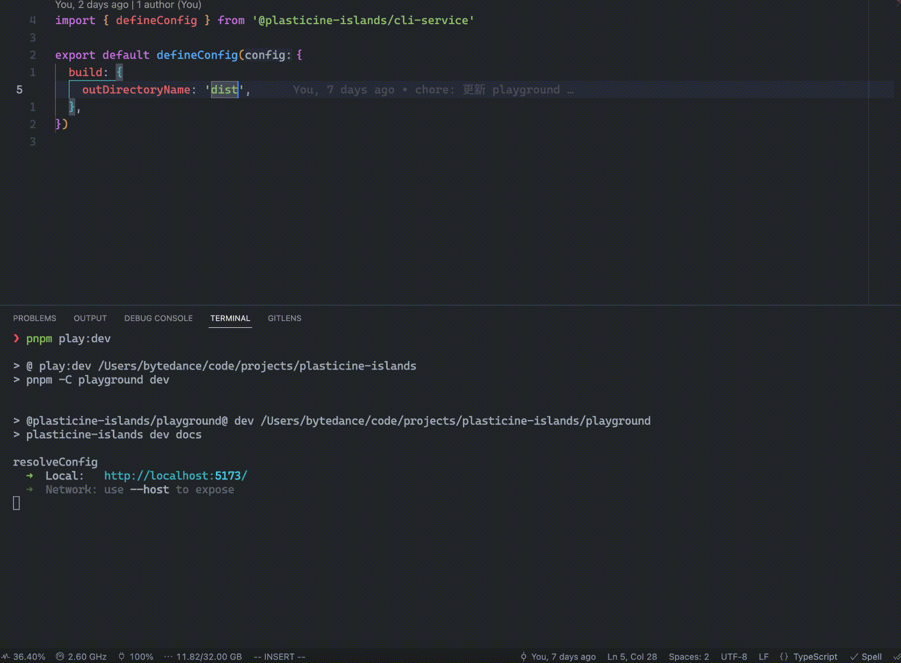
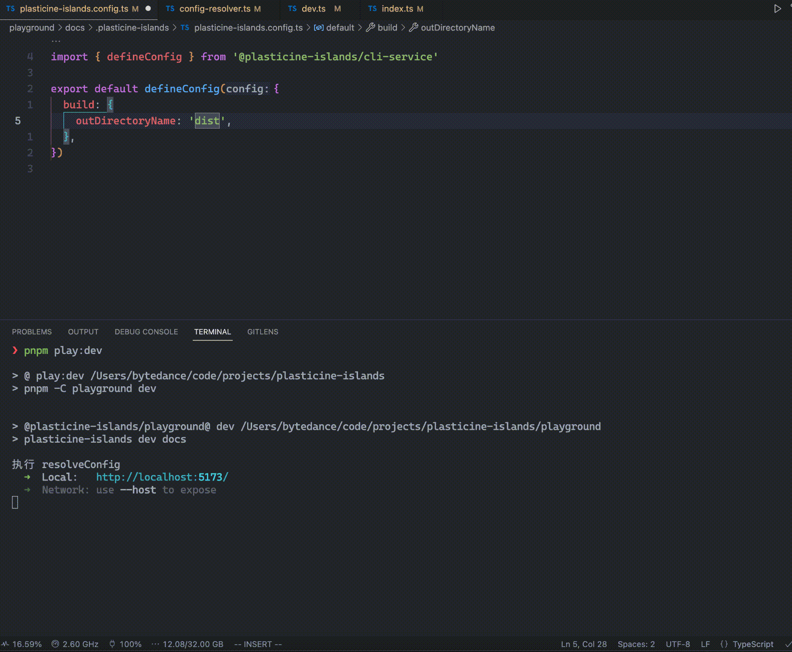

# 实现配置文件解析功能

:::tip 本节代码分支地址
[https://github.com/Plasticine-Yang/plasticine-islands/tree/feat/config-resolver](https://github.com/Plasticine-Yang/plasticine-islands/tree/feat/config-resolver)
:::

## 前言

在使用很多库的时候，大家应该都注意到它们都支持以配置文件的方式进行自定义配置，比如 vite 支持 `vite.config.ts`，`vite.config.js` 等文件进行配置

那么你是否好奇如何实现一个配置文件解析功能呢？可以了解一下 [unconfig](https://github.com/antfu/unconfig)，它提供了通用的配置文件解析功能，能够解析常见的配置文件格式，比如 `.json`，`.js`，`.ts` 以及 `.rc` (如 `.eslintrc`) 等

:::tip
.rc 后缀是一种 Unix 系统中常用的配置文件命名约定，表示 "run commands"，也就是运行命令时所需要的配置文件。

在 Unix 系统中，许多命令都有自己的配置文件，例如 .bashrc、.vimrc、.gitconfig 等等。这些配置文件通常都遵循相同的命名约定，即使用点号开头，后面跟着命令的名称和 .rc 后缀。
:::

本篇文章我们就会用它来为项目添加配置文件解析能力

## 模拟 vitepress 的配置文件解析方式

首先思考一下配置文件解析能力应该放到哪个包中实现？

很显然，需要放到 cli 包中实现，只需将解析出的配置对象传递给其依赖的 core 包使用即可，不需要 core 包自己再去单独解析

在 vitepress 中，配置文件是放在命令执行的 root 目录下的 `.vitepress` 目录中的，事实上很多工具都会有这种以 `.` 开头的目录作为该工具的配置目录以及一些由该工具使用的文件，比如 vitepress 的 build 命令构建的产物也同样会放到 `.vitepress` 目录中

为此，我们需要先定义一个 `BASE_DIRECTORY` 常量指定一个类似 `.vitepress` 这样的目录，但是又得思考一下，这个常量放到 cli 包中定义适合吗？

之前的 mvp 版本中，core 包中的 bundle 产物是输出到 root 目录下的，现在有了 `BASE_DIRECTORY` 后，应当输出到 `root/BASE_DIRECTORY/dist` 这样的目录下，也就是说 core 包也会使用到这个常量，但是不可能让 core 包将 cli 包作为依赖安装进来吧？这样就循环依赖了，不太合理

为此需要有一个 shared 包去管理这些多个包都会用到的共同代码，shared 这样的包在很多开源库中都会用到，比如 vue3 的源码就是这样管理的

创建一个新的包之前已经说过很多次了，就不再赘述了，直接上代码

::: code-group

```ts [packages/shared/src/constants.ts]
/**
 * @description plasticine-islands 在用户侧的基本目录
 *
 * 比如运行 build 构建的产物，用户定义的配置文件等都会保存到该目录中
 */
export const BASE_DIRECTORY = '.plasticine-islands'
```

:::

然后 core 包和 cli 包都需要安装 shared 包，装好之后就可以集成 unconfig 解析配置文件了

## cli-service 包集成 unconfig 解析配置文件

### 为什么不放在 cli 包中

配置文件解析这一能力没有放到 cli 包中，而是放到了单独的一个 `cli-service` 包中，这是为什么呢？

来回看一下目前我们的 cli 包的入口 `index.ts`

```ts
import cac from 'cac'

import pkg from '../package.json'
import { actionBuild, actionDev } from './actions'

const cli = cac('plasticine-islands')

// build 命令
cli.command('build [root]', '构建产物').action(actionBuild)

// dev 命令
cli.command('dev [root]', '启动开发环境服务器').action(actionDev)

// 支持 `--help` 和 `-h` 显示帮助信息
cli.help()

// 支持 `--version` 和 `-v` 显示版本信息
cli.version(pkg.version)

cli.parse()
```

拥有配置文件解析能力后，我们会导出一个 `defineConfig` 函数出去，如果配置文件解析能力放到 cli 包实现的话，那么 defineConfig 也就需要在 cli 包中导出，但是每次 import cli 包的时候，都会执行 cli 的运行流程

这就意味着，如果用户使用了 defineConfig，并且运行 `plasticine-islands build` 命令

那么上面这些运行时代码会在命令运行时执行，而当 build action 中去加载用户的配置文件时，由于其使用了 defineConfig，并且是从 cli 包中导入的，在导入时 cli 入口的运行时代码又会执行一次，而执行到 `cli.parse` 的时候，会再次触发 build action

也就是说整个 build 命令会无限死循环地执行下去，显然是不合理的，事实上，cli 包本身就不应该负责导出 defineConfig 或其他模块，它的职责就单纯是一个命令行应用，那么 defineConfig 这样的 API 应该放在哪里导出呢？

由于它是 cli 包需要用到的一个功能，可以理解成是一种服务，因此我们可以新建一个 `cli-service` 包去负责导出 API，用户使用时也是从这个包中导入

下面就直接开始实现，创建 `cli-service` 包的过程就不赘述了

### 实现

unconfig 提供了一个 `loadConfig` 函数，我们只需要告诉它希望解析什么名字的文件，并提供一个工作目录即可，代码如下

::: code-group

```ts [packages/cli-service/src/config-resolver.ts]
import { loadConfig } from 'unconfig'

import { BASE_DIRECTORY } from '@plasticine-islands/shared'
import type { BuildConfig, PlasticineIslandsConfig, ResolvedConfig } from '@plasticine-islands/types'

import { resolve } from 'path'
import { DEFAULT_OUT_DIRECTORY_NAME } from './constants'

export async function resolveConfig(root: string): Promise<ResolvedConfig> {
  const loadedConfig = await loadConfig<PlasticineIslandsConfig | undefined>({
    sources: [
      {
        files: 'plasticine-islands.config',
        extensions: ['ts', 'js'],
      },
    ],
    merge: false,
    cwd: resolve(root, BASE_DIRECTORY),
  })

  const { config = {}, sources } = loadedConfig

  return {
    root,
    configPath: sources.at(0) ?? '',
    buildConfig: resolveBuildConfig(config),
  }
}

function resolveBuildConfig(config: PlasticineIslandsConfig): BuildConfig {
  const { outDirectoryName } = config.build ?? {}

  return {
    outDirectoryName: outDirectoryName ?? DEFAULT_OUT_DIRECTORY_NAME,
  }
}

export function defineConfig(config: PlasticineIslandsConfig) {
  return config
}
```

```ts [packages/types/src/config.ts]
import { DeepPartial, DeepRequired } from './utils'

export interface BuildConfig {
  /**
   * @description 产物的目录名
   * @default dist
   */
  outDirectoryName: string
}

export interface PlasticineIslandsConfig {
  build?: DeepPartial<BuildConfig>
}

export interface ResolvedConfig {
  /** @description 执行 cli 命令时指定的 root 目录 */
  root: string

  /** @description 配置文件的路径 */
  configPath: string

  /** @description build 命令相关配置 */
  buildConfig: DeepRequired<BuildConfig>
}
```

```ts [packages/types/src/utils.ts]
export type DeepPartial<T> = T extends Record<PropertyKey, any>
  ? {
      [P in keyof T]?: DeepPartial<T[P]>
    }
  : T

export type DeepRequired<T> = T extends Record<PropertyKey, any>
  ? {
      [P in keyof T]-?: DeepRequired<T[P]>
    }
  : T
```

:::

解释一下这里为什么要用 DeepPartial 和 DeepRequired，因为我希望实现的效果是用户即便不编写配置文件，也能够正常使用我们的框架，因此提供给用户定义的配置，也就是 `PlasticineIslandsConfig`，它应当是全部属性都为可选的对象

但是在传递给 core 包使用的时候，需要保证每个配置项都有值，因此还需要有一个全部属性都不是可选的配置对象，也就是 `ResolvedConfig`，因而有了使用 DeepPartial 和 DeepRequired 的需求

导出的 `defineConfig` 函数啥也没做，仅仅是提供一个类型提示

### 修改 build action 的实现

有了配置文件的话，我们就不用之前的 cli option 了，不然还得考虑两者的优先级问题，比较复杂

在 build action 中移除 options 参数，并调用上面实现的 `resolveConfig` 函数获取解析出来的配置，并把原先依赖 options 的 core 包中的函数修改一下

还需要将 `BASE_DIRECTORY` 的改动也加上

::: code-group

```ts [packages/cli/src/actions/build.ts]
import { resolve } from 'path'

import { build } from '@plasticine-islands/core'
import type { ActionBuildFunc } from '@plasticine-islands/types'
import { resolveConfig } from '@plasticine-islands/cli-service'

export const actionBuild: ActionBuildFunc = async (root) => {
  /** @description 需要将相对路径 root 解析成绝对路径，默认使用命令执行时的路径作为 root */
  const parsedRoot = root !== undefined ? resolve(root) : process.cwd()

  const resolvedConfig = await resolveConfig(parsedRoot)

  build(resolvedConfig)
}
```

```ts [packages/core/src/build/index.ts]
import { resolve } from 'path'
import type { OutputChunk } from 'rollup'

import { BASE_DIRECTORY } from '@plasticine-islands/shared'
import type { ResolvedConfig, ServerBundleModule } from '@plasticine-islands/types'

import { SERVER_BUNDLE_DIRECTORY_NAME, SERVER_BUNDLE_NAME } from '../constants'
import { bundle } from './bundle'
import { renderPage } from './render-page'

export async function build(resolvedConfig: ResolvedConfig) {
  const { root, buildConfig } = resolvedConfig

  const [clientBundle] = await bundle(root, buildConfig)

  // 加载服务端构建产物中的 render 函数
  const serverBundleModulePath = resolve(root, BASE_DIRECTORY, SERVER_BUNDLE_DIRECTORY_NAME, SERVER_BUNDLE_NAME)
  const { render }: ServerBundleModule = await import(serverBundleModulePath)

  // 获取客户端产物的入口地址
  const clientEntryChunk = clientBundle.output.find((item) => item.type === 'chunk' && item.isEntry) as OutputChunk

  renderPage(root, render, clientEntryChunk, buildConfig)
}
```

```ts [packages/core/src/build/bundle.ts]
import ora from 'ora'
import { join } from 'path'
import type { RollupOutput } from 'rollup'
import { build as viteBuild, type InlineConfig } from 'vite'

import { BASE_DIRECTORY } from '@plasticine-islands/shared'
import type { BuildConfig, ResolvedConfig } from '@plasticine-islands/types'

import { CLIENT_ENTRY_PATH, SERVER_BUNDLE_DIRECTORY_NAME, SERVER_ENTRY_PATH } from '../constants'

/**
 * @description 构建客户端和服务端产物
 * @param root 命令执行的目标路径
 * @returns [clientBundle, serverBundle]
 */
export async function bundle(root: string, buildConfig: ResolvedConfig['buildConfig']) {
  const spinner = ora('building client + server bundles...\n').start()

  try {
    const clientViteConfig = resolveViteConfig(root, 'client', buildConfig)
    const serverViteConfig = resolveViteConfig(root, 'server', buildConfig)

    const [clientBundle, serverBundle] = await Promise.all([viteBuild(clientViteConfig), viteBuild(serverViteConfig)])
    spinner.succeed('build client + server bundles successfully!')

    return [clientBundle, serverBundle] as [RollupOutput, RollupOutput]
  } catch (error) {
    spinner.fail('构建客户端和服务端产物过程出错')
    console.error(error)
  }
}

function resolveViteConfig(root: string, target: 'client' | 'server', buildConfig: BuildConfig): InlineConfig {
  const { outDirectoryName } = buildConfig
  const isServer = target === 'server'

  return {
    mode: 'production',
    root,
    build: {
      outDir: isServer ? join(BASE_DIRECTORY, SERVER_BUNDLE_DIRECTORY_NAME) : join(BASE_DIRECTORY, outDirectoryName),
      ssr: isServer ? true : false,
      rollupOptions: {
        input: isServer ? SERVER_ENTRY_PATH : CLIENT_ENTRY_PATH,
        output: {
          format: 'esm',
        },
      },
    },
  }
}
```

```ts [packages/core/src/build/render-page.ts]
import ejs from 'ejs'
import fsExtra from 'fs-extra'
import ora from 'ora'
import { resolve } from 'path'
import type { OutputChunk } from 'rollup'

import { BASE_DIRECTORY } from '@plasticine-islands/shared'
import type { BuildHtmlEjsData, ResolvedConfig, ServerRenderFunc } from '@plasticine-islands/types'

import { BUILD_HTML_PATH, DEFAULT_BUILD_HTML_TITLE, SERVER_BUNDLE_DIRECTORY_NAME } from '../constants'

const { ensureDir, readFile, remove, writeFile } = fsExtra

export async function renderPage(
  root: string,
  serverRender: ServerRenderFunc,
  clientEntryChunk: OutputChunk,
  buildConfig: ResolvedConfig['buildConfig'],
) {
  const { outDirectoryName } = buildConfig
  const spinner = ora('rendering page...\n').start()

  try {
    // 读取模板并注入数据
    const template = await readFile(BUILD_HTML_PATH, 'utf-8')
    const html = ejs.render(template, {
      title: DEFAULT_BUILD_HTML_TITLE,
      serverRenderedString: serverRender(),
      clientEntryChunkPath: clientEntryChunk.fileName,
    } as BuildHtmlEjsData)

    // 将结果写入构建目录中
    await ensureDir(resolve(root, BASE_DIRECTORY, outDirectoryName))
    await writeFile(resolve(root, BASE_DIRECTORY, outDirectoryName, 'index.html'), html)

    // 移除服务端构建产物
    await remove(resolve(root, BASE_DIRECTORY, SERVER_BUNDLE_DIRECTORY_NAME))

    spinner.succeed('render page successfully!')
  } catch (error) {
    spinner.fail('渲染页面过程出错\n')
    console.error(error)
  }
}
```

:::

## playground 体验

接下来到 playground 中体验一下，首先编写一个 `plasticine-islands.config.ts` 配置文件

::: code-group

```ts [playground/docs/.plasticine-islands/plasticine-islands.config.ts]
import { defineConfig } from '@plasticine-islands/cli'

export default defineConfig({
  build: {
    outDirectoryName: 'build',
  },
})
```

:::

接下来运行 `pnpm play:build`，效果如下：


可以多尝试几种情况：

- 不编写 `plasticine-islands.config.ts` 文件
- 编写了配置文件，但导出了一个空对象
- 导出了带有 `build` 配置的对象，但该对象是一个空对象

以上情况均能让框架的 build 命令正常运行

至此，配置文件解析的功能就实现啦，之后会随着项目开发继续添加额外的配置项，只需要先修改 `PlasticineIslandsConfig` 类型即可，然后在用到相应配置的地方解构出对应配置项，并且要记得赋默认值即可

## 让前端应用能获取到加载的配置

由于之后配置文件中会配置许多和文档站点相关的信息，比如站点标题，logo，navbar，sidebar，markdown 相关配置等，这些都需要能够在前端应用中获取到才行

但是目前我们的框架尚不具备这个能力，所以接下来思考下如何实现

由于我们的 dev 和 build 命令底层都是基于 vite 实现的，而 vite 的插件机制中有和 rollup 兼容的虚拟模块机制，通过虚拟模块可以允许我们往前端应用中注入解析的配置

### Vite 插件 - 将加载的配置作为虚拟模块

我们需要实现一个 Vite 插件，在插件中提供虚拟模块，并在虚拟模块中将加载的配置导出出去，从而能够让前端应用通过 import 模块的方式获取到用户定义的配置信息

但是提供给前端应用的应当只有页面开发需要的配置，至于 root，configPath，build 这些都不应暴露给前端应用，因为其根本就用不上这些配置

为此我们先扩展一下 `PlasticineIslandsConfig` 的类型

:::code-group

```ts{1-7,11,24-25} [packages/types/src/config.ts]
export interface SiteConfig {
  /**
   * @description 网站标题
   * @default plasticine-islands
   */
  title?: string
}

export interface PlasticineIslandsConfig {
  build?: DeepPartial<BuildConfig>
  siteConfig?: DeepPartial<SiteConfig>
}

export interface ResolvedConfig {
  /** @description 执行 cli 命令时指定的 root 目录 */
  root: string

  /** @description 配置文件的路径 */
  configPath: string

  /** @description build 命令相关配置 */
  buildConfig: DeepRequired<BuildConfig>

  /** @description 站点配置 - 会暴露给前端应用 */
  siteConfig: DeepRequired<SiteConfig>
}
```

:::

由于我们目前的重点不在实现站点样式上，因此不会把 SiteConfig 的类型定义得很详细，只定义一个 title 测试即可，重点在于让前端应用通过导入虚拟模块获取配置文件中的 SiteConfig 配置

然后新建一个 `vite-plugin-plasticine-islands-site-config`，并写入如下代码：

:::code-group

```ts [packages/vite-plugin-plasticine-islands-site-config/src/index.ts]
import type { Plugin } from 'vite'

import type { SiteConfig } from '@plasticine-islands/types'

const virtualModuleId = 'virtual:plasticine-islands-site-config'
const resolvedVirtualModuleId = '\0' + virtualModuleId

export default function vitePluginSiteConfig(siteConfig: SiteConfig): Plugin {
  return {
    name: 'plasticine-islands-site-config',
    resolveId(id) {
      if (id === virtualModuleId) {
        return resolvedVirtualModuleId
      }
    },
    load(id) {
      if (id === resolvedVirtualModuleId) {
        return `export default ${JSON.stringify(siteConfig)}`
      }
    },
  }
}
```

:::

接下来需要将这个插件集成到 core 包中，分别应用到 dev 和 build 命令的 vite 运行时当中

### 集成到 dev 和 build 中

dev 命令启动的 Vite Dev Server 可以配置该插件

build 命令中 resolveViteConfig 的时候可以配置该插件

:::code-group

```ts [packages/core/src/dev-server/index.ts]
import vitePluginReact from '@vitejs/plugin-react'
import { createServer as createViteServer } from 'vite'

import { ResolvedConfig } from '@plasticine-islands/types'
import vitePluginDevServerHtml from '@plasticine-islands/vite-plugin-dev-server-html'
import vitePluginPlasticineIslandsSiteConfig from '@plasticine-islands/vite-plugin-plasticine-islands-site-config'

import { CLIENT_ENTRY_PATH, DEV_SERVER_HTML_PATH } from '../constants'

export function createDevServer(resolvedConfig: ResolvedConfig) {
  const { root, siteConfig } = resolvedConfig

  return createViteServer({
    root,
    plugins: [
      vitePluginReact(),

      vitePluginDevServerHtml({
        htmlPath: DEV_SERVER_HTML_PATH,
        clintEntryPath: CLIENT_ENTRY_PATH,
      }),

      vitePluginPlasticineIslandsSiteConfig(siteConfig),
    ],
  })
}
```

```ts [packages/core/src/build/bundle.ts]
function resolveViteConfig(target: 'client' | 'server', resolvedConfig: ResolvedConfig): InlineConfig {
  const { root, buildConfig, siteConfig } = resolvedConfig
  const { outDirectoryName } = buildConfig
  const isServer = target === 'server'

  return {
    mode: 'production',
    root,
    build: {
      outDir: isServer ? join(BASE_DIRECTORY, SERVER_BUNDLE_DIRECTORY_NAME) : join(BASE_DIRECTORY, outDirectoryName),
      ssr: isServer ? true : false,
      rollupOptions: {
        input: isServer ? SERVER_ENTRY_PATH : CLIENT_ENTRY_PATH,
        output: {
          format: 'esm',
        },
      },
    },
    plugins: [vitePluginPlasticineIslandsSiteConfig(siteConfig)],
  }
}
```

:::

:::tip
这里对 createDevServer 和 resolveViteConfig 的参数进行了修改，具体可到本节对应的代码分支中查看
:::

这里不难发现，dev 和 build 中都有共同的 vite plugins，因此可以考虑将其抽离成一个 `resolveVitePlugins` 函数

:::code-group

```ts [packages/core/src/helpers/resolve-vite-plugins.ts]
import vitePluginReact from '@vitejs/plugin-react'
import type { PluginOption } from 'vite'

import type { ResolvedConfig } from '@plasticine-islands/types'
import vitePluginDevServerHtml from '@plasticine-islands/vite-plugin-dev-server-html'
import vitePluginPlasticineIslandsSiteConfig from '@plasticine-islands/vite-plugin-plasticine-islands-site-config'

import { CLIENT_ENTRY_PATH, DEV_SERVER_HTML_PATH } from '../constants'

export function resolveVitePlugins(resolvedConfig: ResolvedConfig): PluginOption[] {
  const { siteConfig } = resolvedConfig

  return [
    vitePluginReact(),

    vitePluginDevServerHtml({
      htmlPath: DEV_SERVER_HTML_PATH,
      clintEntryPath: CLIENT_ENTRY_PATH,
    }),

    vitePluginPlasticineIslandsSiteConfig(siteConfig),
  ]
}
```

```ts [packages/core/src/dev-server/index.ts]
import { createServer as createViteServer } from 'vite'

import { ResolvedConfig } from '@plasticine-islands/types'

import { resolveVitePlugins } from '../helpers'

export function createDevServer(resolvedConfig: ResolvedConfig) {
  const { root } = resolvedConfig

  return createViteServer({
    root,
    plugins: resolveVitePlugins(resolvedConfig),
  })
}
```

```ts [packages/core/src/build/bundle.ts]
function resolveViteConfig(target: 'client' | 'server', resolvedConfig: ResolvedConfig): InlineConfig {
  const { root, buildConfig } = resolvedConfig
  const { outDirectoryName } = buildConfig
  const isServer = target === 'server'

  return {
    mode: 'production',
    root,
    build: {
      outDir: isServer ? join(BASE_DIRECTORY, SERVER_BUNDLE_DIRECTORY_NAME) : join(BASE_DIRECTORY, outDirectoryName),
      ssr: isServer ? true : false,
      rollupOptions: {
        input: isServer ? SERVER_ENTRY_PATH : CLIENT_ENTRY_PATH,
        output: {
          format: 'esm',
        },
      },
    },
    plugins: resolveVitePlugins(resolvedConfig),
  }
}
```

:::

### 验证效果 - 在 runtime 的 App 组件中导入虚拟模块

:::code-group

```ts [packages/core/bundless/runtime/app.tsx]
import siteConfig from 'virtual:plasticine-islands-site-config'

import Layout from '../theme-default'

const App: React.FC = () => {
  console.log(siteConfig)
  return <Layout />
}

export default App
```

```ts [packages/core/src/plasticine-islands-env.d.ts]
declare module 'virtual:plasticine-islands-site-config' {
  import { SiteConfig } from '@plasticine-islands/types'

  const siteConfig: SiteConfig

  export default siteConfig
}
```

:::

这里通过新增一个 `plasticine-islands-env.d.ts` 文件让 TypeScript 正确识别出虚拟模块的类型

### 验证效果 - 在 playground 中验证

运行 `pnpm play:dev`，效果如下：



运行 `pnpm play:build`，并给 playground 包安装一个 `serve` 依赖，并在 `package.json` 中添加如下脚本：

:::code-group

```json [playground/package.json]
{
  "scripts": {
    "preview": "serve docs/.plasticine-islands/dist"
  }
}
```

```json [package.json]
{
  "scripts": {
    "play:preview": "pnpm -C playground preview"
  }
}
```

:::

运行 `pnpm:preview`，效果如下：





至此，我们就能够在前端应用中访问到用户在配置文件中定义的 SiteConfig 啦，之后在实现网站样式时就以 SiteConfig 为桥梁进行定制

## 配置文件热更新

Vite 插件提供了 `handleHotUpdate` 这个钩子来让我们在文件发生变化时进行一些操作

我们只需要比对一下变化的文件是否是配置文件，是的话重启 Dev Server，加载新的配置文件内容即可

### 有问题的实现

:::code-group

```ts [packages/vite-plugin-plasticine-islands-site-config/src/index.ts]
export default function vitePluginPlasticineIslandsSiteConfig(
  root: string,
  siteConfig: SiteConfig,
  configFilePath: string,
): Plugin {
  return {
    name: 'plasticine-islands-site-config',
    resolveId(id) {
      if (id === virtualModuleId) {
        return resolvedVirtualModuleId
      }
    },
    load(id) {
      if (id === resolvedVirtualModuleId) {
        return `export default ${JSON.stringify(siteConfig)}`
      }
    },

    // 配置文件更新时重启 Dev Server
    handleHotUpdate(ctx) {
      const filesToWatch = [configFilePath]
      const include = (filePath: string) => filesToWatch.some((file) => file.includes(filePath))

      if (include(ctx.file)) {
        console.log(chalk.cyan(`\n配置文件 ${relative(root, configFilePath)} 改动，重启开发服务器...\n`))
        ctx.server.restart()
      }
    },
  }
}
```

:::

这样是不是就能实现配置文件热更新了呢？先思考一下我们热更新的目的是什么？是不是希望开发服务器重新执行 resolveConfig 去读取最新的配置文件内容？

那么我们可以在 resolveConfig 被调用的时候打印一下，再改动一下配置文件看看重启 Dev Server 后是否有重新调用 resolveConfig

:::code-group

```ts{2} [packages/cli-service/src/config-resolver.ts]
export async function resolveConfig(root: string): Promise<ResolvedConfig> {
  console.log('执行 resolveConfig')
  const loadedConfig = await loadConfig<PlasticineIslandsConfig | undefined>({
    sources: [
      {
        files: 'plasticine-islands.config',
        extensions: ['ts', 'js'],
      },
    ],
    merge: false,
    cwd: resolve(root, BASE_DIRECTORY),
  })

  const { config = {}, sources } = loadedConfig

  return {
    root,
    configFilePath: sources.at(0) ?? '',
    buildConfig: resolveBuildConfig(config),
    siteConfig: resolveSiteConfig(config),
  }
}
```

:::



可以看到，并没有打印出「执行 resolveConfig」，说明配置文件并没有重新加载

### 改进

再看看我们是怎么重启 Dev Server 的？

```ts
ctx.server.restart()
```

这是直接调用 Vite Dev Server 实例的 restart 方法去重启 Dev Server 的，而我们的加载配置文件启动 Dev Server 是执行 dev 命令对应的 action 才有的

也就是说，我们应当在配置文件变化时重新执行 dev action 的逻辑

```ts
export const actionDev: ActionDevFunc = async (root) => {
  /** @description 需要将相对路径 root 解析成绝对路径，默认使用命令执行时的路径作为 root */
  const parsedRoot = root !== undefined ? resolve(root) : process.cwd()

  const resolvedConfig = await resolveConfig(parsedRoot)

  const server = await createDevServer(resolvedConfig)
  await server.listen()

  server.printUrls()
}
```

所以将这部分代码抽出来，它会在 actionDev 和插件中都被调用

:::code-group

```ts{18-21} [packages/cli/src/actions/dev.ts]
import { resolve } from 'path'

import { resolveConfig } from '@plasticine-islands/cli-service'
import { createDevServer } from '@plasticine-islands/core'
import type { ActionDevFunc } from '@plasticine-islands/types'

/** @inheritdoc */
export const actionDev: ActionDevFunc = async (root) => {
  await startDevServer(root)
}

async function startDevServer(root?: string) {
  /** @description 需要将相对路径 root 解析成绝对路径，默认使用命令执行时的路径作为 root */
  const parsedRoot = root !== undefined ? resolve(root) : process.cwd()

  const resolvedConfig = await resolveConfig(parsedRoot)

  const server = await createDevServer(resolvedConfig, async () => {
    await server.close()
    startDevServer(root)
  })
  await server.listen()

  server.printUrls()
}
```

```ts [packages/core/src/dev-server/index.ts]
import { createServer as createViteServer } from 'vite'

import { ResolvedConfig } from '@plasticine-islands/types'

import { resolveVitePlugins } from '../helpers'

export function createDevServer(resolvedConfig: ResolvedConfig, onDevServerRestart: () => Promise<void>) {
  const { root } = resolvedConfig

  return createViteServer({
    root,
    plugins: resolveVitePlugins({ resolvedConfig, onDevServerRestart }),
  })
}
```

```ts{10-13,15-16,26} [packages/core/src/helpers/resolve-vite-plugins.ts]
import vitePluginReact from '@vitejs/plugin-react'
import type { PluginOption } from 'vite'

import type { ResolvedConfig, VitePluginPlasticineIslandsSiteConfigOptions } from '@plasticine-islands/types'
import vitePluginDevServerHtml from '@plasticine-islands/vite-plugin-dev-server-html'
import vitePluginPlasticineIslandsSiteConfig from '@plasticine-islands/vite-plugin-plasticine-islands-site-config'

import { CLIENT_ENTRY_PATH, DEV_SERVER_HTML_PATH } from '../constants'

interface ResolveVitePluginsOptions {
  resolvedConfig: ResolvedConfig
  onDevServerRestart: VitePluginPlasticineIslandsSiteConfigOptions['onDevServerRestart']
}

export function resolveVitePlugins(options: ResolveVitePluginsOptions): PluginOption[] {
  const { resolvedConfig, onDevServerRestart } = options

  return [
    vitePluginReact(),

    vitePluginDevServerHtml({
      htmlPath: DEV_SERVER_HTML_PATH,
      clintEntryPath: CLIENT_ENTRY_PATH,
    }),

    vitePluginPlasticineIslandsSiteConfig({ resolvedConfig, onDevServerRestart }),
  ]
}
```

```ts{4,11,36} [packages/vite-plugin-plasticine-islands-site-config/src/index.ts]
import chalk from 'chalk'
import type { Plugin } from 'vite'

import type { VitePluginPlasticineIslandsSiteConfigOptions } from '@plasticine-islands/types'
import { relative } from 'path'

const virtualModuleId = 'virtual:plasticine-islands-site-config'
const resolvedVirtualModuleId = '\0' + virtualModuleId

export default function vitePluginPlasticineIslandsSiteConfig(
  options: VitePluginPlasticineIslandsSiteConfigOptions,
): Plugin {
  const { resolvedConfig, onDevServerRestart } = options
  const { root, siteConfig, configFilePath } = resolvedConfig

  return {
    name: 'plasticine-islands-site-config',
    resolveId(id) {
      if (id === virtualModuleId) {
        return resolvedVirtualModuleId
      }
    },
    load(id) {
      if (id === resolvedVirtualModuleId) {
        return `export default ${JSON.stringify(siteConfig)}`
      }
    },

    // 配置文件更新时重启 Dev Server
    async handleHotUpdate(ctx) {
      const filesToWatch = [configFilePath]
      const include = (filePath: string) => filesToWatch.some((file) => file.includes(filePath))

      if (include(ctx.file)) {
        console.log(chalk.cyan(`\n配置文件 ${relative(root, configFilePath)} 改动，重启开发服务器...\n`))
        await onDevServerRestart()
      }
    },
  }
}
```

```ts [packages/types/src/vite-plugin-plasticine-islands-site-config/index.ts]
import type { ResolvedConfig } from '../config'

export interface VitePluginPlasticineIslandsSiteConfigOptions {
  resolvedConfig: ResolvedConfig
  onDevServerRestart: () => Promise<void>
}
```

:::

现在再来验证一下效果



可以发现成功了！至此配置文件解析能力就实现完啦

:::tip 本节代码分支地址
[https://github.com/Plasticine-Yang/plasticine-islands/tree/feat/config-resolver](https://github.com/Plasticine-Yang/plasticine-islands/tree/feat/config-resolver)
:::
