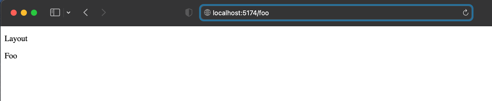
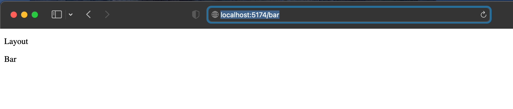
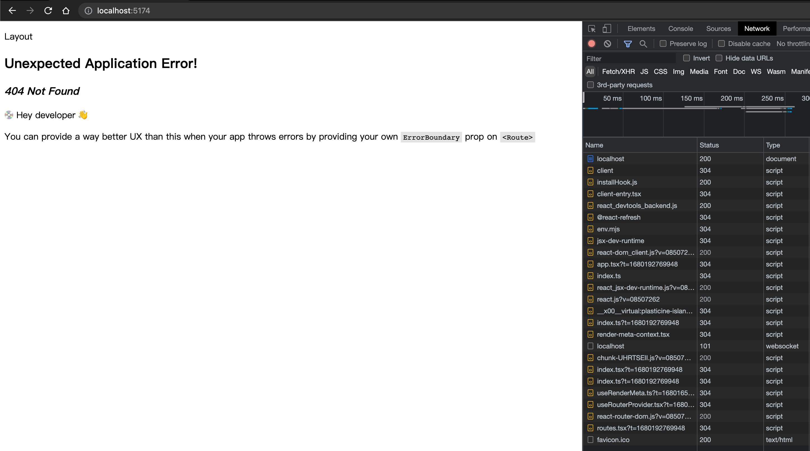
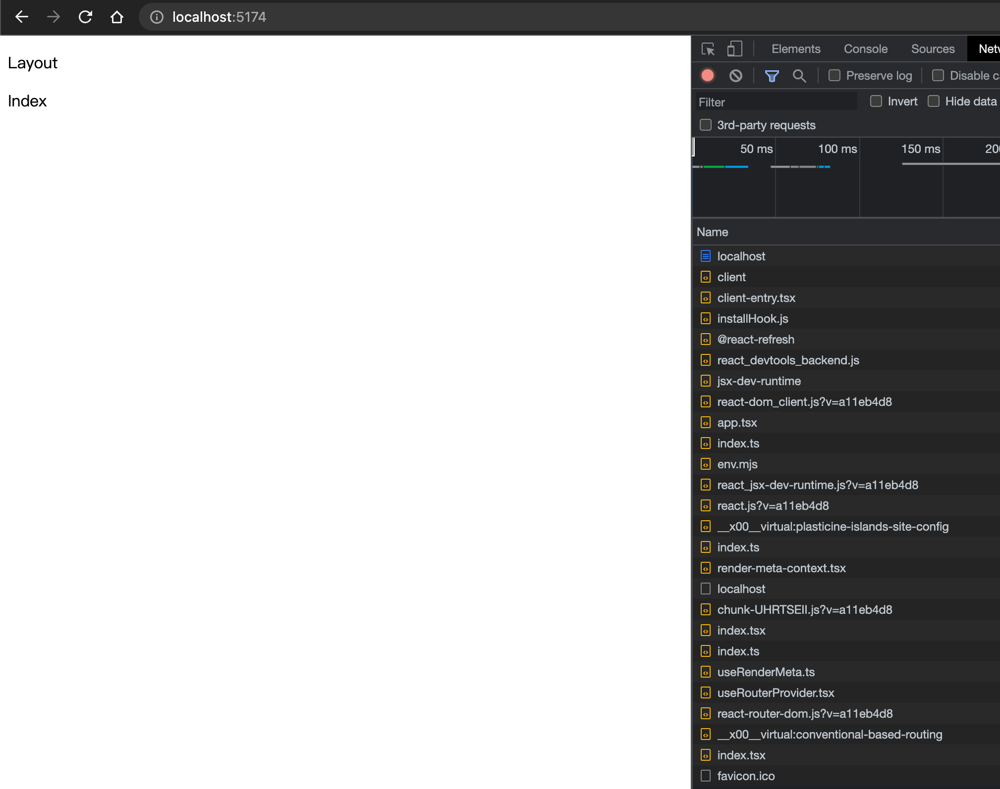
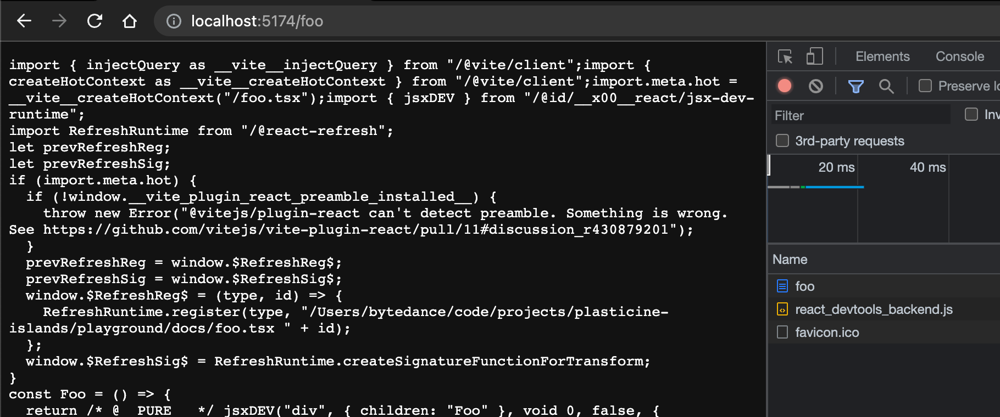
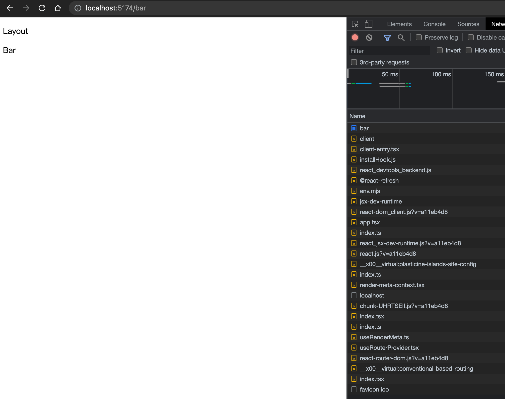
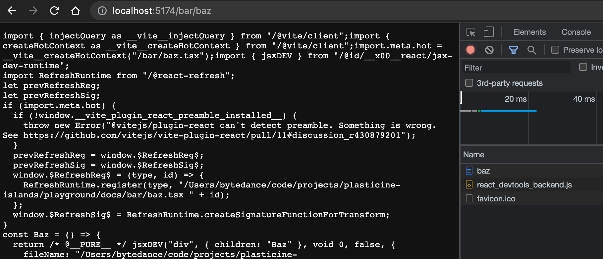
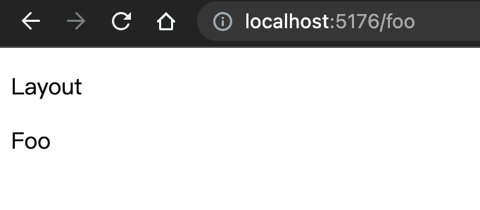

# 约定式路由

:::tip 本节代码分支地址
[https://github.com/Plasticine-Yang/plasticine-islands/tree/feat/conventional-based-routing](https://github.com/Plasticine-Yang/plasticine-islands/tree/feat/conventional-based-routing)
:::

## 前言

约定式路由也叫基于文件系统的路由，也就是将文件系统中的目录结构映射到路由中

比如如下文件目录结构：

```text
├── a.md
├── b
│   ├── c.md
│   ├── d
│   │   └── index.md
│   └── index.md
└── index.md
```

能够映射出如下路由：

```text
/     -> index.md
/a    -> a.md
/b    -> b/index.md
/b/c  -> b/c.md
/b/d  -> b/d/index.md
```

本节我们就要实现这个功能

## 固定路由

在实现约定式路由之前，我们先来实现渲染固定的几个路由，之后再迁移到约定式路由

首先需要安装 `react-router-dom`

```shell
pnpm -C packages/core i react-router-dom
```

先编写两个固定的路由，使其能够正常渲染出来

:::code-group

```ts [packages/core/bundless/runtime/routes.tsx]
import type { RouteObject } from 'react-router-dom'

import Bar from './demo/Bar'
import Foo from './demo/Foo'

export const routes: RouteObject[] = [
  {
    path: '/foo',
    element: <Foo />,
  },
  {
    path: '/bar',
    element: <Bar />,
  },
]
```

```ts [packages/core/bundless/runtime/demo/Foo.tsx]
const Foo: React.FC = () => {
  return <div>Foo</div>
}

export default Foo
```

```ts [packages/core/bundless/runtime/demo/Bar.tsx]
const Bar: React.FC = () => {
  return <div>Bar</div>
}

export default Bar
```

:::

### react-router-dom 的使用

这里我们会在客户端渲染时使用 `createBrowserRouter` + `RouterProvider`，在服务端渲染时使用 `createStaticRouter` + `StaticRouterProvider` 的方式

它们都需要接收 routes 数组，最终在哪里渲染 `<RouterProvider>`，哪里就会出现路由组件

### 通过 context 区分渲染模式

既然知道要用两种不同的路由模式的话，首先得知道当前是客户端渲染还是服务端渲染，这只能在 `client-entry.tsx` 和 `server-entry.tsx` 中知道

所以我们可以先实现一个 `RenderMetaContext` 记录一下渲染所需的一些元数据信息

:::code-group

```ts [packages/core/bundless/runtime/context/render-meta-context.tsx]
import { createContext } from 'react'

export interface RenderMeta {
  /**
   * @description 渲染模式
   * @default client
   */
  mode: 'client' | 'server'
}

export const RenderMetaContext = createContext<RenderMeta>({
  mode: 'client',
})
```

```ts [packages/core/bundless/runtime/hooks/useRenderMeta.ts]
import { useContext } from 'react'

import { RenderMetaContext } from '../context'

export function useRenderMeta() {
  return useContext(RenderMetaContext)
}
```

```ts [packages/core/bundless/runtime/hooks/useRouterProvider.tsx]
import type { ReactElement } from 'react'
import { createBrowserRouter, RouterProvider } from 'react-router-dom'

import { useRenderMeta } from '../../runtime/hooks'
import { routes } from '../../runtime/routes'

export function useRouterProvider() {
  const { mode } = useRenderMeta()

  let res: { renderRouterProvider: () => ReactElement }

  if (mode === 'client') {
    const router = createBrowserRouter(routes)
    res = {
      renderRouterProvider: () => <RouterProvider router={router} />,
    }
  } else if (mode === 'server') {
    // TODO
  }

  return res
}
```

:::

这里还实现了两个 hooks：

- useRenderMeta: 消费 RenderMetaContext
- useRouterProvider: 自动根据渲染模式生成 RouterProvider 或 StaticRouterProvider(之后再实现)

接下来就能够分别在客户端和服务端的 entry 使用了

:::code-group

```ts [packages/core/bundless/runtime/client-entry.tsx]
import { createRoot } from 'react-dom/client'

import App from './app'
import { RenderMetaContext } from './context'

function renderInBrowser() {
  const $root = document.querySelector<HTMLDivElement>('#root')

  if ($root === null) {
    throw new Error('容器节点 `#root` 不存在，客户端渲染无法进行')
  }

  createRoot($root).render(
    <RenderMetaContext.Provider value={{ mode: 'client' }}>
      <App />
    </RenderMetaContext.Provider>,
  )
}

renderInBrowser()
```

```ts [packages/core/bundless/runtime/server-entry.tsx]
import { renderToString } from 'react-dom/server'

import App from './app'
import { RenderMetaContext } from './context'

export function render() {
  return renderToString(
    <RenderMetaContext.Provider value={{ mode: 'server' }}>
      <App />
    </RenderMetaContext.Provider>,
  )
}
```

```ts [packages/core/bundless/theme-default/Layout/index.tsx]
import { useRouterProvider } from '../../runtime/hooks'

const Layout: React.FC = () => {
  const { renderProvider } = useRouterProvider()

  return (
    <div>
      <p>Layout</p>

      {renderProvider()}
    </div>
  )
}

export default Layout
```

:::

现在看看效果：





## Vite 插件 - 虚拟模块导入 routes

要想实现约定式路由，只需要根据文件系统的目录结构，生成对应的 routes 数组即可，可以通过 Vite 插件的虚拟模块做到这一点

得到 routes 后替换我们原来 mock 的 routes 即可

```ts
// 替换这里的 routes 导入方式为从插件的虚拟模块中导入
import { routes } from '../../runtime/routes'
```

新建一个包 - `vite-plugin-conventional-based-routing`

### 文件系统映射到路由系统

先来实现文件系统到路由系统的路径映射

:::code-group

```ts [packages/vite-plugin-conventional-based-routing/src/conventional-based-routing-service.ts]
import fg from 'fast-glob'
import { relative } from 'path'
import { normalizePath } from 'vite'

import { BASE_DIRECTORY } from '@plasticine-islands/shared'
import type { RouteMeta } from '@plasticine-islands/types'

export class ConventionalBasedRoutingService {
  private dirToScan: string
  private routeMetaList: RouteMeta[] = []

  constructor(dirToScan: string) {
    this.dirToScan = dirToScan
    this.init()
  }

  private init() {
    // 扫描文件系统，匹配目标文件
    const files = fg
      .sync(['**/*.{js,jsx,ts,tsx,md,mdx}'], {
        cwd: this.dirToScan,
        absolute: true,
        ignore: ['**/node_modules/**', BASE_DIRECTORY],
      })
      .sort()

    // 生成 RouteMeta
    for (const fileAbsolutePath of files) {
      // 获取文件的相对路径
      const fileRelativePath = normalizePath(relative(this.dirToScan, fileAbsolutePath))

      // 将文件相对路径转换成路由路径
      const routePath = this.normalizeRoutePath(fileRelativePath)

      this.routeMetaList.push({
        routePath,
        fileAbsolutePath,
      })
    }
  }

  private normalizeRoutePath(rawRoutePath: string) {
    const handledRoutePath = rawRoutePath
      // 去除文件名后缀 - e.g. index.tsx -> index
      .replace(/\.(.*)?$/, '')
      // 将 index 转成 `/`
      .replace(/index$/, '')

    // 确保路由路径是以 `/` 开头
    return handledRoutePath.startsWith('/') ? handledRoutePath : `/${handledRoutePath}`
  }

  public getRouteMetaList() {
    return this.routeMetaList
  }
}
```

:::

#### 通过单测验证效果

单测框架使用的是 [vitest](https://vitest.dev/)

:::code-group

```ts [packages/vite-plugin-conventional-based-routing/src/__test__/conventional-based-routing-service/index.test.ts]
import { resolve } from 'path'

import type { RouteMeta } from '@plasticine-islands/types'

import { ConventionalBasedRoutingService } from '../../conventional-based-routing-service'

describe('ConventionalBasedRoutingService', () => {
  const dirToScan = resolve(__dirname, 'fixtures')
  // 用于替代真实文件路径，保证单测在不同机器上运行都得到相同的结果
  const testDir = 'path/to/fixtures'
  const conventionalBasedRoutingService = new ConventionalBasedRoutingService(dirToScan)

  test('文件系统路径映射到路由系统路径', () => {
    const routeMetaList: RouteMeta[] = conventionalBasedRoutingService.getRouteMetaList().map((routeMeta) => ({
      ...routeMeta,
      // 避免真实路径出现，影响在不同机器上运行单测的效果
      fileAbsolutePath: routeMeta.fileAbsolutePath.replace(dirToScan, testDir),
    }))

    expect(routeMetaList).toMatchInlineSnapshot(`
      [
        {
          "fileAbsolutePath": "path/to/fixtures/bar/baz.ts",
          "routePath": "/bar/baz",
        },
        {
          "fileAbsolutePath": "path/to/fixtures/bar/index.ts",
          "routePath": "/bar",
        },
        {
          "fileAbsolutePath": "path/to/fixtures/foo.ts",
          "routePath": "/foo",
        },
        {
          "fileAbsolutePath": "path/to/fixtures/index.ts",
          "routePath": "/",
        },
      ]
    `)
  })
})
```

:::

可以看到，和预期效果一样，接下来就可以利用得到的 routeMetaList 生成 react-router-dom 所需的 routes 数组

### 利用 routeMetaList 生成导出 routes 的代码

首先要思考一下，我们生成的路由代码不应该同步加载所有的页面组件，而是应该按需加载，也就是访问哪个页面才加载对应页面的组件

恰好 react-router-dom 提供了这个能力 - [lazy](https://reactrouter.com/en/main/route/lazy)

我们先对原来的固定路由 Demo 实践一下看看它是如何使用和生效的

:::code-group

```ts [packages/core/bundless/runtime/routes.tsx]
import type { RouteObject } from 'react-router-dom'

export const routes: RouteObject[] = [
  {
    path: '/foo',
    lazy: async () => ({
      Component: (await import('./demo/Foo')).default,
    }),
  },
  {
    path: '/bar',
    lazy: async () => ({
      Component: (await import('./demo/Bar')).default,
    }),
  },
]
```

:::

到浏览器看看效果



可以看到，没访问到 `/foo` 和 `/bar` 时，Foo 和 Bar 组件都没被加载，符合我们的预期，所以生成的代码也按照这个格式来

:::code-group

```ts [packages/vite-plugin-conventional-based-routing/src/conventional-based-routing-service.ts]
export class ConventionalBasedRoutingService {
  // ...

  /**
   * @description 生成 react-router-dom 所需的 routes 数组代码
   */
  public generateRoutesCode() {
    const mapRouteMetaToRouteObjectCode = (routeMeta: RouteMeta) => {
      const { fileAbsolutePath, routePath } = routeMeta

      return `
{
  path: '${routePath}',
  lazy: async () => ({
    Component: (await import('${fileAbsolutePath}')).default
  })
}
      `.trim()
    }

    const code = `
export const routes = [${this.routeMetaList.map(mapRouteMetaToRouteObjectCode).join(',')}]
    `.trim()

    return code
  }
}
```

```ts [packages/vite-plugin-conventional-based-routing/src/__test__/conventional-based-routing-service/index.test.ts]
test('生成 routes 数组代码', () => {
  expect(conventionalBasedRoutingService.generateRoutesCode().replaceAll(dirToScan, testDir)).toMatchInlineSnapshot(`
    "export const routes = [{
      path: '/bar/baz',
      lazy: async () => ({
        Component: (await import('path/to/fixtures/bar/baz.ts')).default
      })
    },{
      path: '/bar',
      lazy: async () => ({
        Component: (await import('path/to/fixtures/bar/index.ts')).default
      })
    },{
      path: '/foo',
      lazy: async () => ({
        Component: (await import('path/to/fixtures/foo.ts')).default
      })
    },{
      path: '/',
      lazy: async () => ({
        Component: (await import('path/to/fixtures/index.ts')).default
      })
    }]"
  `)
})
```

:::

可以看到和我们预想的一样，那接下来就可以完整实现该插件了

:::code-group

```ts [packages/vite-plugin-conventional-based-routing/src/index.ts]
import type { Plugin } from 'vite'

import type { VitePluginPlasticineIslandsConventionalBasedRoutingOptions } from '@plasticine-islands/types'

import { ConventionalBasedRoutingService } from './conventional-based-routing-service'

const virtualModuleId = 'virtual:conventional-based-routing'
const resolvedVirtualModuleId = '\0' + virtualModuleId

export default function vitePluginPlasticineIslandsConventionalBasedRouting(
  options: VitePluginPlasticineIslandsConventionalBasedRoutingOptions,
): Plugin {
  const { root } = options
  const conventionalBasedRoutingService = new ConventionalBasedRoutingService(root)

  return {
    name: 'vite-plugin-conventional-based-routing',
    resolveId(id) {
      if (id === virtualModuleId) {
        return resolvedVirtualModuleId
      }
    },
    load(id) {
      if (id === resolvedVirtualModuleId) {
        return conventionalBasedRoutingService.generateRoutesCode()
      }
    },
  }
}
```

:::

## core 中集成约定式路由插件

:::code-group

```ts [packages/core/src/helpers/resolve-vite-plugins.ts]
export function resolveVitePlugins(options: ResolveVitePluginsOptions): PluginOption[] {
  const { resolvedConfig, onDevServerRestart } = options
  const { root } = resolvedConfig

  return [
    vitePluginReact(),

    vitePluginDevServerHtml({
      htmlPath: DEV_SERVER_HTML_PATH,
      clintEntryPath: CLIENT_ENTRY_PATH,
    }),

    vitePluginPlasticineIslandsSiteConfig({ resolvedConfig, onDevServerRestart }),

    vitePluginPlasticineIslandsConventionalBasedRouting({ root }),
  ]
}
```

```ts [packages/core/bundless/runtime/hooks/useRouterProvider.tsx]
import type { ReactElement } from 'react'
import { createBrowserRouter, RouterProvider } from 'react-router-dom'

import { routes } from '../../runtime/routes' // [!code --]
import { routes } from 'virtual:conventional-based-routing' // [!code ++]

import { useRenderMeta } from '../../runtime/hooks'

export function useRouterProvider() {
  const { mode } = useRenderMeta()
  console.log(routes)
  let res: { renderRouterProvider: () => ReactElement }

  if (mode === 'client') {
    const router = createBrowserRouter(routes)
    res = {
      renderRouterProvider: () => <RouterProvider router={router} />,
    }
  } else if (mode === 'server') {
    // TODO
  }

  return res
}
```

:::

## playground 验证效果

由于目前我们还没实现导入 md 和 mdx 文件的能力，因此先将 `playground/docs` 目录中的 `index.md` 改为 `index.tsx`，并导出一个简单的 React 组件

并且按照单元测试的 fixtures 创造相同的组件结构

```text
playground
├── docs
│   ├── bar
│   │   ├── baz.tsx
│   │   └── index.tsx
│   ├── foo.tsx
│   └── index.tsx
```

:::code-group

```tsx [playground/docs/index.tsx]
const Index = () => {
  return <div>Index</div>
}

export default Index
```

```ts [playground/docs/foo.tsx]
const Foo: React.FC = () => {
  return <div>Foo</div>
}

export default Foo
```

```ts [playground/docs/bar/index.tsx]
const Bar: React.FC = () => {
  return <div>Bar</div>
}

export default Bar
```

```ts [playground/docs/bar/baz.tsx]
const Baz: React.FC = () => {
  return <div>Baz</div>
}

export default Baz
```

:::

然后逐个访问看看效果

`/`



`/foo`



`/bar`



`/bar/baz`



可以看到，访问 `/` 和 `/bar` 都能正常渲染，但是访问 `/foo` 和 `/bar/baz` 返回的都是编译后的文件代码文本内容

这是为什么呢？

## 解决文件系统的问题

因为 Vite Dev Server 也是一个静态资源服务器，当访问 `/` 和 `/bar` 时，文件系统中并没有对应的真实文件，比如 `bar.tsx`，因此不会返回静态资源，从而转发到 react-router-dom 的客户端路由处理，渲染匹配的组件

而访问 `/foo` 和 `/bar/baz` 时，都存在对应的真实文件，即 `foo.tsx` 和 `baz.tsx`，因而直接将文件内容当成静态资源返回了

要解决这个问题很简单，只需要将 root 改为非用户真实执行命令时的 root 即可，也就是不以 `playground/docs` 为 root，可以任意取一个虚假目录作为 root，从而避开 vite dev server 的静态资源返回

但是 build 的时候还是需要获取到真实的 root 的，因此不能修改 build 时的 root，也就是说要能够在插件中感知到当前运行的是什么命令，因此需要先修改一下 `ResolvedConfig`

:::code-group

```ts{2} [packages/types/src/config.ts]
export interface ResolvedConfig {
  command: CliCommand

  /** @description 执行 cli 命令时指定的 root 目录 */
  root: string

  /** @description 配置文件的路径 */
  configFilePath: string

  /** @description build 命令相关配置 */
  buildConfig: DeepRequired<BuildConfig>

  /** @description 站点配置 - 会暴露给前端应用 */
  siteConfig: DeepRequired<SiteConfig>
}
```

```ts [packages/types/src/cli/enums.ts]
export enum CliCommand {
  Dev = 'dev',
  Build = 'build',
}
```

```ts{5,11} [packages/cli/src/actions/build.ts]
import { resolve } from 'path'

import { resolveConfig } from '@plasticine-islands/cli-service'
import { build } from '@plasticine-islands/core'
import { CliCommand, type ActionBuildFunc } from '@plasticine-islands/types'

export const actionBuild: ActionBuildFunc = async (root) => {
  /** @description 需要将相对路径 root 解析成绝对路径，默认使用命令执行时的路径作为 root */
  const parsedRoot = root !== undefined ? resolve(root) : process.cwd()

  const resolvedConfig = await resolveConfig(parsedRoot, CliCommand.Build)

  build(resolvedConfig)
}
```

```ts{5,16} [packages/cli/src/actions/dev.ts]
import { resolve } from 'path'

import { resolveConfig } from '@plasticine-islands/cli-service'
import { createDevServer } from '@plasticine-islands/core'
import { CliCommand, type ActionDevFunc } from '@plasticine-islands/types'

/** @inheritdoc */
export const actionDev: ActionDevFunc = async (root) => {
  await startDevServer(root)
}

async function startDevServer(root?: string) {
  /** @description 需要将相对路径 root 解析成绝对路径，默认使用命令执行时的路径作为 root */
  const parsedRoot = root !== undefined ? resolve(root) : process.cwd()

  const resolvedConfig = await resolveConfig(parsedRoot, CliCommand.Dev)

  const server = await createDevServer(resolvedConfig, async () => {
    await server.close()
    startDevServer(root)
  })
  await server.listen()

  server.printUrls()
}
```

:::

如何修改 root 呢？这个可以放到和配置文件处理相关的插件，即前面实现的配置文件解析对应的插件中实现

Vite 的 config 钩子允许我们修改解析的 vite 配置，在这里面修改 root 即可

:::code-group

```ts{10-14} [packages/vite-plugin-plasticine-islands-site-config/src/index.ts]
export default function vitePluginPlasticineIslandsSiteConfig(
  options: VitePluginPlasticineIslandsSiteConfigOptions,
): Plugin {
  const { devServerAllowList, resolvedConfig, onDevServerRestart } = options
  const { root, siteConfig, configFilePath } = resolvedConfig

  return {
    name: 'plasticine-islands-site-config',

    config() {
      return {
        root: command === CliCommand.Dev ? '__PLASTICINE_DEV_SERVER_ROOT__' : root,
      }
    },
  }
}
```

:::




可以看到现在就正常了，至此约定式路由功能就实现完啦！

:::tip 本节代码分支地址
[https://github.com/Plasticine-Yang/plasticine-islands/tree/feat/conventional-based-routing](https://github.com/Plasticine-Yang/plasticine-islands/tree/feat/conventional-based-routing)
:::
