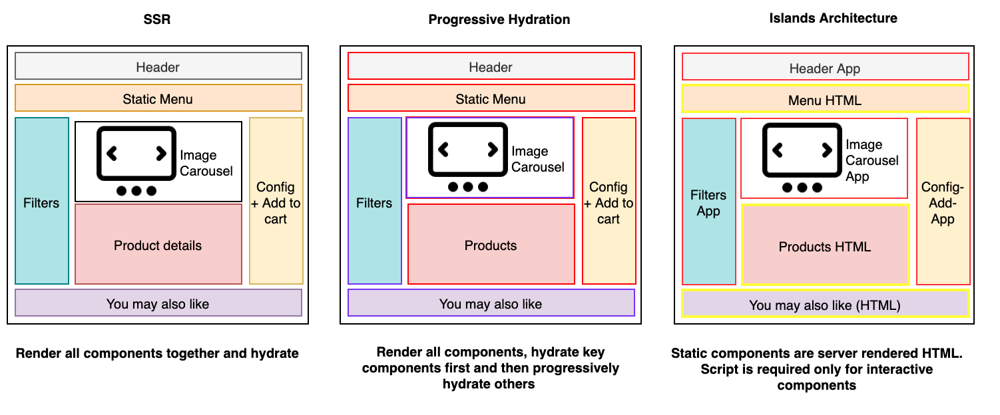

# 介绍

## 前言

本项目是对 [islands 架构](https://www.patterns.dev/posts/islands-architecture/) 的一个实现

仓库地址：[plasticine-islands](https://github.com/Plasticine-Yang/plasticine-islands)

## islands 架构是什么？

islands 架构支持在 SSR 场景下进行局部 [hydration](/react-learning/react-basic/rendering/understanding-hydration/)

传统的 SSR 渲染一个应用时，会进行全量渲染，也就是 **生成整个页面的 html 字符串 + 整个页面的 hydration**

而在 islands 架构下，可以按照是否需要进行 hydration 将应用拆分成多个部分，也就是说这些部分包括：

- 需要 hydrate 的部分
- 纯静态部分

对于纯静态部分，直接在服务端生成 html 后返回即可，不需要进行 hydrate，而对于那些需要 hydrate 的部分，可以局部 hydrate，不需要像传统 SSR 那样全量 hydrate

这有别于渐进增强式地渲染，渐进增强渲染是 **生成整个页面的 html 字符串 + 先 hydrate 重要部分，再逐渐 hydrate 其他部分**

下面这个图很好地对比了三种渲染方式的区别：



## 实现 islands 架构需要做哪些事？

1. 在服务端需要支持零 JavaScript 完成页面的静态渲染
2. 支持在静态内容通过 `placeholders` 嵌入独立的动态组件，每个动态组件都包含用于 hydrate 它自己的运行时代码，这些运行时代码最好是能够在 `requestIdleCallback` 这样的空闲时执行

   就像这样：

   ```tsx
   <Foo __island />
   ```

   通过类似的方式将组件标记为动态组件，为它添加自己的 hydrate 运行时代码

3. 支持同构渲染

其实和 SSR 的能力很像，主要区别点就在于能够将应用按照组件划分为静态部分和支持自行 hydration 的部分

## 开发流程规划

本项目的开发流程如下：

1. MVP 版本开发：在这个版本中主要实现传统的 SSR 同构渲染架构，为后续实现 islands 架构做铺垫
2. 配置文件解析：会使用 [unconfig](https://github.com/antfu/unconfig) 实现
3. 约定式路由：以 vite 插件的方式为我们的框架实现约定式路由特性
4. MDX 工具链集成：这块是框架的使用频率最高的部分 -- 支持解析 markdown, mdx 文件为 html 页面，并且会做一些 UI 上的抽象，使得能够像 [vitepress](https://vitepress.vuejs.org/) 那样通过配置的方式快速生成文档站点的 UI
5. 主题 UI 的开发：基于 React 完成页面 UI 的开发
6. 实现 islands 架构：本项目的重点和亮点
7. 持续集成和部署：集成 CI/CD 能力，并发布 npm package

## 仓库管理方式

由于项目涉及到 CLI、主题包、Core、vite 插件、babel 插件等多个模块，因此会采用 monorepo 的方式进行管理

采用的 monorepo 方案为 [pnpm workspace](https://pnpm.io/workspaces)
