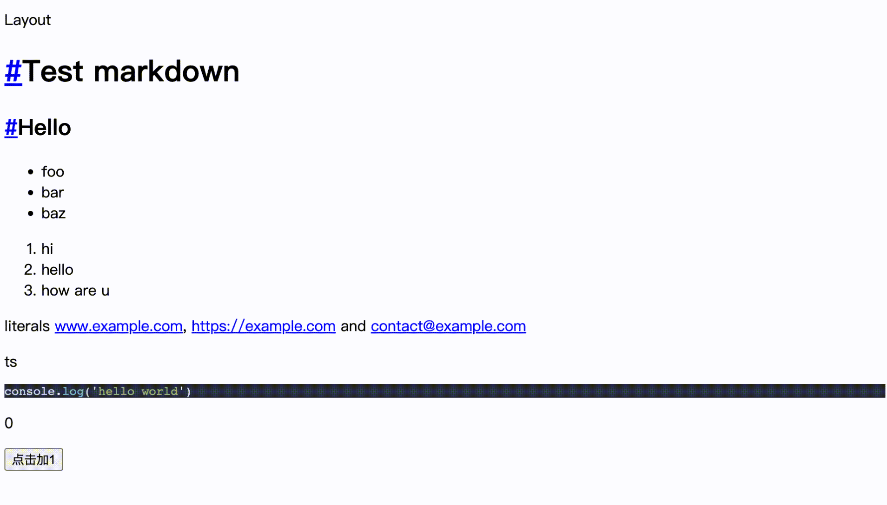
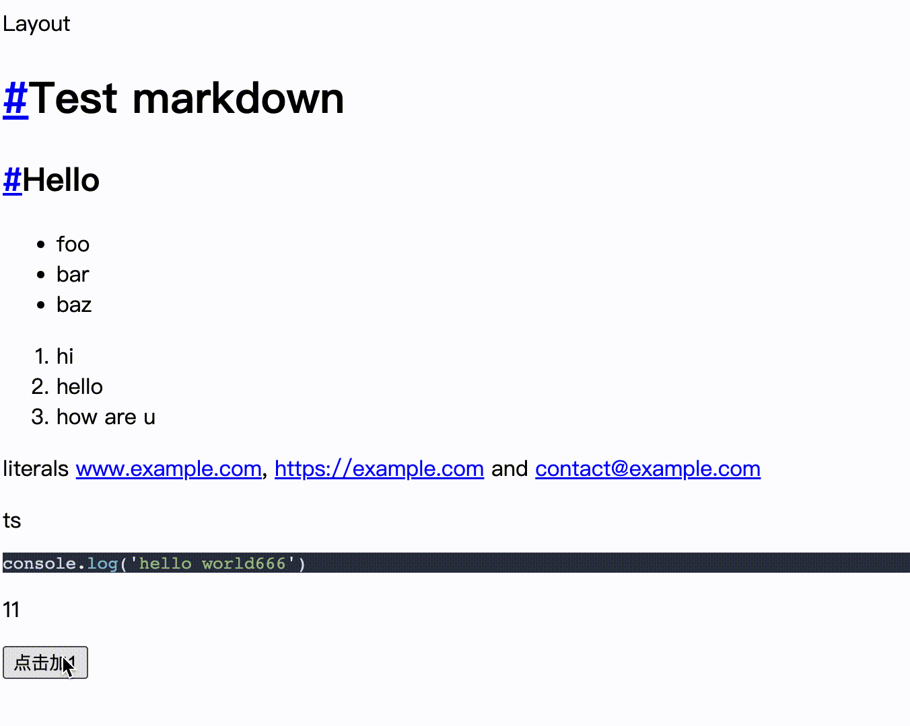

# 开发阶段 MDX 模块热更新

## 目前存在的问题

现在在 playground 中添加一个 mdx 文件，并在其中导入一个简单的 Counter 组件

:::code-group

```tsx [playground/components/Counter.tsx]
import { useState } from 'react'

export default function Counter() {
  const [count, setCount] = useState(0)
  return (
    <div>
      <p>{count}</p>
      <button onClick={() => setCount((count) => count + 1)}>点击加1</button>
    </div>
  )
}
```

```mdx [playground/docs/index.mdx]
import Counter from '../components/Counter.tsx'

# Hello

<Counter />
```

:::

运行这个 Demo 会发现存在以下两个问题：

1. 热更新的模块边界不正确


可以看到，更新的是 `index.mdx` 文件，但 Vite 感知到热更新的文件却是框架内部的 tsx 文件

2. 热更新组件状态丢失



这里改动 `index.mdx` 文件后，Counter 组件的状态并没有保留下来

## 分析原因

要分析这个问题，就要明白 Vite 是如何处理 React 组件的热更新的，因为在 mdx 中使用了 React 组件

Vite 中我们通过 `@vitejs-plugin/react` 这个插件来处理 jsx 和 tsx 文件的，看看对纯 tsx 文件的编译结果是怎样的

从浏览器的开发者工具的网络面板中找到 `Counter.tsx` 的编译结果，其最后添加了这样一段代码

```tsx
if (import.meta.hot) {
  window.$RefreshReg$ = prevRefreshReg
  window.$RefreshSig$ = prevRefreshSig
  import(
    /* @vite-ignore */
    __vite__injectQuery(import.meta.url, 'import')
  ).then((currentExports) => {
    RefreshRuntime.registerExportsForReactRefresh(
      '/Users/plasticine/code/projects/plasticine-islands/playground/components/Counter.tsx',
      currentExports,
    )
    import.meta.hot.accept((nextExports) => {
      if (!nextExports) return
      const invalidateMessage = RefreshRuntime.validateRefreshBoundaryAndEnqueueUpdate(currentExports, nextExports)
      if (invalidateMessage) import.meta.hot.invalidate(invalidateMessage)
    })
  })
}
```

这就是 Vite 为 tsx 编译结果注入的确认热更新边界相关的代码，有了它，Vite 就能正确感知热更新的边界，然而对于 mdx 的编译结果中并没有这段代码

为此，我们需要实现一个 Vite 插件去手动注入确认热更新边界的代码，核心只需要调用 `import.meta.hot.accept()` 即可，不需要像官方插件那样做一些额外处理

## Vite 插件 - 确定 mdx 模块的热更新边界

该插件依赖于 `@vitejs-plugin/react`，因为需要先调用它去处理 mdx 文件中的 tsx，可以通过在 `configResolved` 钩子中获取

由于涉及到对代码的转换，所以这个插件的核心功能会在 `transform` 钩子中实现，先调用 `@vitejs-plugin/react` 插件的 transform 对代码进行处理，再在转换后的代码的最后拼接 `import.meta.hot.accept()` 的调用即可

最终插件代码如下：

```ts
import type { Plugin } from 'vite'
import assert from 'assert'

/** @description md or mdx regex */
const MD_REGEX = /.mdx?$/

/**
 * @description 用于支持 MDX 模块的 hmr
 *
 * Vite 底层处理 jsx/tsx 主要是通过 @vitejs/plugin-react 这个插件完成的，热更新则是依赖于 react-refresh
 * 在 jsx/tsx 的编译结果中插入 `import.meta.hot.accept` 的调用来识别热更新边界
 *
 * 然而 MDX 的编译结果中没有插入 `import.meta.hot.accept` 的调用，因此需要手动为 md, mdx 的编译结果加上热更新调用来告知 Vite 正确的
 * 热更新边界
 */
export default function vitePluginMdxHMR(): Plugin {
  let vitePluginReact: Plugin

  return {
    name: 'vite-plugin-mdx-hmr',
    apply: 'serve',
    configResolved(config) {
      vitePluginReact = config.plugins.find((plugin) => plugin.name === 'vite:react-babel') as Plugin
    },
    async transform(code, id, options) {
      // 为 md, mdx 的编译结果注入热更新相关代码，更新热更新边界
      if (MD_REGEX.test(id)) {
        const vitePluginReactTransform = vitePluginReact.transform
        assert(typeof vitePluginReactTransform === 'function', 'Vite 的 React Plugin 的 transform 方法不存在')

        const reactTransformResult = await vitePluginReactTransform.call(this, code, id + '?.jsx', options)
        const selfAcceptCode = 'import.meta.hot.accept();'

        if (typeof reactTransformResult === 'object' && !reactTransformResult?.code?.includes(selfAcceptCode)) {
          reactTransformResult!.code += selfAcceptCode
        }

        return reactTransformResult
      }
    },
  }
}
```

## 效果验证

将该插件整合到我们的框架后，现在的效果如下：




可以看到，最开始遇到的两个问题都解决了！
