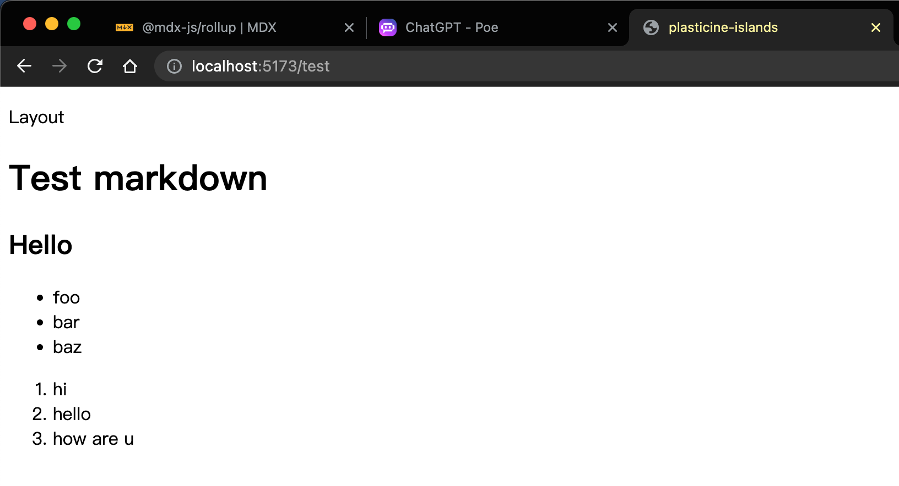
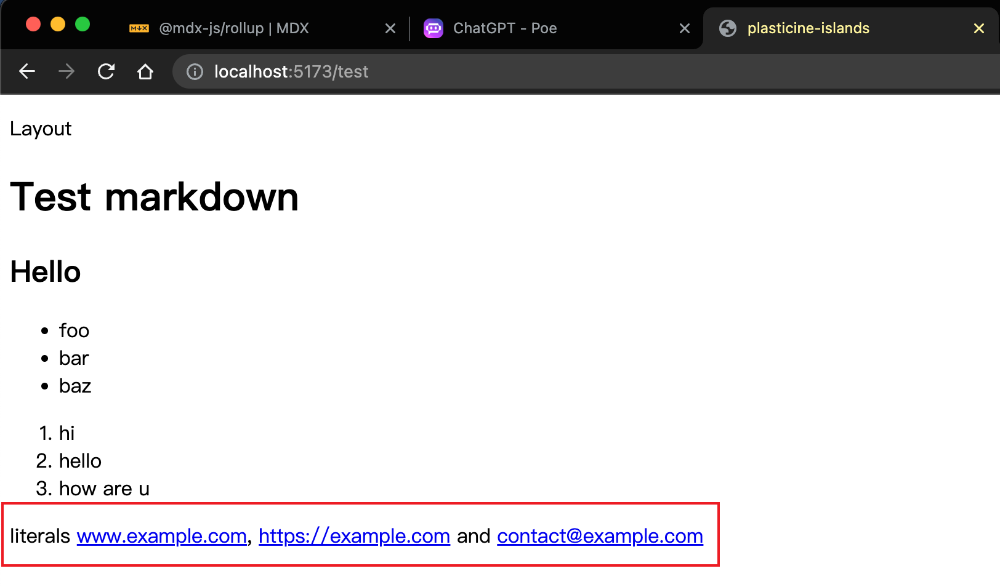
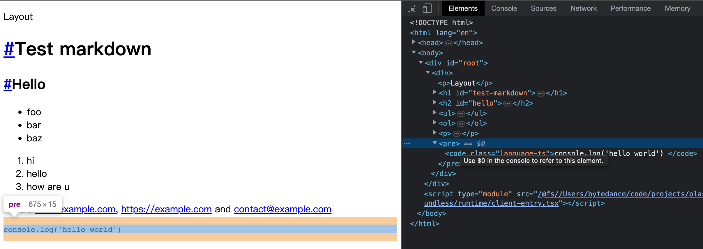
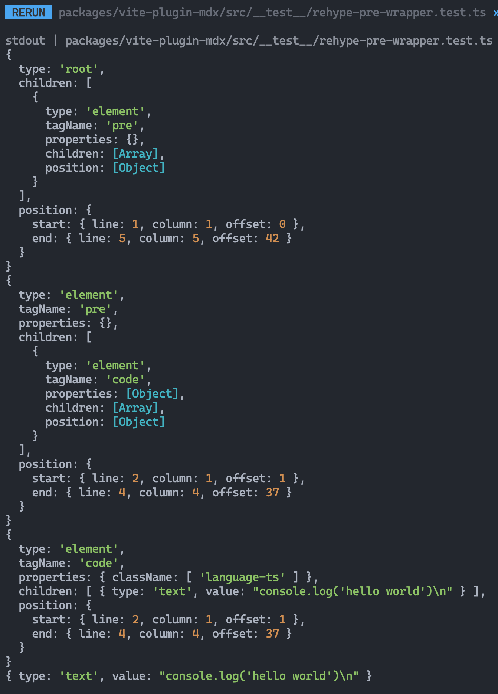
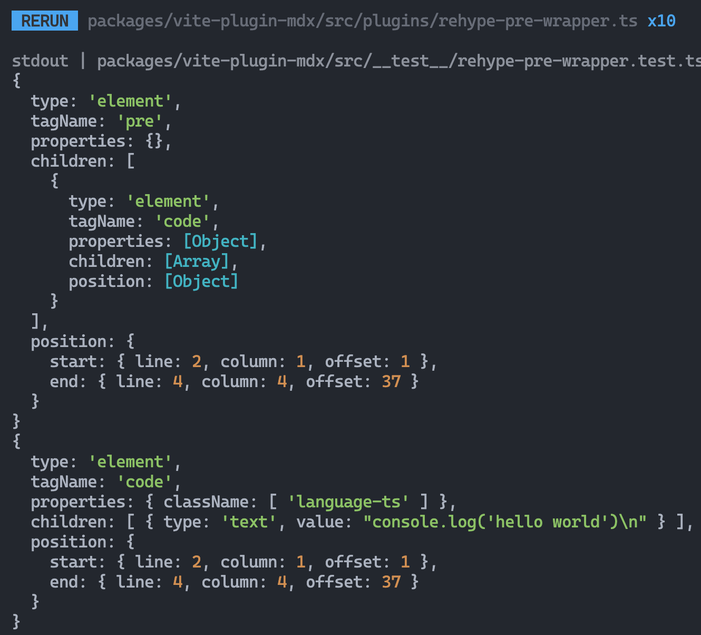
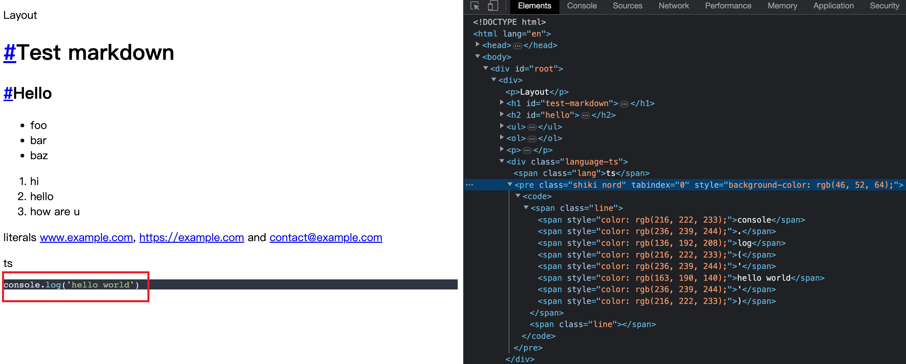

# 集成 MDX 解析能力

:::tip 本节代码分支地址
[https://github.com/Plasticine-Yang/plasticine-islands/tree/feat/mdx](https://github.com/Plasticine-Yang/plasticine-islands/tree/feat/mdx)
:::

## 前言

首先我们要了解一下一些前置知识：

- remark: remark 是一个 Markdown 处理器，它可以将 Markdown 格式的文本内容转换为抽象语法树（AST），然后通过插件系统对 AST 进行修改或操作，最终输出符合用户需求的格式。通过 remark，可以对 Markdown 文件进行语法高亮、代码块转换、表格转换、链接处理等操作。

- rehype: rehype 是一个 HTML 处理器，它可以将 HTML 格式的文本内容转换为抽象语法树（AST），然后通过插件系统对 AST 进行修改或操作，最终输出符合用户需求的格式。通过 rehype，可以对 HTML 文件进行语言转换、元素转换、属性转换、标准化处理等操作。

通常情况下，remark 与 rehype 结合使用，可以实现 Markdown 到 HTML 的完整转换过程。例如，可以使用 remark 将 Markdown 文件转换为 HTML，然后使用 rehype 对 HTML 进行进一步的修改和处理，例如添加样式、JavaScript、SEO 优化等操作。

这样一来我们就可以利用 remark 处理 markdown，集成各种处理 markdown 的 remark 插件，生成 AST 后转成 html，再丢给 rehype 去处理如样式等功能

为了更加方便地完成这件事情，又引出了一个 `remark-rehype` 库

remark-rehype 是一个基于 remark 和 rehype 的转换器，可以将 Markdown 格式的文本内容转换为 HTML 格式的文本内容。它的作用是将 remark 生成的 Markdown 抽象语法树（AST）转换为 rehype 可以处理的 HTML AST，从而生成最终的 HTML 输出。

remark-rehype 的作用类似于一个桥梁，它将 remark 和 rehype 连接起来，使得用户可以在 remark 中使用 Markdown 语法，然后通过 remark-rehype 将其转换为 rehype 可以处理的 HTML 语法，最终生成符合用户需求的 HTML 输出。

remark-rehype 通过插件的形式来扩展其功能，用户可以根据需要添加不同的插件来实现不同的转换操作。例如，可以使用 remark-gfm 插件来支持 GitHub Flavored Markdown 的语法，然后使用 rehype-highlight 插件来对代码块进行语法高亮，从而实现更好的 Markdown 到 HTML 的转换效果。

## 集成思路 & 待集成的功能

可以通过 vite 插件的方式集成 mdx 的解析能力，[@mdx-js/rollup](https://mdxjs.com/packages/rollup/) 这一 rollup 插件就提供了这样的能力，好在 vite 对 rollup 插件的兼容性很好，可以无缝使用

`@mdx-js/rollup` 中支持单独配置 remark 和 rehype 插件，为了方便管理，我们可以新建一个包来维护 mdx 相关的各种插件集成

集成的功能如下：

- [gfm](https://github.github.com/gfm/)：Github Flavored Markdown，是一种 markdown 规范
- 锚点跳转：对于 markdown 中的 `#`、`##` 等标题，处理成 html 后会自动加上锚点，方便点击进行跳转
- 代码块展示语言，就像下面这样，能在右侧看到代码块的语言

  ```ts
  console.log('hello world')
  ```

- 代码块语法高亮

## Vite 插件 - mdx

首先创建一个新的包 - `vite-plugin-mdx`

在入口文件写入如下内容，并集成到 core 包中：

:::code-group

```ts [packages/vite-plugin-mdx/src/index.ts]
import type { Plugin } from 'vite'
import rollupPluginMdx from '@mdx-js/rollup'

export default function vitePluginMdx(): Plugin {
  return rollupPluginMdx({
    remarkPlugins: [],
    rehypePlugins: [],
  })
}
```

```ts{7,42-43} [packages/core/src/helpers/resolve-vite-plugins.ts]
import vitePluginReact from '@vitejs/plugin-react'
import { PluginOption } from 'vite'

import type { ResolvedConfig, VitePluginPlasticineIslandsSiteConfigOptions } from '@plasticine-islands/types'
import vitePluginPlasticineIslandsConventionalBasedRouting from '@plasticine-islands/vite-plugin-conventional-based-routing'
import vitePluginDevServerHtml from '@plasticine-islands/vite-plugin-dev-server-html'
import vitePluginMdx from '@plasticine-islands/vite-plugin-mdx'
import vitePluginPlasticineIslandsSiteConfig from '@plasticine-islands/vite-plugin-plasticine-islands-site-config'

import { BUNDLESS_PATH, CLIENT_ENTRY_PATH, DEV_SERVER_HTML_PATH } from '../constants'

interface ResolveVitePluginsOptions {
  resolvedConfig: ResolvedConfig
  onDevServerRestart?: VitePluginPlasticineIslandsSiteConfigOptions['onDevServerRestart']
}

export function resolveVitePlugins(options: ResolveVitePluginsOptions): PluginOption[] {
  const { resolvedConfig, onDevServerRestart } = options
  const { root } = resolvedConfig

  return [
    // react
    vitePluginReact(),

    // dev server
    vitePluginDevServerHtml({
      htmlPath: DEV_SERVER_HTML_PATH,
      clintEntryPath: CLIENT_ENTRY_PATH,
      loadDefaultHtmlOnError: true,
      filesToWatch: [BUNDLESS_PATH],
    }),

    // 通过虚拟模块让前端应用使用配置文件中的 SiteConfig 数据
    vitePluginPlasticineIslandsSiteConfig({
      resolvedConfig,
      onDevServerRestart,
    }),

    // 约定式路由
    vitePluginPlasticineIslandsConventionalBasedRouting({ root }),

    // mdx
    vitePluginMdx(),
  ]
}
```

:::

然后来 playground 中验证一下，新建 `docs/test.md`

并写入如下内容：

```md
# Test markdown

## Hello

- foo
- bar
- baz

1. hi
2. hello
3. how are u
```

效果如下：



可以看到已经能够成功解析 md 文件了，接下来就一步步集成各种实用的 remark 和 rehype 插件吧

### gfm

gfm 是一个 markdown 规范，所以理所当然是属于 remark 的管辖范畴，因此需要先安装该 remark 插件

```shell
pnpm -C packages/vite-plugin-mdx i remark-gfm
```

然后集成到 remark 中

:::code-group

```ts [packages/vite-plugin-mdx/src/index.ts]
import type { Plugin } from 'vite'
import rollupPluginMdx from '@mdx-js/rollup'
import remarkPluginGFM from 'remark-gfm'

export default function vitePluginMdx(): Plugin {
  return rollupPluginMdx({
    remarkPlugins: [remarkPluginGFM],
    rehypePlugins: [],
  })
}
```

:::

接下来修改 playground 中刚刚新建的 `test.md`，输入一些链接，根据 gfm 的规范，会自动将链接解析成 a 标签

```md
# Test markdown

## Hello

- foo
- bar
- baz

1. hi
2. hello
3. how are u

literals www.example.com, https://example.com and contact@example.com // [!code ++]
```

效果如下：



### 锚点跳转

这个功能涉及到的都是对 html 的处理，因此和 rehype 有关，通过在 github 上搜索相关插件，可以找到下面两个插件搭配使用可以实现这个功能：

- [rehype-autolink-headings](https://github.com/rehypejs/rehype-autolink-headings)：用于为带有 id 的 `h1, h2` 等 headings 标签添加 a 标签链接，并且 href 会指向对应的 heading 标签上的 id

```html
<!-- 处理前 -->
<h1 id="some-id">Lorem ipsum</h1>
<h2>foo 😪</h2>

<!-- 处理后 -->
<h1 id="some-id">
  <a aria-hidden="true" tabindex="-1" href="#some-id"><span class="icon icon-link"></span></a>Lorem ipsum
</h1>
<h2>foo 😪</h2>
```

问题是经过 remark 处理得到的 ast 被 rehype 转成的 html 中，headings 标签是没有 id 属性的，因而无法生成锚点链接，那该怎么办呢？

这时候就需要另一个插件了

- [rehype-slug](https://github.com/rehypejs/rehype-slug)：用于为 headings 标签添加 id 属性

```html
<!-- 处理前 -->
<h1>Lorem ipsum</h1>
<h2>foo 😪</h2>
<h3>
  <div>
    <span> bar </span>
  </div>
</h3>

<!-- 处理后 -->
<h1 id="lorem-ipsum">Lorem ipsum</h1>
<h2 id="foo-">foo 😪</h2>
<h3 id="-------bar---">
  <div>
    <span> bar </span>
  </div>
</h3>
```

生成的 id 会根据标签的内容来决定

这两个插件搭配起来就能够实现锚点链接啦！

:::code-group

```ts [packages/vite-plugin-mdx/src/index.ts]
import rollupPluginMdx from '@mdx-js/rollup'
import rehypeAutolinkHeadings, { type Options as RehypeAutolinkHeadingsOptions } from 'rehype-autolink-headings'
import rehypeSlug from 'rehype-slug'
import remarkGfm from 'remark-gfm'
import type { Plugin } from 'vite'

export default function vitePluginMdx(): Plugin {
  return rollupPluginMdx({
    remarkPlugins: [
      // Github Flavored Markdown Spec: https://github.github.com/gfm/
      remarkGfm,
    ],
    rehypePlugins: [
      // 自动为 h1, h2 等 headings 标签生成 id，id 的值会根据标签的内容决定
      rehypeSlug,

      // 自动为带有 id 属性的 headings 标签添加锚点链接
      [
        rehypeAutolinkHeadings,
        {
          // 为 headings 标签注入额外的 class - 用于定制样式
          properties: {
            class: 'header-anchor',
          },
          content: {
            type: 'text',
            value: '#',
          },
        } as RehypeAutolinkHeadingsOptions,
      ],
    ],
  })
}
```

:::

### 代码块展示语言

我们先来看看目前使用代码块的话会被转成什么样的 html



```html
<pre>
  <code class="language-ts">console.log('hello world')</code>
</pre>
```

这种结构的 html 并不能展示代码块的语言，应当转成如下结构才行：

```html
<div class="language-ts">
  <span class="lang">js</span>
  <pre>
    <code class="language-ts">console.log('hello world')</code>
  </pre>
</div>
```

这样才方便我们后续去实现样式的时候进行布局，那么要如何完成这个转换呢？

由于这是一个对 html 的操作，因此适合通过 rehype 插件去拦截进行转换

#### rehype 插件转换代码块生成的 html 结构

如何开发 rehype 插件呢？可以到其 [官方文档](https://github.com/rehypejs/rehype) 中查看

根据官方文档的描述，我们需要安装下面几个包

```shell
pnpm -C packages/vite-plugin-mdx i unified unist-util-visit
pnpm -C packages/vite-plugin-mdx i @types/hast -D
```

- unified 用于提供插件的类型定义
- unist-util-visit 用于遍历 ast
- @types/hast 则用于提供 rehype 的 ast 节点的类型定义

我们可以先编写一个单元测试，看看目前遍历 rehype 的 ast 时是啥样的

:::code-group

```ts [packages/vite-plugin-mdx/src/__test__/rehype-pre-wrapper.test.ts]
import { unified } from 'unified'
import remarkParse from 'remark-parse'
import remarkRehype from 'remark-rehype'
import rehypeFormat from 'rehype-format'
import rehypeStringify from 'rehype-stringify'

import { rehypePreWrapper } from '../plugins'

describe('rehypePreWrapper', () => {
  test('happy path', () => {
    const processor = unified()
      .use(remarkParse)
      .use(remarkRehype)
      .use(rehypePreWrapper)
      .use(rehypeFormat)
      .use(rehypeStringify)
    const markdown = `
\`\`\`ts
console.log('hello world')
\`\`\`
    `
    const res = processor.processSync(markdown)
    expect(res.value).toMatchInlineSnapshot(`
      "
      <pre><code class=\\"language-ts\\">console.log('hello world')
      </code></pre>
      "
    `)
  })
})
```

````ts [packages/vite-plugin-mdx/src/plugins/rehype-pre-wrapper.ts]
import type { Plugin } from 'unified'
import type { Root } from 'hast'
import { visit } from 'unist-util-visit'

/**
 * 为 markdown 代码块转换成的 html 中的 pre 标签进行修改
 *
 * @example
 *
 * before:
 *
 * ```html
 * <pre>
 *   <code class="language-ts">console.log('hello world')</code>
 * </pre>
 * ```
 *
 * after:
 *
 * ```html
 * <div class="language-ts">
 *   <span class="lang">js</span>
 *   <pre>
 *     <code class="language-ts">console.log('hello world')</code>
 *   </pre>
 * </div>
 * ```
 */
export const rehypePreWrapper: Plugin<[], Root> = () => {
  return (tree) => {
    visit(tree, (node) => {
      // 1. 找到 pre 元素节点
      // 2. 解析出代码块的语言类型
      // 3. 修改 pre 元素节点的结构
      console.log(node)
    })
  }
}
````

:::

输出如下：



我们的目标就是要找到 type 为 `element` 且 `tagName` 为 `pre`，并且第一个子节点 type 为 `element`，`tagName` 为 `code`，然后对其进行修改即可

如何遍历所有的 type 为 `element` 的节点呢？`visit` 函数的第二个参数就可以做到这一点

```ts
visit(tree, 'element', (node) => {
  console.log(node)
})
```



最终可以写出如下代码：

````ts
import type { Element, Root } from 'hast'
import type { Plugin } from 'unified'
import { visit } from 'unist-util-visit'

/**
 * 为 markdown 代码块转换成的 html 中的 pre 标签进行修改
 *
 * @example
 *
 * before:
 *
 * ```html
 * <pre>
 *   <code class="language-ts">console.log('hello world')</code>
 * </pre>
 * ```
 *
 * after:
 *
 * ```html
 * <div class="language-ts">
 *   <span class="lang">js</span>
 *   <pre>
 *     <code class="language-ts">console.log('hello world')</code>
 *   </pre>
 * </div>
 * ```
 */
export const rehypePreWrapper: Plugin<[], Root> = () => {
  return (tree) => {
    visit(tree, 'element', (node) => {
      // 1. 找到 pre 元素节点
      if (isCodeElement(node) && !node.data?.visited) {
        // 2. 解析出代码块的语言类型
        const codeElement = node.children.at(0) as Element
        const codeElementClassName = codeElement.properties?.className?.toString() || ''
        const codeLanguageType = codeElementClassName.split('-').at(1) || ''

        // 3. 修改 pre 元素节点的结构 - 先拷贝一个 node 出来，再对 node 进行修改
        const clonedNode: Element = {
          type: 'element',
          tagName: 'pre',
          children: node.children,
          data: {
            // 避免重复遍历相同的 pre 元素节点导致递归无法终止
            visited: true,
          },
        }

        node.tagName = 'div'
        node.properties = node.properties || {}
        codeElementClassName && (node.properties.className = codeElementClassName)
        node.children = [
          {
            type: 'element',
            tagName: 'span',
            properties: {
              className: 'lang',
            },
            children: codeLanguageType
              ? [
                  {
                    type: 'text',
                    value: codeLanguageType,
                  },
                ]
              : [],
          },
          clonedNode,
        ]
      }
    })
  }
}

/** @description 判断元素节点是否是 markdown 代码块转换而来的 html ast 节点 */
function isCodeElement(element: Element) {
  const firstChild = element.children.at(0)
  return element.tagName === 'pre' && firstChild?.type === 'element' && firstChild.tagName === 'code'
}
````

效果如下：

```ts{17-19}
describe('rehypePreWrapper', () => {
  test('should wrap the `pre` element', () => {
    const processor = unified()
      .use(remarkParse)
      .use(remarkRehype)
      .use(rehypePreWrapper)
      .use(rehypeFormat)
      .use(rehypeStringify)
    const markdown = `
\`\`\`ts
console.log('hello world')
\`\`\`
    `
    const res = processor.processSync(markdown)
    expect(res.value).toMatchInlineSnapshot(`
      "
      <div class=\\"language-ts\\"><span class=\\"lang\\">ts</span>
        <pre><code class=\\"language-ts\\">console.log('hello world')</code></pre>
      </div>
      "
    `)
  })
})
```

最终应用到框架中的效果如下：


### 代码块语法高亮

目前的代码块渲染效果是上图那样的，并没有语法高亮，看起来很不美观，接下来我们就通过 [shiki](https://github.com/shikijs/shiki) 来实现代码块语法高亮的效果

#### 体验 shiki

先通过一个单测来简单地体验一下 shiki 的功能

:::code-group

```ts [packages/vite-plugin-mdx/src/__test__/rehype-shiki.test.ts]
import shiki from 'shiki'

describe('rehypeShiki', () => {
  test('shiki demo', async () => {
    const highlighter = await shiki.getHighlighter({
      theme: 'nord',
    })

    const html = highlighter.codeToHtml("console.log('hello world')", { lang: 'js' })

    expect(html).toMatchInlineSnapshot(
      '"<pre class=\\"shiki nord\\" style=\\"background-color: #2e3440ff\\" tabindex=\\"0\\"><code><span class=\\"line\\"><span style=\\"color: #D8DEE9\\">console</span><span style=\\"color: #ECEFF4\\">.</span><span style=\\"color: #88C0D0\\">log</span><span style=\\"color: #D8DEE9FF\\">(</span><span style=\\"color: #ECEFF4\\">&#39;</span><span style=\\"color: #A3BE8C\\">hello world</span><span style=\\"color: #ECEFF4\\">&#39;</span><span style=\\"color: #D8DEE9FF\\">)</span></span></code></pre>"',
    )
  })
})
```

:::

#### rehype 插件实现代码块语法高亮

我们可以将 highlighter 作为参数，这样就能将代码高亮的自定义能力交给外部决定，插件内部只关注 highlighter 的代码转换能力

:::code-group

```ts [packages/vite-plugin-mdx/src/plugins/rehype-shiki.ts]
import type { Element, Root } from 'hast'
import type { Highlighter } from 'shiki'
import type { Plugin } from 'unified'
import { visit } from 'unist-util-visit'
import { fromHtml } from 'hast-util-from-html'

import { isCodeElement, parseCodeElement } from './shared'

interface RehypeShikiOptions {
  shikiHighlighter: Highlighter
}

export const rehypeShiki: Plugin<[RehypeShikiOptions], Root> = (options) => {
  const { shikiHighlighter } = options

  return (tree) => {
    visit(tree, 'element', (node, index, parent) => {
      if (index !== null && isCodeElement(node)) {
        const codeElement = node.children.at(0) as Element
        const { codeContent, codeLanguageType } = parseCodeElement(codeElement)

        if (codeLanguageType) {
          const highlightedCode = shikiHighlighter.codeToHtml(codeContent, { lang: codeLanguageType })
          // 将 shiki 生成的 html 转成 hast 替换当前 node
          const fragmentHast = fromHtml(highlightedCode, { fragment: true })
          parent?.children.splice(index, 1, ...fragmentHast.children)
        }
      }
    })
  }
}
```

````ts [packages/vite-plugin-mdx/src/plugins/shared.ts]
import type { Element, Text } from 'hast'

/** @description 判断元素节点是否是 markdown 代码块转换而来的 html ast 节点 */
export function isCodeElement(element: Element) {
  const firstChild = element.children.at(0)
  return element.tagName === 'pre' && firstChild?.type === 'element' && firstChild.tagName === 'code'
}

/**
 * @description 解析出代码块 html 元素的 className、代码内容、代码语言类型
 *
 * @example
 *
 * ```html
 * <code class="language-ts">console.log('hello world')</code>
 * ```
 */
export function parseCodeElement(codeElement: Element) {
  const codeContent = (codeElement.children.at(0) as Text).value
  const codeElementClassName = codeElement.properties?.className?.toString()
  const codeLanguageType = codeElementClassName?.split('-').at(1)

  return {
    codeElementClassName,
    codeContent,
    codeLanguageType,
  }
}
````

:::

最后效果如下：

:::code-group

```ts [packages/vite-plugin-mdx/src/__test__/rehype-shiki.test.ts]
import rehypeFormat from 'rehype-format'
import rehypeStringify from 'rehype-stringify'
import remarkParse from 'remark-parse'
import remarkRehype from 'remark-rehype'
import shiki from 'shiki'
import { unified } from 'unified'

import { rehypeShiki } from '../plugins'

describe('rehypeShiki', () => {
  test('shiki demo', async () => {
    const highlighter = await shiki.getHighlighter({
      theme: 'nord',
    })

    const html = highlighter.codeToHtml("console.log('hello world')", { lang: 'js' })

    expect(html).toMatchInlineSnapshot(
      '"<pre class=\\"shiki nord\\" style=\\"background-color: #2e3440ff\\" tabindex=\\"0\\"><code><span class=\\"line\\"><span style=\\"color: #D8DEE9\\">console</span><span style=\\"color: #ECEFF4\\">.</span><span style=\\"color: #88C0D0\\">log</span><span style=\\"color: #D8DEE9FF\\">(</span><span style=\\"color: #ECEFF4\\">&#39;</span><span style=\\"color: #A3BE8C\\">hello world</span><span style=\\"color: #ECEFF4\\">&#39;</span><span style=\\"color: #D8DEE9FF\\">)</span></span></code></pre>"',
    )
  })

  test('should highlight the code', async () => {
    const shikiHighlighter = await shiki.getHighlighter({
      theme: 'nord',
    })
    const processor = unified()
      .use(remarkParse)
      .use(remarkRehype)
      .use(rehypeShiki, { shikiHighlighter })
      .use(rehypeFormat)
      .use(rehypeStringify)
    const markdown = `
\`\`\`ts
console.log('hello world')
\`\`\`
    `

    const res = processor.processSync(markdown)
    expect(res.value).toMatchInlineSnapshot(`
      "
      <pre class=\\"shiki nord\\" style=\\"background-color: #2e3440ff\\" tabindex=\\"0\\"><code><span class=\\"line\\"><span style=\\"color: #D8DEE9\\">console</span><span style=\\"color: #ECEFF4\\">.</span><span style=\\"color: #88C0D0\\">log</span><span style=\\"color: #D8DEE9FF\\">(</span><span style=\\"color: #ECEFF4\\">'</span><span style=\\"color: #A3BE8C\\">hello world</span><span style=\\"color: #ECEFF4\\">'</span><span style=\\"color: #D8DEE9FF\\">)</span></span>
      <span class=\\"line\\"></span></code></pre>
      "
    `)
  })
})
```

:::

最后整合到 Vite 插件中即可

:::code-group

```ts{29-35} [packages/vite-plugin-mdx/src/index.ts]
export default async function vitePluginMdx(): Promise<Plugin> {
  return rollupPluginMdx({
    remarkPlugins: [
      // Github Flavored Markdown Spec: https://github.github.com/gfm/
      remarkGfm,
    ],
    rehypePlugins: [
      // 自动为 h1, h2 等 headings 标签生成 id，id 的值会根据标签的内容决定
      rehypeSlug,

      // 自动为带有 id 属性的 headings 标签添加锚点链接
      [
        rehypeAutolinkHeadings,
        {
          // 为 headings 标签注入额外的 class - 用于定制样式
          properties: {
            class: 'header-anchor',
          },
          content: {
            type: 'text',
            value: '#',
          },
        } as RehypeAutolinkHeadingsOptions,
      ],

      // 将 markdown 代码块转换成的 html pre 元素节点 wrap 到 div 里，并带上代码块对应的语言
      rehypePreWrapper,

      // 代码块语法高亮
      [
        rehypeShiki,
        {
          shikiHighlighter: await getShikiHighlighter(),
        } as RehypeShikiOptions,
      ],
    ],
  })
}
```

:::

最终效果如下



:::tip 本节代码分支地址
[https://github.com/Plasticine-Yang/plasticine-islands/tree/feat/mdx](https://github.com/Plasticine-Yang/plasticine-islands/tree/feat/mdx)
:::
