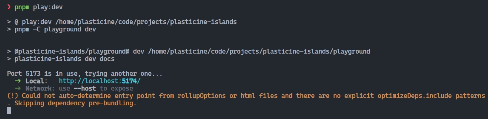
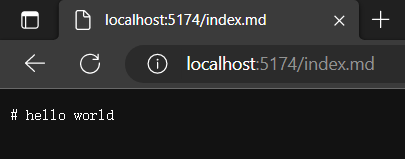

# MVP 版本开发

## 前言

在 MVP 版本中，我们需要完成以下几件事：

- 基本 CLI 命令：包括 dev 和 build
- 搭建 vite 开发环境服务器
- 支持 React 组件的渲染
- 实现传统 SSR 渲染流程

## 项目创建

这里我会使用我自己的一套 [node-monorepo 项目模板](https://github.com/Plasticine-Yang/templates/tree/main/node-monorepo)

```shell
npx degit Plasticine-Yang/templates/node-monorepo plasticine-islands
```

这套模板集成了前端工程化必备的一些基本工具，如：

- vitest
- typescript
- unbuild
- eslint
- prettier
- husky
- commitlint
- lint-staged
- cz-git
- changesets

它能够很方便地让我们进行 node 库的开发，并且是基于 pnpm workspace monorepo 方案的，开箱即用，对于打包构建也是十分方便，以创建一个 cli 包为例：

在 `packages` 目录中创建一个 `cli` 目录，并写入如下内容到 `package.json` 中

```json
{
  "name": "@plasticine-islands/cli",
  "version": "0.0.0",
  "author": "Plasticine-Yang",
  "description": "cli of @plasticine-islands",
  "type": "module",
  "license": "MIT",
  "main": "./dist/index.cjs",
  "module": "./dist/index.mjs",
  "types": "./dist/index.d.ts",
  "exports": {
    ".": {
      "require": "./dist/index.cjs",
      "import": "./dist/index.mjs",
      "types": "./dist/index.d.ts"
    }
  },
  "keywords": ["islands", "islands architecture", "ssg", "plasticine-islands", "cli"],
  "scripts": {
    "build": "unbuild",
    "stub": "unbuild --stub"
  }
}
```

配置好 `main`, `module`, `types`, `exports` 等包入口声明，`unbuild` 就能够自动检测并打包出对应产物，无需任何配置，十分舒服！

:::tip
这里的 `stub` 命令是 `unbuild` 的一个特性，大致就是免去了传统的那种启动一个监听进程去监听文件变化然后重新编译产物，它完全不需要启动一个额外的监听进程，文件变更立马就能得到最新的结果，具体原理可以查看 [官方文档](https://github.com/unjs/unbuild#-passive-watcher) 的介绍
:::

在仓库根目录的 `package.json` 中写入如下 script 脚本：

```json
{
  "scripts": {
    "build:cli": "pnpm -C packages/cli build",
    "stub:cli": "pnpm -C packages/cli stub"
  }
}
```

pnpm 的 `-C` 参数是让命令执行时的工作目录指向 `-C` 参数的目录，这样就能很方便地执行各个子包的命令，不需要手动切换到具体目录再执行命令

:::tip
也可以使用 `pnpm --filter @plasticine-islands/cli build` 的方式实现同等效果，但是这种方式需要输入完整的包名

个人更倾向于使用 `-C` 参数，可以避免输入完整包名的心智负担，因为有时候可能想不起来包名是啥，然后就得看看自己目前写的项目是啥，知道包名后再拼接上子包名才行

而 `-C` 的话直接无脑输入 `packages` 作为前缀，再跟上子包名即可
:::

## CLI 应用开发

在 MVP 版本中，我们主要实现两个命令 -- `dev` 和 `build`，具体的命令执行依赖于 `core` 包，先把 CLI 实现以下，之后实现 `core` 的时候再集成进来即可

### 安装核心依赖

CLI 的实现依赖于 [cac](https://github.com/cacjs/cac)，它能够很方便地帮助我们实现一个 CLI 应用，先来安装它叭~

```shell
pnpm -C packages/cli i cac
```

### 基本实现

目前的简易实现如下：

```ts
import cac from 'cac'

import pkg from '../package.json'

const cli = cac('plasticine-islands')

// build 命令
cli.command('build [root]', '构建产物').action((root?: string) => {
  console.log(`build ${root}`)
})

// dev 命令
cli.command('dev [root]', '启动开发环境服务器').action((root?: string) => {
  console.log(`dev ${root}`)
})

// 支持 `--help` 和 `-h` 显示帮助信息
cli.help()

// 支持 `--version` 和 `-v` 显示版本信息
cli.version(pkg.version)

cli.parse()
```

具体的 action 等之后实现 `core` 包的时候再来集成，接下来我们要试试能否将这个 cli 应用跑起来

### 将 cli 应用跑起来

将 cli 应用跑起来有很多方式：

- 使用 `tsx` 这个工具直接执行 ts 文件，`tsx` 类似于 `ts-node`，但是比 `ts-node` 好用很多，无需关心 cjs 和 esm 的兼容问题，并且执行速度快很多
- 运行构建产物
- 运行 stub 模式的产物
- 以命令的方式运行

四种方式都会讲解一下如何实现

#### 使用 tsx 跑 cli

如果你使用了我的 `node-monorepo` 模板的话，已经默认集成了 `tsx` 这个工具，直接在 cli 这个包的 `package.json` 中添加如下命令：

```json
{
  "scripts": {
    "start": "tsx src/index.ts"
  }
}
```

然后在项目根目录的 `package.json` 中添加如下命令：

```json
{
  "scripts": {
    "start:cli": "pnpm -C packages/cli start"
  }
}
```

这样就能在项目根目录直接以 `pnpm start:cli` 的方式去运行 cli 应用了


#### 运行构建产物

也可以先运行 `pnpm build:cli` 构建产物，然后执行 `node packages/cli/dist/index.mjs` 的方式去跑，但是这种方式太繁琐，每次更新代码都要手动构建，再执行 node 命令，不太推荐


#### 运行 stub 模式的产物

stub 模式相比于普通的构建方式，只需要运行以此，之后代码更新后都无需手动去构建产物，并且不需要启动监听进程去动态构建即可得到最新的产物

运行 `pnpm stub:cli`，再执行 `node packages/cli/dist/index.mjs` 即可


#### 以命令的方式运行

这种方式需要为 cli 子包声明 `bin` 入口，指向打包产物，这样就能以 `npx plasticine-islands` 这样的方式去运行 cli 应用

修改 cli 包中的 `package.json`，添加 `bin` 入口：

```json
{
  "bin": {
    "plasticine-islands": "./bin/plasticine-islands.js"
  }
}
```

接下来创建 `packages/cli/bin/plasticine-islands.js`，在这里面导入构建的产物：

```js
#!/usr/bin/env node
import '../dist/index.mjs'
```

接下来将 `@plasticine-islands/cli` 这个包安装到项目根目录中，这样就可以以 `npx plasticine-islands` 或 `pnpm plasticine-islands` 的方式去跑我们的 cli 命令了，配合 stub 模式的话体验会更好

```shell
# 将 @plasticine-islands/cli 安装到项目根目录
pnpm i @plasticine-islands/cli -w
```


至此我们的 mvp 版本中的 cli 应用就算实现完毕啦，可以到 [feat/mvp-cli](https://github.com/Plasticine-Yang/plasticine-islands/tree/feat/mvp-cli) 分支查看代码

## 单独管理类型代码

为了方便不同包之使用彼此的类型，我认为单独创建一个 `types` 包去管理各个包中用到的类型更加合适，因此在 packages 中添加一个新的包

其 `package.json` 如下：

```json
{
  "name": "@plasticine-islands/types",
  "version": "0.0.0",
  "author": "Plasticine-Yang",
  "description": "types of @plasticine-islands",
  "type": "module",
  "license": "MIT",
  "main": "./src/index.ts",
  "module": "./src/index.ts",
  "types": "./src/index.ts",
  "exports": {
    ".": {
      "require": "./src/index.ts",
      "import": "./src/index.ts",
      "types": "./src/index.ts"
    }
  },
  "keywords": ["islands", "islands architecture", "ssg", "plasticine-islands", "types"]
}
```

在 `main`, `module` 等字段中直接导出的是 ts 文件，因为它并不会打包到产物中，只是作为开发时供不同包引用的一个类型包而已

### tsconfig.json 配置包别名

并且在 `tsconfig.json` 中配置各包的引用：

```json{3,17-19}
{
  "compilerOptions": {
    "baseUrl": ".",
    "module": "ESNext",
    "target": "ESNext",
    "lib": ["ESNext"],
    "strict": true,
    "esModuleInterop": true,
    "skipLibCheck": true,
    "moduleResolution": "node",
    "resolveJsonModule": true,
    "noUnusedLocals": true,
    "strictNullChecks": true,
    "allowJs": true,
    "forceConsistentCasingInFileNames": true,
    "types": ["vitest/globals"],
    "paths": {
      "@plasticine-islands/*": ["./packages/*/src"]
    }
  },
  "include": ["packages/**/*.ts"],
  "exclude": ["node_modules"]
}
```

这是为了让 ts 知道当我们在代码中导入 `@plasticine-islands` 命名空间下的包时去哪里寻找代码，这时候你可能就会问了，打包的时候咋办？ts 的这个 paths 在打包时并不会进行替换的

但是别忘了，我们的打包工具使用的是 unbuild，它会自动将 `dependencies` 排除到产物中的，因此只要我们确保使用到的包都作为依赖安装了的话就不用担心打包构建的问题

### 重构 cli 包

为了体验一下这个效果，接下来对前面实现的 cli 包进行一个小重构，目的是将 actions 放到单独的目录中管理，这就需要我们提取 actions 的类型，前面说了，类型统一放到 types 包中管理了，因此 cli 只需导入 types 包提供的类型即可

首先安装 `@plasticine-islands/types` 作为依赖

```shell
pnpm -C packages/cli i "@plasticine-islands/types@*" -D
```

接下来创建 `packages/types/src/cli/index.ts`，将刚刚在 cli 包中实现的两个 action 的类型提取出来放到这里面

```ts
/** @description dev 命令的 action */
export type ActionDevFunc = (root?: string) => void

/** @description build 命令的 action */
export type ActionBuildFunc = (root?: string) => void
```

然后再在 `packages/types/src/index.ts` 中统一导出

```ts
export * from './cli'
```

现在就可以在 cli 包中使用了，创建 `packages/cli/src/actions/dev.ts` 和 `packages/cli/src/actions/build.ts`

::: code-group

```ts [src/actions/dev.ts]
import type { ActionDevFunc } from '@plasticine-islands/types'

export const actionDev: ActionDevFunc = (root) => {
  console.log(`dev ${root}`)
}
```

```ts [src/actions/build.ts]
import type { ActionBuildFunc } from '@plasticine-islands/types'

export const actionBuild: ActionBuildFunc = (root) => {
  console.log(`build ${root}`)
}
```

```ts [src/actions/index.ts]
export * from './dev'
export * from './build'
```

:::

最后再更新一下 `packages/cli/src/index.ts` 中的代码

```ts{4,9,12}
import cac from 'cac'

import pkg from '../package.json'
import { actionBuild, actionDev } from './actions'

const cli = cac('plasticine-islands')

// build 命令
cli.command('build [root]', '构建产物').action(actionBuild)

// dev 命令
cli.command('dev [root]', '启动开发环境服务器').action(actionDev)

// 支持 `--help` 和 `-h` 显示帮助信息
cli.help()

// 支持 `--version` 和 `-v` 显示版本信息
cli.version(pkg.version)

cli.parse()
```

这样设计的好处在于：

- 如果有别的包需要使用 cli 包的类型，直接到 types 包中统一导入
- 包与包的类型之间有依赖的话可以统一在 types 包中实现，不需要由具体包去操心，利于关注点分离

## 搭建 vite 开发环境服务器

现在我们就为第一个 CLI 命令 -- `dev` 进行实现，它会启动一个 vite 开发环境服务器，这个将会放到 `core` 包中实现

```ts
import { createServer as createViteServer } from 'vite'

import type { CreateDevServerOptions } from '@plasticine-islands/types'

const defaultCreateDevServerOptions: CreateDevServerOptions = {
  root: process.cwd(),
}

export function createDevServer(options: CreateDevServerOptions = defaultCreateDevServerOptions) {
  const { root } = options

  return createViteServer({
    root,
  })
}
```

对应的类型在 `packages/types/src/core/dev-server/index.ts` 中

```ts
/** @description 创建开发环境服务器所需参数 */
export interface CreateDevServerOptions {
  root?: string
}
```

### 集成 core 到 cli 包中

在 actionDev 中会调用 core 包提供的 `createDevServer`，也就是说 cli 包依赖于 core 包，因此先安装一下：

```shell
pnpm -C packages/cli i "@plasticine-islands/core@*"
```

然后修改 devAction 的实现如下：

```ts
import { resolve } from 'path'

import { createDevServer } from '@plasticine-islands/core'
import type { ActionDevFunc } from '@plasticine-islands/types'

/** @inheritdoc */
export const actionDev: ActionDevFunc = async (root) => {
  /** @description 需要将相对路径 root 解析成绝对路径，默认使用命令执行时的路径作为 root */
  const parsedRoot = root !== undefined ? resolve(root) : process.cwd()

  const server = await createDevServer({ root: parsedRoot })
  await server.listen()

  server.printUrls()
}
```

就是简单启动一个 vite 的开发环境服务器，接下来我们验证一下它的效果，要如何验证呢？

### 创建 playground 包体验效果

为了方便模拟实际使用的效果，我会创建一个 playground 包进行单独体验

在项目根目录下创建 `playground/packages.json`

```json
{
  "name": "@plasticine-islands/playground",
  "private": true,
  "author": "Plasticine-Yang",
  "description": "core of @plasticine-islands",
  "type": "module",
  "license": "MIT",
  "scripts": {
    "dev": "plasticine-islands dev docs",
    "build": "plasticine-islands build docs"
  },
  "dependencies": {
    "@plasticine-islands/cli": "workspace:*"
  }
}
```

由于该包不在 `packages` 目录中，所以我们还需要修改一下 `pnpm-workspace.yaml`

```yaml
packages:
  - 'packages/*'
  - 'playground'
```

再执行 `pnpm i` 安装一下依赖，然后修改根目录的 `package.json`，添加 `play:dev` 和 `play:build` scripts

```json
{
  "scripts": {
    "play:dev": "pnpm -C playground dev",
    "play:build": "pnpm -C playground build"
  }
}
```

接下来在 `playground` 中创建一个 `docs` 目录，并添加一个 `index.md` 文件，写入如下内容：

```md
# hello world
```

在项目根目录执行 `pnpm play:dev docs` 查看效果：





可以看到，成功啦！

## 支持 React 组件的渲染

要支持 React 组件的渲染，首先我们得提供一个带有容器节点的入口 html，将 React 组件渲染到容器节点中

入口 html 内容如下：

```html
<!DOCTYPE html>
<html lang="en">
  <head>
    <meta charset="UTF-8" />
    <meta http-equiv="X-UA-Compatible" content="IE=edge" />
    <meta name="viewport" content="width=device-width, initial-scale=1.0" />
    <title>plasticine-islands</title>
  </head>
  <body>
    <div id="root"></div>
  </body>
</html>
```

首先遇到的问题就是，如何让 vite 的开发环境服务器支持渲染这个 html 呢？

### Vite 插件 - Dev Server 加载 html

答案是自行实现一个插件，插件的功能是给开发环境服务器注册一个中间件，在这个中间件中读取模板 html 的文件内容，并作为结果返回出去即可

如何实现这样一个插件呢？通过查阅 [Vite 官方文档](https://vitejs.dev/guide/api-plugin.html#configureserver) 可以发现其提供了 `configureServer` hook，允许我们在这里面获取服务器实例并注册自定义的中间件

因此可以写一个简单的 plugin 完成我们的需求，首先创建一个新的包 -- `vite-plugin-dev-server-html`

并在 types 包中定义一下该插件的参数类型：

```ts
// packages/types/src/vite-plugin-dev-server-html/index.ts
/** @description vite-plugin-dev-server-html-options 插件参数 */
export interface VitePluginDevServerHtmlOptions {
  /** @description 要加载的 html 文件路径 */
  htmlPath: string

  /**
   * @description 是否需要在插件运行过程中出错时加载默认的 html
   * @default true
   */
  loadDefaultHtmlOnError?: boolean
}
```

然后就可以 `packages/vite-plugin-dev-server-html/src/index.ts` 中实现该插件了

```ts
import { type Plugin } from 'vite'

import { resolve } from 'path'
import { fileURLToPath } from 'url'
import { readFile } from 'fs/promises'

import type { VitePluginDevServerHtmlOptions } from '@plasticine-islands/types'

const __dirname = fileURLToPath(new URL('.', import.meta.url))
const DEFAULT_HTML_PATH = resolve(__dirname, 'default.html')

const DEFAULT_OPTIONS: VitePluginDevServerHtmlOptions = {
  htmlPath: DEFAULT_HTML_PATH,
  loadDefaultHtmlOnError: true,
}

/**
 * @description 为 vite 开发环境服务器加载 html 作为入口
 */
export default function vitePluginDevServerHtml(options: VitePluginDevServerHtmlOptions = DEFAULT_OPTIONS): Plugin {
  const { htmlPath, loadDefaultHtmlOnError } = options

  return {
    name: 'vite-plugin-dev-server-html',
    apply: 'serve',
    configureServer(server) {
      // 需要在 vite 内置的 middleware 运行完后再运行该 middleware
      return () => {
        server.middlewares.use(async (_, res, next) => {
          let html: string

          try {
            html = await readFile(htmlPath, 'utf-8')
          } catch (error) {
            if (loadDefaultHtmlOnError) {
              html = await readFile(DEFAULT_HTML_PATH, 'utf-8')
            } else {
              return next(error)
            }
          }

          res.statusCode = 200
          res.setHeader('Content-Type', 'text/html')
          res.end(html)
        })
      }
    },
  }
}

export type { VitePluginDevServerHtmlOptions }
```

最后再在 core 包中安装该插件，并进行使用即可

```shell
pnpm -C packages/core i "@plasticine-islands/vite-plugin-dev-server-html@*"
```

```ts
// packages/core/src/dev-server/index.ts
import { createServer as createViteServer } from 'vite'

import type { CreateDevServerOptions } from '@plasticine-islands/types'
import vitePluginDevServerHtml from '@plasticine-islands/vite-plugin-dev-server-html'

import { DEV_SERVER_HTML_PATH } from '../constants'

const defaultCreateDevServerOptions: CreateDevServerOptions = {
  root: process.cwd(),
}

export function createDevServer(options: CreateDevServerOptions = defaultCreateDevServerOptions) {
  const { root } = options

  return createViteServer({
    root,
    plugins: [
      vitePluginDevServerHtml({
        htmlPath: DEV_SERVER_HTML_PATH,
      }),
    ],
  })
}
```

和之前的步骤类似，在项目根目录的 `package.json` 中添加插件相应的 `build` 和 `stub` 脚本，并以 stub 模式构建插件后即可运行 `pnpm play:dev` 查看效果，如果能在浏览器中看到成功渲染了指定的 html 则说明成功啦~
