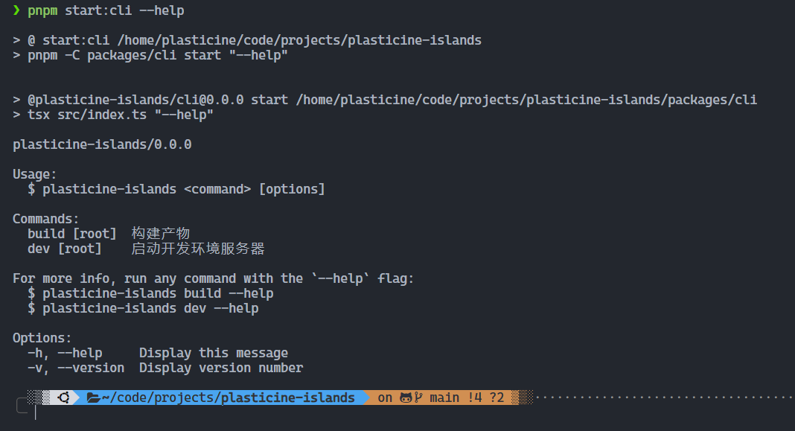
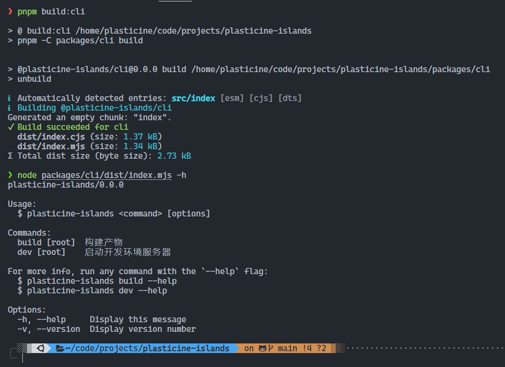
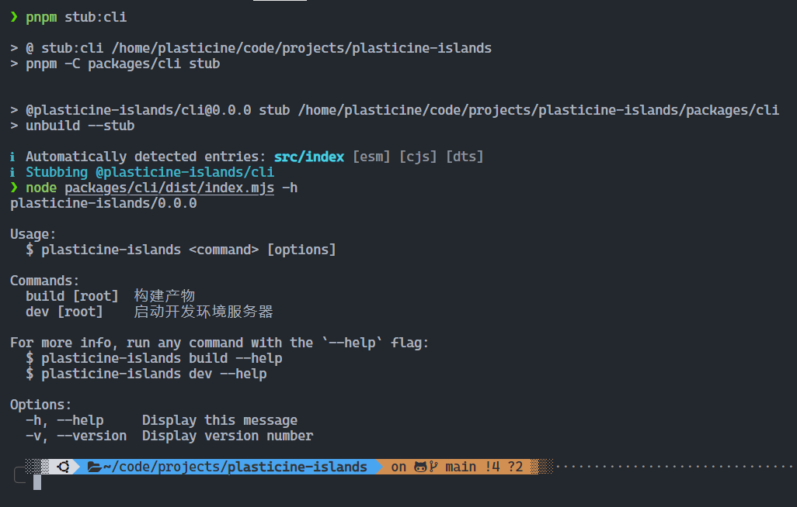
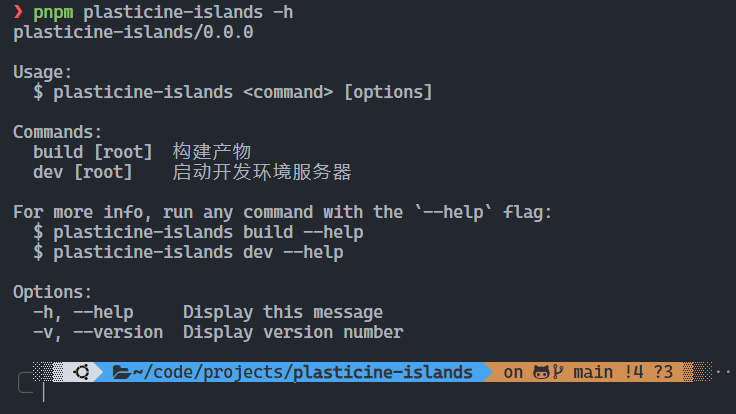

# MVP 版本开发

## 前言

在 MVP 版本中，我们需要完成以下几件事：

- 基本 CLI 命令：包括 dev 和 build
- 搭建 vite 开发环境服务器
- 实现传统 SSR 渲染流程
- 主题包的 Layout Demo 实现，完整实现会在后续文章中讲解

## 项目创建

这里我会使用我自己的一套 [node-monorepo 项目模板](https://github.com/Plasticine-Yang/templates/tree/main/node-monorepo)

```shell
npx degit Plasticine-Yang/templates/node-monorepo plasticine-islands
```

这套模板集成了前端工程化必备的一些基本工具，如：

- vitest
- typescript
- unbuild
- eslint
- prettier
- husky
- commitlint
- lint-staged
- cz-git
- changesets

它能够很方便地让我们进行 node 库的开发，并且是基于 pnpm workspace monorepo 方案的，开箱即用，对于打包构建也是十分方便，以创建一个 cli 包为例：

在 `packages` 目录中创建一个 `cli` 目录，并写入如下内容到 `package.json` 中

```json
{
  "name": "@plasticine-islands/cli",
  "version": "0.0.0",
  "author": "Plasticine-Yang",
  "description": "cli of @plasticine-islands",
  "type": "module",
  "license": "MIT",
  "main": "./dist/index.cjs",
  "module": "./dist/index.mjs",
  "types": "./dist/index.d.ts",
  "exports": {
    ".": {
      "require": "./dist/index.cjs",
      "import": "./dist/index.mjs",
      "types": "./dist/index.d.ts"
    }
  },
  "keywords": ["islands", "islands architecture", "ssg", "plasticine-islands", "cli"],
  "scripts": {
    "build": "unbuild",
    "stub": "unbuild --stub"
  }
}
```

配置好 `main`, `module`, `types`, `exports` 等包入口声明，`unbuild` 就能够自动检测并打包出对应产物，无需任何配置，十分舒服！

:::tip
这里的 `stub` 命令是 `unbuild` 的一个特性，大致就是免去了传统的那种启动一个监听进程去监听文件变化然后重新编译产物，它完全不需要启动一个额外的监听进程，文件变更立马就能得到最新的结果，具体原理可以查看 [官方文档](https://github.com/unjs/unbuild#-passive-watcher) 的介绍
:::

在仓库根目录的 `package.json` 中写入如下 script 脚本：

```json
{
  "scripts": {
    "build:cli": "pnpm -C packages/cli build",
    "stub:cli": "pnpm -C packages/cli stub"
  }
}
```

pnpm 的 `-C` 参数是让命令执行时的工作目录指向 `-C` 参数的目录，这样就能很方便地执行各个子包的命令，不需要手动切换到具体目录再执行命令

:::tip
也可以使用 `pnpm --filter @plsaticine-islands/cli build` 的方式实现同等效果，但是这种方式需要输入完整的包名

个人更倾向于使用 `-C` 参数，可以避免输入完整包名的心智负担，因为有时候可能想不起来包名是啥，然后就得看看自己目前写的项目是啥，知道包名后再拼接上子包名才行

而 `-C` 的话直接无脑输入 `packages` 作为前缀，再跟上子包名即可
:::

## CLI 应用开发

在 MVP 版本中，我们主要实现两个命令 -- `dev` 和 `build`，具体的命令执行依赖于 `core` 包，先把 CLI 实现以下，之后实现 `core` 的时候再集成进来即可

### 安装核心依赖

CLI 的实现依赖于 [cac](https://github.com/cacjs/cac)，它能够很方便地帮助我们实现一个 CLI 应用，先来安装它叭~

```shell
pnpm -C packages/cli i cac
```

### 基本实现

目前的简易实现如下：

```ts
import cac from 'cac'

import pkg from '../package.json'

const cli = cac('plasticine-islands')

// build 命令
cli.command('build [root]', '构建产物').action((root?: string) => {
  console.log(`build ${root}`)
})

// dev 命令
cli.command('dev [root]', '启动开发环境服务器').action((root?: string) => {
  console.log(`dev ${root}`)
})

// 支持 `--help` 和 `-h` 显示帮助信息
cli.help()

// 支持 `--version` 和 `-v` 显示版本信息
cli.version(pkg.version)

cli.parse()
```

具体的 action 等之后实现 `core` 包的时候再来集成，接下来我们要试试能否将这个 cli 应用跑起来

### 将 cli 应用跑起来

将 cli 应用跑起来有很多方式：

- 使用 `tsx` 这个工具直接执行 ts 文件，`tsx` 类似于 `ts-node`，但是比 `ts-node` 好用很多，无需关心 cjs 和 esm 的兼容问题，并且执行速度快很多
- 运行构建产物
- 运行 stub 模式的产物
- 以命令的方式运行

四种方式都会讲解一下如何实现

#### 使用 tsx 跑 cli

如果你使用了我的 `node-monorepo` 模板的话，已经默认集成了 `tsx` 这个工具，直接在 cli 这个包的 `package.json` 中添加如下命令：

```json
{
  "scripts": {
    "start": "tsx src/index.ts"
  }
}
```

然后在项目根目录的 `package.json` 中添加如下命令：

```json
{
  "scripts": {
    "start:cli": "pnpm -C packages/cli start"
  }
}
```

这样就能在项目根目录直接以 `pnpm start:cli` 的方式去运行 cli 应用了



#### 运行构建产物

也可以先运行 `pnpm build:cli` 构建产物，然后执行 `node packages/cli/dist/index.mjs` 的方式去跑，但是这种方式太繁琐，每次更新代码都要手动构建，再执行 node 命令，不太推荐



#### 运行 stub 模式的产物

stub 模式相比于普通的构建方式，只需要运行以此，之后代码更新后都无需手动去构建产物，并且不需要启动监听进程去动态构建即可得到最新的产物

运行 `pnpm stub:cli`，再执行 `node packages/cli/dist/index.mjs` 即可



#### 以命令的方式运行

这种方式需要为 cli 子包声明 `bin` 入口，指向打包产物，这样就能以 `npx plasticine-islands` 这样的方式去运行 cli 应用

修改 cli 包中的 `package.json`，添加 `bin` 入口：

```json
{
  "bin": {
    "plasticine-islands": "./bin/plasticine-islands.js"
  }
}
```

接下来创建 `packages/cli/bin/plasticine-islands.js`，在这里面导入构建的产物：

```js
#!/usr/bin/env node
import '../dist/index.mjs'
```

接下来将 `@plasticine-islands/cli` 这个包安装到项目根目录中，这样就可以以 `npx plasticine-islands` 或 `pnpm plasticine-islands` 的方式去跑我们的 cli 命令了，配合 stub 模式的话体验会更好

```shell
# 将 @plasticine-islands/cli 安装到项目根目录
pnpm i @plasticine-islands/cli -w
```


