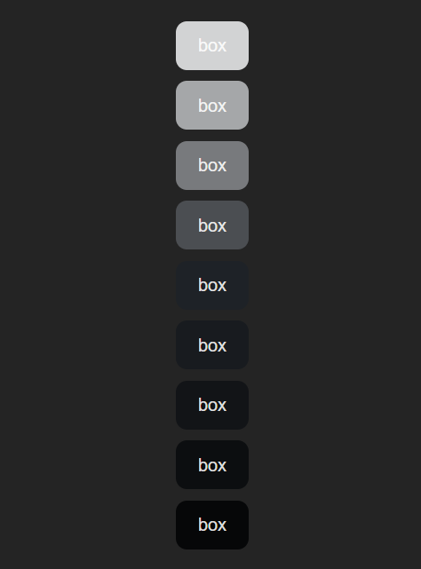
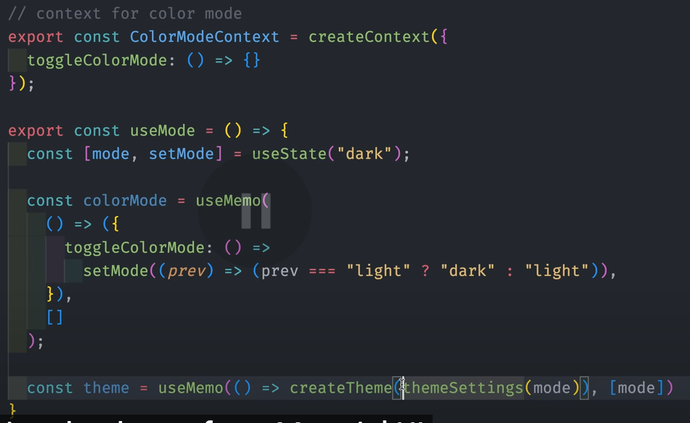
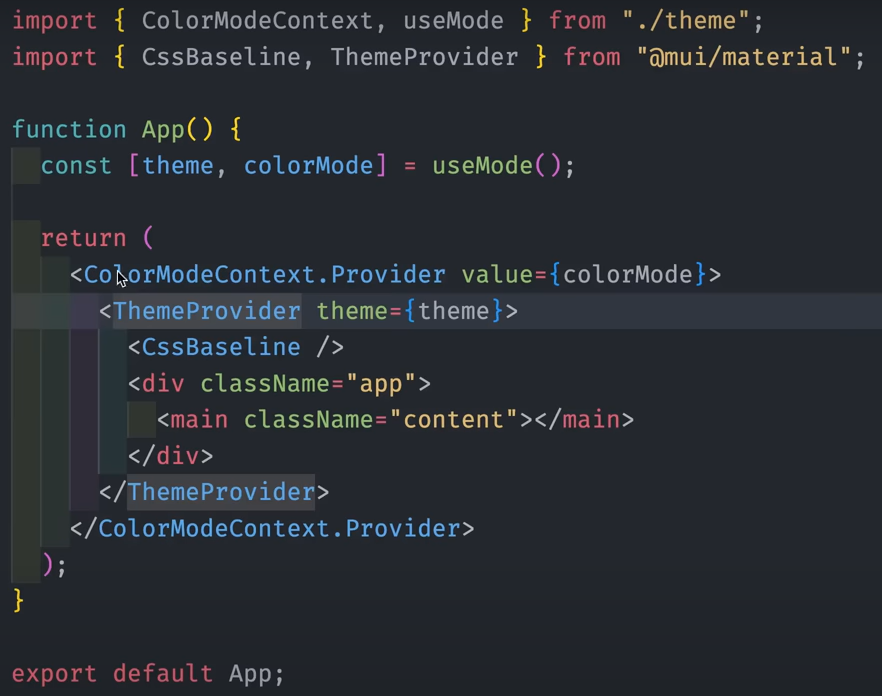

# 技巧

## 生成更亮或更暗的颜色

比如一个按钮悬浮的时候，我们希望他的颜色变得更暗或者更亮，这个时候就可以用一款 vscode 插件 - `Tailwind Shades` 去生成颜色

比如下面这个 Demo

```tsx
import './style.css'

const Foo: React.FC = () => {
  return (
    <div className="foo">
      <div className="box1">box</div>
      <div className="box2">box</div>
      <div className="box3">box</div>
      <div className="box4">box</div>
      <div className="box5">box</div>
      <div className="box6">box</div>
      <div className="box7">box</div>
      <div className="box8">box</div>
      <div className="box9">box</div>
    </div>
  )
}
```

在 `style.css` 中为每个 box 指定背景颜色，假设我现在使用的颜色是 `#1e2227`，然后鼠标选中这个颜色，按下 `Ctrl + Shift + P` 调出 vscode 命令面板，输入 `TailwindShades` 回车即可看到生成如下结果：

```css
#1e2227 {
  100: "#d2d3d4",
  200: "#a5a7a9",
  300: "#787a7d",
  400: "#4b4e52",
  500: "#1e2227",
  600: "#181b1f",
  700: "#121417",
  800: "#0c0e10",
  900: "#060708"
}
```

数值越深则颜色越深，而 `500` 则是原颜色，最终应用到 Demo 中的效果如下：



## 深浅色模式切换

使用 `createContext` 创建一个 `ColorModeContext`，结合 `@mui/material` 的 `ThemeProvider` 和 `CssBaseline` 组件实现深浅色切换




