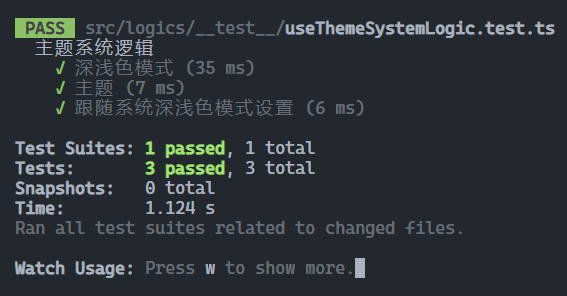
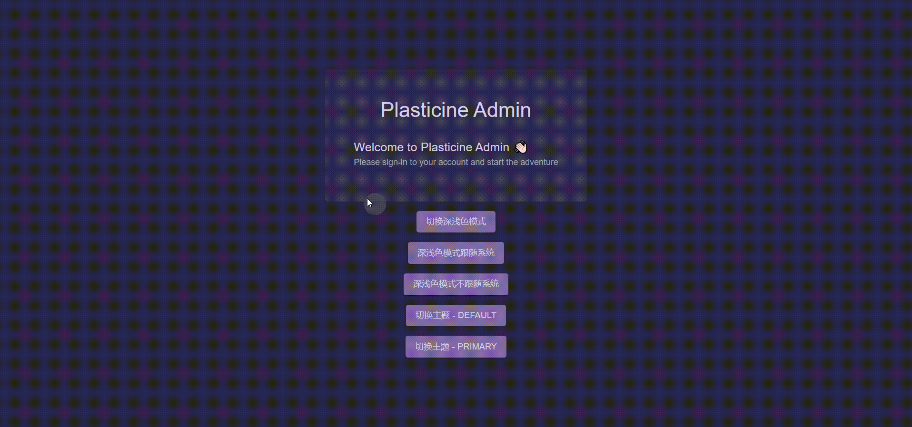
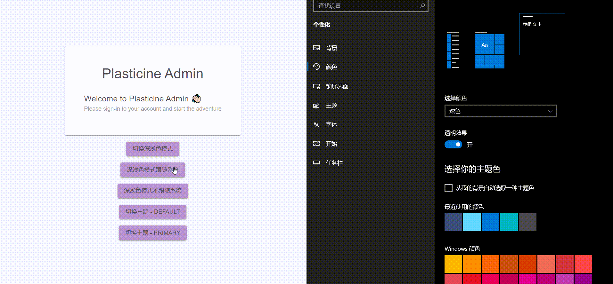

# 主题系统

:::tip 本篇文章对应的代码分支
https://github.com/Plasticine-Yang/plasticine-admin/tree/feat/theme-system
:::

## 前言

主题系统这一功能在很多地方都能见到，比如我们的手机、一些管理系统网站等都会有，那么你是否好奇过它们都是怎么实现的呢？

本篇文章假设我们的背景是实现一个管理系统中的主题系统，通过 `面向类型编程 + TDD` 的思想手把手带你撸一个主题系统出来，为了方便测试逻辑，会使用 zustand 来实现，在 zustand 中维护相关状态，并将主题系统的逻辑封装到一个 hook 中便于测试

## 设计理念

首先介绍一下主题系统的设计理念，先区分两个概念：

- 色彩模式
- 主题

色彩模式指的是操作系统处于深色模式还是浅色模式，或许你会疑惑，这不应该算是主题吗？

在我看来，主题更多的是配置各种颜色，比如背景颜色，字体颜色等，而深浅色模式则是配置明亮度的，在一个主题中可以配置深浅色模式下的颜色

比如有个主题叫 `foo`，那么在该主题下我可以分别配置深色模式和浅色模式下的背景色以及字体色等

那么色彩模式和主题是如何标识的呢？我的设计思路是在根 html 标签上设置自定义 dataset 的方式实现，色彩模式通过 `data-color-mode` 标识，而主题则通过 `data-theme` 标识，结合 css 选择器去应用不同主题下的 css 变量配置从而让主题系统生效

理解了这一设计理念后就可以开始写代码了

## 定义类型

基于面向类型编程的思想，我们先来定义一下要实现主题系统所涉及到的类型

:::code-group

```ts [src/types/settings.ts]
export type ColorModeType = 'dark' | 'light'
export type ThemeType = 'default'

export interface SettingsState {
  /**
   * @description 色彩模式 - 浅色 or 深色
   * @default 'dark'
   */
  colorMode: ColorModeType

  /**
   * @description 色彩模式是否需要跟随操作系统
   * @default false
   */
  shouldColorModeFollowSystem: boolean

  /**
   * @description 主题
   * @default 'default'
   */
  theme: ThemeType
}

export interface SettingsSetters {
  setColorMode: (colorMode: ColorModeType) => void
  setShouldColorModeFollowSystem: (shouldColorModeFollowSystem: boolean) => void
  setTheme: (theme: ThemeType) => void
}

export interface SettingsActions {
  toggleColorMode: () => void
}

export type SettingsStore = SettingsState & SettingsSetters & SettingsActions
```

:::

首先定义了一个 interface -- `Settings`，代表整个管理系统的设置，主题系统的配置就可以定义在这里面

## SettingsStore

### 状态管理

zustand 的使用我就不介绍了，自行阅读官方文档了解，使用起来很简单，SettingsStore 的实现如下

:::code-group

```ts [src/stores/settings.ts]
import { create, createStore, useStore } from 'zustand'
import { devtools } from 'zustand/middleware'
import { immer } from 'zustand/middleware/immer'

import type { SettingsState, SettingsStore } from '@/types'

const initialSettingsState: SettingsState = {
  colorMode: 'dark',
  shouldColorModeFollowSystem: false,
  theme: 'default',
}

export const createSettingsStore = () => {
  const storeName = 'SettingsStore'

  return createStore<SettingsStore>()(
    immer(
      devtools(
        (set, get) => ({
          ...initialSettingsState,

          // setters
          setColorMode(colorMode) {
            set((state) => {
              state.colorMode = colorMode
            })
          },
          setShouldColorModeFollowSystem(shouldColorModeFollowSystem) {
            set((state) => {
              state.shouldColorModeFollowSystem = shouldColorModeFollowSystem
            })
          },
          setTheme(theme) {
            set((state) => {
              state.theme = theme
            })
          },

          // actions
          toggleColorMode() {
            const { colorMode, setColorMode } = get()
            setColorMode(colorMode === 'dark' ? 'light' : 'dark')
          },
        }),
        { name: storeName },
      ),
    ),
  )
}

export const settingsStore = createSettingsStore()
```

:::

这里为什么没按照官方文档的方式使用 `create` 而是 `createStore` 呢？主要是考虑到要给单元测试使用，单测要尽量保证代码的独立性，比如有多个单元测试组如果都要用到这个 store，那么采用 `create` 创造出来的是一个 zustand 封装过的 hooks，store 实例在其内部管理，那么多个单测组拿到的实例都是同一个，导致单测组之间产生关联

因此这里我选择了使用 `createStore` 来实现，这样一来每个单测组内部自行调用 `createSettingsStore` 来保证 store 实例的独立性，而在实际业务使用时，则可以使用导出的 `settingsStore` 这一单例

状态的维护没啥特别的，就是三个状态以及额外实现了一个深浅色模式切换的 toggle action

核心在于这些状态对主题系统运行的逻辑是如何处理的

### 封装运行时逻辑为 hook

接下来封装一个 `useThemeSystemLogic` hook ，其中主要是执行一些副作用，包括：

- colorMode 改变时修改根 html 标签的 dataset
- theme 改变时修改根 html 标签的 dataset
- shouldColorModeFollowSystem 改变时通过媒体查询操作系统的色彩模式去修改 colorMode 状态从而改变管理系统的色彩模式

但是我们先不急着实现这个 hook，基于 TDD 的思想，我们先编写对应的单元测试

#### 单元测试

单测框架用的是 `jest` + `@testing-library/react`

:::code-group

```ts [src/logics/__test__/useThemeSystemLogic.ts]
import { act, renderHook } from '@testing-library/react'
import type { StoreApi } from 'zustand'

import { createSettingsStore } from '@/stores'
import type { SettingsStore } from '@/types'

import { useThemeSystemLogic } from '../useThemeSystemLogic'

describe('主题系统逻辑', () => {
  let settingsStore: StoreApi<SettingsStore>
  let rootEl: HTMLElement

  const getRootElColorMode = () => rootEl.dataset.colorMode
  const getRootElTheme = () => rootEl.dataset.theme

  /** @description 模拟系统深浅色模式 */
  const mockMatchMedia = (isDarkMode: boolean) => {
    const matchMediaMock = jest.fn().mockReturnValue({
      matches: isDarkMode,
      addEventListener: jest.fn(),
      removeEventListener: jest.fn(),
    })

    // window.matchMedia 是只读属性，需要通过配置 writable 为 true 来修改为 mock 版本的 matchMedia
    Object.defineProperty(window, 'matchMedia', {
      writable: true,
      value: matchMediaMock,
    })

    return matchMediaMock
  }

  beforeEach(() => {
    // 默认系统处于深色模式
    mockMatchMedia(true)

    rootEl = document.documentElement
    settingsStore = createSettingsStore()

    renderHook(() => useThemeSystemLogic(settingsStore))
  })

  test('深浅色模式', () => {
    const setColorMode = settingsStore.getState().setColorMode

    act(() => {
      setColorMode('dark')
    })
    expect(getRootElColorMode()).toBe('dark')

    act(() => {
      setColorMode('light')
    })
    expect(getRootElColorMode()).toBe('light')
  })

  test('主题', () => {
    const setTheme = settingsStore.getState().setTheme

    act(() => {
      setTheme('foo' as any)
    })
    expect(getRootElTheme()).toBe('foo')

    act(() => {
      setTheme('bar' as any)
    })
    expect(getRootElTheme()).toBe('bar')
  })

  test('跟随系统深浅色模式设置', () => {
    const setShouldColorModeFollowSystem = settingsStore.getState().setShouldColorModeFollowSystem

    act(() => {
      // 开启跟随系统深浅色模式变化
      setShouldColorModeFollowSystem(true)
    })

    // 系统切换到深色模式
    mockMatchMedia(true)
    // 监听操作系统深浅色模式变更的事件监听回调的执行不是同步的，因此立刻断言会导致获取不到回调执行引起的变更结果
    // 因此将断言放到下一个宏任务中
    setTimeout(() => {
      expect(getRootElColorMode()).toBe('dark')
    })

    // 系统切换到浅色模式
    mockMatchMedia(false)
    setTimeout(() => {
      expect(getRootElColorMode()).toBe('light')
    })

    setTimeout(() => {
      act(() => {
        // 关闭跟随系统深浅色模式变化功能
        setShouldColorModeFollowSystem(false)
      })
      expect(getRootElColorMode()).toBe('light')

      // 系统无论如何切换深浅色模式 - rootEl 的 colorMode 都不受影响
      mockMatchMedia(true)
      setTimeout(() => {
        expect(getRootElColorMode()).toBe('light')
      })

      mockMatchMedia(false)
      setTimeout(() => {
        expect(getRootElColorMode()).toBe('light')
      })
    })
  })
})
```

:::

由于获取操作系统的深浅色模式会用到 `window.matchMedia` 这个 API，但我们不关心它的实现，只关心控制它的返回结果，因此需要对它进行 mock

至于其他的细节在单测中都写了注释，就不过多解释了，API 看不懂的自行阅读官方文档，接下来去实现 `useThemeSystemLogic`

#### 实现

:::code-group

```ts [src/logics/useThemeSystemLogic.ts]
import { useEffect } from 'react'
import { type StoreApi, useStore } from 'zustand'
import { shallow } from 'zustand/shallow'

import type { SettingsStore } from '@/types'

export function useThemeSystemLogic(settingsStore: StoreApi<SettingsStore>) {
  const { colorMode, theme, shouldColorModeFollowSystem } = useStore(
    settingsStore,
    (settings) => ({
      colorMode: settings.colorMode,
      theme: settings.theme,
      shouldColorModeFollowSystem: settings.shouldColorModeFollowSystem,
    }),
    shallow,
  )

  const setColorMode = useStore(settingsStore, (settings) => settings.setColorMode)

  // colorMode 变化时修改 html 标签的 `data-color-mode`
  useEffect(() => {
    const htmlEl = document.querySelector('html')
    htmlEl && (htmlEl.dataset.colorMode = colorMode)
  }, [colorMode])

  // theme 变化时修改 html 标签的 `data-theme`
  useEffect(() => {
    const htmlEl = document.querySelector('html')
    htmlEl && (htmlEl.dataset.theme = theme)
  }, [theme])

  // shouldColorModeFollowSystem 影响 colorMode
  useEffect(() => {
    if (shouldColorModeFollowSystem) {
      const handleMediaQueryListChange = (e: MediaQueryListEvent) => {
        const isDarkMode = e.matches
        setColorMode(isDarkMode ? 'dark' : 'light')
      }

      const mediaQueryList = matchMedia('(prefers-color-scheme: dark)')
      mediaQueryList.addEventListener('change', handleMediaQueryListChange)

      const isDarkMode = mediaQueryList.matches
      setColorMode(isDarkMode ? 'dark' : 'light')

      return () => {
        mediaQueryList.removeEventListener('change', handleMediaQueryListChange)
      }
    }
  }, [shouldColorModeFollowSystem, setColorMode])
}
```

:::

三个状态对应三个副作用，各司其职，接下来看看单测运行结果



顺利通过，接下来可以去实现样式部分了

## TailwindCSS 配置主题

前面说过了，主题主要是通过 css 变量实现的，而 TailwindCSS 可以通过如 `bg-[--primary-color]` 这样的方式去使用 css 变量的值，因此我们通过如下方式去配置多套不同的主题

:::code-group

```scss [src/styles/themes/default-theme.scss]
html[data-theme='default']:root {
  // light mode
  --pa-background-color: #f4f5fa;
  --pa-layer-color: #ffffff;
  --pa-text-color: #544f5a;
  --pa-primary-color: #ba94d1;

  // dark mode
  --pa-dark-background-color: #28243d;
  --pa-dark-layer-color: #312d4b;
  --pa-dark-text-color: #cecce5;
  --pa-dark-primary-color: #7f669d;
}
```

```scss [src/styles/themes/primary.scss]
html[data-theme='primary']:root {
  // light mode
  --pa-background-color: #def5e5;
  --pa-layer-color: #bcead5;
  --pa-text-color: #544f5a;
  --pa-primary-color: #b3ffae;

  // dark mode
  --pa-dark-background-color: #4f775d;
  --pa-dark-layer-color: #6a9e7c;
  --pa-dark-text-color: #cecce5;
  --pa-dark-primary-color: #62a388;
}
```

```scss [src/styles/themes/index.scss]
@use 'default-theme';

@layer base {
  // ====================== background ======================
  body {
    @apply bg-[--pa-background-color] dark:bg-[--pa-dark-background-color];
  }

  // ====================== text ======================
  :is(p, h1, h2, h3, h4, h5, h6, span, button, a) {
    @apply text-[--pa-text-color] dark:text-[--pa-dark-text-color];
  }
}
```

```scss [src/styles/globals.scss]
@use 'themes';

// Tailwind CSS setup
@tailwind base;
@tailwind components;
@tailwind utilities;
```

:::

:::tip
pa 是 `plasticine-admin` 的简称
:::

然后通过一个简单的 Demo 体验一下：

:::code-group

```tsx [src/pages/login/index.tsx]
const Login: React.FC = () => {
  const toggleColorMode = useStore(settingsStore, (settings) => settings.toggleColorMode)
  const setShouldColorModeFollowSystem = useStore(settingsStore, (settings) => settings.setShouldColorModeFollowSystem)
  const setTheme = useStore(settingsStore, (settings) => settings.setTheme)

  const btnClassName =
    'bg-[--pa-primary-color] dark:bg-[--pa-dark-primary-color] hover:bg-[--pa-primary-color] dark:hover:bg-[--pa-dark-primary-color] use-text-color'

  return (
    <Box className="flex-col-center gap-4 min-h-screen">
      <LoginForm />
      <Button className={btnClassName} variant="contained" onClick={toggleColorMode}>
        切换深浅色模式
      </Button>

      <Button
        className={btnClassName}
        variant="contained"
        onClick={() => {
          setShouldColorModeFollowSystem(true)
        }}
      >
        深浅色模式跟随系统
      </Button>

      <Button
        className={btnClassName}
        variant="contained"
        onClick={() => {
          setShouldColorModeFollowSystem(false)
        }}
      >
        深浅色模式不跟随系统
      </Button>

      <Button
        className={btnClassName}
        variant="contained"
        onClick={() => {
          setTheme('default')
        }}
      >
        切换主题 - default
      </Button>

      <Button
        className={btnClassName}
        variant="contained"
        onClick={() => {
          setTheme('primary')
        }}
      >
        切换主题 - primary
      </Button>
    </Box>
  )
}
```

:::

这样一来我们只需要定义好管理系统的几套主题，并在 ts 中切换主题时修改对应的主题名即可让主题生效了




