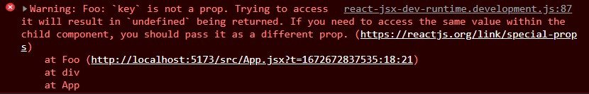
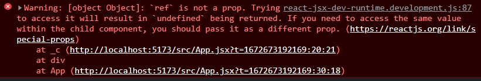

# jsx

## jsx 会变成什么？

每个 jsx 最终都会被 ReactElement 函数转换

```ts
const ReactElement = function (
  type: ElementType,
  key: Key,
  ref: Ref,
  props: Props,
) {
  const element: ReactElement = {
    $$typeof: REACT_ELEMENT_TYPE,
    type,
    key,
    ref,
    props,
    __mark: 'Plasticine-Yang',
  }

  return element
}
```

## jsx 函数主流程

从 React v17 开始，react 包导出了 `jsx-runtime`，通过调用里面的 `jsx` 函数将 `jsx` 转成 `ReactElement`

jsx 函数的主流程大致如下：

1. 赋值 key
2. 赋值 ref
3. 赋值 props
4. 赋值 defaultProps

代码如下：

```ts
const hasValidKey = (config: any) => config.key !== undefined
const hasValidRef = (config: any) => config.ref !== undefined

/** @description 特殊属性不会作为 props 被赋值 */
const RESERVED_PROPS = {
  key: true,
  ref: true,
}

function jsx(type: ElementType, config: any) {
  let propName: string

  const props: Props = {}

  let key: Key = null
  let ref: Ref = null

  // 赋值 key
  if (hasValidKey(config)) {
    key = '' + config.key
  }

  // 赋值 ref
  if (hasValidRef(config)) {
    ref = config.ref
  }

  // 赋值 props
  for (propName in config) {
    if (
      Object.prototype.hasOwnProperty.call(config, propName) &&
      !RESERVED_PROPS.hasOwnProperty(propName)
    ) {
      props[propName] = config[propName]
    }
  }

  // 赋值 defaultProps
  if (type?.defaultProps) {
    const defaultProps = type.defaultProps
    for (propName in defaultProps) {
      if (props[propName] === undefined) {
        props[propName] = defaultProps[propName]
      }
    }
  }

  return ReactElement(type, key, ref, props)
}
```

## jsx 和 jsxDEV 的区别？

react 导出的包中还有一个 `jsx-dev-runtime`，使用该包时调用的是 `jsxDEV` 函数，那么这个函数相比于 `jsx` 有什么不同呢？

主要是多了对 `key` 和 `ref` 的控制台警告监控，当你试图通过 props 访问 key 和 ref 时会在控制台弹出警告

```js
function defineKeyPropWarningGetter(props, displayName) {
  if (__DEV__) {
    const warnAboutAccessingKey = function () {
      if (!specialPropKeyWarningShown) {
        specialPropKeyWarningShown = true
        console.error(
          '%s: `key` is not a prop. Trying to access it will result ' +
            'in `undefined` being returned. If you need to access the same ' +
            'value within the child component, you should pass it as a different ' +
            'prop. (https://reactjs.org/link/special-props)',
          displayName,
        )
      }
    }
    warnAboutAccessingKey.isReactWarning = true

    // 试图通过 props 访问 key 时会遇到控制台警告
    Object.defineProperty(props, 'key', {
      get: warnAboutAccessingKey,
      configurable: true,
    })
  }
}

function defineRefPropWarningGetter(props, displayName) {
  if (__DEV__) {
    const warnAboutAccessingRef = function () {
      if (!specialPropRefWarningShown) {
        specialPropRefWarningShown = true
        console.error(
          '%s: `ref` is not a prop. Trying to access it will result ' +
            'in `undefined` being returned. If you need to access the same ' +
            'value within the child component, you should pass it as a different ' +
            'prop. (https://reactjs.org/link/special-props)',
          displayName,
        )
      }
    }
    warnAboutAccessingRef.isReactWarning = true

    // 试图通过 props 访问 ref 时会遇到控制台警告
    Object.defineProperty(props, 'ref', {
      get: warnAboutAccessingRef,
      configurable: true,
    })
  }
}

function jsxDEV(type: ElementType, config: any) {
  // ...

  if (key || ref) {
    const displayName =
      typeof type === 'function'
        ? type.displayName || type.name || 'Unknown'
        : type
    if (key) {
      defineKeyPropWarningGetter(props, displayName)
    }
    if (ref) {
      defineRefPropWarningGetter(props, displayName)
    }
  }

  // ...
}
```

试图访问 props.key 时：

```jsx
const Foo = props => {
  console.log(props.key)

  return <div>Foo</div>
}

function App() {
  return (
    <div>
      <Foo key="foo" />
    </div>
  )
}
```



试图访问 props.ref 时：

```jsx
const Foo = forwardRef((props, ref) => {
  console.log(props.ref)

  return <div ref={ref}>Foo</div>
})

function App() {
  const fooRef = useRef(null)

  return (
    <div>
      <Foo ref={fooRef} />
    </div>
  )
}
```


