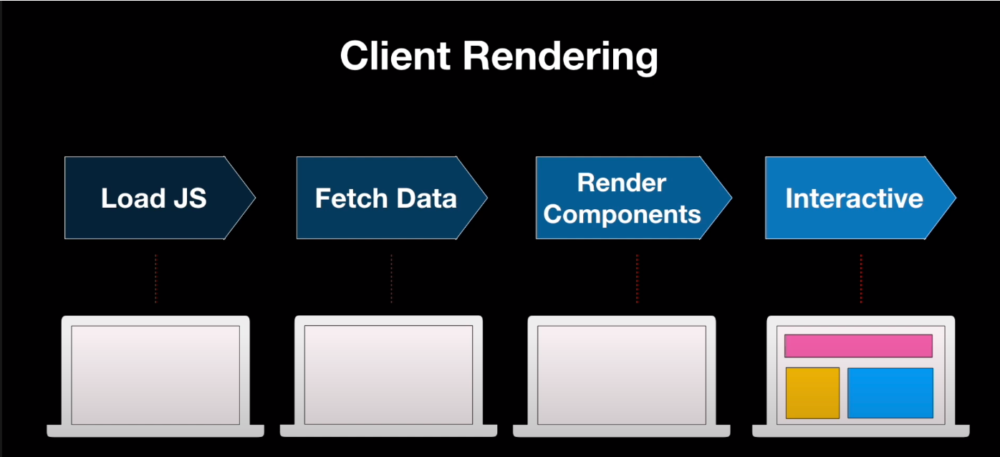
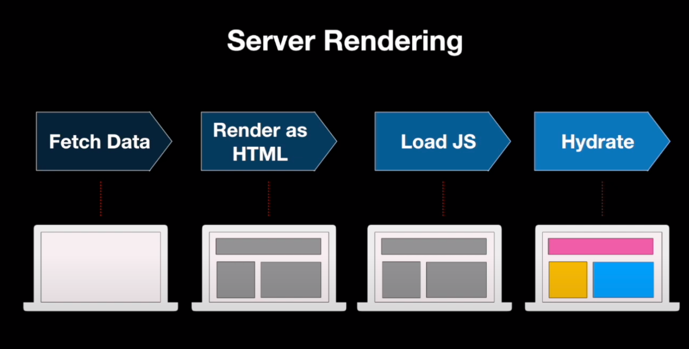

# 如何理解 SSR 中的 hydrate?

## 理解 hydrate

在 `react-dom/client` 中：

- `createRoot` 的方式进行客户端渲染，也就是 CSR(client-side rendering)，它会将应用的渲染流程完全交给浏览器客户端去完成



- `hydrateRoot` 用于搭配 `react-dom/server` 的 `renderToString` 等 API 使用

  - `renderToString` 在服务端生成页面 html 字符串，此时首屏加载的不再是空页面，而是有内容的 html 文档
  - 但是缺少交互，主要是因为各种事件都未绑定上去，因此往往会在返回的 html 字符串中注入 `script` 加载包含 `hydrateRoot` 的脚本去绑定事件



未添加事件绑定的时候，整个页面都是不可交互的，只有内容可以查看，这个时候可以将整个页面理解为是很 "dry" 的，就如图中灰色部分一样

而绑定了事件监听器后，整个页面如同被注入了 “水” 一样，变得不那么 "dry"，变得可交互了，就如图中彩色部分一样，这就是 hydrate 的本意：**往服务端渲染返回的 html 中注入额外的客户端运行时脚本完成事件监听器的绑定**

## 通过 Demo 体验 SSR Hydrate

接下来我们通过一个简单的 Demo 来加深对 hydrate 过程的理解，涉及到三方：

- server
- client
- App

### 同构渲染

`server` 负责将 `App` 渲染成 html 字符串，对于事件绑定之类的事情不做处理，只负责讲生成的 html 字符串响应给浏览器客户端

`client` 则负责为 `App` 完成 “注水” 过程，为应用添加交互

`App` 则是整个应用的内容

由他们的作用不难发现，`server` 和 `client` 都依赖于 `App`，因此需要保证 App 组件中的代码需要保证能够在 node 服务端和浏览器客户端都能执行，也就意味着不能执行一些平台特定代码，比如访问 window 对象

如果真的一定需要访问 window 这样的浏览器端才有的 API，我们应当将其放到客户端运行时才会执行的地方中调用，比如 `componentDidMount` 这样的生命周期中的代码在服务端是不会也没必要执行的，因此在这里面访问 window 不会造成服务端运行出错

这种需要在服务端和浏览器客户端都执行一遍的特性，就叫同构渲染

### Demo 代码

接下来就可以看看 Demo 的实现了

#### webpack

首先看看 webpack 如何配置，需要对客户端和服务端分别进行打包构建：

`webpack.base.js`

```js
const path = require('path')

module.exports = {
  module: {
    rules: [
      {
        test: /.js$/,
        loader: 'babel-loader',
        exclude: /node_modules/,
        options: {
          presets: ['@babel/preset-env'],
        },
      },
      {
        test: /.(ts|tsx)?$/,
        use: 'ts-loader',
        exclude: /node_modules/,
      },
    ],
  },
  resolve: {
    extensions: ['.tsx', '.ts', '.js'],
    alias: {
      '@': path.resolve(process.cwd(), './src'),
    },
  },
}
```

用于对 ts 进行处理

`webpack.server.js`

```js
const path = require('path')
const { merge } = require('webpack-merge')
const baseConfig = require('./webpack.base')
const { PROJECT_ROOT, DIST_PATH } = require('./constants')

module.exports = merge(baseConfig, {
  mode: 'development',
  entry: path.resolve(PROJECT_ROOT, 'src/server/index.tsx'),
  target: 'node',
  output: {
    filename: 'bundle.js',
    path: path.resolve(DIST_PATH, 'server-build'),
  },
  externals: {
    express: 'express',
    react: 'react',
    'react-dom/server': 'react-dom/server',
  },
  externalsType: 'commonjs',
})
```

服务端的产物不需要进行 bundle，因此把用到的几个库都放到 externals 中

`webpack.client.js`

```js
const path = require('path')
const { merge } = require('webpack-merge')
const baseConfig = require('./webpack.base')
const { PROJECT_ROOT, DIST_PATH } = require('./constants')

module.exports = merge(baseConfig, {
  mode: 'development',
  entry: path.resolve(PROJECT_ROOT, 'src/client/index.tsx'),
  output: {
    filename: 'bundle.js',
    path: path.resolve(DIST_PATH, 'client-build'),
  },
})
```

客户端需要进行 bundle，将 React 和 ReactDOM 运行时都打包进去

#### App.tsx

```tsx
import { useState } from 'react'

interface AppProps {
  name: string
}

const App: React.FC<AppProps> = (props) => {
  const { name } = props

  const [count, setCount] = useState(0)

  return (
    <div>
      <p>name: {name}</p>
      <p>count: {count}</p>
      <button
        onClick={() => {
          setCount((count) => count + 1)
        }}
      >
        add count
      </button>
    </div>
  )
}

export default App
```

就是一个很常规的计数器 Demo 组件

#### server

```ts
import express from 'express'
import { resolve } from 'path'

import { renderToString } from 'react-dom/server'

import App from '../App'

const app = express()

app.get('/', (req, resp) => {
  const html = `
<!DOCTYPE html>
<html lang="en">
  <head>
    <meta charset="UTF-8" />
    <meta name="viewport" content="width=device-width, initial-scale=1.0" />
    <title>React SSR Demo</title>
  </head>
  <body>
    <div id="root">
      ${renderToString(<App name="plasticine" />)}
    </div>
  </body>
</html>
`.trim()

  resp.type('html')
  resp.send(html)
})

app.listen(3000, () => {
  console.log('server listening on port 3000')
})
```

#### client

此时打包并启动服务端，能够顺利访问到页面，但是无法交互，也就是点击按钮不能将计数器的值 +1，这就是处于前面说的 "dry" 状态，需要通过注水，加载事件绑定相关的客户端运行时代码才能够添加交互

```ts
import { hydrateRoot } from 'react-dom/client'
import App from '../App'

hydrateRoot(document.getElementById('root')!, <App name="plasticine" />)
```

仅仅是写了客户端的代码还不行，还需要将其和服务端结合，怎么结合呢？

在服务端返回的 html 中加载客户端的产物即可

```ts{10,25}
import express from 'express'
import { resolve } from 'path'

import { renderToString } from 'react-dom/server'

import App from '../App'

const app = express()

app.use(express.static(resolve(process.cwd(), 'dist/client-build')))

app.get('/', (req, resp) => {
  const html = `
<!DOCTYPE html>
<html lang="en">
  <head>
    <meta charset="UTF-8" />
    <meta name="viewport" content="width=device-width, initial-scale=1.0" />
    <title>React SSR Demo</title>
  </head>
  <body>
    <div id="root">
      ${renderToString(<App name="plasticine" />)}
    </div>
    <script src="/bundle.js"></script>
  </body>
</html>
`.trim()

  resp.type('html')
  resp.send(html)
})

app.listen(3000, () => {
  console.log('server listening on port 3000')
})
```

这样就能够完成整个 SSR 渲染的流程了
