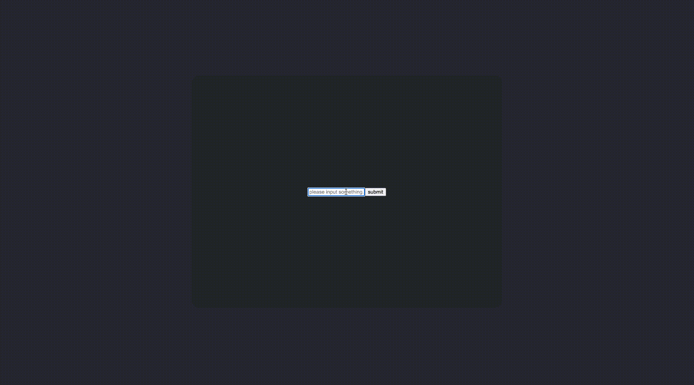

# Differences between react components, instances and elements

## 提出问题，带着问题阅读

1. 为什么对于渲染在屏幕上的视图需要用三个概念去描述？

## 理解为什么要引入 ReactElement

首先来看一个简单的案例场景：

1. 有一个表单，表单中有一个输入框
2. 表单未提交时在表单中渲染一个按钮，点击该按钮会触发表单的 submit 事件
3. 触发了 submit 事件后，提交按钮消失，并 alert 一个成功消息

接下来我们用面向对象的 UI 编程实现看看传统的面向对象方式存在什么问题。

### 面向对象的 UI 编程实现

每一个组件管理自身的行为，因此需要先抽象出一个通用的组件行为基类

```ts
/** 将组件的通用行为抽象成一个基类 */
abstract class TraditionalObjectOrientedView<
  Props extends Record<string, any> = Record<string, any>,
  State extends Record<string, any> = Record<string, any>,
  Element extends HTMLElement = HTMLElement,
> {
  public props: Props
  protected state: State
  public el: Element

  constructor(props: Props) {
    this.props = props
    this.state = this.getInitialState()
    this.el = this.createElement()
    this.render()
    this.initEventListeners()
    this.bindEventListeners()
  }

  abstract getInitialState(): State

  abstract createElement(): Element

  abstract render(): void

  protected initEventListeners(): void {}

  protected bindEventListeners(): void {}

  protected removeEventListeners(): void {}

  public destroy(): void {
    this.removeEventListeners()
  }
}
```

首先实现表单中的输入框组件：

```ts
interface FormInputProps {
  placeholder: string
}

interface FormInputState {}

class FormInput extends TraditionalObjectOrientedView<FormInputProps, FormInputState, HTMLInputElement> {
  getInitialState(): FormInputState {
    return {}
  }

  createElement(): HTMLInputElement {
    const el = document.createElement('input')

    el.type = 'text'

    return el
  }

  render(): void {
    const { placeholder } = this.props

    this.el.placeholder = placeholder
  }
}
```

然后是提交按钮组件：

```ts
interface FormSubmitButtonProps {
  text: string
}

interface FormSubmitButtonState {}

class FormSubmitButton extends TraditionalObjectOrientedView<
  FormSubmitButtonProps,
  FormSubmitButtonState,
  HTMLButtonElement
> {
  getInitialState(): FormSubmitButtonState {
    return {}
  }

  createElement(): HTMLButtonElement {
    const el = document.createElement('button')

    el.type = 'submit'

    return el
  }

  render(): void {
    const { text } = this.props

    this.el.innerText = text
  }
}
```

最后是表单组件，在其内部组合上面的两个组件，并添加交互：

```ts
interface FormProps {
  placeholder: string
  buttonText: string
}

interface FormState {
  isSubmitted: boolean
  formInputInstance: FormInput | null
  formSubmitButtonInstance: FormSubmitButton | null
}

class Form extends TraditionalObjectOrientedView<FormProps, FormState, HTMLFormElement> {
  private handleSubmit(e: SubmitEvent) {
    e.preventDefault()

    this.state.isSubmitted = true
    this.render()

    alert('submit success!')
  }

  getInitialState(): FormState {
    return {
      isSubmitted: false,
      formInputInstance: null,
      formSubmitButtonInstance: null,
    }
  }

  createElement(): HTMLFormElement {
    const el = document.createElement('form')

    return el
  }

  render(): void {
    const { placeholder, buttonText } = this.props
    const { isSubmitted, formInputInstance, formSubmitButtonInstance } = this.state

    // 初始化表单输入框实例
    if (formInputInstance === null) {
      this.state.formInputInstance = new FormInput({ placeholder })
      this.el.appendChild(this.state.formInputInstance.el)
    }

    // 未提交的时候初始化表单提交按钮实例
    if (!isSubmitted && formSubmitButtonInstance === null) {
      this.state.formSubmitButtonInstance = new FormSubmitButton({ text: buttonText })
      this.el.appendChild(this.state.formSubmitButtonInstance.el)
    }

    // 更新表单提交按钮
    if (formSubmitButtonInstance !== null) {
      formSubmitButtonInstance.props.text = buttonText
      formSubmitButtonInstance.render()
    }

    // 已提交了的情况下卸载表单提交按钮
    if (isSubmitted && formSubmitButtonInstance !== null) {
      this.el.removeChild(formSubmitButtonInstance.el)
      formSubmitButtonInstance.destroy()
    }
  }

  protected initEventListeners(): void {
    this.handleSubmit = this.handleSubmit.bind(this)
  }

  protected bindEventListeners(): void {
    this.el.addEventListener('submit', this.handleSubmit)
  }

  protected removeEventListeners(): void {
    this.el.removeEventListener('submit', this.handleSubmit)
  }
}

export const setupObjectOrientedUIProgrammingDemo = () => {
  const $app = document.querySelector<HTMLDivElement>('#app')!
  const formInstance = new Form({ buttonText: 'submit', placeholder: 'please input something...' })

  $app.appendChild(formInstance.el)
}
```

效果如下：



不难发现传统的面向对象 UI 编程存在以下几个问题：

1. 每个组件实例都不可避免地要保留对相关 DOM、子组件实例的引用。
2. 需要手动管理组件的创建、更新（手动更新子组件 props 并调用其 render 方法）和销毁。
3. 代码的行数会随着组件状态的增加呈现 O(n^2) 的增加。
4. 父组件可以直接访问子组件实例，导致后续难以解耦。

那么 React 做出了哪些改进呢？那就是引入了 ReactElement 来解决。

### ReactElement 是什么？

ReactElement 是一个 immutable object，用于描述 DOM 或组件实例，以及它们的 props，其结构如下：

```ts
interface ReactElement {
  /** string 表示 DOM 元素标签名，ReactClass 则是 React 的类组件构造函数或函数组件的函数 */
  type: string | ReactClass
  props: Record<string, any>
}
```

比如对于下面这段 DOM：

```html
<p class="paragraph"></p>
```

其对应的 ReactElement 对象为：

```ts
{
  type: 'p',
  props: {
    className: 'paragraph',
  }
}
```

### ReactElement 如何描述嵌套层级关系

更进一步，DOM 一般都会嵌套，比如下面这种：

```html
<button class="button button-blue">
  <b>OK!</b>
</button>
```

那么 ReactElement 如何表示这种嵌套关系呢？约定是在 props 中有一个特殊的属性 -- `children`，用于存放所有子 ReactElement，当只有一个子元素时 children 就是子元素本身，当有多个子元素时则为一个存放所有子元素的数组，比如：

```ts
{
  type: 'button',
  props: {
    className: 'button button-blue',
    children: {
      type: 'b',
      props: {
        children: 'OK!'
      }
    }
  }
}
```

多个子元素：

```html
<button class="button button-blue">
  <b>OK!</b>
  <b>Nice!</b>
</button>
```

对应的 ReactElement

```ts
{
  type: 'button',
  props: {
    className: 'button button-blue',
    children: [
      {
        type: 'b',
        props: {
          children: 'OK!'
        }
      },
      {
        type: 'b',
        props: {
          children: 'Nice!'
        }
      }
    ]
  }
}
```

### ReactElement 可以有效解耦父子组件

来看一下下面这个例子：

```tsx
const DeleteAccount = () => (
  <div>
    <p>Are you sure?</p>
    <DangerButton>Yep</DangerButton>
    <Button color="blue">Cancel</Button>
  </div>
)
```

对应的 ReactElement 长这样：

```tsx
const DeleteAccount = () => ({
  type: 'div',
  props: {
    children: [{
      type: 'p',
      props: {
        children: 'Are you sure?'
      }
    }, {
      type: DangerButton,
      props: {
        children: 'Yep'
      }
    }, {
      type: Button,
      props: {
        color: 'blue',
        children: 'Cancel'
      }
   }]
});
```

如果是传统的面向对象的 UI 编程的话，需要在 DeleteAccount 组件中保留对 div 和 p 等 DOM 的引用，以及对 DangerButton 和 Button 组件实例的引用，无法做到父子组件的解耦。

而 ReactElement 仅仅描述它们的层级结构，并不保留任何相关 DOM 或组件实例的引用，可以有效做到解耦。

## 总结

1. 为什么对于渲染在屏幕上的视图需要用三个概念去描述？
