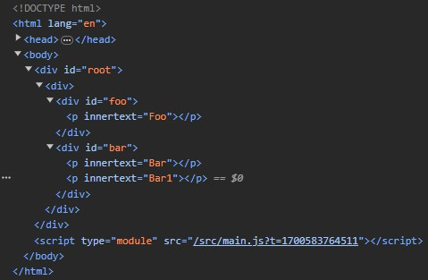

# React mount 的简要流程

## 前言

本篇主要探讨一下 React 挂载一个组件到 DOM 这一过程都发生了些什么。会通过一步步实现的方式，逐步做一个可用的 demo 出来告诉你 React mount 到底发生了什么。

一些名词解释：

- `user-defined(composite) components`: 由 React 组件组成的 jsx，比如 `<App />`
- `platform-specific(host) components`: 由宿主环境中的元素组成的 jsx，比如浏览器环境中的 `<div />`

## mount 的整体框架 - 递归

首先来看看我们最常见的 React 应用的初始化代码：

```tsx
const rootEl = document.querySelector('#root')
const root = ReactDOM.createRoot(rootEl)
root.render(<App />)
```

`<App />` 等价于一个 ReactElement：

```ts
{
  type: App,
  props: {}
}
```

前面提到过，React 会通过一种名为 reconciliation 的算法去处理一个组件，直到把它全部解析为 DOM 为止，实现这个算法的包名为 reconciler。

这里先不关心 `ReactDOM.createRoot(rootEl)` 创建的 root 是什么，我们只看它的 render 方法，该方法接受一个 `<App />` ReactElement，也就是根组件，reconciler 从它出发，发现 type 并不是一个 string，那么它就有可能是 React 类组件或函数组件，相应的处理如下：

1. 函数组件：调用 `App(props)` 拿到返回的 ReactElement 树，也就是 jsx
2. 类组件：创建组件实例，`new App(props)`，并调用 `instance.componentWillMount()` 生命周期钩子，再调用 `render` 方法获取返回的 jsx

这样一来 reconciler 就得到了新的 jsx，于是可以继续遍历它们并重复上面这个过程，因此这是一个递归的过程。相应的伪代码如下：

```js
import './style.css'

function isClass(type) {
  // React.Component subclass has this flag
  return Boolean(type.prototype?.isReactComponent)
}

/**
 * This function takes a React element (e.g. `<App />`)
 * and returns a DOM representing the mounted tree.
 *
 * Note: this implementation is incomplete and recurses infinitely!
 * It only handles elements like `<App />`  or `<Button />`
 * It doesn't handle elements like `<div />` or `<p />` yet.
 */
function mount(element) {
  const { type, props } = element

  let renderedElement

  // We will determine the rendered element
  // by either running the type as function
  // or creating an instance and calling render().
  if (isClass(type)) {
    // Class component
    const publicInstance = new type(props)

    publicInstance.componentWillMount?.()

    // Get the rendered element by calling the render method.
    renderedElement = publicInstance.render()
  } else {
    // Function component
    renderedElement = type(props)
  }

  // The process is recursive because a component may
  // return an element with a type of another component.
  return mount(renderedElement)
}

function App() {
  return {
    type: 'div',
    props: {},
  }
}

const rootEl = document.querySelector('#root')
const node = mount({ type: App, props: {} })
rootEl.appendChild(node)
```

:::warning
这段伪代码中递归调用了 mount 函数去处理返回的 ReactElement，目前还没有添加递归终止条件的处理，因此它是不能运行的。
:::

## mount host components

前言的名词解释中提到过，host components 是宿主环境中的渲染元素，比如浏览器 DOM 环境中的 `<div />`。我们的 demo 中只处理了 composite components，还缺少对 host components 的处理，如果能处理 host components，那其实也自然完成了递归的终止条件了。因为整个递归的目的就是要得到 host components 并进行渲染。

如果 host components 还有 children 的话，会调用相同的算法去挂载它们，因为我们的算法既能处理 composite components 又能处理 host components，因此无论 children 是哪种情况都是可以处理的。

最终要达到的一个效果应当是得到一个只有 host components 的 jsx，比如：

```jsx
function Foo() {
  return (
    <div>
      <p>Foo</p>
    </div>
  )
}

function App() {
  return (
    <div>
      <Foo />
    </div>
  )
}

/**
 * <App /> 会被算法解析成：
 *
 * <div>
 *   <div>
 *     <p>Foo</p>
 *   </div>
 * </div>
 */
```

这样只是得到了一段 jsx，但要将其渲染到宿主环境中的话还需要调用相关 API 去创建宿主环境的元素，比如 DOM 环境下需要根据这段 jsx 去创建各个节点，并将它们连接起来，最终将处理好的 DOM 添加到 rootEl 中即可完成挂载。

为此，我们的算法应当设计成平台无关的，这样才能实现不同渲染环境的渲染器，去消费算法最终生成的 jsx，而这个算法正是 reconciler 所需要做的。

搞懂了大致原理后，我们就要来进一步完善我们的 demo 了，由于现在要区分处理 composite components 和 host components，因此把它们单独拆成两个函数，提高代码可读性：

```js title=mount
function mount(element) {
  const { type } = element

  if (typeof type === 'function') {
    // User-defined components
    return mountComposite(element)
  } else if (typeof type === 'string') {
    // Platform-specific components
    return mountHost(element)
  }
}
```

```js title=mountComposite
/**
 * This function only handles elements with a composite type.
 * For example, it handles `<App />` and `<Button />`, but not a `<div />`.
 */
function mountComposite(element) {
  const { type, props } = element

  let renderedElement

  // We will determine the rendered element
  // by either running the type as function
  // or creating an instance and calling render().
  if (isClass(type)) {
    // Class component
    const publicInstance = new type(props)

    publicInstance.componentWillMount?.()

    // Get the rendered element by calling the render method.
    renderedElement = publicInstance.render()
  } else {
    // Function component
    renderedElement = type(props)
  }

  // This is recursive but we'll eventually reach the bottom of recursion when
  // the element is host rather than composite;
  return mount(renderedElement)
}
```

```js title=mountHost
/**
 * This function only handles elements with a host type.
 * For example, it handles `<div />` and `<p />` but not an `<App />`
 */
function mountHost(element) {
  const { type, props } = element
  let { children = [] } = props

  if (!Array.isArray(children)) {
    children = [children]
  }

  children = children.filter(Boolean)

  // This block of code shouldn't be in the reconciler.
  // Different renderers might initialize nodes differently.
  // For example, React Native would create iOS or Android views.
  const node = document.createElement(type)
  for (const propName of Object.keys(props)) {
    if (propName !== 'children') {
      node.setAttribute(propName, props[propName])
    }
  }

  // Mount the children
  for (const childElement of children) {
    // Children may be host or composite.
    // We will also mount them recursively.
    const childNode = mount(childElement)

    // This line of code is also renderer-specific.
    // It would be different depending on the renderer.
    node.appendChild(childNode)
  }

  // Return the DOM node as result.
  // This is where the recursion ends.
  return node
}
```

直接通过一个 Demo 来验证一下这个挂载流程是否可行：

```js
function Foo() {
  return {
    type: 'div',
    props: {
      id: 'foo',
      children: {
        type: 'p',
        props: {
          innerText: 'Foo',
        },
      },
    },
  }
}

function Bar() {
  return {
    type: 'div',
    props: {
      id: 'bar',
      children: [
        {
          type: 'p',
          props: {
            innerText: 'Bar',
          },
        },
        {
          type: 'p',
          props: {
            innerText: 'Bar1',
          },
        },
      ],
    },
  }
}

function App() {
  return {
    type: 'div',
    props: {
      children: [
        {
          type: Foo,
        },
        {
          type: Bar,
        },
      ],
    },
  }
}

const rootEl = document.querySelector('#root')
const node = mount({ type: App, props: {} })
rootEl.appendChild(node)
```

效果如下：



可以看到已经可以成功挂载了！

## 总结

到这里我们已经理解了 React mount 的主要流程是怎样的，接下来我们的目标是了解 React update 的主要流程是怎样的。此外，我们的 demo 还不支持设置文本，比如 `<p>foo</p>` 中的 foo。在后续的文章中会一一讲解。
