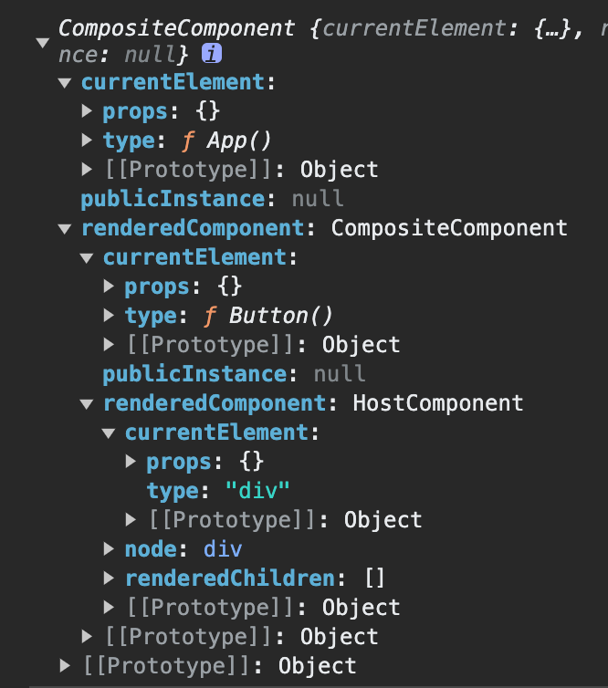
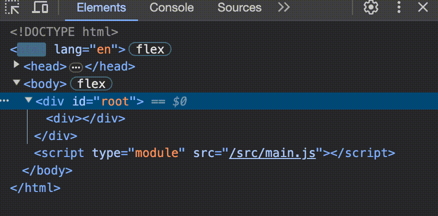

# update 的简要流程

## 前言

React 的一个主要特性就在于可以 re-render 所有元素而不用重新创建 DOM，也就是能够最大程度上复用已有的 DOM。

然而，目前我们的 demo 实现只完成了挂载初始的 jsx，无法完成更新操作，这是因为我们缺少更新操作所需的必要信息，比如完成一次更新，如果是类组件，我们应当复用已创建的实例；此外，还需要知道与每个组件关联的 DOM。

本篇文章就是来探讨一下如何记录这些更新操作所需的必要信息，以及如何利用这些信息去完成更新流程。

## 引入内部实例记录额外信息

为什么要引入内部实例呢？原有的 `mountComposite` 和 `mountHost` 方式存在什么问题吗？

因为我们现在需要记录额外的信息，如果是原来的函数的方式的话，这些额外的信息只能通过闭包的方式去保存，但为了逻辑上更好理解和代码上更好管理，还是认为引入实例的方式更适合。

### 重构已有实现

明白了引入内部实例的原因后就可以来重构一下已有的实现了，重构的思路是这样的：

1. 将 mountComposite 和 mountHost 封装到 `CompositeComponent` 和 `HostComponent` 类中。
2. 将原来的 mount 函数根据 element type 去挂载不同类型元素的实现改为创建对应的 CompositeComponent 或 HostComponent 实例。

这样一来我们就能将更新所需的必要信息存储在 CompositeComponent 和 HostComponent 中了。

### instantiateComponent

将原来的 mount 函数改成 instantiateComponent，从命名上的变化可以看出来，函数的职责从完成挂载这一动作变成了创建内部组件实例。

```js
function instantiateComponent(element) {
  const { type } = element

  if (typeof type === 'function') {
    return new CompositeComponent(element)
  } else if (typeof type === 'string') {
    return new HostComponent(element)
  }
}
```

接下来再分别实现 CompositeComponent 和 HostComponent。

### CompositeComponent

```js
class CompositeComponent {
  constructor(element) {
    this.currentElement = element
    this.renderedComponent = null
    this.publicInstance = null
  }

  getPublicInstance() {
    return this.publicInstance
  }

  mount() {
    const { type, props } = this.currentElement

    let publicInstance
    let renderedElement
    if (isClass(type)) {
      publicInstance = new type(props)
      publicInstance.componentWillMount?.()
      renderedElement = publicInstance.render()
    } else if (typeof type === 'function') {
      publicInstance = null
      renderedElement = type(props)
    }

    this.publicInstance = publicInstance

    // Instantiate the internal instance according to the element.
    // It would be a HostComponent for `<div />` or `<p />`,
    // and a CompositeComponent for `<App />` or `<Button />`.
    const renderedComponent = instantiateComponent(renderedElement)
    this.renderedComponent = renderedComponent

    // Mount the rendered output.
    return renderedComponent.mount()
  }
}
```

将原来的 `mountComposite` 逻辑封装到了实例的 mount 方法中，并且现在能够支持记录 `currentElement`, `publicInstance`, `renderedComponent` 等更新所必须的信息。

:::warning

不要混淆 CompositeComponent 实例和 publicInstance 实例！！！

- 前者是 reconciler 内部算法运行所需的实例，是不对外暴露的；
- 后者是用户传入的 jsx 中 type 为类组件时创建的实例，是可以对外暴露的；

:::

由于 CompositeComponent 和 HostComponent 只在 reconciler 内部使用，因此称为内部实例（internal instances）。

相对的，用户定义的 jsx 类组件实例则称为 public instances。

### HostComponent

接下来再看看 HostComponent 的实现，同样地，将 mountHost 重构为 HostComponent 也是为了记录一些额外的信息，需要记录哪些额外信息呢？

1. currentElement - 和 CompositeComponent 一样，都是为了记录内部实例对应的 ReactElement
2. renderedChildren - jsx 子元素对应的内部实例
3. node - 渲染到宿主环境中的元素，比如 DOM

对应的代码如下：

```js
class HostComponent {
  constructor(element) {
    this.currentElement = element
    this.renderedChildren = []
    this.node = null
  }

  mount() {
    const { type, props } = this.currentElement
    let { children = [] } = props

    if (!Array.isArray(children)) {
      children = [children]
    }

    const node = document.createElement(type)
    this.node = node

    for (const propName of Object.keys(props)) {
      if (propName !== 'children') {
        node.setAttribute(propName, props[propName])
      }
    }

    // Create and save the contained children.
    // Each of them can be an CompositeComponent and HostComponent,
    // depending on whether the element type is a string or a function.
    const renderedChildren = children.map(instantiateComponent)
    this.renderedChildren = renderedChildren

    // Collect DOM nodes they return on mount.
    const childNodes = renderedChildren.map((child) => child.mount())
    for (const childNode of childNodes) {
      node.appendChild(childNode)
    }

    // Return DOM node as mount result.
    return node
  }
}
```

### 内部实例组成的树结构

重构完后，举个例子来看看内部实例构成的树结构会是怎样的，比如下面这个 `<App />` jsx：

```js
function Button() {
  return {
    type: 'div',
    props: {},
  }
}

function App() {
  return {
    type: Button,
    props: {},
  }
}

const appElement = {
  type: App,
  props: {},
}

const rootEl = document.querySelector('#root')
const internalInstance = instantiateComponent(appElement)
const node = internalInstance.mount()
rootEl.appendChild(node)

console.log(internalInstance)
```

结果如下图所示：



### 进一步封装一个语义化的 mount 函数

上面的 demo 中，mount 的过程暴露在外部，使用起来很不语义化，难以阅读，这里我们再做一个小小的优化，把 mount 的细节封装起来，外部只需要传入根组件 ReactElement 以及要挂载的容器节点即可，就类似于 `ReactDOM.mount(<App />, document.querySelector('#root'))`。

```js
function mount(element, containerNode) {
  // Create top-level internal instance.
  const rootComponent = instantiateComponent(element)

  // Mount the top-level component into the container.
  const node = rootComponent.mount()
  containerNode.appendChild(node)

  // Return the public instance it provides.
  const publicInstance = rootComponent.getPublicInstance()
  return publicInstance
}
```

使用起来和 `ReactDOM.mount` 很像：

```js
const appElement = {
  type: App,
  props: {},
}

const rootEl = document.querySelector('#root')
mount(appElement, rootEl)
```

### 小结

为了为后续更新视图做准备，我们对之前的 demo 进行了重构，重构的目的是将函数实现转成实例方法实现，从而能够在实例中存储一些额外信息用于后续更新视图时进行 diff。

重构后的实例被称为内部实例，针对 composite element（type 为 function 或 class 的 ReactElement）和 host element（type 为 string 的 ReactElement）分别重构出 CompositeComponent 和 HostComponent 类，对应的实例都是 reconciler 的内部实例。

两种内部实例中记录的额外信息分别为：

CompositeComponent:

- The current element.
- The public instance if element type is class.
- The single rendered internal instance. It can be a HostComponent or a CompositeComponent instance.

HostComponent:

- The current element.
- The DOM node.
- All child internal instances. Each of them can be either a HostComponent or a CompositeComponent.

## unmount

要实现 update，需要先实现 unmount，因为 diff 出差异时需要卸载无用的节点。那么要如何实现呢？能否直接把 containerNode 的 innerHTML 清空呢？

答案是不行，原因如下：

1. 每个节点可能有自己的事件监听回调，卸载时需要先移除这些事件监听回调；
2. React 类组件是有 `componentWillUnmount` 生命周期钩子的，需要在卸载之前调用该钩子；

为此，可以大致梳理出一个 unmount 流程主要做的事情：

- 对于 CompositeComponent

  - 调用 `componentWillUnmount` 生命周期钩子（如果有的话）
  - 调用 renderedComponent 的 unmount 方法，递归地进行 unmount

- 对于 HostComponent
  - 遍历 renderedChildren，即所有的子内部实例，调用它们的 unmount 方法

这里为了简化，把事件监听回调的移除忽略掉了，只需要关注核心流程即可。

知道了大致思路后，可以看看相应的代码：

```js title="CompositeComponent"
class CompositeComponent {
  constructor(element) {
    this.currentElement = element
    this.renderedComponent = null
    this.publicInstance = null
  }

  // ...

  unmount() {
    this.publicInstance?.componentWillUnmount?.()
    this.renderedComponent?.unmount?.()
  }
}
```

```js title="HostComponent"
class HostComponent {
  constructor(element) {
    this.currentElement = element
    this.renderedChildren = []
    this.node = null
  }

  // ...

  unmount() {
    for (const childComponent of this.renderedChildren) {
      childComponent.unmount()
    }
  }
}
```

现在我们的内部实例上有了 unmount 方法，我们还需要提供一个 public API 去调用内部实例的 unmount 方法，并在 unmount 后将 `containerNode.innerHTML` 清空。

```js
function unmount(containerNode) {
  const node = containerNode.firstChild
  const rootComponent = node.__internalInstance

  rootComponent?.unmount()
  containerNode.innerHTML = ''
}
```

值得注意的是，由于 unmount 是一个对外暴露的 API，因此其接受的参数也应当是外部能访问到的，也就是传入一个挂载的容器节点，我能帮你完成卸载里面的 React 组件。

这就涉及到一个从外部数据到内部数据的转换了，我们可以在 mount 的时候将内部实例存储到渲染出的 DOM 上，这样在 unmount 的时候就能够获取到了，也就是这里的 `node.__internalInstance`。还需要注意一个边界场景就是重复 mount 时应当先把已有的节点 unmount。

```js {2-5,12}
function mount(element, containerNode) {
  // Destroy any existing tree.
  if (containerNode.firstChild) {
    unmount(containerNode)
  }

  // Create top-level internal instance.
  const rootComponent = instantiateComponent(element)

  // Mount the top-level component into the container.
  const node = rootComponent.mount()
  node.__internalInstance = rootComponent

  containerNode.appendChild(node)

  // Return the public instance it provides.
  const publicInstance = rootComponent.getPublicInstance()
  return publicInstance
}
```

通过一个 Demo 简单效果：

```js
function Button() {
  return {
    type: 'div',
    props: {},
  }
}

function App() {
  return {
    type: Button,
    props: {},
  }
}

const appElement = {
  type: App,
  props: {},
}

const rootEl = document.querySelector('#root')
mount(appElement, rootEl)

setTimeout(() => {
  unmount(rootEl)
}, 3000)
```

效果是先 mount，然后 3s 后 unmount：


