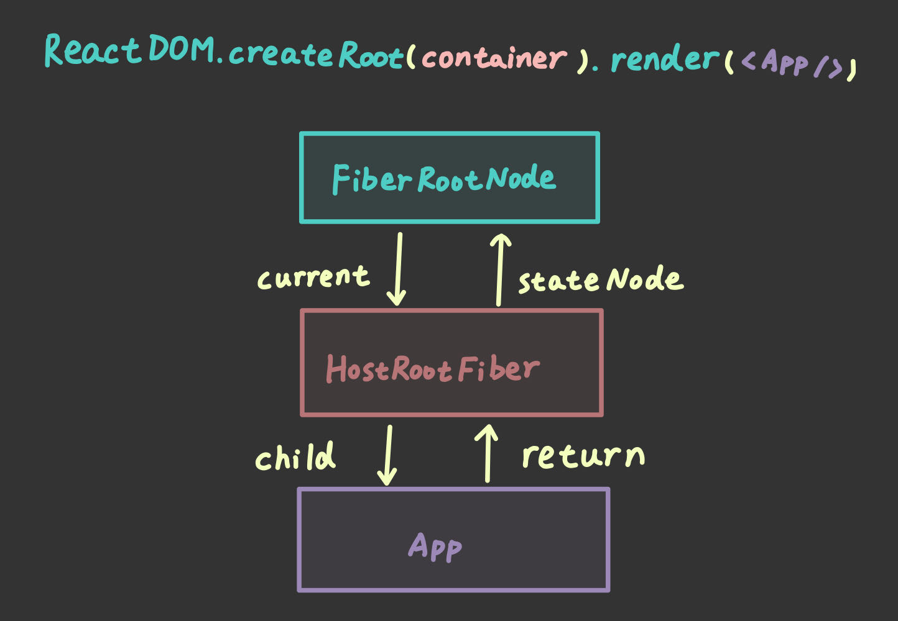
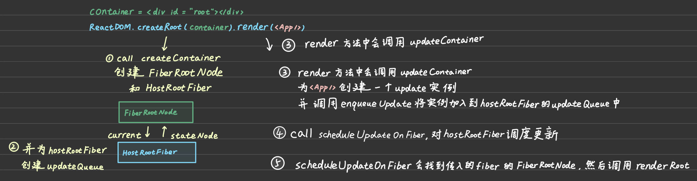

# 如何触发更新流程？

## 前言

上一篇文章中，我们在 `work-loop.ts` 中实现了 `renderRoot`，但是并没有调用方去调用它，那么这个函数在什么时候被谁调用呢？

首先可以想到的是，触发 renderRoot 的话，意味着触发了更新流程，那么来总结一下 React 中会触发更新流程的操作都有哪些：

- `ReactDOM.createRoot().render` or 旧版的 `ReactDOM.render`
- 类组件 `setState`
- 类组件 `forceUpdate`
- 函数组件 `useState dispatcher`
- 函数组件 `useReducer dispatcher`

对于不同的更新途径，我们希望有一套统一的更新机制，其具有如下特性：

- 能够兼容上面提到的多种触发更新的方式
- 为后面扩展优先级机制做铺垫

所以我们有必要在前期就设计好更新的机制

## 更新机制的组成部分

在 React 中，其实现了一个代表更新的数据结构 -- `Update` 以及消费 Update 的数据结构 -- `UpdateQueue`

- Update: **计算 state 的最小单位**
- UpdateQueue: **保存参与 state 计算的相关数据**

UpdateQueue 和 Update 的关系如下代码所示：

```TypeScript
interface UpdateQueue {
  shared: {
    pending: Update 环形链表
  }
}
```

当然，UpdateQueue 还有别的属性，这里只是为了体现它和 Update 的关系只列出了 `shared.pending` 属性

至于 Update 的结构，对于当前阶段，我们只需要知道其结构如下：

```TypeScript
interface Update {
  action: Action
}
```

`Action` 是什么呢？我们来回忆一下 React 中 `useState dispatcher` 的参数形式

```TypeScript
const [count, setCount] = useState(0)

// 1. dispatcher 直接传入新状态值触发更新
setCount(1)

// 2. dispatcher 传入函数触发更新
setCount((oldCount) => oldCount + 1)
```

这里的 Action 就对应着 dispatcher 参数的两种形式

事实上，在 React 中 action 属性是针对于 FunctionComponent 而言的，对于 ClassComponent 和 HostRoot，使用的是 `payload` 属性而不是 action

:::tip
关于这部分内容，可以阅读卡颂大神的 [《React 设计原理》](https://item.jd.com/13576643.html) 的 `6.2.2` 章节
:::

接下来我们就先来定义一下这两个重要组成部分叭~

## 定义 Update 和 UpdateQueue 类型

这两个类型只会在 `react-reconciler` 包中用到，因此只在该包中定义

而 `Action` 后续还会在 hooks 中用到，因此将其类型声明放到 `shared` 包中

`packages/react-reconciler/src/update-queue.ts`

```TypeScript
import type { Action } from '@plasticine-react/shared'

interface Update<State> {
  action: Action<State>
}

interface UpdateQueue<State> {
  shared: {
    pending: Update<State> | null
  }
}

export type { Update, UpdateQueue }
```

`packages/shared/src/react-types.ts`

```TypeScript
export type Action<State> = State | ((state: State) => State)
```

## 实现操作 Update 和 UpdateQueue 相关函数

我们需要实现：

- 创建 Update 和 UpdateQueue 对象的函数 -- `createUpdate` 和 `createUpdateQueue`
- 往 UpdateQueue 对象中添加 Update 对象的函数 -- `enqueueUpdate`
- 从 UpdateQueue 对象中消费 Update 对象的函数 -- `processUpdateQueue`

这里我们采用面向过程的写法

### createUpdate 和 createUpdateQueue

很简单，就是按照定义的类型去创建相应对象

```TypeScript
function createUpdate<State>(action: Action<State>): Update<State> {
  return {
    action,
  }
}

function createUpdateQueue<State>(): UpdateQueue<State> {
  return {
    shared: {
      pending: null,
    },
  }
}
```

### enqueueUpdate

接受一个 UpdateQueue 和一个 Update，并将 Update 加入到 UpdateQueue 的循环链表中，但是目前我们先不考虑循环链表的实现，仅仅是简单地将 Update 作为链表的第一个节点

```TypeScript
function enqueueUpdate<State>(
  updateQueue: UpdateQueue<State>,
  update: Update<State>,
): void {
  updateQueue.shared.pending = update
}
```

### processUpdateQueue

目前我们的消费逻辑仅仅针对于消费一个 Update 对象，接受一个 `baseState`，以及待消费的 Update 对象，然后将 baseState 交给 Update 对象消费后返回

```TypeScript
/**
 * @description 消费一个 Update 对象 -- 将 baseState 交给 Update 消费后返回新的 state
 */
function processUpdateQueue<State>(
  baseState: State,
  pendingUpdate: Update<State> | null,
): ProcessUpdateQueueReturnType<State> {
  const result: ProcessUpdateQueueReturnType<State> = {
    memoizedState: baseState,
  }

  if (pendingUpdate !== null) {
    const action = pendingUpdate.action
    if (action instanceof Function) {
      // baseState -- 1 | update -- (x) => x + 1 --> memoizedState -- 2
      result.memoizedState = action(baseState)
    } else {
      // baseState -- 1 | update -- 6 --> memoizedState -- 6
      result.memoizedState = action
    }
  }

  return result
}
```

## 梳理后续工作流

首先，在我们的更新机制运作起来之前，我们需要先实现一下 `mount` 时会调用的 API，也就是 `ReactDOM.createRoot(container).render` 这一流程

`createRoot(container)` 中，`container` 是真实 DOM 元素，对应的 `WorkTag` 为 `HostRoot`，对应的 fiber 我们称其为 `HostRootFiber`

`createRoot()` 返回值的类型是 `FiberRootNode`，调用其 render 方法时，接入到更新机制中

所以，接下来我们需要先去实现 `createRoot`，然后再去接入刚刚实现的这套更新机制

其次，在实现更新机制时有以下两点值得注意：

1. 更新流程可能由任意组件触发，但是更新流程的入口是根节点，也就是 `FiberRootNode`，从根节点开始递归进行更新流程，因此我们需要从发生更新的节点往上寻找，一直找到根节点为止
2. 需要有一个统一的根节点来管理通用信息

最后再说一下 `FiberRootNode` 和 `HostRootFiber` 的关系，如下图所示：



## 实现 FiberRootNode

要实现 `createRoot`，我们需要先声明其返回值 `FiberRootNode` 的类型

这里需要注意的是，`react-reconciler` 是与平台无关的，因此 `createRoot` 的 `container` 不能是和平台相关的 API，比如我们不能把它声明成 `HTMLElement` 这样的类型

所以我们需要抽象一个 `Container` 类型，具体的类型交给平台相关的包去完善，比如在 `react-dom` 包中使用 `react-reconciler` 时，可以让其指定 Container 的类型为 HTMLElement

为此，我们需要将这部分交由具体平台实现的类型抽离出来，放到一个名为 `host-config.ts` 的文件中管理

`packages/react-reconciler/src/host-config.ts`

```TypeScript
/**
 * @description 抽象出交由具体平台实现的类型
 */

/** @description createRoot(container) 中 container 的类型 */
export type Container = unknown
```

然后来实现 `FiberRootNode`

`packages/react-reconciler/src/fiber.ts`

```TypeScript
/**
 * @description createRoot() 的返回值类型
 */
class FiberRootNode {
  public container: Container
  public current: FiberNode

  /** @description 更新流程结束后的 HostRootFiber */
  public finishedWork: FiberNode | null

  constructor(container: Container, hostRootFiber: FiberNode) {
    this.container = container

    // 初始化 FiberRootNode 和 hostRootFiber 之间的引用关系
    this.current = hostRootFiber
    hostRootFiber.stateNode = this

    this.finishedWork = null
  }
}
```

接下来我们要搭建 `mount` 的流程

## 搭建 mount 流程

我们创建一个新的文件 -- `fiber-reconciler.ts`，在这里面实现两个函数：

- `createContainer`: 在调用 `createRoot` 的时候会调用该函数
- `updateContainer`: 在调用 `FiberRootNode` 的 `render` 方法的时候会调用该函数

首先来实现 `createContainer` 函数

### createContainer

在这里面我们会完成 `hostRootFiber` 和 `FiberRootNode` 的实例化，并且为 hostRootFiber 添加一个 `updateQueue` 属性，将其和前面实现的更新机制关联起来

`packages/react-reconciler/src/fiber-reconciler.ts`

```TypeScript
/**
 * @description 执行 createRoot 的时候会调用该函数初始化 FiberRootNode 和 hostRootFiber，并将 hostRootFiber 和更新机制关联起来
 */
function createContainer(container: Container) {
  const hostRootFiber = new FiberNode(HostRoot, {}, null)
  const root = new FiberRootNode(container, hostRootFiber)

  hostRootFiber.updateQueue = createUpdateQueue()

  return root
}
```

### updateContainer

当我们执行 `createRoot(container).render(<App />)` 时，会在 render 方法执行时执行 `updateContainer` 函数，在这里我们会为传入的 `<App />` 这一 ReactElement 对象创建一个 Update 对象，并将其加入到 `hostRootFiber` 的 `updateQueue` 中，这样一来之后触发更新流程的时候就能从 updateQueue 中获取到要更新的内容

也就是说我们把 `mount` 流程交由更新流程实现了

`packages/react-reconciler/src/fiber-reconciler.ts`

```TypeScript
/**
 * @description 执行 FiberRootNode 的 render 方法的时候会执行该函数，为待更新的 element 创建 Update 对象，并将其加入到 hostRootFiber.updateQueue 中
 * @param element ReactElement
 * @param root FiberRootNode
 */
function updateContainer(element: ReactElement, root: FiberRootNode) {
  const hostRootFiber = root.current

  // 为 element 实例化 Update 对象
  const update = createUpdate<ReactElement | null>(element)

  // 将 update 对象加入到 hostRootFiber 的 updateQueue 中，这样在更新流程中就能感知到需要 mound 的 element
  enqueueUpdate(
    hostRootFiber.updateQueue as UpdateQueue<ReactElement | null>,
    update,
  )

  return element
}
```

## 关联 renderRoot 和 updateContainer

现在我们在 `work-loop.ts` 中再实现一个 `scheduleUpdateOnFiber` 函数，顾名思义，传入一个 fiber，会根据该 fiber 进行更新调度

我们可以在 `updateContainer` 函数中调用 `scheduleUpdateOnFiber`，将刚加入过 `element` 对应的 `Update` 对象的 `hostRootFiber` 交给其进行更新调度

而在 `scheduleUpdateOnFiber` 中会去调用 `renderRoot`，以此将两者关联起来

另一方面，scheduleUpdateOnFiber 也是为了后面的 `react-scheduler` 的诞生包埋下伏笔

`packages/react-reconciler/src/work-loop.ts`

```TypeScript
/**
 * @description 对传入的 fiber 调度其 updateQueue
 */
function scheduleUpdateOnFiber(fiber: FiberNode) {}
```

不要忘了在 `updateContainer` 中调用该函数启动更新流程

```TypeScript
function updateContainer(element: ReactElement, root: FiberRootNode) {
  const hostRootFiber = root.current

  // 为 element 实例化 Update 对象
  const update = createUpdate<ReactElement | null>(element)

  // 将 update 对象加入到 hostRootFiber 的 updateQueue 中，这样在更新流程中就能感知到需要 mound 的 element
  enqueueUpdate(
    hostRootFiber.updateQueue as UpdateQueue<ReactElement | null>,
    update,
  )

  // 将更新流程交给调度函数处理 // [!code focus]
  scheduleUpdateOnFiber(hostRootFiber) // [!code focus]

  return element
}
```

对于 `scheduleUpdateOnFiber`，其作用是调度更新流程，而更新流程需要从 `FiberRootNode` 开始，因此对于传入的 fiber，我们要以其作为起点，不断往上移动，直到找到 `root` 为止，然后将 root 传给 `renderRoot` 完成渲染

所以我们需要先实现一个对给定的任意 fiber 找到其 root 的函数 -- `markUpdateFromFiberToRoot`

```TypeScript
/**
 * @description 从传入的 fiber 出发，寻找其所在 fiber tree 的 FiberRootNode
 * @param fiber FiberNode
 */
function markUpdateFromFiberToRoot(fiber: FiberNode): FiberRootNode | null {
  let node = fiber
  let parent = fiber.return

  while (parent !== null) {
    node = parent
    parent = parent.return
  }

  // node 此时是 hostRootFiber
  if (node.tag === HostRoot) {
    return node.stateNode as FiberRootNode
  }

  return null
}
```

然后再补充 `scheduleUpdateOnFiber` 的实现

```TypeScript
/**
 * @description 对传入的 fiber 调度其 updateQueue
 */
function scheduleUpdateOnFiber(fiber: FiberNode) {
  const root = markUpdateFromFiberToRoot(fiber)
  root !== null && renderRoot(root)
}
```

## 重构 renderRoot

现在有个问题，`scheduleUpdateOnFiber` 中调用 `renderRoot` 时传入的是 `FiberRootNode`，而上一篇文章中我们实现的 renderRoot 接收的参数类型是 `FiberNode`

显然现在需要重构一下 renderRoot 的实现了，再来看一下我们之前的 renderRoot 实现：

```TypeScript
function renderRoot(root: FiberNode) {
  // 初始化
  prepareFreshStack(root)

  // 开启工作循环
  workLoop()
}
```

其实主要受影响的是 `prepareFreshStack` 函数，所以我们只需要重构 prepareFreshStack 函数即可，而其之前的实现如下：

```TypeScript
function prepareFreshStack(root: FiberNode) {
  workInProgress = root
}
```

由于现在 root 的类型是 FiberRootNode，所以我们只需要做一个 FiberRootNode 到 workInProgress 的转换即可，因此我们再实现一个 `createWorkInProgress` 函数

```TypeScript
/**
 * @description 用于 prepareFreshStack 中根据 FiberRootNode 创建 workInProgress，也就是 hostRootFiber
 *              由于 react 双缓冲的特性，所以应当返回 current.alternate
 */
function createWorkInProgress(
  current: FiberNode,
  pendingProps: Props,
): FiberNode {
  let wip = current.alternate

  if (wip === null) {
    // mount

    // 首次挂载时不存在 current.alternate，因此初始化创建一个
    wip = new FiberNode(HostRoot, pendingProps, current.key)

    // hostRootFiber 的 stateNode 指向 FiberRootNode
    wip.stateNode = current.stateNode

    // 建立双缓冲的两棵 fiber tree 之间的联系
    wip.alternate = current
    current.alternate = wip
  } else {
    // update
    wip.pendingProps = pendingProps

    // 清除副作用相关属性
    wip.flags = NoFlags
  }

  // 发挥双缓冲的特性，尽可能复用 current 上的属性
  wip.type = current.type
  wip.updateQueue = current.updateQueue
  wip.child = current.child
  wip.memoizedProps = current.memoizedProps
  wip.memoizedState = current.memoizedState

  return wip
}
```

这里考虑到后续实现更新流程时会用到 `processUpdateQueue` 返回的 `memoizedState`，因此给 `FiberNode` 扩展了一个 `memoizedState` 属性

```TypeScript
class FiberNode {
  // ...
  public memoizedState: unknown // [!code focus]

  constructor(tag: WorkTag, pendingProps: Props, key: Key) {
    // ...
    this.memoizedState = null // [!code focus]
  }
}
```

最后我们再将其应用到 `prepareFreshStack` 中即可

```TypeScript
function prepareFreshStack(root: FiberRootNode) {
  workInProgress = createWorkInProgress(root.current, {})
}
```

## 总结

最后我们来总结一下 `ReactDOM.createRoot(container).render(<App />)` 的流程以及所有实现的函数的功能



`fiber-reconciler.ts`

- `createContainer`: 执行 createRoot 的时候会调用该函数初始化 FiberRootNode 和 hostRootFiber，并将 hostRootFiber 和更新机制关联起来
- `updateContainer`: 执行 FiberRootNode 的 render 方法的时候会执行该函数，为待更新的 element 创建 Update 对象，并将其加入到 hostRootFiber.updateQueue 中

`update-queue.ts`

- `createUpdate`: 创建 Update 实例
- `createUpdateQueue`: 创建 UpdateQueue 实例
- `enqueueUpdate`: 将 update 加入到 updateQueue 中
- `processUpdateQueue`: 消费一个 Update 对象 -- 将 baseState 交给 Update 消费后返回新的 state

`work-loop.ts`

- `scheduleUpdateOnFiber`: 对传入的 fiber 调度其 updateQueue
- `markUpdateFromFiberToRoot`: 从传入的 fiber 出发，寻找其所在 fiber tree 的 FiberRootNode

`fiber.ts`

- `createWorkInProgress`: 用于 prepareFreshStack 中根据 FiberRootNode 创建 workInProgress，也就是 hostRootFiber，由于 react 双缓冲的特性，所以应当返回 current.alternate
