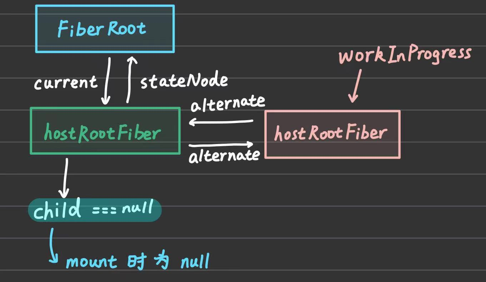

# 实现首屏渲染

:::tip
本篇文章对应代码可以到 [03_first-screen-rendering](https://github.com/plasticine-yang/plasticine-react/tree/03_first-screen-rendering) 分支查看
:::

## 前言

本篇文章的主要目的是实现首屏渲染，也就是 `mount` 的流程，对于 mount 的流程实际上是复用了更新流程的，并没有单独实现一个专门的 mount 流程，那么是如何复用更新流程的呢？这就是本篇文章要探讨的内容了

首先我们要明确一下更新流程会做什么事：

1. **生成 wip fiber tree**
2. **为 fiber tree 中的 fiber 节点标记副作用 flags**

上述两个步骤就是更新流程的核心目的，在完成了这两步之后，就可以交给 commit 阶段，根据每个节点的副作用 flags 去做出相应处理

那么 mount 的时候，wip fiber tree 并不存在，这就需要通过递归的方式去生成 fiber tree，并且在给每个 fiber tree 打上副作用 flags 的时候，为它们都打上 `Placement` 标记，也就是代表着要插入 fiber 对应的 ReactElement，这样不就实现 mount 了么？

可以看到，对于 mount 流程，完全可以复用更新的流程，所以 React 中没有必要单独实现一套 mount 的流程，但是上面这个只是我们目前初步的想法，实际上在 React 中是否真的是这样实现的呢？

在 React 中，大致流程和我们上面描述的一致，但是有一个点不一样。React 在 mount 时并不会为每个节点都打上 `Placement` 标记，只会为 `hostRootFiber` 打上 `Placement` 标记，那你可能就会好奇这样的话 fiber tree 的其余子节点要怎么在 commit 阶段实际渲染到 UI 中呢？这个问题就要在读完本篇文章后才能知晓了

接下来我们先来看看要做什么，上篇文章中，我们实际上只是搭建了整个更新流程的基本骨架，但是实际的 `生成 wip fiber tree` 和 `为 fiber tree 中的 fiber 节点标记副作用 flags` 这两个核心步骤并没有实现

而这两个实际上是分别在递归的 `递` 和 `归` 中完成的，也就是分别在 `beginWork` 和 `completeWork` 中完成，因加接下来我们的重点先放到这两个函数的实现上

## 前置知识 -- Fiber Flags 的分类

对于 `Fiber Flags`，我们将其分为两类：

- 结构变化相关：比如 `Placement`、`ChildDeletion` 这种会修改整个 fiber tree 结构的 flags
- 属性变化相关：比如 `Update` 这种对 fiber tree 的结构没影响，而是影响到具体 fiber 的 props 的

**在 `beginWork` 时为生成的 fiber 打上的标记都是结构变化相关的，在 `completeWork` 时为 fiber 打上的标记则是属性变化相关的**

## 预备工作 -- 添加 `__DEV__` 全局标识

在实现之前，我们先来做一个预备工作 -- 为项目添加 `__DEV__` 全局标识

为什么要添加这个标识呢？首先从其名字就能知道它是标识当前代码是否运行在开发环境下的，我们希望在开发环境下能够为使用者提供一些警告信息，而在生产环境下这些警告信息则不输出

那么你可能会问，“我直接用 `process.env.NODE_ENV`” 去标识不就好了，这样确实是可以，但是每次我们在遇到这种区分开发环境和生产环境的场景时，都要写这么一长串的话太麻烦了，所以采用这种全局标识的方式实现，开发体验会更好，事实上，在 React 和 Vue 中都是这么做的，那么要如何实现这样的全局标识呢？

由于我们的打包工具用的是 `rollup`，恰好 rollup 社区中有一个名为 `@rollup/plugin-replace` 的官方插件可以实现这个功能，其官方文档介绍如下：

> 🍣 A Rollup plugin which replaces targeted strings in files while bundling.

它能够在打包的时候识别配置的字符串，并将其替换成配置的值，这样一来我们能够配置类似 `__DEV__: process.env.NODE_ENV === 'development' ? true : false` 这样的配置项，这样就可以进行区分了

并且结合 rollup 的 `deadcode elimination` 能力，在生产环境下，代码中的 `if (__DEV__) {}` 都会被插件替换成 `if (false) {}`，从而不会将其打包到产物中，减小打包体积

首先安装该插件：

```shell
pnpm -C packages/cli i @rollup/plugin-replace
```

然后添加相应配置：

```TypeScript
function createReplaceConfig(config: RollupBuildConfig) {
  const { mode } = config

  const replaceConfig: RollupReplaceOptions = {
    // ============== plugin config ==============

    // Prevents replacing strings where they are followed by a single equals sign.
    preventAssignment: true,

    // ============== replace values ==============
    __DEV__: mode === 'development' ? true : false,
  }

  return replaceConfig
}
```

由于要在 TypeScript 中使用 `__DEV__` 这样一个全局标识，而 TypeScript 并不知道它是个啥玩意儿，所以我们还需要为其添加类型声明，在 `packages/react-reconciler/src` 中添加一个 `reconciler.d.ts` 文件

```TypeScript
/** @description 全局标识是否在开发环境中 */
declare let __DEV__: boolean
```

然后我们在 `react-reconciler` 包的入口中随便导出个变量，并且其值设置为 `__DEV__`

```TypeScript
const foo = __DEV__

export { foo }
```

执行 `pnpm build react-reconciler` 看看打包产物

```TypeScript
const foo = true;

export { foo };
```

再执行 `pnpm build react-reconciler --mode=production`

```TypeScript
const foo = false;

export { foo };
```

打包功能正常，接下来我们可以去实现 `beginWork` 和 `completeWork` 啦~

## beginWork

首先要明确一下 `beginWork` 的目的：

1. 生成下一个 fiber
2. 为生成的 fiber 打上标记

:::tip
这里需要说明一下，第二个目的需要区分所处阶段是 `mount` 时还是 `update` 时，`mount` 时是不需要打上标记的，这个稍后会详细讨论
:::

beginWork 作用的对象是 FiberNode，而 FiberNode 有多种类型，比如 `HostRoot`、`HostComponent`、`HostText`等，所以我们首先需要根据 FiberNode 的类型去执行不同的处理函数

`packages/react-reconciler/src/begin-work.ts`

```TypeScript
/**
 * @description 开始消费工作单元 消费完后应当返回 child 作为下一个工作单元
 */
function beginWork(workInProgress: FiberNode): FiberNode | null {
  switch (workInProgress.tag) {
    case HostRoot:
      return null

    case HostComponent:
      return null

    case HostText:
      return null

    default:
      if (__DEV__) {
        console.warn('beginWork: 尚未实现的 beginWork 情况', workInProgress)
      }
      return null
  }
}
```

### updateHostRoot

因为现在我们的目的是实现 mount 流程，所以先从 HostRoot 类型的 FiberNode 开始下手，实现一个 `updateHostRoot` 的函数，其目标节点是 HostRoot 也就是 hostRootFiber，是整个递归流程的起点

任务是对比 `旧的子 FiberNode` 和 `新的子 ReactElement`，并生成 `新的子 FiberNode` 返回作为下一个 beginWork 的工作单元

`旧的子 FiberNode` 可以从 `hostRootFiber.alternate.child` 获取

`新的子 ReactElement` 则需要通过消费 update 对象获得，update 对象从哪里来？

我们回到 mount 流程的入口，也就是执行 `createRoot(container).render(<App />)` 的 render 方法时调用的 `updateContainer` 中，它会为 `<App />` 创建一个 `Update` 对象，该对象的 `action` 就是 `<App />` 对应的 ReactElement

回顾一下消费 update 的实现 -- `processUpdateQueue`

```TypeScript
type ProcessUpdateQueueReturnType<State> = {
  memoizedState: State
}
/**
 * @description 消费一个 Update 对象 -- 将 baseState 交给 Update 消费后返回新的 state
 */
function processUpdateQueue<State>(
  baseState: State,
  pendingUpdate: Update<State> | null,
): ProcessUpdateQueueReturnType<State> {
  const result: ProcessUpdateQueueReturnType<State> = {
    memoizedState: baseState,
  }

  if (pendingUpdate !== null) {
    const action = pendingUpdate.action
    if (action instanceof Function) {
      // baseState -- 1 | update -- (x) => x + 1 --> memoizedState -- 2
      result.memoizedState = action(baseState)
    } else {
      // baseState -- 1 | update -- 6 --> memoizedState -- 6
      result.memoizedState = action
    }
  }

  return result
}
```

由于为 `<App />` 创建的 update 对象的 action 是一个值而不是函数，所以消费后得到的结果就是 `<App />` 这个 ReactElement 本身，即 `新的子 ReactElement`

详细流程放在代码注释中说明

`packages/react-reconciler/src/begin-work.ts`

```TypeScript
/**
 * @description 处理 HostRoot 的 FiberNode
 * @param workInProgress wip fiber tree 中待调和的 hostRootFiber
 */
function updateHostRoot(workInProgress: FiberNode) {
  // 获取 workInProgress 的 baseState 和待消费的 update
  const baseState = workInProgress.memoizedState as ReactElement
  const updateQueue = workInProgress.updateQueue as UpdateQueue<ReactElement>
  const pending = updateQueue.shared.pending // pending 是 Update<Element> 也就是待消费的 update

  // 消费 update -- 得到的 memoizedState 就是 updateContainer 时为 `<App />` 创建的 Update 对象中的 action，也就是 `<App />` 本身
  // 也就是说 mount 时，这里得到的 memoizedState 就是 `<App />` 对应的 ReactElement
  const { memoizedState } = processUpdateQueue(baseState, pending)

  // update 消费完毕后将其更新到 workInProgress 中 -- 此时 hostRootFiber.memoizedState === <App />
  workInProgress.memoizedState = memoizedState

  // update 消费完后需要将其清空
  updateQueue.shared.pending = null

  // 接下来需要获取到 `子 current FiberNode` 和 `子 ReactElement` 进行对比，并得到新的 `子 FiberNode`
  // 这里其实就是一个 diff 算法的过程了
  // `子 current FiberNode` 是旧 FiberNode
  // `子 ReactElement`  是新 ReactElement
  // 目的是生成新的子 FiberNode，这个过程交给 `reconcileChildren` 函数去处理
  const nextChildren: ReactElement = workInProgress.memoizedState // 子 ReactElement

  // 子 current FiberNode 可以通过 workInProgress.alternate.children 获取
  // 也就是 FiberRootNode.current.children
  reconcileChildren(workInProgress, nextChildren)

  // reconcileChildren 执行完后会将新的子 FiberNode 挂到 workInProgress.child 上，将其返回即可作为下一个工作单元
  return workInProgress.child
}
```

:::tip 思考
这里为什么要有 `reconcileChildren` 这个函数呢？直接把对比逻辑写在 `updateHostRoot` 函数里不就可以了吗？
:::

:::details 查看答案
这是因为我们还要考虑到之后对其他类型的 FiberNode 进行处理的时候也会有 `对比子节点获取新子节点` 的这样一个逻辑，比如稍后要实现的 `updateHostComponent` 就马上会用到，因此适合将其抽离成一个单独的函数去实现
:::

### updateHostComponent

以 `react-dom` 为例，HostComponent 指的就是诸如 `<div>hello</div>` 这样的普通 DOM 元素，我们要调用 `reconcileChildren` 去对比 DOM 属性是否发生变化，那就有一个问题，如何获取到 `reconcileChildren` 所需的第二个参数 -- `nextChildren` 呢？

:::details 查看答案
回忆我们在使用 React 的时候，如何获取到一个 DOM 元素的 children?

```TypeScript
const foo = <div>foo</div>
console.log(foo.props.children) // foo
```

同样地，我们也可以从其 fiber 的 `pendingProps.children` 中获取到 `nextChildren`
:::

代码实现如下：

`packages/react-reconciler/src/begin-work.ts`

```TypeScript
/**
 * @description 处理 HostComponent 的 FiberNode
 * @param workInProgress wip fiber tree 中待调和的 fiber
 */
function updateHostComponent(workInProgress: FiberNode): FiberNode | null {
  const nextProps = workInProgress.pendingProps
  const nextChildren = nextProps.children

  reconcileChildren(workInProgress, nextChildren)

  return workInProgress.child
}
```

相较于 `updateHostRoot`，主要是获取 `nextChildren` 的方式不同：

- updateHostRoot: 通过调用 `processUpdateQueue` 消费 update 获取 nextChildren
- updateHostComponent: 通过 `pendingProps` 获取 nextChildren

后续流程则都是一样的，交由 `reconcileChildren` 处理

至于 `HostText`，直接返回 `null` 即可，因为其不存在子节点了，不能也没必要调用 `reconcileChildren`

### reconcileChildren

前面已经实现了 beginWork 了，但其实它的核心在于实现 `reconcileChildren`，该函数才是 `递` 阶段的核心

先来明确一下 reconcileChildren 的任务：

- 接收 `workInProgress` 和 `待调和的 children`：可以从 workInProgress 中获取旧 children fiber，而新 children 则是 ReactElement
- 对比两者进行 diff 算法，并为新 children 生成 fiber 返回

根据上面的描述，我们需要先从 workInProgress 中获取旧 children fiber，也就是 `workInProgress.alternate.child`

在实现第二个核心任务之前，我们先来探讨下这个过程是否有可优化的地方

#### 性能优化策略 -- mount 时进行离屏渲染

理论上，mount 阶段我们需要在 reconcileChildren 中生成 fiber tree 的过程中，为每个 fiber 打上 `Placement` 标记，才能在 commit 阶段将它们渲染到 UI 上，但实际上这里存在一个优化策略

如果是一个个 fiber 打上 Placement 标记，那么在 commit 的时候，UI 也将会是一个个渲染出 fiber 节点对应的 ReactElement 的，这会频繁操作 DOM。但其实我们完全可以将 `hostRootFiber` 的子节点进行 `离屏渲染`，也就是在内存中将这些真实 DOM 创建出来，最后再一次性将 `hostRootFiber` 渲染出来，避免频繁地操作 DOM

也就是说，我们在打 `Placement` 标记时，只给 `hostRootFiber` 打上该标记即可，对于其子 fiber 我们不标记 `Placement`，那我们就需要有一种机制去实现上面说的 `离屏渲染` 才行，而对于 update 阶段，就没有这样的优化策略了

所以 reconcileChildren 中需要针对 mount 和 update 采取不同的实现，在 mount 时只给 `hostRootFiber` 打上 `Placement` 标记，对于其子 fiber 则不进行标记，update 则正常标记，给 fiber 打上标记这一行为在 React 中的专业术语叫做 **追踪副作用**

所以我们可以利用 **是否追踪副作用** 来区分 mount 和 update 的两种实现

#### 如何区分 mount 和 update 阶段

明白了上面的流程和原因后，我们要思考一下如何区分 mount 和 update 阶段呢？

:::details 查看答案
利用 mount 时 `wip.alternate.child === null` 也就是 current fiber tree 中除了 `hostFiberRoot` 外还没有子 fiber 这一特点进行区分


:::

#### ChildReconciler

为了区分两个阶段，我们需要两个不同的实现，在 React 中，mount 对应的实现名为 `mountChildFibers`，update 对应的实现名为 `reconcileChildFibers`

由于两者的实现仅在于是否要为生成的 fiber 打标记，也就是是否要追踪它们的副作用，除此之外的其他实现是一样的，因此适合用闭包的方式去实现

实现一个 `ChildReconciler` 函数，并且其有一个 `shouldTrackEffects` 控制是否追踪 fiber 的副作用属性，其内部的闭包函数根据 shouldTrackEffects 参数的值去控制是否要为生成的 fiber 打标记，并且主要的调和逻辑也是在该闭包函数内完成

`packages/react-reconciler/src/child-fibers.ts`

```TypeScript
/**
 * @description 用于为 mount 和 update 调和 children 时做区分
 *              mount 时为了离屏渲染进行性能优化，只为 hostRootFiber 追踪副作用，也就是给其打上 Placement
 *              update 时则正常追踪副作用
 * @param shouldTrackEffects 是否需要追踪 fiber 的副作用
 */
function ChildReconciler(shouldTrackEffects: boolean) {
  /**
   *
   * @param workInProgress wip fiber tree 上待调和的 fiber
   * @param currentFiber wip fiber 对应的 current fiber tree 中的 fiber
   * @param newChild 待调和的新 ReactElement
   */
  function reconcileChildFibers(
    workInProgress: FiberNode,
    currentFiber: FiberNode | null,
    newChild?: ReactElement,
  ) {}

  return reconcileChildFibers
}

/**
 * @description mount 阶段调和 children
 */
const mountChildFibers = ChildReconciler(false)

/**
 * @description update 阶段调和 children
 */
const reconcileChildFibers = ChildReconciler(true)

export { mountChildFibers, reconcileChildFibers }
```

然后 `reconcileChildren` 就可以分别为 mount 和 update 阶段调用这两个闭包函数

`packages/react-reconciler/src/child-fibers.ts`

```TypeScript
/**
 * @description 调和 children -- 根据 wip 旧的子 fiber 和 新的 ReactElement 生成新的子 fiber，并挂载到 wip.child 上
 * @param workInProgress wip fiber tree 上待调和的 fiber
 * @param children 待调和的新 ReactElement
 */
function reconcileChildren(workInProgress: FiberNode, children?: ReactElement) {
  // 获取 wip fiber 在 current fiber tree 上对应的 fiber -- 也就是旧 fiber
  const current = workInProgress.alternate

  // mount 时不存在旧 fiber，即 current === null，利用这点来区分 mount 和 update

  if (current !== null) {
    // update
    workInProgress.child = reconcileChildFibers(
      workInProgress,
      current,
      children,
    )
  } else {
    // mount
    workInProgress.child = mountChildFibers(workInProgress, null, children)
  }
}
```

现在我们的关注点转移到 `ChildReconciler` 中，主要是实现其内部的 `reconcileChildFibers` 函数，其会根据 `newChild` 的不同情况去调用不同的处理函数

- 对于 ReactElement 会调用 `reconcileSingleElement` 函数去处理
- 对于纯文本元素会调用 `reconcileSingleTextNode` 函数去处理

`packages/react-reconciler/src/child-fibers.ts`

```TypeScript
  /**
   *
   * @param workInProgress wip fiber tree 上待调和的 fiber
   * @param currentFiber wip fiber 对应的 current fiber tree 中的 fiber
   * @param newChild 待调和的新 ReactElement
   */
function ChildReconciler(shouldTrackEffects: boolean) {
  /**
   *
   * @param workInProgress wip fiber tree 上待调和的 fiber
   * @param currentFiber wip fiber 对应的 current fiber tree 中的 fiber
   * @param newChild 待调和的新 ReactElement
   */
  function reconcileChildFibers(
    workInProgress: FiberNode,
    currentFiber: FiberNode | null,
    newChild?: ReactElement,
  ) {
    // ReactElement
    if (typeof newChild === 'object' && newChild !== null) {
      switch (newChild.$$typeof) {
        case REACT_ELEMENT_TYPE:
          return reconcileSingleElement()

        default:
          if (__DEV__) {
            console.warn(
              'reconcileChildFibers: 尚未支持的 ReactElement 类型',
              newChild,
            )
          }
          break
      }
    }

    // TODO 多节点 -- ul > li*3

    // HostText
    if (typeof newChild === 'string' || typeof newChild === 'number') {
      return reconcileSingleTextNode()
    }

    // 尚未支持的 child
    if (__DEV__) {
      console.warn('reconcileChildFibers: 尚未支持的 child', newChild)
    }

    return null
  }

  function reconcileSingleElement() {}

  function reconcileSingleTextNode() {}

  return reconcileChildFibers
}
```

我们首先只考虑 ReactElement 和 纯文本节点的情况，其他的之后再说，接下来去实现 `reconcileSingleElement` 和 `reconcileSingleTextNode` 函数

##### reconcileSingleElement -- mount 时离屏渲染的关键

在这个函数中，我们需要为 ReactElement 创建对应的 fiber，所以我们需要先实现一个根据传入的 ReactElement 返回对应 fiber 的函数

`packages/react-reconciler/src/fiber.ts`

```TypeScript
/**
 * @description 根据传入的 ReactElement 创建其对应的 FiberNode
 * @param element ReactElement
 * @returns FiberNode
 */
function createFiberFromElement(element: ReactElement) {
  const { type, props, key } = element

  let fiberTag: WorkTag = FunctionComponent

  if (typeof type === 'string') {
    // <div>hello</div> --> HostComponent
    fiberTag = HostComponent
  } else if (typeof type !== 'function' && __DEV__) {
    console.warn(
      'createFiberFromElement: 尚未实现的 ReactElement type 类型',
      element,
    )
  }

  const fiber = new FiberNode(fiberTag, props, key)
  fiber.type = type
  return fiber
}
```

然后就是 `reconcileSingleElement`，还记得调和的核心任务是什么吗？

- 为待调和元素创建 fiber
- 给创建的 fiber 打上结构变化相关的标记

第一个我们已经完成了，那么第二个呢？这就需要再实现一个 `placeSingleChild` 函数去为 fiber 节点打上 `Placement` 标记了，由于需要考虑 mount 和 update 流程中是否为 fiber 打上标记，所以这个函数我们应当放到 `ChildReconciler` 闭包函数中去实现，因为可以从该闭包环境中获取到 `shouldTrackEffects` 参数

`packages/react-reconciler/src/child-fibers.ts`

```TypeScript
/**
 * @description 为 fiber 打上 `Placement` 标记
 * @param fiber 待打上 `Placement` 标记的 fiber
 * @returns 已打上 `Placement`  标记的 fiber (只在需要的时候打上标记)
 */
function placeSingleChild(fiber: FiberNode) {
  if (shouldtrackeffects && fiber.alternate === null) {
    // 只在应该追踪副作用 且 fiber 是首次渲染时才需要打上 Placement 标记
    fiber.flags |= Placement
  }

  // 其余情况不需要打上 Placement 标记
  return fiber
}
```

:::tip mount 时离屏渲染的关键

这里的 `if (shouldtrackeffects && fiber.alternate === null)` 是 mount 时离屏渲染的关键，mount 时 `reconcileChildren` 调用的是 `mountChildFibers`，也就是 `ChildReconciler(false)`，因此 mount 时所有的子 fiber 生成后都不会打上 Placement 标记

那所以整个 UI 要怎么渲染呢？关键点就在 `hostRootFiber` 身上，由于 mount 时整个 wip fiber tree 上只有 `hostRootFiber.alternate` 不是 `null`，所以其会走 `reconcileChildFibers` 而不是 `mountChildFibers`，这也就意味着会为 `<App />` 对应的 fiber 打上 `Placement` 标记

而整个离屏渲染则是在 `completeWork` 的时候完成的，当 `completeWork` 执行到 `hostRootFiber` 时，整个离屏 DOM Tree 已经生成好了，接下来就只需要交给 commit 阶段，当其发现 `<App />` 对应的 fiber 有 `Placement` 标记时，就会一次性将整个内存中的离屏 DOM Tree 挂载到真实 DOM 中，从而完成渲染，这样就避免了 mount 时对子树节点一个一个地渲染，造成性能浪费

具体的离屏 DOM Tree 如何生成我们会在 completeWork 的时候知晓

:::

完成了以上两个核心任务后，`reconcileSingleElement` 就能实现了

`packages/react-reconciler/src/child-fibers.ts`

```TypeScript
/**
 * @description 调和 current fiber 和 ReactElement
 * @param returnFiber 为 element 创建出的 fiber 的 return 指向
 * @param currentFiber 为 element 创建出的 fiber 的 alternate 指向
 * @param element 待创建 fiber 的 ReactElement
 * @returns 为 elemen 创建的 fiber
 */
function reconcileSingleElement(
  returnFiber: FiberNode,
  currentFiber: FiberNode | null,
  element: ReactElement,
) {
  // 为 element 创建 fiber
  const fiber = createFiberFromElement(element)

  fiber.return = returnFiber

  return fiber
}
```

##### reconcileSingleTextNode

类似地，也能够实现 `reconcileSingleTextNode` 了，区别只在于为文本元素创建 fiber 比较简单，不需要单独实现一个类似 `createFiberFromElement` 的函数，直接手动 new FiberNode 即可

`packages/react-reconciler/src/child-fibers.ts`

```TypeScript
/**
 * @description 调和 current fiber 和 文本元素
 * @param returnFiber 为 content 创建出的 HostText 类型的 fiber 的 return 指向
 * @param currentFiber 为 content 创建出的 HostText 类型的 fiber 的 alternate 指向
 * @param content 待创建 fiber 的 文本元素内容
 * @returns 为 content 创建的 fiber
 */
function reconcileSingleTextNode(
  returnFiber: FiberNode,
  currentFiber: FiberNode | null,
  content: string | number,
) {
  // 为 content 创建 HostText 类型的 fiber
  const fiber = new FiberNode(HostText, { content }, null)

  fiber.return = returnFiber

  return fiber
}
```

最后我们再把 `reconcileChildFibers` 完善下即可

`packages/react-reconciler/src/child-fibers.ts`

```TypeScript
function ChildReconciler(shouldTrackEffects: boolean) {
  /**
   *
   * @param workInProgress wip fiber tree 上待调和的 fiber
   * @param currentFiber wip fiber 对应的 current fiber tree 中的 fiber
   * @param newChild 待调和的新 ReactElement
   */
  function reconcileChildFibers(
    workInProgress: FiberNode,
    currentFiber: FiberNode | null,
    newChild?: ReactElement,
  ) {
    // ReactElement
    if (typeof newChild === 'object' && newChild !== null) {
      switch (newChild.$$typeof) {
        case REACT_ELEMENT_TYPE:
          // 为 newChild 生成 fiber 并打上 Placement 标记 // [!code focus]
          return placeSingleChild( // [!code focus]
            reconcileSingleElement(workInProgress, currentFiber, newChild), // [!code focus]
          ) // [!code focus]

        default:
          if (__DEV__) {
            console.warn(
              'reconcileChildFibers: 尚未支持的 ReactElement 类型',
              newChild,
            )
          }
          break
      }
    }

    // TODO 多节点 -- ul > li*3

    // HostText
    if (typeof newChild === 'string' || typeof newChild === 'number') {
      // 为 newChild 生成 fiber 并打上 Placement 标记 // [!code focus]
      return placeSingleChild( // [!code focus]
        reconcileSingleTextNode(workInProgress, currentFiber, newChild), // [!code focus]
      ) // [!code focus]
    }

    // 尚未支持的 child
    if (__DEV__) {
      console.warn('reconcileChildFibers: 尚未支持的 child', newChild)
    }

    return null
  }

  // ...

  return reconcileChildFibers
}
```

至此，`beginWork` 的流程就算实现完啦~

## completeWork

同样地，我们也要先明确一下 `completeWork` 的目的：

1. **为 `HostComponent` 和 `HostText` 构建离屏 DOM 树**
2. **每个 fiber 需要记录其子树的 flags**

### 为什么是在 completeWork 时构建离屏 DOM 树？

因为 completeWork 是对 wip fiber tree 进行自下而上遍历的过程，所以在 completeWork 时，子 fiber 是已经生成好的，因此我们可以在这个时候创建真实 DOM Tree

并且由于这些 fiber 都是没有 `Placement` 标记的，所以它们不会被 commit 阶段处理，而是作为一整棵存在于内存中的离屏 DOM Tree，最终在 `hostRootFiber.child` 被渲染到 UI 时一次性将整个离屏 DOM Tree 渲染到 UI 中

### 为什么要记录每个 fiber 的子树 flags？

试想一下，当 wip fiber tree 生成完毕后，commit 阶段是不是需要对被标记的 fiber 对应的 DOM 元素执行 flags 对应的 DOM 操作？那首先就遇到一个问题了，要怎么找到这些散落在 wip fiber tree 中各个 fiber 节点上的 flags?

如果通过从 hostRootFiber 开始往下遍历不断收集 flags 的话，在 fiber tree 结构比较复杂时，遍历耗时比较久，性能不太好

但是我们可以利用 `completeWork` 以及 `位运算` 的特点去完成 flags 的收集，只需要给 FiberNode 加一个 `subtreeFlags` 属性

然后在 completeWork 的时候其是自下而上遍历 wip fiber tree 的，所以在任意一个节点上我们都能够获取到其子节点，那么只需要将子节点的 `subtreeFlags` 以及子节点的 `flags` 通过 `按位或运算` 将其赋值到当前节点的 `subtreeFlags` 属性上

这样一来随着 completeWork 不断往上遍历，最终遍历回 hostRootFiber 节点时，其 `subtreeFlags` 属性就收集到了整颗 wip fiber tree 的 flags

也就是说，在 commit 阶段时无论处在哪个节点，都能够知道当前这颗子树有哪些副作用标记操作要执行

事实上，这一流程在 React 中被称为 “flags 冒泡”，在 `bubbleProperties` 函数中实现

### appendAllChildren -- 构建 DOM Tree

从 DOM 渲染的角度来看，`appendAllChildren` 函数是将所有的子元素添加到容器元素中，而由于我们操作的工作单元是 fiber，所以该函数的签名如下：

```TypeScript
function appendAllChildren(parent: HTMLElement, workInProgress: FiberNode): void {}
```

假设现在的渲染场景是这样的：

```tsx
const Foo: FC = () => {
  return <div>foo</div>
}

const Bar: FC = () => {
  return <div>bar</div>
}

const App: FC = () => {
  return (
    <div>
      <Foo />
      <Bar />
    </div>
  )
}

ReactDOM.createRoot(document.getElementById('root')).render(<App />)
```

假设此时 `parent` 是 `<App />` 中的 `<div>`，`workInProgress` 是 `<Foo />` 对应的 fiber，那么我们难道是将 `<Foo />` 这样的元素添加到 parent 指向的 `<div>` 中吗？显然不是，我们希望得到的 DOM 结构应当是将 `<Foo />` 中的 `<div>` 添加到 parent 指向的 `<div>` 中

也就是说，**从 fiber 中查找同级的 DOM 元素，可能需要跨 fiber 层级查找**，即 **fiber 的层级与 DOM 元素的层级可能不是一一对应的**

因此 appendAllChildren 的实现应当是一个和 fiber 遍历流程相同的递归流程，这样才能保证渲染的是 `<div>` 这样的 DOM 元素而不是 `<Foo />` 这样的元素

综上所述，appendAllChildren 的实现如下：

`packages/react-reconciler/src/complete-work.ts`

```TypeScript
/**
 * @description 将 workInProgress 的 fiber 对应的真实 DOM 添加到 parent 中
 * @param parent HTML 容器元素
 * @param workInProgress 待离屏渲染的 fiber
 */
function appendAllChildren(
  parent: HTMLElement,
  workInProgress: FiberNode,
): void {
  let node = workInProgress.child

  while (node !== null) {
    // node 是 DOM 对应的 fiber
    if (node.tag === HostComponent || node.tag === HostText) {
      // 往 parent 中插入 DOM 元素
      appendInitialChild(parent, node.stateNode)
    } else if (node.child !== null) {
      // node 不是 DOM 对应的 fiber，往 child 遍历寻找 DOM 对应的 fiber
      node.child.return = node
      node = node.child
      continue
    }

    // base case 1: 遍历到 parent 对应的 fiber
    if (node === workInProgress) return

    // 如果没有兄弟 fiber，则向父 fiber 遍历寻找 DOM 对应的 fiber
    while (node.sibling === null) {
      // base case 2: 回到 hostRootFiber 或 回到 parent 对应的 fiber
      if (node.return === null || node.return === workInProgress) return
      node = node?.return
    }

    // 遍历兄弟 fiber 寻找 DOM 对应的 fiber
    node.sibling.return = node.return
    node = node.sibling
  }
}
```

接下来我们就可以把 appendAllChildren 整合到 completeWork 中了

`packages/react-reconciler/src/complete-work.ts`

```TypeScript
/**
 * @description workLoop 的递归中的 `归` 阶段
 *              - mount 时进行离屏渲染
 *              - 为每个 fiber 记录 subtreeFlags
 */
function completeWork(workInProgress: FiberNode) {
  const newProps = workInProgress.pendingProps
  const current = workInProgress.alternate

  switch (workInProgress.tag) {
    case HostRoot:
      break

    case HostComponent:
      if (current !== null && workInProgress.stateNode) {
        // update
      } else {
        // mount

        // instance 是抽象出来的平台无关的节点实例 -- 比如 DOM 中创建 HTMLDivElement
        const instance = createInstance(workInProgress.type, newProps)
        appendAllChildren(instance, workInProgress)

        // fiber 的 stateNode 指向 DOM
        workInProgress.stateNode = instance
      }
      break

    case HostText:
      if (current !== null && workInProgress.stateNode) {
        // update
      } else {
        // mount

        // textInstance 是抽象出来的平台无关的文本节点实例 -- 比如 DOM 中创建文本节点 Text
        const textInstance = createTextInstance(workInProgress.type, newProps)

        // HostText 不存在 child，所以不需要调用 appendAllChildren
        // appendAllChildren(textInstance, workInProgress)

        // fiber 的 stateNode 指向 DOM
        workInProgress.stateNode = textInstance
      }
      break

    default:
      if (__DEV__) {
        console.warn(
          'completeWork: 尚未实现的 completeWork 情况',
          workInProgress,
        )
      }
      break
  }
}
```

这里把具体的 DOM 相关的操作抽象成平台无关的操作，前面我们已经将平台无关的代码都放到 `host-config.ts` 中维护了，这里我们先随意给一个实现，之后在实现 `ReactDOM` 的时候再具体去实现它们

`packages/react-reconciler/src/host-config.ts`

```TypeScript
/**
 * @description 创建具体平台实例 -- 比如创建 DOM 元素
 */
function createInstance(...args: any[]) {
  return {} as any
}

/**
 * @description 创建具体平台的文本实例 -- 比如创建 DOM 中的 Text
 */
function createTextInstance(...args: any[]) {
  return {} as any
}

/**
 * @description 往 parent 中插入元素
 */
function appendInitialChild(...args: any[]) {
  return {} as any
}
```

### flags 冒泡

前面分析的时候说过要给 FiberNode 添加一个 `subtreeFlags` 属性，其作用是记录 fiber 的子树中所有 fiber 的 flags

`packages/react-reconciler/src/fiber.ts`

```TypeScript
class FiberNode {
  // ...

  public subtreeFlags: Flags // [!code ++]

  constructor(tag: WorkTag, pendingProps: Props, key: Key) {
    // ...

    // Effects
    this.subtreeFlags = NoFlags // [!code ++]
  }
}
```

同时还要在 `createWorkInProgress` 中清除副作用相关属性时将 subtreeFlags 也清除

`packages/react-reconciler/src/fiber.ts`

```TypeScript
function createWorkInProgress(
  current: FiberNode,
  pendingProps: Props,
): FiberNode {
  let wip = current.alternate

  if (wip === null) {
    // mount

    // 首次挂载时不存在 current.alternate，因此初始化创建一个
    wip = new FiberNode(HostRoot, pendingProps, current.key)

    // hostRootFiber 的 stateNode 指向 FiberRootNode
    wip.stateNode = current.stateNode

    // 建立双缓冲的两棵 fiber tree 之间的联系
    wip.alternate = current
    current.alternate = wip
  } else {
    // update
    wip.pendingProps = pendingProps

    // 清除副作用相关属性
    wip.flags = NoFlags
    wip.subtreeFlags = NoFlags // [!code ++]
  }

  // 发挥双缓冲的特性，尽可能复用 current 上的属性
  wip.type = current.type
  wip.updateQueue = current.updateQueue
  wip.child = current.child
  wip.memoizedProps = current.memoizedProps
  wip.memoizedState = current.memoizedState

  return wip
}
```

然后就可以实现 `bubbleProperties` 函数了，在该函数中我们会完成 `flags 冒泡` 的操作

`packages/react-reconciler/src/complete-work.ts`

```TypeScript
/**
 * @description flags 冒泡 -- 收集 workInProgress 子 fiber tree 的 flags
 * @param workInProgress 待操作 fiber
 */
function bubbleProperties(workInProgress: FiberNode) {
  let subtreeFlags = NoFlags
  let child = workInProgress.child

  while (child !== null) {
    // 收集 child 的子树 flags
    subtreeFlags |= child.subtreeFlags

    // 收集 child 自身的 flags
    subtreeFlags |= child.flags

    // 建立 child 和 workInProgress 的联系
    child.return = workInProgress

    // 收集 sibling 的 subtreeFlags
    child = child.sibling
  }

  // 将收集结果存入 workInProgress 中
  workInProgress.subtreeFlags |= subtreeFlags
}
```

然后在 completeWork 中调用它

`packages/react-reconciler/src/complete-work.ts`

```TypeScript
function completeWork(workInProgress: FiberNode) {
  const newProps = workInProgress.pendingProps
  const current = workInProgress.alternate

  switch (workInProgress.tag) {
    case HostRoot:
      bubbleProperties(workInProgress) // [!code focus]
      break

    case HostComponent:
      if (current !== null && workInProgress.stateNode) {
        // update
      } else {
        // mount

        // instance 是抽象出来的平台无关的节点实例 -- 比如 DOM 中创建 HTMLDivElement
        const instance = createInstance(workInProgress.type, newProps)
        appendAllChildren(instance, workInProgress)

        // fiber 的 stateNode 指向 DOM
        workInProgress.stateNode = instance
      }

      bubbleProperties(workInProgress) // [!code focus]
      break

    case HostText:
      if (current !== null && workInProgress.stateNode) {
        // update
      } else {
        // mount

        // textInstance 是抽象出来的平台无关的文本节点实例 -- 比如 DOM 中创建文本节点 Text
        const textInstance = createTextInstance(newProps.content)

        // HostText 不存在 child，所以不需要调用 appendAllChildren
        // appendAllChildren(textInstance, workInProgress)

        // fiber 的 stateNode 指向 DOM
        workInProgress.stateNode = textInstance
      }

      bubbleProperties(workInProgress) // [!code focus]
      break

      break

    default:
      if (__DEV__) {
        console.warn(
          'completeWork: 尚未实现的 completeWork 情况',
          workInProgress,
        )
      }
      break
  }
}
```

flags 冒泡完后，在任意一个 fiber 中都能够通过 `subtreeFlags` 属性知道以该 fiber 为根节点的 fiber tree 是否存在副作用需要处理，方便 commit 阶段的时候使用

## 对接 commitRoot

现在我们的 reconciler 就算完成了，也就是 render 阶段算是实现了，接下来的流程要交给 commit 阶段去处理，我们先与其对接一下，至于 commit 阶段的实现，会在下篇文章中讲解

要如何对接呢？commit 阶段肯定需要获取到整颗调和好了的 fiber tree，我们将调和好的 fiber tree，也就是 `workLoop` 结束后的 `workInProgress` 挂载到 `FiberRootNode` 的 `finishedWork` 属性上，再将整个 FiberRootNode 交给 `commitRoot` 函数即可

而 `workInProgress` 可以通过 `root.current.alternate` 获取到，因为无论时调和之前还是调和之后，`root.current` 都是指向旧 fiber tree 的 `hostRootFiber` 的，通过其 `alternate` 属性即可获取到调和后的 `hostRootFiber`，具体代码如下：

`packages/react-reconciler/src/complete-work.ts`

```TypeScript
/**
 * @description 渲染根元素 -- 工作流入口
 * @param root 根元素的 fiber
 */
function renderRoot(root: FiberRootNode) {
  // 初始化
  prepareFreshStack(root)

  // 开启工作循环
  workLoop()

  // 工作循环结束后说明 reconcile 完毕 -- 更新 roo.finishedWork 指向完整的以 hostRootFiber 为根节点的 fiber tree // [!code focus]
  const finishedWork = root.current.alternate // [!code focus]
  root.finishedWork = finishedWork // [!code focus]

  // 接下来交给 commit 阶段去根据 reconcile 时给每个 fiber 打上的 flags 去进行宿主环境中的渲染 // [!code focus]
  commitRoot(root) // [!code focus]
}
```

这里还有一个小细节可以优化一下，因为我们现在有 `__DEV__` 全局标识，而我们无法保证 `workLoop()` 的执行会有什么预期之外的错误，所以可以用 `try catch` 包裹处理一下，并且在开发环境下输出错误信息

```TypeScript
function renderRoot(root: FiberRootNode) {
  // 初始化
  prepareFreshStack(root)

  try { // [!code focus]
    // 开启工作循环 // [!code focus]
    workLoop() // [!code focus]
  } catch (error) { // [!code focus]
    if (__DEV__) { // [!code focus]
      console.error('workLoop 发生错误:', error) // [!code focus]
    } // [!code focus]
  } // [!code focus]

  // 工作循环结束后说明 reconcile 完毕 -- 更新 roo.finishedWork 指向完整的以 hostRootFiber 为根节点的 fiber tree
  const finishedWork = root.current.alternate
  root.finishedWork = finishedWork

  // 接下来交给 commit 阶段去根据 reconcile 时给每个 fiber 打上的 flags 去进行宿主环境中的渲染
  // commitRoot(root)
}
```

:::tip
本篇文章对应代码可以到 [03_first-screen-rendering](https://github.com/plasticine-yang/plasticine-react/tree/03_first-screen-rendering) 分支查看
:::
