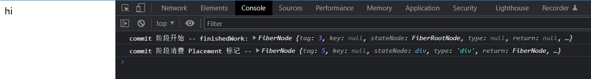

# 初探 react-dom

:::tip
本篇文章对应代码可以到 [04_preliminary_react_dom](https://github.com/Plasticine-Yang/plasticine-react/tree/04_preliminary_react_dom) 分支查看
:::

## 前言

前面我们实现的初版 `react-reconciler`，其运行时在 React 中被称为 `render` 阶段，它已经能够将传入的具有单节点的 JSX 转换成对应的 fiber tree

而本节我们要实现的 `react-dom` 模块，其运行时在 React 中被称为 `commit` 阶段，用于处理生成的 fiber tree，根据每个 fiber 的副作用 flags，将这些副作用“提交”到宿主环境中，就像使用 git 的时候提交代码那样，提交后就能在宿主环境中看到对应的 UI 了

站在前端工程师的视角，和我们接触最密切的就是 `react-dom` 这个包了，其对应的宿主环境就是浏览器，因此本节主要是以该包为例来讲解 `commit` 阶段的工作流程

## commit 流程概览

之前的 render 阶段有两个子阶段：

- `beginWork`
- `completeWork`

在 commit 阶段也是类似的，也有自己的子阶段，并且它的子阶段更多，有三个子阶段：

- `beforeMutation`
- `mutation`
- `layout`

render 阶段中的 `completeWork` 子阶段会“自下而上”为 fiber 标记 subtreeFlags，类比来看，commit 阶段的三个子阶段都会“自下而上”地消费 subtreeFlags

那么这三个子阶段分别会做什么事情呢？

### beforeMutation

主要处理 `ClassComponent` 和 `HostRoot` 类型的 fiber

- ClassComponent: 执行其 `getSnapshotBeforeUpdate` 方法
- HostRoot: 清空 HostRoot 挂载的内容，方便 mutation 阶段渲染

### mutation

DOM API 主要就是在这里被调用的，对于 HostComponent，会进行 DOM 元素的增、删、改

其次，在 mutation 阶段结束后，进入到 layout 阶段之前，会进行 fiber tree 的切换，让当前的 finishedWork 作为 current fiber tree，这样在下一次 render 阶段中就能够获取到旧的 fiber 节点进行 diff 算法的比对了

```TypeScript
root.current = finishedWork
```

### layout

layout 阶段的主要工作是对 `OffscreenComponent` 的显/隐逻辑控制，常见于 Suspense 异步组件中

## commitWork

知道了 commit 阶段的大概流程后，我们就要准备开始实现了，首先 commit 阶段的入口是 `commitRoot` 这个函数，其接受 render 阶段的产物 -- 打上副作用 flags 的 fiber tree，并根据这些 flags 去分配三个子阶段的工作，commitRoot 的骨架大致如下：

`packages/react-reconciler/src/work-loop.ts`

```TypeScript
/**
 * @description commit 阶段入口
 * @param root 带有 render 阶段产物 finishedWork 的 FiberRootNode
 */
function commitRoot(root: FiberRootNode) {
  const finishedWork = root.finishedWork

  if (finishedWork === null) return

  if (__DEV__) {
    console.log('commit 阶段开始 -- finishedWork:', finishedWork)
  }

  // finishedWork 变量已经保存了 root.finishedWork 的引用，可以重置 root.finishedWork
  root.finishedWork = null

  // 根据 subtreeFlags 决定各阶段是否需要进入

  // beforeMutation

  // mutation

  // layout
}
```

现在的问题就是如何知道是否进入 beforeMutaion, mutation, layout 这三个子阶段呢？这就要用到 mask 掩码的原理了

### mask 掩码

比如说 mutation 阶段只处理带有 `Placement`, `Update` 和 `ChildDeletion` 标记的 fiber，那么可以声明一个 mask 常量 `MutationMask`，其值为这三种 flag 进行按位或运算后的结果

那么在判断是否要进入 beforeMutation 阶段时就可以用 `(finishedWork.subtreeFlags & MutationMask) !== NoFlags` 来判断是否需要进入 beforeMutation 阶段了

`packages/react-reconciler/src/fiber-flags.ts`

```TypeScript
/**
 * @description 为 fiber 打上的标记
 */
export enum Flags {
  NoFlags = /*                      */ 0b000000000000000000000000000,

  /** @description 插入元素 */
  Placement = /*                    */ 0b000000000000000000000000010,

  /** @description 更新元素 */
  Update = /*                       */ 0b000000000000000000000000100,

  /** @description 删除元素 */
  ChildDeletion = /*                */ 0b000000000000000000000010000,
}

/**
 * @description commit 阶段的 beforeMutation 子阶段需要处理的 fiber flags
 */
export const MutationMask = Flags.Placement | Flags.Update | Flags.ChildDeletion
```

---

知道了 mask 掩码的原理后，我们就可以将其应用到我们的代码中了，如果一次 commit 阶段没有任何的副作用 flags，那么它也不会进入三个阶段的任何一个阶段，所以这里需要有一个 `subtreeHasEffects` 和 `rootHasEffects` 标识一下是否有必要进入三个子阶段

`packages/react-reconciler/src/work-loop.ts`

```TypeScript
function commitRoot(root: FiberRootNode) {
  const finishedWork = root.finishedWork

  if (finishedWork === null) return

  if (__DEV__) {
    console.log('commit 阶段开始 -- finishedWork:', finishedWork)
  }

  // finishedWork 变量已经保存了 root.finishedWork 的引用，可以重置 root.finishedWork
  root.finishedWork = null

  const subtreeHasEffects =
    (finishedWork.subtreeFlags & MutationMask) !== NoFlags
  const rootHasEffects = (finishedWork.flags & MutationMask) !== NoFlags

  if (subtreeHasEffects || rootHasEffects) {
    // beforeMutation
    // mutation
    // layout
  } else {
  }
}
```

目前我们只实现 mutation 阶段，另外两个阶段之后实现的时候再把相应 mask 掩码补上然后加到 `subtreeHasFlags` 和 `rootHasFlags` 中即可

### 实现 mutation 阶段

前面分析 commit 流程的时候也提到过，mutation 阶段主要就两个任务：

- DOM API 的调用
- fiber tree 的切换

fiber tree 的切换其实很简单，就是修改一下 `root.current` 的指向，这个我们现在就可以做到，只需要在 mutation 阶段结束，进入 layout 阶段之前修改即可

其次，即便没有进入 mutation 阶段，也要切换 fiber tree，起到双缓存的效果

`packages/react-reconciler/src/work-loop.ts`

```TypeScript
function commitRoot(root: FiberRootNode) {
  const finishedWork = root.finishedWork

  if (finishedWork === null) return

  if (__DEV__) {
    console.log('commit 阶段开始 -- finishedWork:', finishedWork)
  }

  // finishedWork 变量已经保存了 root.finishedWork 的引用，可以重置 root.finishedWork
  root.finishedWork = null

  const subtreeHasEffects =
    (finishedWork.subtreeFlags & MutationMask) !== NoFlags
  const rootHasEffects = (finishedWork.flags & MutationMask) !== NoFlags

  if (subtreeHasEffects || rootHasEffects) {
    // beforeMutation
    // mutation

    // fiber tree 切换 -- 使当前的 finishedWork 成为 current fiber tree，作为下一次 render 阶段的旧 fiber tree // [!code focus]
    root.current = finishedWork // [!code focus]

    // layout
  } else {
    // 即便不进行任何操作，也要切换 fiber tree // [!code focus]
    root.current = finishedWork // [!code focus]
  }
}
```

整个 mutation 阶段的入口我们放到单独的 `commitMutationEffects` 函数中去实现，前面也说了 mutation 阶段等三个子阶段都是“自下而上”消费 subtreeFlags 的，那么也就是说和 render 阶段类似，存在一个 DFS 遍历 fiber tree 的流程

并且真正的消费 subtreeFlags 是在“归”的时候进行的，也就是像下面这样：

`packages/react-reconciler/src/commit-work.ts`

```TypeScript
/**
 * @description commit 阶段 mutation 子阶段入口
 * @param finishedWork 带有 MutationMask 的 fiber tree root
 */
function commitMutationEffects(finishedWork: FiberNode) {
  nextEffect = finishedWork

  while (nextEffect !== null) {
    // 向下遍历找到不是 mutation 阶段需要的 subtreeFlags 或者遍历到叶子节点
    const child: FiberNode | null = nextEffect.child

    if (
      (nextEffect.subtreeFlags & MutationMask) !== NoFlags &&
      child !== null
    ) {
      // 还没到该“归”的时候，继续向下“递”
      nextEffect = child
    } else {
      // 到“归”的时候了
      up: while (nextEffect !== null) {
        xxx() // 执行消费 subtreeFlags 的逻辑

        const sibling: FiberNode | null = nextEffect.sibling

        if (sibling !== null) {
          // 存在兄弟节点 那么就沿着兄弟节点继续往下“递”
          nextEffect = sibling
          break up
        }

        // 没有兄弟节点 那么只能继续沿着 return 往上“归”
        nextEffect = nextEffect.return
      }
    }
  }
}
```

这个遍历顺序在 render 阶段的时候已经写过很多次了，就不过多讲解了，现在的重点主要是这里的 `xxx` 函数，它用于真正消费 `subtreeFlags`，也就是说我们将在这里进行 DOM API 的调用，遇到 `Placement` 标记就执行类似 `parentDOM.appendChild()` 这样的操作

这个 `xxx` 函数在 React 中的名字为 `commitMutationEffectsOnFiber`

#### 处理 Placement 标记

首先我们来处理带有 Placement 标记的 fiber，处理完后的效果就是一个 fiber 会被真正的渲染到宿主环境 UI 中

先将调用处理 Placement 标记的函数的地方完善一下，也就是在 `commitMutationEffectsOnFiber` 中完善代码

`packages/react-reconciler/src/commit-work.ts`

```TypeScript
/**
 * @description 消费 MutationMask 相关的 subtreeFlags
 * @param finishedWork 带有 MutationMask 需要的 subtreeFlags 的 fiber
 */
function commitMutationEffectsOnFiber(finishedWork: FiberNode) {
  const flags = finishedWork.flags

  if ((flags & Placement) !== NoFlags) {
    commitPlacement(finishedWork)

    // 消费完 Placement 标记后将该标记移除
    finishedWork.flags &= ~Placement
  }
}
```

`commitPlacement` 就是用于处理 `Placement` 标记的函数，该函数的流程如下：

1. 从 finishedWork 触发，向上遍历找到宿主环境中的父节点，以 DOM 环境为例就是找到 `parent DOM`

实现一个 `getHostParent` 函数完成

`packages/react-reconciler/src/commit-work.ts`

```TypeScript
/**
 * @description 消费带有 Placement 标记的 fiber
 * @param finishedWork 带有 Placement 标记的 fiber
 */
function commitPlacement(finishedWork: FiberNode) {
  if (__DEV__) {
    console.log('commit 阶段消费 Placement 标记 --', finishedWork)
  }

  // parent DOM
  const hostParent = getHostParent(finishedWork)
}

/**
 * @description 获取 fiber 的 stateNode 在宿主环境中的 Container
 * @param fiber FiberNode
 * @returns fiber 的 stateNode 在宿主环境中的 Container
 */
function getHostParent(fiber: FiberNode): Container {
  let parent = fiber.return

  while (parent !== null) {
    const parentTag = parent.tag

    switch (parentTag) {
      case HostComponent:
        return parent.stateNode

      case HostRoot:
        return (parent.stateNode as FiberRootNode).container as Container

      default:
        parent = parent.return
        break
    }
  }

  if (__DEV__) {
    console.warn('getHostParent 未找到 hostParent, 操作的 fiber:', fiber)
  }
}
```

2. 将 finishedWork 的 child 中是 `HostComponent` 或 `HostText` 的 fiber 添加到 `parent DOM` 中

实现一个 `appendPlacementNodeIntoContainer` 函数完成

`packages/react-reconciler/src/commit-work.ts`

```TypeScript
/**
 * @description 消费带有 Placement 标记的 fiber
 * @param finishedWork 带有 Placement 标记的 fiber
 */
function commitPlacement(finishedWork: FiberNode) {
  if (__DEV__) {
    console.log('commit 阶段消费 Placement 标记 --', finishedWork)
  }

  // parent DOM
  const hostParent = getHostParent(finishedWork)

  // 将 finishedWork 中 HostComponent 或 HostText 类型的 fiber 对应的 stateNode
  // 添加到宿主环境的容器元素 hostParent 中
  appendPlacementNodeIntoContainer(finishedWork, hostParent)
}

/**
 * @description
 * 将 finishedWork 中 HostComponent 或 HostText 类型的 fiber 对应的 stateNode
 * 添加到宿主环境的容器元素 hostParent 中
 *
 * 因为传进来的 finishedWork 其类型不一定是 HostComponent 或 HostText
 * 所以存在一个向下遍历直到找到符合条件的 fiber 的过程
 * @param finishedWork 待添加到 hostParent 中的 fiber
 * @param hostParent 宿主环境的容器元素
 */
function appendPlacementNodeIntoContainer(
  finishedWork: FiberNode,
  hostParent: Container,
) {
  const tag = finishedWork.tag
  if (tag === HostComponent || tag === HostText) {
    // base case: 找到了 HostComponent 或 HostText 类型的 fiber
    appendChildToContainer(finishedWork.stateNode, hostParent)
    return
  }

  // 向下遍历直到找到 HostComponent 或 HostText 类型的 fiber
  const child = finishedWork.child

  if (child !== null) {
    appendPlacementNodeIntoContainer(child, hostParent)

    // 将同层的兄弟节点也插入到 hostParent 中
    let sibling = child.sibling
    while (sibling !== null) {
      appendPlacementNodeIntoContainer(sibling, hostParent)
      sibling = sibling.sibling
    }
  }
}
```

这里 `appendChildToContainer` 是一个平台无关的操作，应当交给具体平台去实现，所以放到 `host-config.ts` 中

`packages/react-reconciler/src/host-config.ts`

```TypeScript
/**
 * @description 往 parent 中插入 child
 */
function appendChildToContainer(...args: any[]) {
  return {} as any
}
```

## 重构 host-config

到目前为止，我们的代码还都是在 `react-reconciler` 中编写的，我们已经实现了对 Placement 标记的处理，也就是说应当具备受屏渲染单节点子元素的能力了

出于跨平台的考虑，之前我们有将所有具体渲染平台相关的函数抽象到 `host-config.ts` 中，现在我们希望看一下其在浏览器的受屏渲染效果，所以需要实现 `react-dom` 包，去实现那些抽象出来的渲染相关 API

但是思考一下，目前我们的 `react-reconciler` 的 `host-config.ts` 中仅仅只是把这些函数罗列出来，并没有一个入口提供给具体实现平台去实现，所以我们需要重构一下 `host-config.ts`，提供一个实现这些渲染 API 的入口

大致思路是实现一个 `initHostConfig` 函数，接受传入的 `HostConfig`，然后逐一将它们赋值到预定义的相关函数中，代码如下：

`packages/react-reconciler/src/host-config.ts`

```TypeScript
/* eslint-disable @typescript-eslint/no-unused-vars */

/**
 * @description 抽象出交由具体平台实现的类型
 */

import type { Props } from '@plasticine-react/shared'

import { FiberNode } from './fiber'

/** @description createRoot(container) 中 container 的类型 */
type Container = unknown

interface HostConfig<Container = any, Instance = any, TextInstance = any> {
  /** @description 创建具体平台实例 -- 比如创建 DOM 元素 */
  createInstance: (type: FiberNode['type'], newProps: Props) => Instance

  /** @description 创建具体平台的文本实例 -- 比如创建 DOM 中的 Text */
  createTextInstance: (content: string) => TextInstance

  /** @description 往 parent 中插入元素 */
  appendInitialChild: (
    parent: Container,
    child: Instance | TextInstance,
  ) => void

  /** @description 往 parent 中插入 child */
  appendChildToContainer: (
    child: Instance | TextInstance,
    container: Container,
  ) => void
}

let createInstance: HostConfig['createInstance'] = (type, newProps) => {
  throw new Error('Function not implemented.')
}

let createTextInstance: HostConfig['createTextInstance'] = (content) => {
  throw new Error('Function not implemented.')
}

let appendInitialChild: HostConfig['appendInitialChild'] = (parent, child) => {
  throw new Error('Function not implemented.')
}

let appendChildToContainer: HostConfig['appendChildToContainer'] = (
  child,
  container,
) => {
  throw new Error('Function not implemented.')
}

/**
 * @description 具体平台实现时通过调用该函数来传入 hostConfig
 */
function initHostConfig<Instance>(hostConfig: HostConfig<Instance>) {
  createInstance = hostConfig.createInstance
  createTextInstance = hostConfig.createTextInstance
  appendInitialChild = hostConfig.appendInitialChild
  appendChildToContainer = hostConfig.appendChildToContainer
}

export type { Container, HostConfig }

export {
  createInstance,
  createTextInstance,
  appendInitialChild,
  appendChildToContainer,
  initHostConfig,
}
```

再在 `react-reconciler` 的入口导出一个 `ReactReconciler` 类，并且构造函数接收一个 `HostConfig`，然后在构造函数中调用 `initHostConfig` 即可

```TypeScript
import { createContainer, updateContainer } from './fiber-reconciler'
import { HostConfig, initHostConfig } from './host-config'

class ReactReconciler<Container, Instance, TextInstance> {
  constructor(hostConfig: HostConfig<Container, Instance, TextInstance>) {
    initHostConfig(hostConfig)
  }

  createContainer = createContainer<Container>
  updateContainer = updateContainer
}

export type { HostConfig } from './host-config'

export default ReactReconciler
```

## react-dom

`react-dom` 中主要是实现 `HostConfig`，并实现 `createRoot` 函数，其本质就是实例化一个 `ReactReconciler`，然后调用其 `createContainer`，并返回一个带有 `render` 方法的对象，`render` 方法中则会调用 `ReactReconciler` 实例的 `updateContainer` 方法

1. 实现 `HostConfig` 接口

```TypeScript
import { HostConfig } from '@plasticine-react/react-reconciler'

type Container = Element
type Instance = Element
type TextInstance = Text

const hostConfig: HostConfig<Container, Instance, TextInstance> = {
  createInstance(type) {
    const element = document.createElement(type)
    return element
  },

  createTextInstance(content) {
    return document.createTextNode(content)
  },

  appendInitialChild(parent, child) {
    parent.appendChild(child)
  },

  appendChildToContainer(child, container) {
    container.appendChild(child)
  },
}

export type { Container, Instance, TextInstance }

export { hostConfig }
```

2. 实现 `createRoot` 函数

```TypeScript
import type { ReactElement } from '@plasticine-react/shared'

import ReactReconciler from '@plasticine-react/react-reconciler'

import { Container, hostConfig } from './host-config'

const reconciler = new ReactReconciler(hostConfig)

function createRoot(container: Container) {
  const root = reconciler.createContainer(container)

  return {
    render(element: ReactElement) {
      reconciler.updateContainer(element, root)
    },
  }
}

export { createRoot }
```

现在在 `playground` 示例项目中安装我们的 `react-dom`，并编写一个简单的示例看看能否渲染：

`playground/src/main.tsx`

```TypeScript
//@ts-ignore
import React from '@plasticine-react/react'

//@ts-ignore
import ReactDOM from '@plasticine-react/react-dom'

const el = React.createElement('div', { children: 'hi' })

ReactDOM.createRoot(document.querySelector<HTMLDivElement>('#root')).render(el)
```

效果如下：



可以看到能够顺利渲染，至此我们的初版 `react-dom` 就实现完啦~

:::tip
本篇文章对应代码可以到 [04_preliminary_react_dom](https://github.com/Plasticine-Yang/plasticine-react/tree/04_preliminary_react_dom) 分支查看
:::
