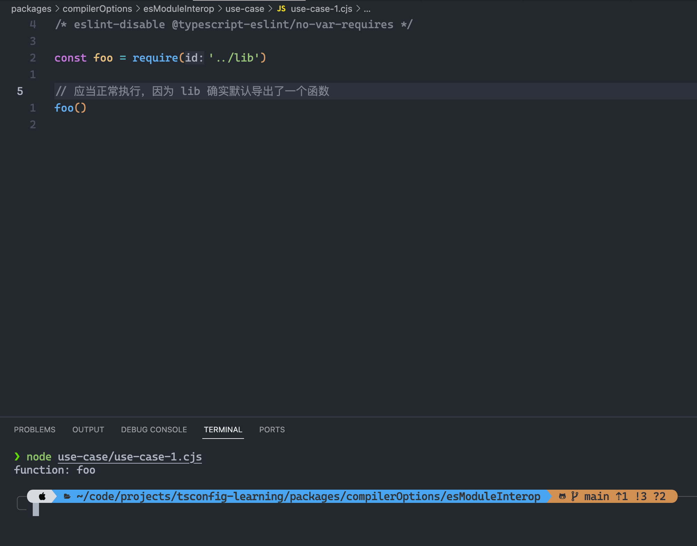
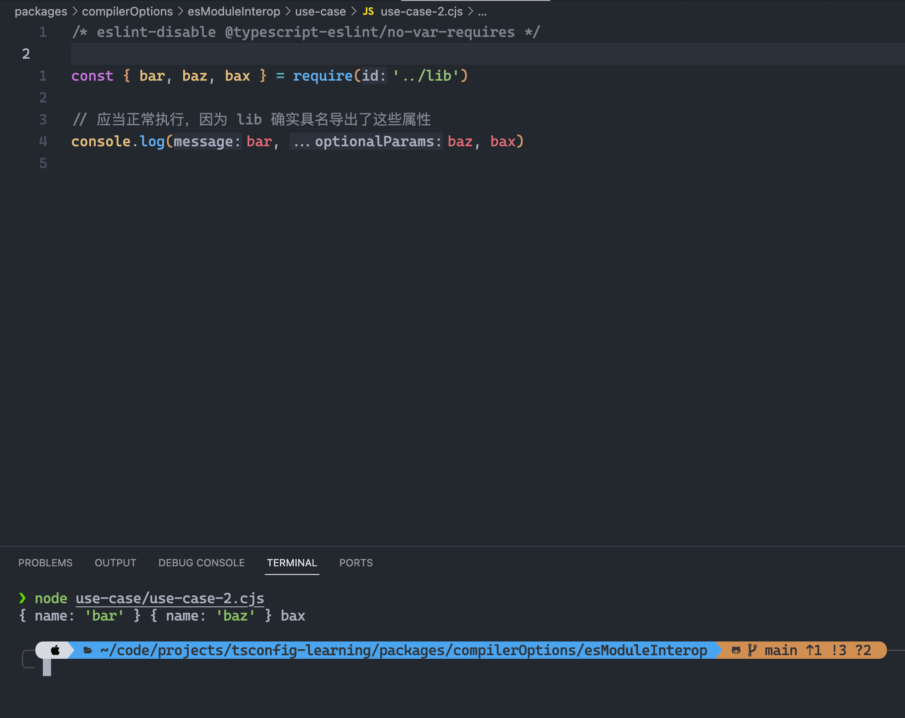
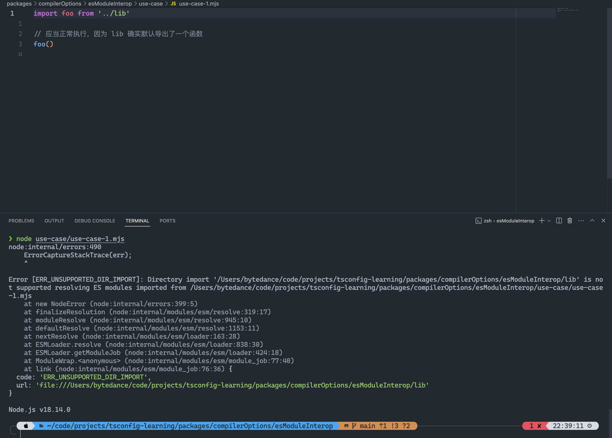
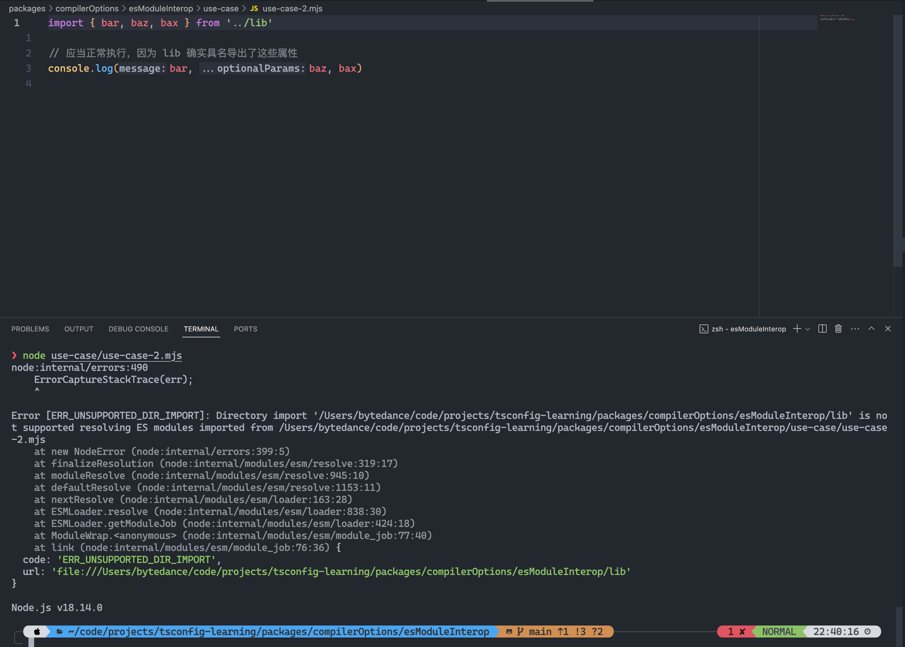
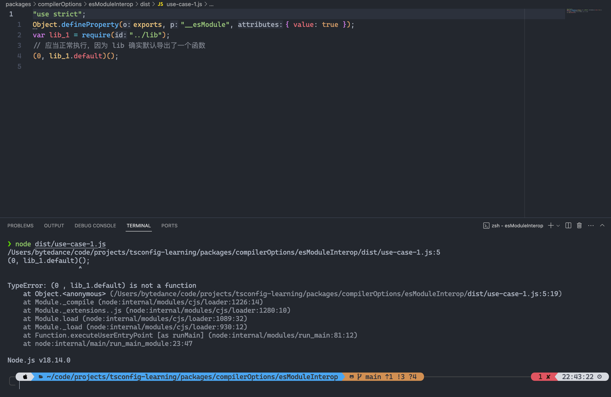
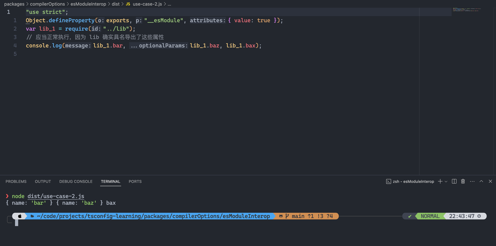
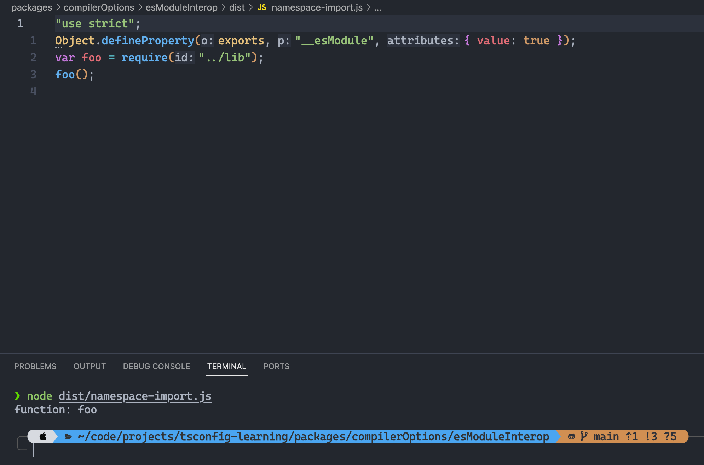
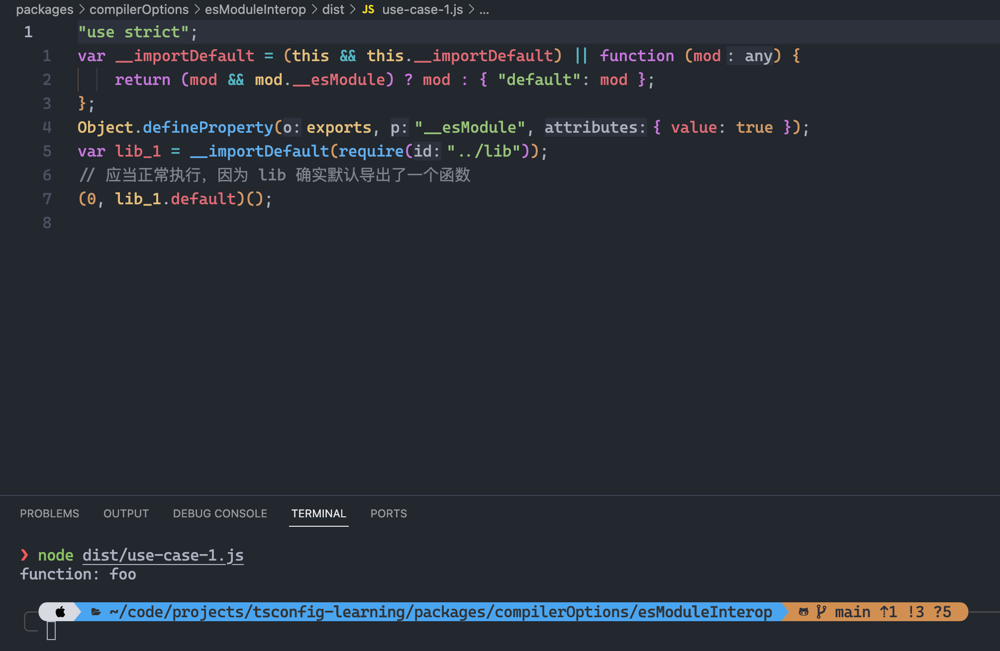
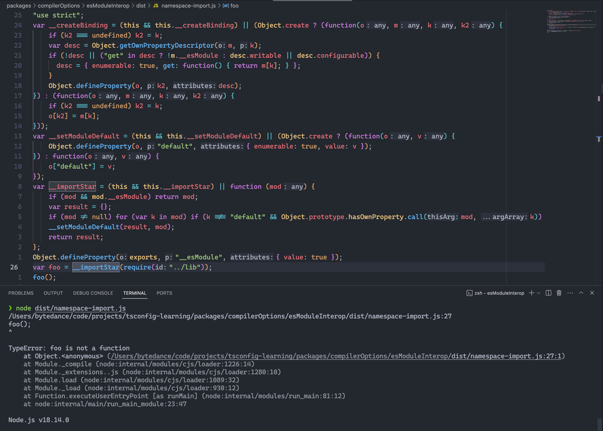

import { Tab, Tabs } from 'rspress/theme'

# esModuleInterop

## 作用

**[esModuleInterop](https://www.typescriptlang.org/tsconfig#esModuleInterop) 用于解决 ESModule 通过 default import 和 namespace import 导入 CommonJS 模块时的兼容性问题**

:::tip

在编译领域，interop 指的是不同语言、系统或平台之间进行交互和通信的能力。它强调的是在不同编程语言、框架或环境之间无缝地传递数据、调用函数或共享资源的能力。

:::

## 场景介绍

场景：当我们使用 ESModule import 导入一个 CommonJS 模块，并且想把 ESModule 编译成 CommonJS 时会存在一些兼容性问题，而 `esModuleInterop` 则是通过 **增加一些运行时代码去解决这些兼容性问题的**，下面通过一个 Demo 演示一下：

`tsconfig.json` 配置如下：

```json
{
  "compilerOptions": {
    "module": "CommonJS",
    "target": "ES5",
    "outDir": "dist"
  },
  "include": ["src/*"]
}
```

该配置会将 src 里的 ts 文件编译成 CommonJS 规范的代码。

假设现在我们有一个 CommonJS 规范的库，它会通过 `module.exports` 导出一个函数，且在导出的函数对象上又挂了一些属性，然后在我们的 ts 源码中会通过 default import 去导入这个库，并调用该函数：

`lib/index.js`

```js
function foo() {
  console.log('function: foo')
}

foo.bar = {
  name: 'bar',
}

foo.baz = {
  name: 'baz',
}

foo.bax = 'bax'

foo.default = {
  name: 'default',
}

module.exports = foo
```

## 原生 Node.js 角度分析

在 CommonJS 规范的角度来看：

<Tabs>
  <Tab label="use case 1: 默认导入">

```js
const foo = require('../lib')

// 应当正常执行，因为 lib 确实默认导出了一个函数
foo()
```

  </Tab>

  <Tab label="use case 2: 具名导入">

```js
const { bar, baz, bax } = require('../lib')

// 应当正常执行，因为 lib 确实具名导出了这些属性
console.log(bar, baz, bax)
```

  </Tab>
</Tabs>

在 ESModule 规范的角度来看：

<Tabs>
  <Tab label="use case 1: 默认导入">

```js
import foo from '../lib'

// 应当正常执行，因为 lib 确实默认导出了一个函数
foo()
```

  </Tab>

  <Tab label="use case 2: 具名导入">

```js
import { bar, baz, bax } from '../lib'

// 应当正常执行，因为 lib 确实具名导出了这些属性
console.log(bar, baz, bax)
```

  </Tab>
</Tabs>

在 CommonJS 环境下，这两个 use case 都能够符合预期地运行，没有冲突：





而在原生 Node.js 的 ESModule 环境下，这两个 use case 的运行情况如下：





## tsc 角度分析

那么如果是运行经过 tsc 编译后的结果呢？

use case 1:



use case 2:



可以看到，对于默认导入场景仍然会存在问题，也就是说 ESModule 默认导入 CommonJS 存在问题。

事实上，可以通过 namespace import 的方式，也就是 `import * as foo from '../lib'` 的方式获取 foo 函数：

```ts
import * as foo from '../lib'

foo()
```



可以看到，之所以能够成功运行是因为 namespace import 会被 tsc 处理成 `require('../lib')()`，而 default import 则被处理成了 `require('../lib').default()`，前者和 CommonJS 里消费默认导出的方式一致，因此能够成功运行。

但是在 ESModule 的规范里，`import * as foo` 这样的 namespace import 语法得到的 foo 应当是一个 object，这里却得到了一个函数，并且可以直接调用，不符合规范。

## esModuleInterop 做了什么？

理解了冲突后，接下来就看看 esModuleInterop 是如何解决这一冲突的吧！

```json {6}
{
  "compilerOptions": {
    "module": "CommonJS",
    "target": "ES5",
    "outDir": "dist",
    "esModuleInterop": true
  },
  "include": ["src/*"]
}
```

对于 default import，编译结果和运行效果如下：



可以看到增加了一些运行时代码，也就是 `__importDefault` 函数；

该函数会将 `require('../lib')` 得到的模块包到一个对象中，并挂在 `default` 属性下，如此一来最终得到的默认导入模块就是 `module.exports` 指向的模块，符合预期。

对于 namespace import，编译结果和运行效果如下：



`__importStar` 会遍历 require 得到的模块的所有属性，对于非 default 属性，会将它们都放到一个对象中返回，最后再把 default 属性指向整个 require 的模块，也就是 `module.exports` 的对象。

这符合 ESModule namespace import 规范要求的导入的模块是一个对象，因此把它当成函数执行时会报错，符合预期。

## 总结

`esModuleInterop` 可以解决 ESModule 中导入 CommonJS 时的 default import 和 namespace import 冲突，named import 则不受影响。

- 对于 default import，是通过将导入的模块包装到一个对象中，挂在对象的 default 属性上，并在消费时消费对象的 default 属性实现的；
- 对于 namespace import，是通过遍历导入的模块的所有属性，挂到新对象上，并把新对象的 default 属性指向整个 require 的模块实现的；
