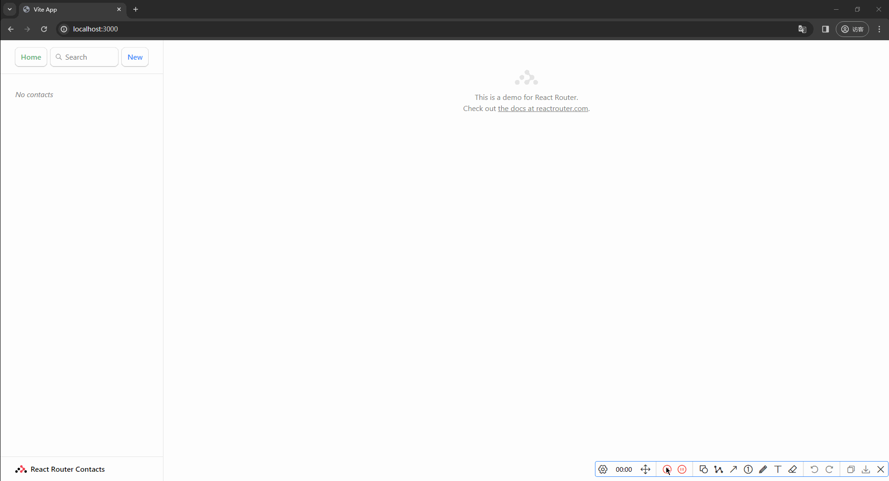
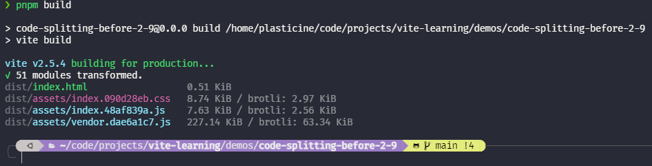
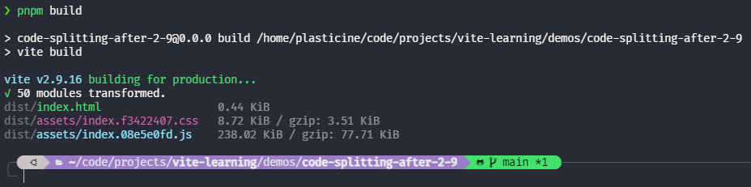
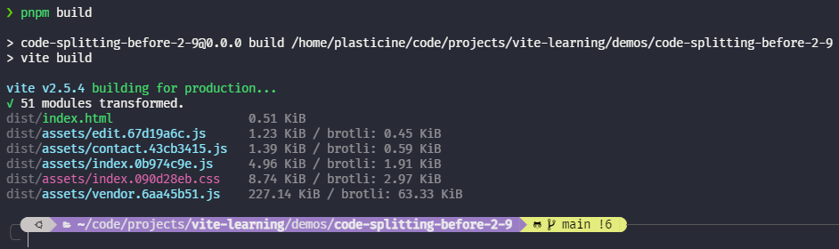
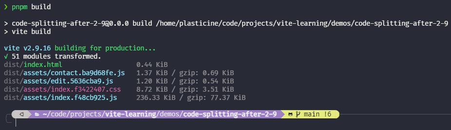
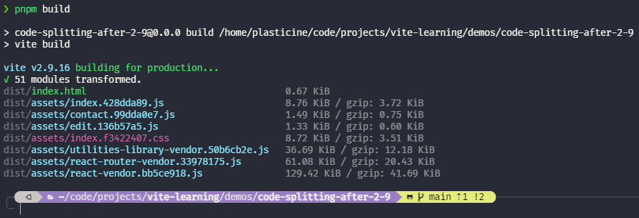

# 代码分割

## 概念解释

代码分割，也叫拆包，涉及到下面三个基本概念：

- **bundle**: 打包产物，包含 js 和各种静态资源
- **chunk**: 打包后的 js 文件，是 bundle 的子集
- **vendor**: 第三方包的打包产物，是一种特殊的 chunk

## 为什么要代码分割？

一般来说，生产环境下，需要将源码打包成一个产物去加载，但随着代码体积的增大，仍然使用一个产物的话会导致产物也变得十分巨大，导致下面两个问题：

1. **无法按需加载**

   一个前端应用中的 js 可以分为两部分：

   1. **initial chunk**: 当前页面首屏加载所需的 js
   2. **async chunk**: 非当前页面首屏加载所必须的 js

   如果不进行代码分割，那么得到的 bundle 就包括了 initial chunk 和 async chunk，这会让浏览器加载额外的不必要的资源，影响首屏渲染性能。

2. **缓存复用率底**

   即便只变了一行代码，也会导致整个 bundle 变化，从而无法复用缓存

## Vite 默认的拆包策略

Vite 的拆包策略在 2.9 之前与之后不一样，这里以 [react-router 官方示例](https://reactrouter.com/en/main/start/tutorial) 作为例子介绍一下。

这个 Demo 的功能示例如下图所示：



下面会以这个 Demo 在 Vite 2.9 之前和之后的构建产物进行对比。

### 未手动拆包时的构建产物对比

这个 Demo 在 Vite 2.9 之前的构建产物如下：



在 Vite 2.9 之后的构建产物如下：



从这里就可以看出 Vite 2.9 之前和之后的默认拆包策略有所不同：**2.9 之前是会把第三方依赖打包进 vendor 中，2.9 之后则是简单粗暴地将业务代码和第三方依赖库都打包成一个 bundle**

### 手动拆包后的构建产物对比

首屏渲染时的页面和点击左侧列表项加载的页面（`/contact/:contactId` 路由）是两个页面，首屏渲染时不需要把 contact 相关页面也加载进来。

目前的路由配置是这样的：

```jsx
const router = createBrowserRouter([
  {
    path: '/',
    element: <Root />,
    errorElement: <ErrorPage />,
    loader: rootLoader,
    action: rootAction,
    children: [
      {
        errorElement: <ErrorPage />,
        children: [
          { index: true, element: <Index /> },
          {
            path: 'contacts/:contactId',
            element: <Contact />,
            loader: contactLoader,
            action: contactAction,
          },
          {
            path: 'contacts/:contactId/edit',
            element: <EditContact />,
            errorElement: <div>Oops! There was an error when editing.</div>,
            loader: contactLoader,
            action: editAction,
          },
          {
            path: 'contacts/:contactId/destroy',
            errorElement: <div>Oops! There was an error when destroying.</div>,
            action: destroyAction,
          },
        ],
      },
    ],
  },
])
```

针对路由进行代码分割，优化成这样：

```jsx {15,20}
const router = createBrowserRouter([
  {
    path: '/',
    element: <Root />,
    errorElement: <ErrorPage />,
    loader: rootLoader,
    action: rootAction,
    children: [
      {
        errorElement: <ErrorPage />,
        children: [
          { index: true, element: <Index /> },
          {
            path: 'contacts/:contactId',
            lazy: () => import('./routes/contact'),
          },
          {
            path: 'contacts/:contactId/edit',
            errorElement: <div>Oops! There was an error when editing.</div>,
            lazy: () => import('./routes/edit'),
          },
          {
            path: 'contacts/:contactId/destroy',
            errorElement: <div>Oops! There was an error when destroying.</div>,
            action: destroyAction,
          },
        ],
      },
    ],
  },
])
```

:::tip

改造方式参考 [react-router lazy API](https://reactrouter.com/en/main/route/lazy)

:::

现在再对比一下 2.9 之前和之后的构建产物：

2.9 之前：



2.9 之后：



除了前面已经介绍过的业务代码和第三方依赖是否分开打包的区别之外，两个版本在对待动态 import 的模块，都会单独打包成一个 chunk，从而完成了代码分割。

这样在生产环境下，首屏渲染时就不会加载 contact 和 edit 这两个 chunk，只会加载必需的 chunk，提高首屏渲染性能。

## 自定义拆包策略

Vite 默认的拆包策略显然不太符合我们这个 Demo 在生产环境的需求，原因如下（以 2.9 之后的拆包策略举例）：

1. 业务代码和第三方依赖打进同一个 bundle 中，导致如果仅仅是升级一下依赖，也会导致整个 bundle 变化，从而之前的缓存失效
2. 类似地，如果只是更新业务代码，依赖并没有发生变化，那么也是需要重新加载整个 bundle，导致之前的缓存失效

理想情况应当是每个第三方依赖单独拆包成独立的 vendor，因此我们需要自定义拆包策略，这点可以通过 `manualChunks` 来实现，这是一个 rollup 提供的配置，而由于 Vite 在构建时底层用的是 rollup，因此其提供了该参数的透传。

该参数的配置方式有两种：

1. 对象方式：`key` 指定为 vendor 产物的名字，`value` 是一个数组，表示要把哪些第三方依赖打进 key 对应的 vendor 文件中
2. 函数方式：传入模块 id，返回一个 string 作为 vendor 产物的名字

这里以对象方式举个例子，函数方式也是类似的就不赘述了：

`vite.config.js`

```js
export default defineConfig({
  plugins: [react()],
  build: {
    rollupOptions: {
      output: {
        manualChunks: {
          'react-vendor': ['react', 'react-dom'],
          'react-router-vendor': ['react-router-dom'],
          'utilities-library-vendor': ['localforage', 'match-sorter', 'match-sorter'],
        },
      },
    },
  },
})
```

产物结果如下：



并且在产物的 html 中查看 js 资源的引入顺序如下：

```html {8-12}
<!DOCTYPE html>
<html lang="en">
  <head>
    <meta charset="UTF-8" />
    <link rel="icon" type="image/svg+xml" href="/src/favicon.svg" />
    <meta name="viewport" content="width=device-width, initial-scale=1.0" />
    <title>Vite App</title>
    <script type="module" crossorigin src="/assets/index.428dda89.js"></script>
    <link rel="modulepreload" href="/assets/react-vendor.bb5ce918.js" />
    <link rel="modulepreload" href="/assets/react-router-vendor.33978175.js" />
    <link rel="modulepreload" href="/assets/utilities-library-vendor.50b6cb2e.js" />
    <link rel="stylesheet" href="/assets/index.f3422407.css" />
  </head>
  <body>
    <div id="root"></div>
  </body>
</html>
```

可以看到，对于第三方库，会以 `modulepreload` 的方式预先加载，然后再加载业务代码产物 js 资源，这样一来，无论是哪个第三方依赖更新，都不会影响其他资源的缓存复用，提高线上生产环境的缓存复用率。
