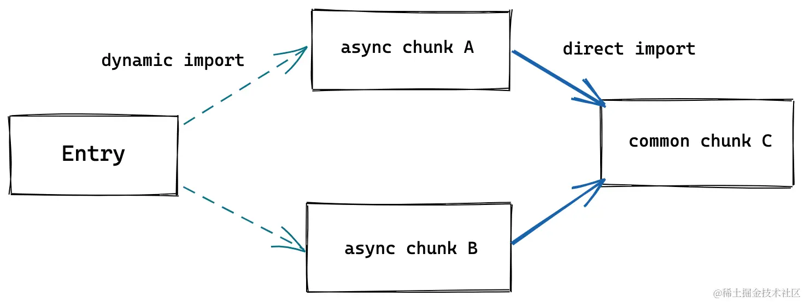

# 双引擎架构

## 前言

Vite 本身其实并不是一个 bundler，更像是一个整合商，在开发环境下利用浏览器原生支持的 ESM 模块化能力提供 no-bundle 的能力，在生产环境下则依然需要进行 bundle 保证产物的。

这种开发环境和生产环境下不同的特性实际上和 Vite 底层的双引擎架构有关，分别是 `esbuild` 和 `rollup`。它们对 Vite 来说有多重要？各自扮演了什么样的角色？本篇文章来一起探讨一下。

## 整体架构图

沿用开篇里的 Vite 架构图：

## esbuild 的作用

简要概括就是：

1. 依赖预构建
2. 单文件转译
3. 代码压缩

### 依赖预构建

关于依赖预构建在[上一篇文章](./pre-build.md)里已经解释过了，这里再简要说明一下。

依赖预构建就是用于在启动开发服务器之前将非 ESM 模块化规范的依赖进行 bundle，避免造成请求瀑布流。

:::tip

其实在 Vite 1.x 版本中是使用 rollup 进行预构建的，但是 esbuild 用来进行预构建的性能比 rollup 快太多了，因此后面切换成了 esbuild。

:::

### 单文件转译

从架构图中可以看到，esbuild 无论是在开发环境还是生产环境，都是参与了 ts 和 jsx 的转译的，替换了原来的 babel 和 tsc，极大程度上提升了 ts 和 jsx 的转译性能。

:::tip
注意区分 bundle 和单文件转译，单文件转译的英文是 transform，是针对单个文件的，而 bundle 是针对整个应用而言的。
:::

### 代码压缩

在生产环境下，esbuild 负责对产物进行压缩，相比传统的 terser 进行压缩，其压缩性能是提高了很多的，主要原因有两个：

1. 压缩涉及到大量的 AST 操作，而传统构建工具流中，AST 无法在各个构建工具之间共享，也就意味着存在很多重复解析 AST 的过程，而 esbuild 基于 Golang 开发，可以全流程共用一个 AST，无需重复解析
2. 原生语言 Golang 的运行效率比 JavaScript 高，对于压缩这种计算密集型的工作，其性能是肯定比不上 Golang 的

### 局限性

- 不支持转译为 ES5
- 不提供操作打包产物的接口（比如 rollup 中的 renderChunk 钩子）
- 不支持自定义 code splitting 策略

由于这些局限性的存在，导致 esbuild 更多地是被用在开发环境下而不是生产环境下，当然，这些局限性并不影响它在开发环境下的优秀表现。

:::tip
虽然不支持转译为 ES5，但 Vite 仍能很好地进行 polyfill 以保障浏览器兼容性。
:::

### 小结

esbuild 并不仅仅是用在开发环境中，它也有参与到生产环境构建的部分环节，主要作用是处理一些计算密集型的工作，提高构建时的效率。

可以总结一下它在开发环境和生产环境下分别做了什么：

- 开发环境：

  - 依赖预构建：作为 bundler 对依赖进行预构建成 bundle

- 生产环境：
  - 代码转译：将 ts 和 jsx 转译为 js
  - 代码压缩：替换传统的 terser，提高压缩性能

## rollup 的作用

简要概括就是：

1. 生产环境 Bundle
2. 兼容插件机制

### 生产环境 bundle

开发环境下我们可以利用浏览器原生支持 ESM 的特性，提高冷启动和热更新的效率，但生产环境下我们不能这么做，因为这会造成多个网络请求（每个模块都需要一个网络请求去加载），对性能有一定影响，因此生产环境下仍然是需要进行 bundle 的。

Vite 选择使用 rollup 在生成环境中进行 bundle，并基于 rollup 本身成熟的打包能力上进行优化和扩展，主要包括以下三个方面：

1. CSS 代码分割：如果某个异步模块中引入了一些 CSS 代码，Vite 就会自动将这些 CSS 抽取出来生成单独的文件，提高线上产物的缓存复用率。
2. 自动预加载：Vite 会为入口 chunk 的依赖自动生成预加载标签 `<link rel="modulepreload">`
3. 异步 chunk 加载优化：
   
   - rollup 会先请求 chunk A，然后在加载 A 的过程中发现依赖 chunk C 才去加载 chunk C
   - Vite 做的优化是加载 A 的同时就立即加载其依赖的 C，提高依赖加载效率

### 兼容插件机制

之所以生产环境下选择 rollup 作为 bundler 而不是 esbuild 的一个最根本的原因就是 rollup 丰富完善的插件生态，作为一个新生的构建工具，Vite 肯定要兼容已有生态，否则自己另起一个生态需要很长时间去发展和壮大；其次，兼容 rollup 插件也使其能够吸引许多开发者往 Vite 迁移。

Vite 兼容 rollup 插件的一个大致原理就是在内部实现了一个 `Plugin Container`，用来模拟 rollup 调度各个 Vite 插件执行，而 Vite 插件的设计完全兼容 rollup，因此在生产环境中将所有的 Vite 插件传给 rollup 也是没有问题的。
