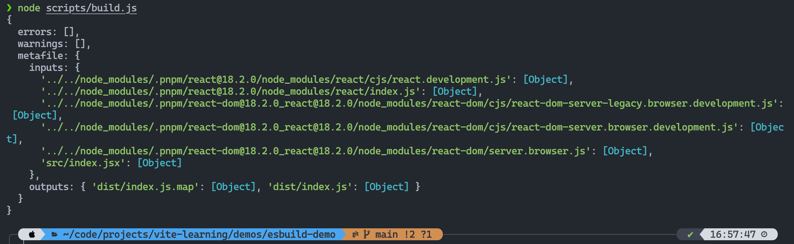
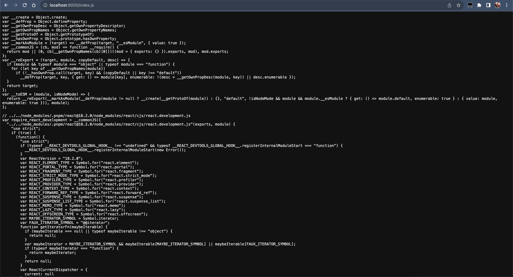
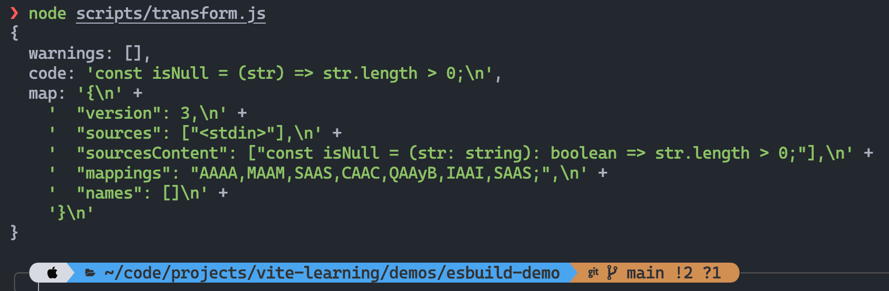

# 玩转 esbuild

## 前言

本篇来玩转 Vite 底层双引擎之一 -- esbuild，学习它的一些基本概念和功能使用，并实战开发一个完整的 esbuild 插件。

## 基本概念

esbuild 支持通过 cli 和 js api 调用，前者就不过多介绍了，无非就是通过各种 cli 参数控制打包行为，灵活性不是很高，简单的打包场景可以使用 cli 的方式，如果需要进行一些定制操作的话更多地会选择 js api。

而 js api 主要包括两个部分：

1. Build API：针对整个项目而言，对项目进行打包
2. Transform API：针对单个文件而言，对单个文件进行转译

## 基本使用

接下来会分别介绍一下 Build API 和 Transform API 的基本使用

### Build API

接下来通过一些简单的 Demo 体验一下 Build API，这里主要介绍常用的三个：

1. build
2. buildSync
3. serve

#### build & buildSync

```js
const { build } = require('esbuild')

async function buildWithESBuild() {
  const result = await build({
    absWorkingDir: process.cwd(),
    entryPoints: ['./src/index.jsx'],
    outdir: './dist',
    bundle: true,
    format: 'esm',
    external: [],
    splitting: true,
    sourcemap: true,
    metafile: true,
    minify: false,
    write: true,
    loader: {
      '.png': 'base64',
    },
  })

  console.log(result)
}

buildWithESBuild()
```



buildSync 和 build 使用上是类似的，从命名上能看出来一个是同步一个是异步，建议是使用 build 而不是 buildSync，因为如果使用 buildSync 的话，所使用的插件中 **不能进行异步操作**。

#### serve

serve 具有以下三个特点：

1. 会启动一个 Golang 实现的服务器
2. 类似于 webpack-dev-server，所有产物都不会写入磁盘，而是保存在内存中
3. 每次请求到来时进行 rebuild，返回最新的产物

:::warning
rebuild 的时机是 `请求到来`，而不是 `本地文件变更`。
:::

```js
const { serve } = require('esbuild')

async function serveWithESBuild() {
  const serveResult = await serve(
    {
      port: 8000,
      servedir: './dist',
    },
    {
      absWorkingDir: process.cwd(),
      entryPoints: ['./src/index.jsx'],
      outdir: './dist',
      bundle: true,
      format: 'esm',
      external: [],
      splitting: true,
      sourcemap: true,
      metafile: true,
      minify: false,
      write: true,
      loader: {
        '.png': 'base64',
      },
    },
  )

  console.log(`HTTP server starts at port: ${serveResult.port}`)
}

serveWithESBuild()
```

启动后就可以通过 http 访问构建后的产物了：



在新版 esbuild 中没有 serve 这个 API 了，变成用 context 替代，使用方式如下：

```js
import * as esbuild from 'esbuild'
import http from 'node:http'

// Start esbuild's server on a random local port
let ctx = await esbuild.context({
  // ... your build options go here ...
})

// The return value tells us where esbuild's local server is
let { host, port } = await ctx.serve({ servedir: '.' })

// Then start a proxy server on port 3000
http
  .createServer((req, res) => {
    const options = {
      hostname: host,
      port: port,
      path: req.url,
      method: req.method,
      headers: req.headers,
    }

    // Forward each incoming request to esbuild
    const proxyReq = http.request(options, (proxyRes) => {
      // If esbuild returns "not found", send a custom 404 page
      if (proxyRes.statusCode === 404) {
        res.writeHead(404, { 'Content-Type': 'text/html' })
        res.end('<h1>A custom 404 page</h1>')
        return
      }

      // Otherwise, forward the response from esbuild to the client
      res.writeHead(proxyRes.statusCode, proxyRes.headers)
      proxyRes.pipe(res, { end: true })
    })

    // Forward the body of the request to esbuild
    req.pipe(proxyReq, { end: true })
  })
  .listen(3000)
```

使用方式上的变化无需在意，只需要知道 esbuild 有这么个能力即可，以后再变化也可以直接跟着官方文档去查。

### Transform API

与 Build API 类似，主要包括 `transform` 和 `transformSync`。

#### transform & transformSync

```js
const { transform } = require('esbuild')

async function transformWithESBuild() {
  const transformResult = await transform('const isNull = (str: string): boolean => str.length > 0;', {
    sourcemap: true,
    loader: 'tsx',
  })

  console.log(transformResult)
}

transformWithESBuild()
```



## 了解 esbuild 插件

插件开发的本质就是基于原有的体系结构基础上进行 `扩展` 和 `自定义`。

esbuild 的插件设计是一个对象，对象中有 `name` 和 `setup` 属性：

- name：插件名称
- setup：一个函数，入参是一个 build 对象，该对象上有一些钩子供我们自定义钩子函数的逻辑

### 体验一下吧！

下面是一个简单的示例：

```js title="build-with-demo-plugin.js"
const { build } = require('esbuild')

const envPlugin = {
  name: 'env',
  setup(build) {
    build.onResolve({ filter: /^env$/ }, (args) => ({
      path: args.path,
      namespace: 'env-ns',
    }))

    build.onLoad({ filter: /.*/, namespace: 'env-ns' }, () => ({
      contents: JSON.stringify(process.env),
      loader: 'json',
    }))
  },
}

function buildWithDemoPlugin() {
  build({
    entryPoints: ['./src/plugin-demo.js'],
    bundle: true,
    outfile: './dist/plugin-demo.js',
    plugins: [envPlugin],
  })
}

buildWithDemoPlugin()
```

entryPoints 的文件代码：

```js title="plugin-demo.js"
// 应用了 env 插件后，构建时将会被替换成 process.env 对象
import { PATH } from 'env'

console.log(`PATH is ${PATH}`)
```

产物的代码如下：

```js
;(() => {
  // env-ns:env
  var PATH = '/Users/root/.nvm/versions/node/v18.14.0/bin:/usr/local/bin'

  // src/plugin-demo.js
  console.log(`PATH is ${PATH}`)
})()
```

### 钩子简介

#### onResolve

负责控制路径解析行为：可以用于筛选要处理哪些路径。

上面的 Demo 中我们是这样使用该钩子的：

```js
build.onResolve({ filter: /^env$/ }, (args) => ({
  path: args.path,
  namespace: 'env-ns',
}))
```

第一个参数是一个对象，用于决定插件要处理哪些文件，其包含两个属性：

- filter: 必填参数，是一个 RegExp，用于筛选要处理哪些文件

:::warning

这里的 RegExp 是用 Golang 里的 RegExp 语法，因此不能百分百兼容 JavaScript 的 RegExp，不支持：

- `?<=`
- `?=`
- `\1` 反向引用

:::

- namespace: 可选参数，声明命名空间，用于后续在 onLoad 钩子中直接拿到筛选出的文件

#### onLoad

负责控制内容加载行为：可以以 onResolve 中解析出的 namespace 作为筛选项，获取要处理的模块路径，然后去决定加载这些路径时需要返回什么内容。

```js
build.onLoad({ filter: /.*/, namespace: 'env-ns' }, (args) => {
  console.log(`${'='.repeat(30)} onLoad ${'='.repeat(30)}`)
  // 模块路径
  console.log(args.path)
  // namespace 标识
  console.log(args.namespace)
  // 后缀信息
  console.log(args.suffix)
  // 额外的插件数据
  console.log(args.pluginData)

  return {
    // 模块具体内容
    contents: JSON.stringify(process.env),
    // 错误信息
    errors: [],
    // 指定 loader，如`js`、`ts`、`jsx`、`tsx`、`json`等等
    loader: 'json',
    // 额外的插件数据
    pluginData: null,
    // 插件名称
    pluginName: 'xxx',
    // 基准路径
    resolveDir: './dir',
    // 警告信息
    warnings: [],
    // 同上
    watchDirs: [],
    watchFiles: [],
  }
})
```

对应的 stdout 输出如下：

```shell
============================== onResolve ==============================
env
/Users/root/code/projects/vite-learning/demos/esbuild-demo/src/plugin-demo.js
file
/Users/root/code/projects/vite-learning/demos/esbuild-demo/src
import-statement
undefined
============================== onLoad ==============================
env
env-ns
?xxx
undefined
```

#### onStart & onEnd

这两个钩子从命名上就能够知道它们的作用了，分别是在构建开始和构建结束时执行，就不过多介绍了。

## 插件开发实战

接下来通过两个需求来实战一下 esbuild 的插件开发：

1. 通过 http 加载库
2. 自动生成 html 引入产物

### 通过 http 加载库

我们一般加载模块时都是通过 import 导入相关库的包名，但如果想通过 http 去加载相关库的话是不支持的，比如从 cdn 加载 react 和 react-dom:

```jsx
// react 和 react-dom 从 CDN 拉取
import { render } from 'https://cdn.skypack.dev/react-dom'
import React from 'https://cdn.skypack.dev/react'

let Greet = () => <h1>Hello, ESBuild!</h1>

render(<Greet />, document.getElementById('root'))
```

那么现在我们就自行开发一个插件来支持该功能！

首先需要在 onResolve 的时候决定我们需要处理 http 或 https 开头的路径

```js
// 导入的模块是 http 链接的话需要进行处理
build.onResolve(
  {
    filter: /^https?:\/\//,
  },
  (args) => {
    return {
      path: args.path,
      namespace: 'http-url',
    }
  },
)
```

我们来看看 cdn 返回的模块代码是怎样的：

```js
/*
 * Skypack CDN - react@17.0.1
 *
 * Learn more:
 *   📙 Package Documentation: https://www.skypack.dev/view/react
 *   📘 Skypack Documentation: https://www.skypack.dev/docs
 *
 * Pinned URL: (Optimized for Production)
 *   ▶️ Normal: https://cdn.skypack.dev/pin/react@v17.0.1-yH0aYV1FOvoIPeKBbHxg/mode=imports/optimized/react.js
 *   ⏩ Minified: https://cdn.skypack.dev/pin/react@v17.0.1-yH0aYV1FOvoIPeKBbHxg/mode=imports,min/optimized/react.js
 *
 */

// Browser-Optimized Imports (Don't directly import the URLs below in your application!)
export * from '/-/react@v17.0.1-yH0aYV1FOvoIPeKBbHxg/dist=es2019,mode=imports/optimized/react.js'
export { default } from '/-/react@v17.0.1-yH0aYV1FOvoIPeKBbHxg/dist=es2019,mode=imports/optimized/react.js'
```

可以看到，会从 cdn 域名下的其他地方继续加载模块，因此我们也需要增加对这部模块的处理，因此需要再增加一个 onResolve：

```js
// 拦截间接依赖的路径，并重写路径
// tip: 间接依赖同样会被自动带上 `http-url` 的 namespace
build.onResolve({ filter: /.*/, namespace: 'http-url' }, (args) => ({
  // 重写路径
  path: new URL(args.path, args.importer).toString(),
  namespace: 'http-url',
}))
```

最后就是处理这些模块路径获取最终的内容，具体来说也就是下载对应的 http 资源并返回即可。

```js
build.onLoad({ filter: /.*/, namespace: 'http-url' }, async (args) => {
  const contents = await new Promise((resolve, reject) => {
    async function fetch(url) {
      console.log(`Downloading: ${url}`)

      const httpClient = url.startsWith('https') ? https : http
      const request = httpClient
        .get(url, (response) => {
          const statusCode = response.statusCode

          if ([301, 302, 307].includes(statusCode)) {
            fetch(new URL(response.headers.location, url).toString())
            request.destroy()
          } else if (statusCode === 200) {
            const chunks = []

            response.on('data', (chunk) => {
              chunks.push(chunk)
            })

            response.on('end', () => {
              resolve(Buffer.concat(chunks))
            })
          } else {
            reject(new Error(`GET ${url} failed: status ${statusCode}`))
          }
        })
        .on('error', reject)
    }

    fetch(args.path)
  })

  return {
    contents,
  }
})
```

最终完整代码如下：

```js title="import-http-plugin.js"
module.exports = () => ({
  name: 'esbuild:http',
  setup(build) {
    const http = require('http')
    const https = require('https')

    // 导入的模块是 http 链接的话需要进行处理
    build.onResolve(
      {
        filter: /^https?:\/\//,
      },
      (args) => {
        return {
          path: args.path,
          namespace: 'http-url',
        }
      },
    )

    // 拦截间接依赖的路径，并重写路径
    // tip: 间接依赖同样会被自动带上 `http-url` 的 namespace
    build.onResolve({ filter: /.*/, namespace: 'http-url' }, (args) => ({
      // 重写路径
      path: new URL(args.path, args.importer).toString(),
      namespace: 'http-url',
    }))

    build.onLoad({ filter: /.*/, namespace: 'http-url' }, async (args) => {
      const contents = await new Promise((resolve, reject) => {
        async function fetch(url) {
          console.log(`Downloading: ${url}`)

          const httpClient = url.startsWith('https') ? https : http
          const request = httpClient
            .get(url, (response) => {
              const statusCode = response.statusCode

              if ([301, 302, 307].includes(statusCode)) {
                fetch(new URL(response.headers.location, url).toString())
                request.destroy()
              } else if (statusCode === 200) {
                const chunks = []

                response.on('data', (chunk) => {
                  chunks.push(chunk)
                })

                response.on('end', () => {
                  resolve(Buffer.concat(chunks))
                })
              } else {
                reject(new Error(`GET ${url} failed: status ${statusCode}`))
              }
            })
            .on('error', reject)
        }

        fetch(args.path)
      })

      return {
        contents,
      }
    })
  },
})
```

接入一下该插件：

```js build.js
const { build } = require('esbuild')
const importHttpPlugin = require('./import-http-plugin')

async function buildWithImportHttpPlugin() {
  await build({
    entryPoints: ['./src/import-http-demo.jsx'],
    outdir: './dist/import-http-demo',
    format: 'esm',
    bundle: true,
    splitting: true,
    sourcemap: true,
    metafile: true,
    plugins: [importHttpPlugin()],
  })

  console.log('Bundle finished!')
}

buildWithImportHttpPlugin()
```

运行后的 stdout:

```shell
Downloading: https://cdn.skypack.dev/react-dom
Downloading: https://cdn.skypack.dev/react
Downloading: https://cdn.skypack.dev/-/react@v17.0.1-yH0aYV1FOvoIPeKBbHxg/dist=es2019,mode=imports/optimized/react.js
Downloading: https://cdn.skypack.dev/-/react-dom@v17.0.1-oZ1BXZ5opQ1DbTh7nu9r/dist=es2019,mode=imports/optimized/react-dom.js
Downloading: https://cdn.skypack.dev/-/object-assign@v4.1.1-LbCnB3r2y2yFmhmiCfPn/dist=es2019,mode=imports/optimized/object-assign.js
Downloading: https://cdn.skypack.dev/-/scheduler@v0.20.2-PAU9F1YosUNPKr7V4s0j/dist=es2019,mode=imports/optimized/scheduler.js
Bundle finished!
```

这样一来就支持对 http 的模块进行 bundle 啦，是不是非常酷炫！

### 自动生成 html 引入产物

背景：

esbuild 打包出来的产物是 js 和 css，并不能直接运行，需要手动创建一个 html 文件去引入这些打包产物后才能使用，现在我们要开发的插件就是自动生成这个 html 文件。

实现思路是利用 `onEnd` 钩子能够从 metafile 中获取到所有产物的信息这一特点来遍历所有产物的构建信息，然后生成相应的 script 和 link 标签去加载它们。比较简单，就不过多赘述，直接看代码吧！

```js
const fs = require('fs/promises')
const path = require('path')

module.exports = () => ({
  name: 'esbuild:html-generator',
  setup(build) {
    build.onEnd(async (buildResult) => {
      if (buildResult.errors.length) {
        return
      }
      const { metafile } = buildResult
      // 1. 拿到 metafile 后获取所有的 js 和 css 产物路径
      const scripts = []
      const links = []
      if (metafile) {
        const { outputs } = metafile
        const assets = Object.keys(outputs)

        assets.forEach((asset) => {
          if (asset.endsWith('.js')) {
            scripts.push(createScript(asset))
          } else if (asset.endsWith('.css')) {
            links.push(createLink(asset))
          }
        })
      }
      // 2. 拼接 HTML 内容
      const templateContent = generateHTML(scripts, links)
      // 3. HTML 写入磁盘
      const templatePath = path.join(process.cwd(), 'index.html')
      await fs.writeFile(templatePath, templateContent)
    })
  },
})

function createScript(src) {
  return `<script type="module" src="${src}"></script>`
}

function createLink(src) {
  return `<link rel="stylesheet" href="${src}"></link>`
}

function generateHTML(scripts, links) {
  return `
<!DOCTYPE html>
<html lang="en">

<head>
  <meta charset="UTF-8" />
  <meta name="viewport" content="width=device-width, initial-scale=1.0" />
  <title>Esbuild App</title>
  ${links.join('\n')}
</head>

<body>
  <div id="root"></div>
  ${scripts.join('\n')}
</body>

</html>
`.trim()
}
```
