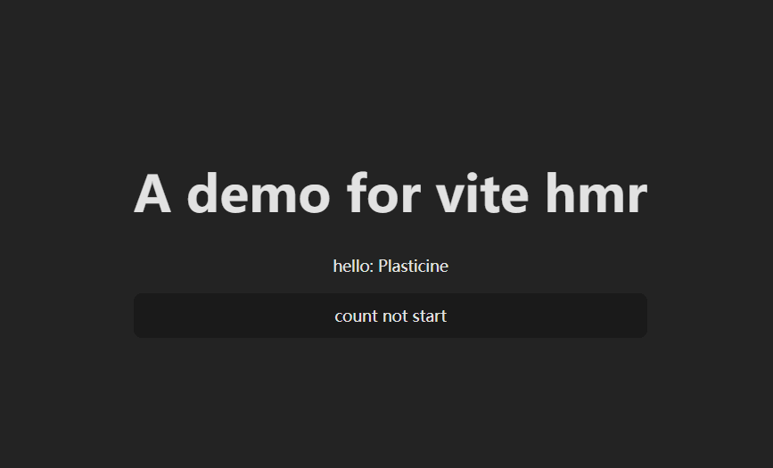
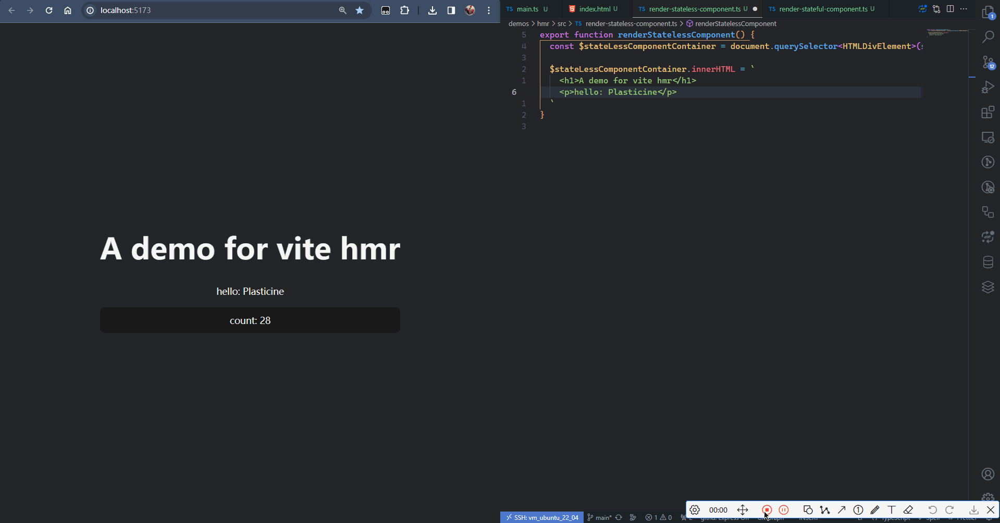
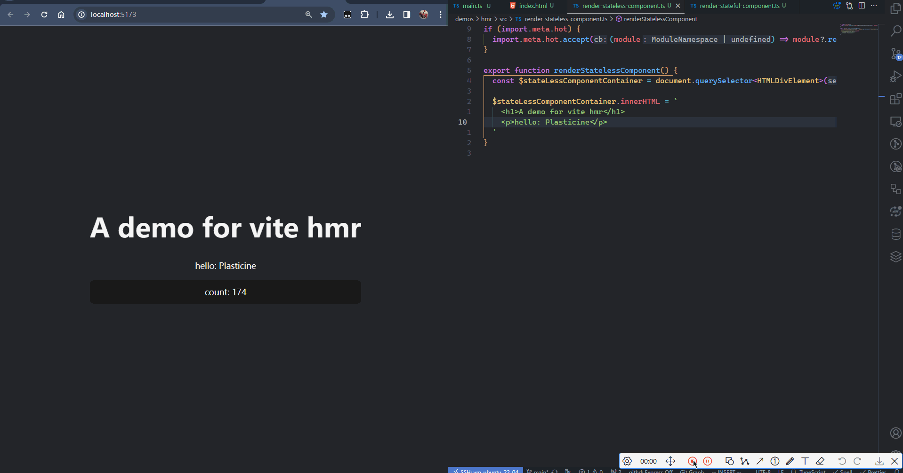

import { Tab, Tabs } from 'rspress/theme'

# 玩转 HMR API

## HMR 概念简介

全称 `Hot Module Replacement`，模块热更新。在页面模块更新的时候，直接把页面中发生变化的模块替换为新的模块，同时不会影响其它模块的正常运作。通过 HMR 的技术我们就可以实现局部刷新和状态保存。

## ESM HMR 规范

Vite 的 HMR API 设计是基于 [ESM HMR 规范](https://github.com/withastro/esm-hmr) 实现的，该规范由 Snowpack、WMR 和 Vite 一起制定，其类型定义如下：

```ts
interface ImportMeta {
  readonly hot?: {
    readonly data: any
    accept(): void
    accept(cb: (mod: any) => void): void
    accept(dep: string, cb: (mod: any) => void): void
    accept(deps: string[], cb: (mods: any[]) => void): void
    prune(cb: () => void): void
    dispose(cb: (data: any) => void): void
    decline(): void
    invalidate(): void
    on(event: string, cb: (...args: any[]) => void): void
  }
}
```

`import.meta` 是现代浏览器原生支持的，该规范规定 `import.meta.hot` 中保存 ESM HMR 相关 API 实现，接下来介绍一下该规范的几个核心 API。

## accept - 模块更新时逻辑：界定热更新的边界

accept 意思是接受，即哪个模块作为热更新的来源，Vite 就会接受该模块，并将其视为热更新的边界，且可以自行决定要如何对模块进行热更新。

边界的意思就是热更新仅对边界内的模块生效，边界外的模块不应受影响。

热更新模块来源可以分为以下三种情况：

- 接受 `自身模块` 的更新
- 接受 `某个子模块` 的更新
- 接受 `多个子模块` 的更新

接下来会通过一个 Demo 来理解这三种情况：

<Tabs>
  <Tab label="index.html">

```html
<!DOCTYPE html>
<html lang="en">
  <head>
    <meta charset="UTF-8" />
    <link rel="icon" type="image/svg+xml" href="/vite.svg" />
    <meta name="viewport" content="width=device-width, initial-scale=1.0" />
    <title>HMR</title>
  </head>
  <body>
    <div id="app">
      <div id="stateless-component-container"></div>
      <div id="stateful-component-container"></div>
    </div>

    <script type="module" src="/src/main.ts"></script>
  </body>
</html>
```

  </Tab>

  <Tab label="main.ts">

```ts
import { renderStatefulComponent } from './render-stateful-component'
import { renderStatelessComponent } from './render-stateless-component'
import './style.css'

renderStatelessComponent()
renderStatefulComponent()
```

  </Tab>

  <Tab label="render-stateful-component.ts">

```ts
export function renderStatelessComponent() {
  const $stateLessComponentContainer = document.querySelector<HTMLDivElement>('#stateless-component-container')!

  $stateLessComponentContainer.innerHTML = `
    <h1>A demo for vite hmr</h1>
    <p>hello: Plasticine</p>
  `
}
```

  </Tab>

  <Tab label="render-stateless-component.ts">

```ts
export function renderStatefulComponent() {
  const $statefulComponentContainer = document.querySelector<HTMLDivElement>('#stateful-component-container')!

  $statefulComponentContainer.innerHTML = `
    <div id="counter">count not start</div>
  `

  useUpdateCounterEffect()
}

function useUpdateCounterEffect() {
  let count = 0
  const $counter = document.querySelector<HTMLDivElement>('#counter')!

  setInterval(() => {
    $counter.innerText = `count: ${count}`
    count++
  }, 1000)
}
```

  </Tab>
</Tabs>

效果如下：



### 接受自身模块的更新

也就是以模块自身作为热更新边界，把 `import.meta.hot.accept` 的调用放到热更新模块自身内部去维护。

我们的 demo 中分别渲染了一个无状态组件和一个有状态组件，当无状态组件代码变更导致热更新时，预期的效果应当是仅改变无状态组件的内容，有状态组件不受影响。

但现在的实际效果是无状态组件代码变更后，热更新会将有状态组件也刷新，导致视图上的 count 又从 0 开始计算了。



这里 hmr 的边界应为 `render-stateless-component.ts` 这个模块，所以我们需要在这个模块里添加一些代码，让 vite 接受该模块自身的更新，从而将其识别为热更新的边界，不影响其他模块。

```ts
if (import.meta.hot) {
  import.meta.hot.accept((module) => module?.renderStatelessComponent())
}
```

HMR API 的 accept 就是做这件事情的，它会传入当前模块，你可以决定在当前模块代码变更时要如何进行热更新，这里我们的热更新逻辑就是需要重新执行以下 renderStatelessComponent 函数，因此直接在回调中调用即可。

:::tip

这里判断 `import.meta.hot` 存在是为了 treeshaking，因为生产环境构建阶段是不会注入 `import.meta.hot` 对象的，从而可以在构建时被移除。

:::

现在就不会在改动无状态组件代码时影响有状态组件了：



### 接受某个子模块的更新

刚刚我们是把热更新边界的划定交给发生变更的模块内部自行维护，实际上可以把这个边界划定提升到父模块中完成。

`main.ts` 依赖 `render-stateless-component.ts` 模块，即 `main.ts` 是 `render-stateless-component.ts` 的父模块，我们可以把 `import.meta.hot` 的调用放到 `main.ts` 中实现，使其接受子模块的更新，将子模块划分为热更新边界。

```ts
if (import.meta.hot) {
  import.meta.hot.accept('./render-stateless-component.ts', (module) => {
    module?.renderStatelessComponent()
  })
}
```

效果和上面是一样的，就不重复贴图了。

### 接受多个子模块的更新

刚刚在 accept 方法的第一个参数传的是一个 string，表示用于接受一个子模块的更新，而如果我们传的是 `string[]`，那么就可以用于接受多个子模块的更新。

```ts
if (import.meta.hot) {
  import.meta.hot.accept(['./render-stateless-component.ts', './render-stateful-component.ts'], (modules) => {
    const [statelessComponentModule, statefulComponentModule] = modules

    if (statelessComponentModule) {
      statelessComponentModule.renderStatelessComponent()
    }

    if (statefulComponentModule) {
      statefulComponentModule.renderStatefulComponent()
    }
  })
}
```

效果也是和前面一样，不重复贴图了。

## dispose - 模块销毁时逻辑

对于有状态组件，我们设定了一个 interval，模块热更新时应当将之前的 interval 清除掉。

`render-stateful-component.ts`

```ts
if (import.meta.hot) {
  import.meta.hot.dispose(() => {
    if (timer) {
      clearInterval(timer)
    }
  })
}
```

对于 vite hmr 的 API 主要掌握 accept 和 dispose 即可，其他的用的比较少，需要时可自行查阅官方文档。
