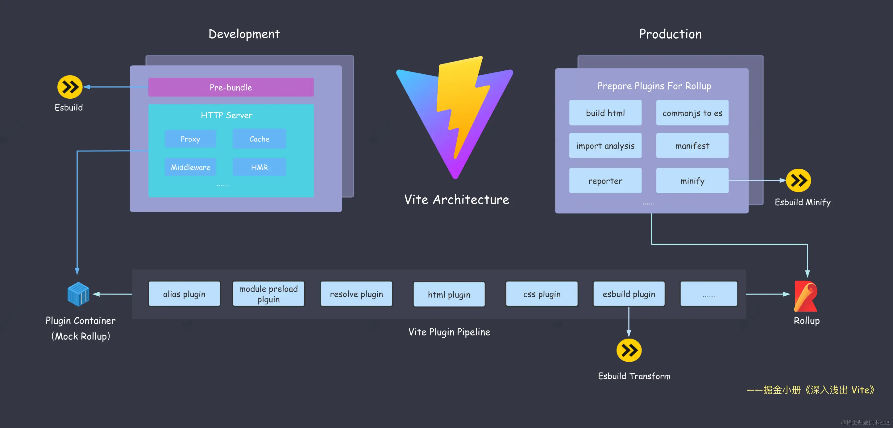

# 开篇

## 介绍

作为 Vite 学习系列文章的开篇，主要介绍一下面对前端的众多构建工具，他们存在的目的是什么？以及 Vite 为什么在众多构建工具中脱颖而出。最后介绍一下 Vite 的整体架构，对 Vite 有一个整体认知。

## 前端工程的痛点

无论是 webpack, rollup, esbuild 还是 vite，这些构建工具的出现都是为了解决前端工程中的痛点，那么痛点都有哪些呢？

### 模块化

前端模块化规范有很多，比如 CommonJS, ESM, AMD, CMD, UMD 等等，构建工具一方面需要落实这些规范，保证模块的正常加载；另一方面需要需要兼容不同的模块规范，适应不同的执行环境。

### 各种语法转译

对于目前众多前端框架的各种语法，比如 jsx, tsx, vue, svelte 等是无法直接在浏览器中直接运行的，构建工具需要将这些语法全部编译为浏览器能识别的语法。

其次，前端开发中经常遇到各种静态资源，比如图片、字体、样式文件 css, less, scss，这些都是需要构建工具统一转译处理，并产出到最终的构建产物中供浏览器中直接消费。

### 产物质量问题

对于最终上线到线上环境的产物，需要考虑各个浏览器的兼容性、安全性（避免源码泄露，一般需要经过混淆）以及代码体积过大导致出现运行时的性能问题，这些都可以在构建层面进行优化。

### 开发效率

开发时的冷启动、热更新时间对开发效率的影响是很大的，一个好的构建工具也应该兼顾到开发效率的提升。

## Vite 高效在哪？

围绕上面这些痛点来看：

- 模块化：基于浏览器原生支持的 ESM 规范实现模块加载，并且无论是在开发环境还是生成环境，都支持将其他规范的产物转成 ESM。
- 语法转移：Vite 支持处理各种前端高级语法，如 TypeScript、jsx、vue 等，也支持处理各种静态资源的处理。
- 产物质量：Vite 支持配合如 Terser，Babel 等工具链对产物进行混淆、压缩以及 Tree Shaking 等处理，极大程度保证产物的质量。
- 开发效率：得益于使用浏览器原生支持的 ESM 实现开发时 no-bundle 的特性，Vite 的冷启动和热更新时间都有很大的优势。

## Vite 整体架构

