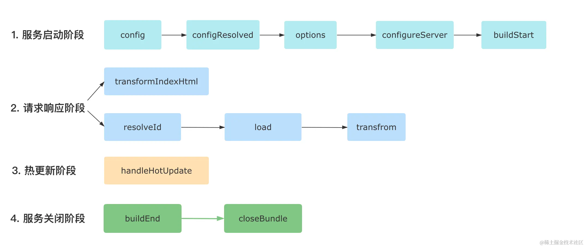
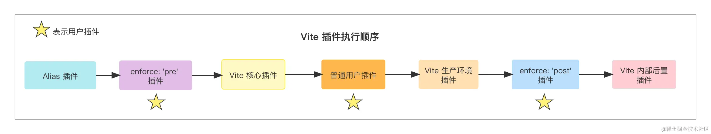

import { Tab, Tabs } from 'rspress/theme'

# 玩转 vite plugin

## 前言

vite 的 plugin 与 rollup 十分类似，都是一个对象，里面包含 name 属性，即插件的名称，以及各种生命周期 hooks。

rollup plugin 的所有 hooks 在 vite plugin 中都能兼容，并且 vite plugin 还有一些自己特有的 hooks，本篇文章会介绍一下这些 vite plugin 特有的 hooks。

## vite plugin 特有的 hooks

### config

当你需要对 vite 的配置进行一些处理时可以使用该 hook:

<Tabs>
  <Tab label="vite-plugin-config-hook.ts">

```ts
import { Plugin } from 'vite'

export function vitePluginConfigHook(): Plugin {
  return {
    name: 'vite-plugin-config-hook',
    config(config, env) {
      console.log(config)
      console.log(env)
    },
  }
}
```

  </Tab>

  <Tab label="vite.config.ts">

```ts
import { resolve } from 'path'
import { defineConfig } from 'vite'

import { vitePluginConfigHook } from './vite-plugins/vite-plugin-config-hook'

export default defineConfig({
  resolve: {
    alias: {
      '@': resolve(__dirname, 'src'),
    },
  },
  plugins: [vitePluginConfigHook()],
})
```

  </Tab>
</Tabs>

输出如下：

```js
{
  resolve: {
    alias: {
      '@': '/Users/root/code/projects/vite-learning/demos/vite-plugin-startup/src'
    }
  },
  plugins: [ { name: 'vite-plugin-config-hook', config: [Function: config] } ],
  optimizeDeps: { force: undefined },
  server: {}
}
{
  mode: 'development',
  command: 'serve',
  isSsrBuild: false,
  isPreview: false
}
```

:::tip
config hook 返回的对象会被 deep merge 到 vite config 中，也可以直接修改 config 对象，但是官方更推荐的是前者。
:::

### configResolved

从命名上也能很容易知道它是用于获取最终解析完，会被 vite 消费的 config，一般使用场景是从该 hook 中记录一下最终的 config 到我们自己的插件内部：

```ts
export function vitePluginConfigResolvedHook(): Plugin {
  let resolvedConfig: ResolvedConfig

  return {
    name: 'vite-plugin-config-resolved-hook',
    configResolved(config) {
      resolvedConfig = config
    },
  }
}
```

### configureServer

进作用于开发阶段，用于对 dev server 进行配置：

```ts
export function vitePluginConfigureServer(): Plugin {
  return {
    name: 'vite-plugin-config-resolved-hook',
    configureServer(server) {
      // 在内置中间件执行之前执行
      server.middlewares.use((req, res, next) => {
        console.log(req, res)

        next()
      })

      // 在内置中间件执行之后执行
      return () => {
        server.middlewares.use((req, res, next) => {
          console.log(req, res)

          next()
        })
      }
    },
  }
}
```

### transformIndexHtml

用于对 vite 的入口 html 进行 transform，比如修改 html 内容、插入某些标签等等：

```ts
export function vitePluginTransformIndexHtml(): Plugin {
  return {
    name: 'vite-plugin-transform-index-html',
    transformIndexHtml(html, ctx) {
      console.log(ctx)

      // 1. 返回 string 对 html 进行转换
      // return html.replace(/<title>(.*?)<\/title>/, '<title>hello: $1</title>')

      // 2. 返回一个对象，除了可以替换 html 外还能往 html 中注入标签
      return {
        html,
        tags: [
          // 注入一个加载 lodash-es 的 script
          {
            tag: 'script',
            attrs: { type: 'module', src: 'https://unpkg.com/lodash-es@3.10.1/lodash.js' },
            injectTo: 'head',
          },
        ],
      }
    },
  }
}
```

### handleHotUpdate

用于在热更新时进行自定义操作，比如：

<Tabs>
  <Tab label="vite-plugin-handle-hot-update.ts">

```ts
export function vitePluginHandleHotUpdate(): Plugin {
  return {
    name: 'vite-plugin-handle-hot-update',
    async handleHotUpdate(ctx) {
      logWithDivider('vite-plugin-handle-hot-update')

      logWithDivider('需要热更的文件')
      console.log(ctx.file)

      logWithDivider('需要热更的模块，如一个 Vue 单文件会涉及多个模块')
      console.log(ctx.modules)

      logWithDivider('时间戳')
      console.log(ctx.timestamp)

      logWithDivider('Vite Dev Server 实例')
      console.log(ctx.server)

      logWithDivider('读取最新的文件内容')
      console.log(await ctx.read())

      // 自行处理 HMR 事件
      ctx.server.ws.send({
        type: 'custom',
        event: 'hot-update-ctx-info',
        data: {
          ctxInfo: {
            file: ctx.file,
            modules: ctx.modules,
            timestamp: ctx.timestamp,
            latestContent: await ctx.read(),
          },
        },
      })

      return []
    },
  }
}
```

  </Tab>

  <Tab label="消费热更新数据的地方">

```ts
if (import.meta.hot) {
  import.meta.hot.on('hot-update-ctx-info', (payload) => {
    console.log('hot update payload: ', payload)
  })
}
```

  </Tab>
</Tabs>

这个 demo 中在热更新时可以在浏览器中通过自定义的 websocket 事件获取到服务器中的热更新模块信息。

## plugin hook 执行顺序

执行顺序如下图所示：



## plugin 应用场景和应用时机

开发 plugin 时可以通过 `apply` 属性指定该插件应用于什么场景，比如是开发阶段还是生产环境构建阶段：

```ts
export function vitePluginApply(): Plugin {
  return {
    name: 'vite-plugin-apply',
    // serve or build
    apply: 'serve',

    // 通过函数配置，更加灵活
    // apply(config, env) {},
  }
}
```

实际上用户定义的插件的执行时机也是可以自定义的，首先来看下 vite plugin 的执行顺序（注意和前面的 plugin hook 执行顺序区分开，前面的是 hooks 的执行顺序而非各个插件的执行顺序）:



因此我们可以指定插件的 `enforce` 属性去告诉 vite 这个插件要在哪个时机执行，不指定 enforce 参数时是普通插件，指定 enforce 值的话可以声明为 pre 或者 post。
