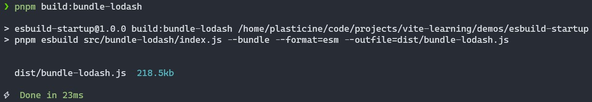
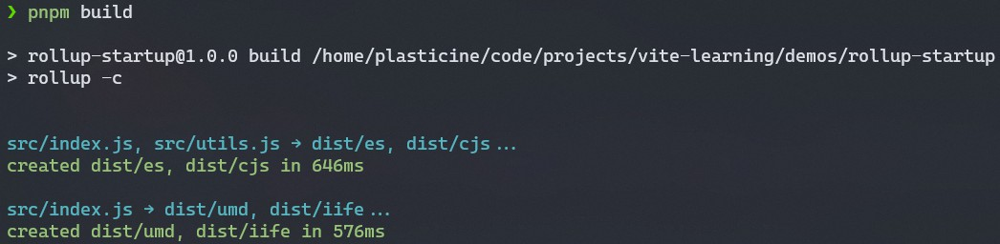
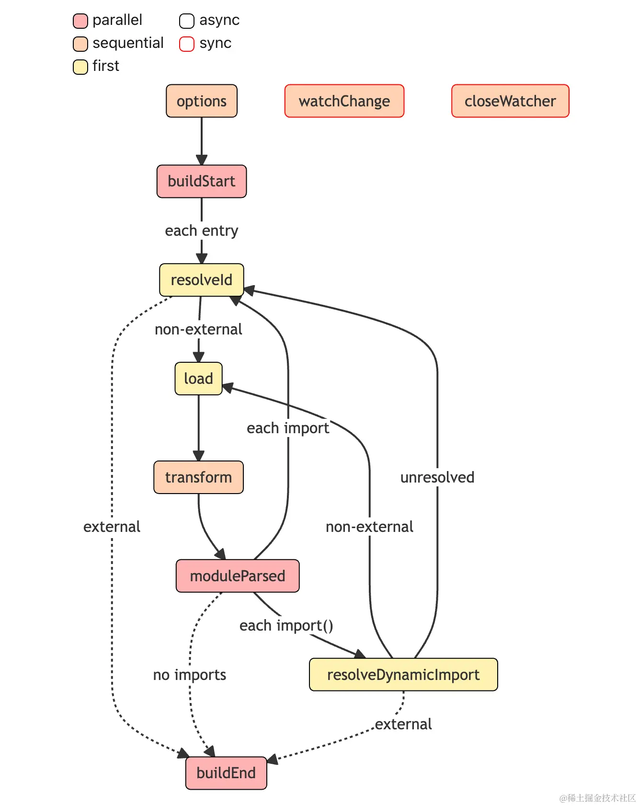
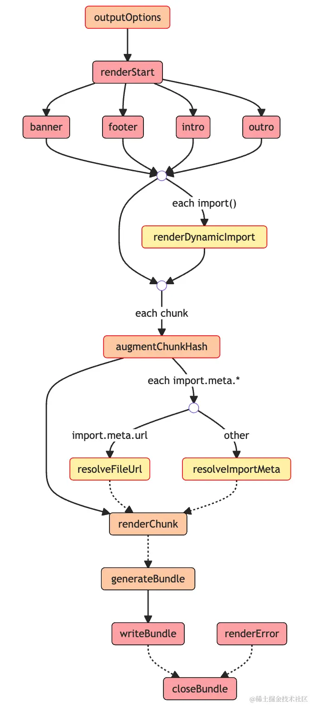

# 玩转 rollup

## 前言

本篇来玩转 Vite 底层双引擎的另一位 -- rollup，同样也是学习它的基本使用和常用插件，并深入了解一下 rollup 的插件机制。

## 基本使用

主要包括 cli 使用方式和 js api 使用方式。

### cli 使用方式

主要介绍一下 rollup 打包的常用配置，比较简单，这边直接贴代码看注释即可：

```js title="rollup.config.js"
import { defineConfig } from 'rollup'

export default defineConfig(
  // 可以传一个对象或一个数组，使用场景区别：
  // - 对象：有一个或多个入口，但 output 配置是共用的
  // - 数组：有多个入口，且 output 配置不同
  [
    {
      input: ['src/index.js', 'src/utils.js'],
      output: [
        // {
        //   // 产物输出目录
        //   dir: 'dist',
        //   // 以下三个配置项都可以使用这些占位符:
        //   // 1. [name]: 去除文件后缀后的文件名
        //   // 2. [hash]: 根据文件名和文件内容生成的 hash 值
        //   // 3. [format]: 产物模块格式，如 es、cjs
        //   // 4. [extname]: 产物后缀名(带`.`)
        //   // 入口模块的输出文件名
        //   entryFileNames: `[name].js`,
        //   // 非入口模块(如动态 import)的输出文件名
        //   chunkFileNames: 'chunk-[hash].js',
        //   // 静态资源文件输出文件名
        //   assetFileNames: 'assets/[name]-[hash][extname]',
        //   // 产物输出格式，包括`amd`、`cjs`、`es`、`iife`、`umd`、`system`
        //   format: 'cjs',
        //   // 是否生成 sourcemap 文件
        //   sourcemap: true,
        //   // 如果是打包出 iife/umd 格式，需要对外暴露出一个全局变量，通过 name 配置变量名
        //   name: 'MyBundle',
        //   // 全局变量声明
        //   globals: {
        //     // 项目中可以直接用`$`代替`jquery`
        //     jquery: '$',
        //   },
        // },
        {
          dir: 'dist/es',
          format: 'esm',
        },
        {
          dir: 'dist/cjs',
          format: 'cjs',
        },
      ],
      // 对于某些第三方包，有时候我们不想让 Rollup 进行打包，也可以通过 external 进行外部化
      // 在 SSR 构建或者使用 ESM CDN 的场景中，这个配置将非常有用
      // external: ['react', 'react-dom'],
    },
    {
      input: ['src/index.js'],
      output: [
        {
          name: 'Foo',
          dir: 'dist/umd',
          format: 'umd',
        },
        {
          name: 'Foo',
          dir: 'dist/iife',
          format: 'iife',
        },
      ],
    },
  ],
)
```

### js api 使用方式

主要关注 rollup 提供的 `rollup` 和 `watch` 这两个 API：

- rollup: 用于 bundle
- watch: 用于监听文件变化时进行 bundle

接下来通过两个简单的 demo 体验一下：

#### rollup

```js
import { rollup } from 'rollup'

// 常用 inputOptions 配置
const inputOptions = {
  input: './src/index.js',
}

const outputOptionsList = [
  // 常用 outputOptions 配置
  {
    dir: 'dist-with-build-script/es',
    entryFileNames: `[name].[hash].js`,
    chunkFileNames: 'chunk-[hash].js',
    assetFileNames: 'assets/[name]-[hash][extname]',
    format: 'es',
    sourcemap: true,
    globals: {
      lodash: '_',
    },
  },
  // 省略其它的输出配置
]

async function build() {
  let bundle
  let buildFailed = false

  try {
    // 1. 调用 rollup 生成 bundle 对象
    bundle = await rollup(inputOptions)

    for (const outputOptions of outputOptionsList) {
      // 2. 拿到 bundle 对象，根据每一份输出配置，调用 generate 和 write 方法分别生成和写入产物
      const { output } = await bundle.generate(outputOptions)
      await bundle.write(outputOptions)
    }
  } catch (error) {
    buildFailed = true
    console.error(error)
  }
  if (bundle) {
    // 最后调用 bundle.close 方法结束打包
    await bundle.close()
  }
  process.exit(buildFailed ? 1 : 0)
}

build()
```

调用 rollup 后会生成一个 RollupBuild 对象，可以调用该对象的 generate 得到生成的 OutputChunk 去进行一些定制操作，但这些都只是在内存中进行，如果需要将产物真正写入到硬盘中，还需要调用该对象的 write 方法。

#### watch

直接看代码：

```js
import { watch } from 'rollup'

const watcher = watch({
  // 和 rollup 配置文件中的属性基本一致，只不过多了`watch`配置
  input: './src/index.js',
  output: [
    {
      dir: 'dist-with-watch-script/es',
      format: 'esm',
    },
    {
      dir: 'dist-with-watch-script/cjs',
      format: 'cjs',
    },
  ],
  watch: {
    exclude: ['node_modules/**'],
    include: ['src/**'],
  },
})

// 监听 watch 各种事件
watcher.on('restart', () => {
  console.log('重新构建...')
})

watcher.on('change', (id) => {
  console.log('发生变动的模块id: ', id)
})

watcher.on('event', (e) => {
  if (e.code === 'BUNDLE_END') {
    console.log('打包信息:', e)
  }
})
```

启动后改动一下 `src/index.js` 后的 stdout 如下：

```shell
打包信息: {
  code: 'BUNDLE_END',
  duration: 40,
  input: './src/index.js',
  output: [
    '/home/plasticine/code/projects/vite-learning/demos/rollup-startup/dist-with-watch-script/es',
    '/home/plasticine/code/projects/vite-learning/demos/rollup-startup/dist-with-watch-script/cjs'
  ],
  result: {
    cache: { modules: [Array], plugins: [Object: null prototype] {} },
    close: [AsyncFunction: close],
    closed: false,
    generate: [AsyncFunction: generate],
    watchFiles: [Getter],
    write: [AsyncFunction: write]
  }
}
发生变动的模块id:  /home/plasticine/code/projects/vite-learning/demos/rollup-startup/src/index.js
重新构建...
打包信息: {
  code: 'BUNDLE_END',
  duration: 13,
  input: './src/index.js',
  output: [
    '/home/plasticine/code/projects/vite-learning/demos/rollup-startup/dist-with-watch-script/es',
    '/home/plasticine/code/projects/vite-learning/demos/rollup-startup/dist-with-watch-script/cjs'
  ],
  result: {
    cache: { modules: [Array], plugins: [Object: null prototype] {} },
    close: [AsyncFunction: close],
    closed: false,
    generate: [AsyncFunction: generate],
    watchFiles: [Getter],
    write: [AsyncFunction: write]
  }
}
```

可以让我们自定义监听文件变化时的行为。

## 常用插件

rollup 的插件系统生态十分丰富，能够让 rollup 具备一些额外的能力，比如：

- 支持 bundle 第三方库
- 支持处理 cjs 规范的入口模块
- 注入环境变量
- 配置路径别名
- 压缩产物代码

### @rollup/plugin-node-resolve

该插件的官方文档介绍：

> Locate modules using the Node resolution algorithm, for using third party modules in node_modules

rollup 官方文档的 [troubleshooting](https://rollupjs.org/troubleshooting/#warning-treating-module-as-external-dependency) 中有这样一句话：

> Rollup will only resolve relative module IDs by default. This means that an import statement like this…
>
> ```js
> import moment from 'moment'
> ```
>
> …won't result in moment being included in your bundle – instead, it will be an external dependency that is required at runtime. If that's what you want, you can suppress this warning with the external option, which makes your intentions explicit:
>
> If you do want to include the module in your bundle, you need to tell Rollup how to find it. In most cases, this is a question of using @rollup/plugin-node-resolve.

即项目中依赖的第三方库默认是不会被 bundle 的，rollup 只会处理相对路径的模块，如果确实要 bundle 第三方库的话，需要使用 [@rollup/plugin-node-resolve](https://github.com/rollup/plugins/tree/master/packages/node-resolve) 插件让 rollup 支持解析 node 库的路径。

### @rollup/plugin-commonjs

rollup 虽然能够打包出 cjs 格式的产物，但其接受的入口模块以及相关依赖都必须得是 esm 规范的模块才行。

虽然我们能保证开发自己的代码时使用 esm 规避这个问题，但是我们不能保证我们使用的第三方库提供的代码也是 esm 规范的，因此需要支持处理 cjs 规范的入口模块，这就是 [@rollup/plugin-commonjs](https://github.com/rollup/plugins/tree/master/packages/commonjs) 所做的事情。

该插件的官方文档介绍也能很直观地体现它的作用：

> Convert CommonJS modules to ES6, so they can be included in a Rollup bundle

接下来就安装一下 `@rollup/plugin-node-resolve` 和 `@rollup/plugin-commonjs` 来尝试把 lodash 这样一个只提供了 cjs 的第三方库打包进我们的 bundle 中吧！

```shell
pnpm i @rollup/plugin-node-resolve @rollup/plugin-commonjs
```

在 `rollup.config.js` 配置的 plugins 中注册一下这两个插件即可，这里也可以对比一下 esbuild 和 rollup 打包同样的代码所花费的时间：





可以看到，esbuild 构建 esm 产物的耗时是 `23ms`，而 rollup 构建 esm 产物的耗时则是 `646ms`，esbuild 比 rollup 快了 28 倍！

### 其它插件

剩下的一些比较常用的 rollup 插件就简要介绍一下，不逐一演示了：

- [@rollup/plugin-json](https://github.com/rollup/plugins/tree/master/packages/json): 支持.json 的加载，并配合 rollup 的 Tree Shaking 机制去掉未使用的部分，进行按需打包。
- [@rollup/plugin-babel](https://github.com/rollup/plugins/tree/master/packages/babel): 在 Rollup 中使用 Babel 进行 JS 代码的语法转译。
- [@rollup/plugin-typescript](https://github.com/rollup/plugins/tree/master/packages/typescript): 支持使用 TypeScript 开发。
- [@rollup/plugin-alias](https://github.com/rollup/plugins/tree/master/packages/alias): 支持别名配置。
- [@rollup/plugin-replace](https://github.com/rollup/plugins/tree/master/packages/replace): 在 Rollup 进行变量字符串的替换。
- [rollup-plugin-visualizer](https://github.com/btd/rollup-plugin-visualizer): 对 Rollup 打包产物进行分析，自动生成产物体积可视化分析图。

## 深入理解 rollup 插件机制

### rollup 构建流程

当在 cli 中执行 rollup 后，其整个构建流程可以用简化后的代码表示：

```js
// build 阶段
const bundle = await rollup.rollup(inputOptions)

// output 阶段
await Promise.all(outputOptions.map(bundle.write))

// end
await bundle.close()
```

也就是主要包括了：

1. build 阶段：创建模块依赖图，初始化各个模块的 AST 以及模块之间的依赖关系
2. output 阶段：生成输出产物的信息以及将产物写入硬盘

### build 阶段

来看看 build 阶段生成的 RollupBuild 是个什么东西：

```js
async function build() {
  const rollupBuild = await rollup.rollup({
    input: [resolve(__dirname, 'demo.js')],
  })

  console.log(inspect(rollupBuild, false, 100, true))
}
```

输出如下：

```js
{
  cache: {
    modules: [
      {
        ast: { ... },
        attributes: {},
        code: "export const foo = 'foo'\n",
        customTransformCache: false,
        dependencies: [],
        id: '/Users/root/code/projects/vite-learning/demos/rollup-startup/src/what-does-build-phase-do/module-foo.js',
        meta: {},
        moduleSideEffects: true,
        originalCode: "export const foo = 'foo'\n",
        originalSourcemap: null,
        resolvedIds: [Object: null prototype] {},
        sourcemapChain: [],
        syntheticNamedExports: false,
        transformDependencies: [],
        transformFiles: undefined
      },
      {
        ast: { ... },
        attributes: {},
        code: "import { foo } from './module-foo'\n\nconsole.log(foo)\n",
        customTransformCache: false,
        dependencies: [
          '/Users/root/code/projects/vite-learning/demos/rollup-startup/src/what-does-build-phase-do/module-foo.js'
        ],
        id: '/Users/root/code/projects/vite-learning/demos/rollup-startup/src/what-does-build-phase-do/demo.js',
        meta: {},
        moduleSideEffects: true,
        originalCode: "import { foo } from './module-foo'\n\nconsole.log(foo)\n",
        originalSourcemap: null,
        resolvedIds: [Object: null prototype] {
          './module-foo': {
            attributes: {},
            external: false,
            id: '/Users/root/code/projects/vite-learning/demos/rollup-startup/src/what-does-build-phase-do/module-foo.js',
            meta: {},
            moduleSideEffects: true,
            resolvedBy: 'rollup',
            syntheticNamedExports: false
          }
        },
        sourcemapChain: [],
        syntheticNamedExports: false,
        transformDependencies: [],
        transformFiles: undefined
      }
    ],
    plugins: [Object: null prototype] {}
  },
  close: [AsyncFunction: close],
  closed: false,
  generate: [AsyncFunction: generate],
  watchFiles: [Getter],
  write: [AsyncFunction: write]
}
```

可以看到，RollupBuild 是一个记录了各个模块的信息以及依赖关系，并没有生成产物也没有写入磁盘，如果需要完成这两步，则涉及到 output 阶段的 API。

### output 阶段

output 阶段的 API 主要包括 RollupBuild 对象的 generate 和 write 方法。

generate 方法调用后会得到一个 RollupOutput 类型的对象，其记录了输出内容的相关信息，实际上 write 方法也能得到 RollupOutput，只是前者不会写入磁盘，后者会写入磁盘。

下面通过一个 demo 看看 RollupOutput 的结构。

```js title="generate"
async function build() {
  const rollupBuild = await rollup.rollup({
    input: [resolve(__dirname, 'demo.js')],
  })

  const rollupOutput = await rollupBuild.generate({
    format: 'esm',
  })

  console.log(inspect(rollupOutput, false, 100, true))
}
```

```js
{
  output: [
    {
      exports: [],
      facadeModuleId: '/Users/root/code/projects/vite-learning/demos/rollup-startup/src/what-does-build-phase-do/demo.js',
      isDynamicEntry: false,
      isEntry: true,
      isImplicitEntry: false,
      moduleIds: [
        '/Users/root/code/projects/vite-learning/demos/rollup-startup/src/what-does-build-phase-do/module-foo.js',
        '/Users/root/code/projects/vite-learning/demos/rollup-startup/src/what-does-build-phase-do/demo.js'
      ],
      name: 'demo',
      type: 'chunk',
      dynamicImports: [],
      fileName: 'demo.js',
      implicitlyLoadedBefore: [],
      importedBindings: {},
      imports: [],
      modules: [Object: null prototype] {
        '/Users/root/code/projects/vite-learning/demos/rollup-startup/src/what-does-build-phase-do/module-foo.js': {
          code: [Getter],
          originalLength: 25,
          removedExports: [],
          renderedExports: [ 'foo' ],
          renderedLength: 18
        },
        '/Users/root/code/projects/vite-learning/demos/rollup-startup/src/what-does-build-phase-do/demo.js': {
          code: [Getter],
          originalLength: 53,
          removedExports: [],
          renderedExports: [],
          renderedLength: 17
        }
      },
      referencedFiles: [],
      code: "const foo = 'foo';\n\nconsole.log(foo);\n",
      map: null,
      preliminaryFileName: 'demo.js',
      sourcemapFileName: null
    }
  ]
}
```

了解完 rollup 构建流程的两大阶段后就可以开始探索插件机制了，插件的各种钩子就是作用于这两大阶段的。

### 插件 hook 的类型

#### 按构建阶段分类

按照 rollup 构建流程的两大阶段，插件 hook 的类型也可以对应分为两类：

- build hook: 作用于 build 阶段的 hook，对代码的操作粒度为 **模块级别**，即单文件级别
- output hook: 作用于 output 阶段的 hook，对代码的操作粒度为 **chunk 级别**（一个 chunk 是多个模块打包到一个文件的产物）

#### 按执行方式分类

按执行方式大致可以分为以下几类：

- Async & Sync
- Parallel & Sequential: 相互之间无依赖关系的 hook 可以通过并发的方式执行，比如 `buildStart`；有依赖关系的则只能串行执行，比如 `transform`
- First: 有多个插件实现了某个 hook 时，会依次运行，直到其中一个 hook 返回非空值时停止，比如 `resolveId`

### build 阶段 hooks 工作流

build 阶段的 hook 以及相应的工作流如下图所示：



这里解释几个重点常用的 hook 的作用：

- resolveId: 解析文件路径，比如导入某个 npm 包，我们可以自定义解析到具体的某个 node_modules 里该包的路径
- load: 根据解析到的文件路径去加载对应的内容
- transform: 对 load 加载完成的模块内容进行转换，比如调用 babel 进行转译
- moduleParsed: 传入所有的 import 代码
  - 静态 import，调用 resolveId
  - 动态 import，调用 resolveDynamicImport，解析成功则继续走 load 的流程，否则降级到用 resolveId 兜底处理

:::tip
对于配置了 external 的 id，不会执行 load 和 transform hooks。
:::

### output 阶段 hooks 工作流

output 阶段的 hook 以及相应的工作流如下图所示：




- outputOptions: 用于对 output 配置进行转换
- banner, footer, intro, outro: 往打包产物的相应位置插入自定义内容，比如协议声明、作者介绍、项目介绍等等
- renderChunk: 自定义操作每个生成的 chunk
- generateBundle: 入参是所有的 chunk 和 assets，可以自行决定是否删除掉某些 chunk 或 asset
